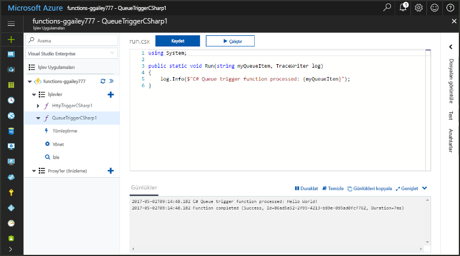
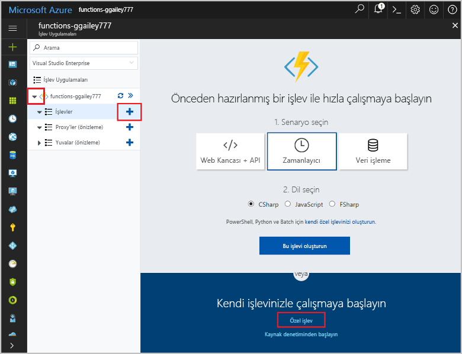
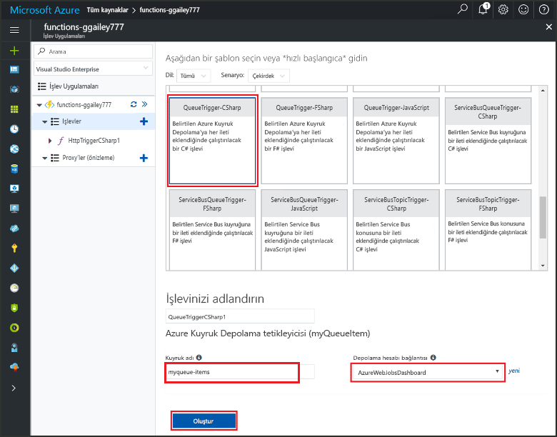
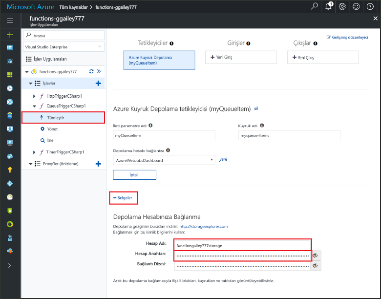
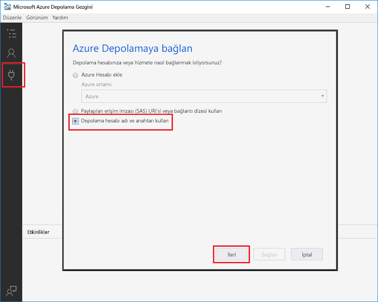
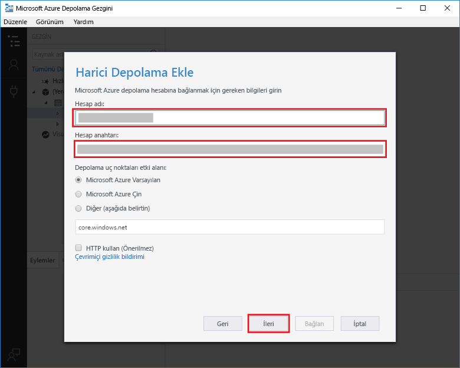
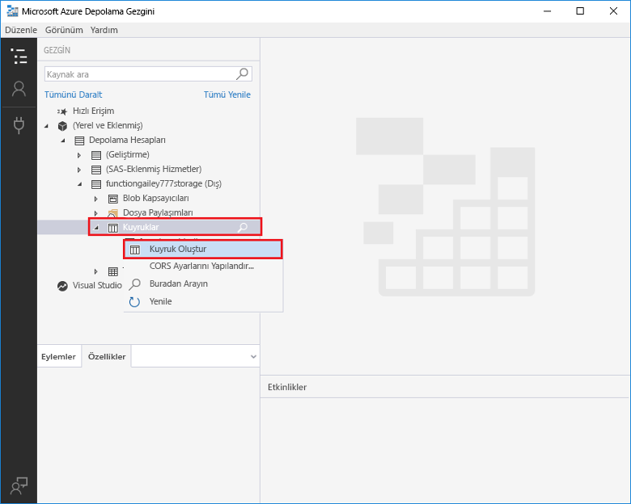
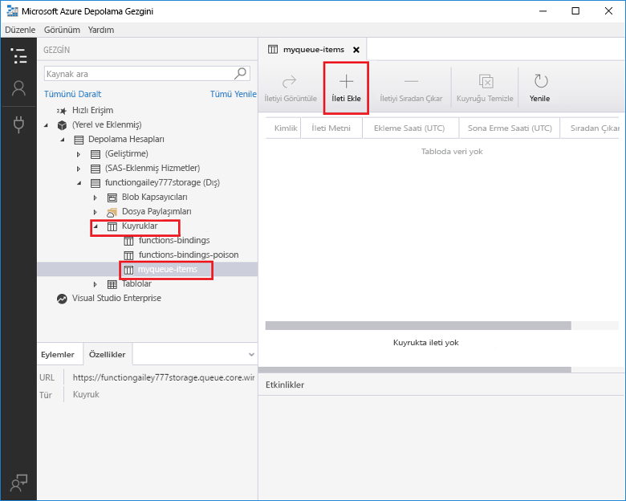
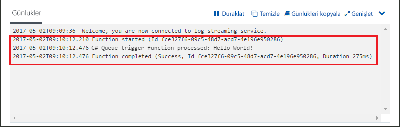

# Azure Kuyruk Depolama tarafından tetiklenen bir işlev oluşturma

Bir Azure Depolama kuyruğuna ileti gönderildiğinde tetiklenen bir işlev oluşturmayı öğrenin.

## Ön koşullar

- [Microsoft Azure Depolama Gezgini](http://storageexplorer.com/)'ni indirip yükleme.

- Azure aboneliği. Aboneliğiniz yoksa başlamadan önce [ücretsiz bir hesap](https://azure.microsoft.com/free/?WT.mc_id=A261C142F) oluşturun.

[!INCLUDE [functions-portal-favorite-function-apps](../../includes/functions-portal-favorite-function-apps.md)]

## Azure İşlev uygulaması oluşturma

[!INCLUDE [Create function app Azure portal](../../includes/functions-create-function-app-portal.md)]

Ardından, yeni işlev uygulamasında bir işlev oluşturun.

## Kuyruk ile tetiklenen bir işlev oluşturma

1. İşlev uygulamanızı genişletin ve **İşlevler**'in yanındaki **+** düğmesine tıklayın. Bu, işlev uygulamanızdaki ilk işlevse **Özel işlev**'i seçin. Böylece işlev şablonlarının tamamı görüntülenir.

    

2. İstediğiniz dil için **QueueTrigger** şablonunu seçin ve tabloda belirtilen ayarları kullanın.

    
    
    | Ayar | Önerilen değer | Açıklama |
    |---|---|---|
    | **Kuyruk adı**   | myqueue-items    | Depolama hesabınızdaki bağlantı kurulacak kuyruğun adı. |
    | **Depolama hesabı bağlantısı** | AzureWebJobStorage | İşlev uygulamanız tarafından kullanılmakta olan depolama hesabı bağlantısını kullanabilir veya yeni bir bağlantı oluşturabilirsiniz.  |
    | **İşlevinizi adlandırın** | İşlev uygulamanızda benzersiz olmalıdır | Kuyruk tarafından tetiklenen bu işlevin adı. |

3. İşlevinizi oluşturmak için **Oluştur**'a tıklayın.

Ardından Azure Depolama hesabınıza bağlanıp **myqueue-items** depolama kuyruğunu oluşturun.

## Kuyruk oluşturma

1. İşlevinizde **Tümleştir**'e tıklayın, **Belgeler**'i genişletin ve hem **Hesap adı** hem de **Hesap anahtarı** değerlerini kopyalayın. Depolama hesabına bağlanmak için bu kimlik bilgilerini kullanacaksınız. Depolama hesabınıza önceden bağlandıysanız 4. adıma geçin.

    v

1. [Microsoft Azure Depolama Gezgini](http://storageexplorer.com/) aracını çalıştırın, sol taraftaki bağlan simgesine tıklayın, **Depolama hesabı adı ve anahtarı kullan**'ı seçin ve **İleri**'ye tıklayın.

    

1. 1 Adımda kopyaladığınız **Hesap adı** ve **Hesap anahtarı** değerlerini girin, **İleri**'ye ve ardından **Bağlan**'a tıklayın.

    

1. Eklediğiniz depolama hesabını genişletin, **Kuyruklar**'a sağ tıklayın, **Kuyruk oluştur**'a tıklayın, `myqueue-items` yazın ve Enter tuşuna basın.

    

Artık bir depolama kuyruğunuz var ve kuyruğa ileti ekleyerek işlevi test edebilirsiniz.

## İşlevi test etme

1. Azure portalına dönün, işlevinizi bulun, sayfanın en altındaki **Günlükler** bölümünü genişletin ve günlük akışının duraklatılmış olmadığından emin olun.

1. Depolama Gezgini'nde depolama hesabınızı genişletin, **Kuyruklar**'ı ve **myqueue-items** öğesini seçip **İleti ekle**'ye tıklayın.

    

1. "Hello World!" iletinizi **İleti metni** alanına yazın ve **Tamam**'a tıklayın.

1. Birkaç saniye bekledikten sonra işlev günlüklerinize dönün ve yeni iletinin kuyruktan okunmuş olduğunu doğrulayın.

    

1. Depolama Gezgini'ne dönüp **Yenile**'ye tıklayın ve iletinin işlenip kuyruktan kaldırılmış olduğunu doğrulayın.

## Kaynakları temizleme

[!INCLUDE [Next steps note](../../includes/functions-quickstart-cleanup.md)]

## Sonraki adımlar

Depolama kuyruğuna bir ileti eklendiğinde çalışacak bir işlev oluşturdunuz.

[!INCLUDE [Next steps note](../../includes/functions-quickstart-next-steps.md)]

Kuyruk depolama tetikleyicileri hakkında daha fazla bilgi için bkz. [Azure İşlevleri Kuyruk depolama bağlamaları](functions-bindings-storage-queue.md).
