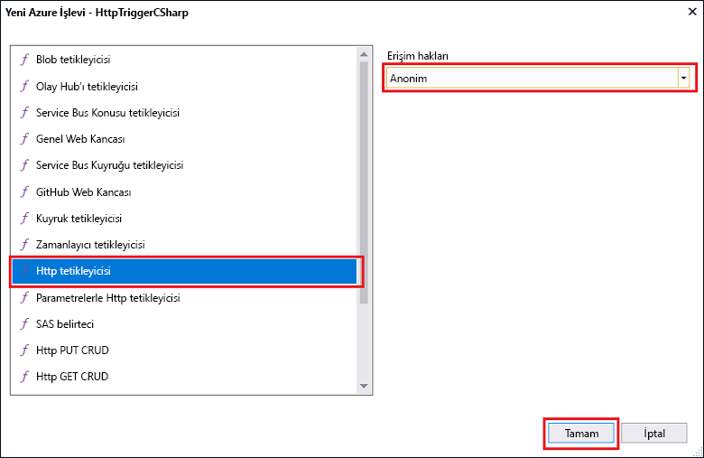

# Visual Studio kullanarak ilk işlevinizi oluşturma

Azure İşlevleri, öncelikle bir VM oluşturmak veya bir web uygulaması yayımlamak zorunda kalmadan kodunuzu sunucusuz bir ortamda yürütmenize olanak tanır.

> [!IMPORTANT]
> Bu konu başlığı altında, adımları tamamlamak için Visual Studio’nun Önizleme Sürümü kullanılır. Devam etmeden önce lütfen [Visual Studio 2017 Önizleme sürümü 15.3](https://www.visualstudio.com/vs/preview/)’ü yüklediğinizden emin olun.

Bu konuda, yerel olarak bir “merhaba dünya” işlevini oluşturmak ve test etmek amacıyla Visual Studio 2017 için Azure İşlevleri Araçları’nı nasıl kullanacağınızı öğreneceksiniz. Ardından işlev kodunu Azure’da yayımlayacaksınız.

## Ön koşullar

Bu öğreticiyi tamamlamak için şunları yükleyin:

* **Azure geliştirme** iş yükü dahil [Visual Studio 2017 Önizleme sürümü 15.3](https://www.visualstudio.com/vs/preview/).

    

[!INCLUDE [quickstarts-free-trial-note](../../includes/quickstarts-free-trial-note.md)]

## Visual Studio 2017 için Azure İşlevleri Araçları’nı yükleyin

Başlamadan önce, Visual Studio 2017 için Azure İşlevleri Araçları’nı indirip yüklemeniz gerekir. Bu araçlar, yalnızca Visual Studio 2017 Önizleme sürümü 15.3 veya sonraki bir sürümüyle kullanılabilir. Azure İşlevleri Araçları’nı zaten yüklediyseniz bu bölümü atlayabilirsiniz.

[!INCLUDE [Install the Azure Functions Tools for Visual Studio](../../includes/functions-install-vstools.md)]   

## Visual Studio'da bir Azure İşlevleri projesi oluşturma

[!INCLUDE [Create a project using the Azure Functions template](../../includes/functions-vstools-create.md)]

Projeyi oluşturduğunuza göre, artık ilk işlevinizi oluşturabilirsiniz.

## İşlevi oluşturma

1. **Çözüm Gezgini**’nde, proje düğümünüze sağ tıklayın ve **Yeni** > **Öğe Ekle**’yi seçin. **Azure İşlevi**’ni seçin ve **Ekle**’ye tıklayın.

2. **HttpTrigger**’ı seçin, **İşlev Adı** yazın, **Erişim Hakları** için **Anonim**’i seçin ve **Oluştur**’a tıklayın. Oluşturulan işleve, herhangi bir istemciden bir HTTP isteği erişir. 

    

HTTP ile tetiklenen işlev oluşturduğunuza göre, artık bunu yerel bilgisayarınızda test edebilirsiniz.

## İşlevi yerel olarak test etme

Azure İşlevleri Temel Araçları, Azure İşlevleri projenizi yerel geliştirme bilgisayarınızda çalıştırmanıza olanak sağlar. Visual Studio'da ilk kez bir işlev başlattığınızda bu araçları yüklemeniz istenir.  

1. İşlevinizi test etmek için F5’e basın. İstenirse Visual Studio'dan gelen Azure İşlevleri Temel (CLI) araçlarını indirme ve yükleme isteğini kabul edin.  Aracın HTTP isteklerini işleyebilmesi için bir güvenlik duvarı özel durumu etkinleştirmeniz de gerekebilir.

2. Azure İşlevleri çalışma zamanı çıktısından işlevinizin URL'sini kopyalayın.  

    

3. HTTP isteğinin URL’sini tarayıcınızın adres çubuğuna yapıştırın. `&name=<yourname>` sorgu dizesini bu URL’ye ekleyip isteği yürütün. İşlevin döndürdüğü yerel GET isteğine tarayıcıda verilen yanıt aşağıda gösterilmiştir: 

    

4. Hata ayıklamayı durdurmak için Visual Studio araç çubuğunda **Durdur** düğmesine tıklayın.

İşlevin yerel bilgisayarınızda düzgün çalıştığını doğruladıktan sonra, projeyi Azure'da yayımlamanın zamanı gelmiştir.

## Projeyi Azure'da yayımlama

Projenizi yayımlayabilmeniz için önce Azure aboneliğinizde bir işlev uygulamanızın olması gerekir. Visual Studio'dan bir işlev uygulaması oluşturabilirsiniz.

[!INCLUDE [Publish the project to Azure](../../includes/functions-vstools-publish.md)]

## Azure'da işlevinizi test etme

1. Yayımlama profili sayfasından işlev uygulamasının temel URL'sini kopyalayın. İşlevi yerel olarak test ederken kullandığınız URL’nin `localhost:port` kısmını, yeni temel URL ile değiştirin. Daha önce olduğu gibi, `&name=<yourname>` sorgu dizesini bu URL’ye ekleyip isteği yürütmeyi unutmayın.

    HTTP ile tetiklenen işlevinizi çağıran URL şunun gibi görünür:

        http://<functionappname>.azurewebsites.net/api/<functionname>?name=<yourname> 

2. HTTP isteğinin yeni URL’sini tarayıcınızın adres çubuğuna yapıştırın. İşlevin döndürdüğü uzak GET isteğine tarayıcıda verilen yanıt aşağıda gösterilmiştir: 

    
 
## Sonraki adımlar

HTTP ile tetiklenen basit bir işlevi kullanarak C# işlev uygulaması oluşturmak için Visual Studio’yu kullandınız. 

+ Projenizi diğer tetikleyici ve bağlama türlerini destekleyecek şekilde yapılandırma hakkında bilgi almak için, [Visual Studio için Azure İşlevleri Araçları](functions-develop-vs.md) makalesindeki [Yerel geliştirme için proje yapılandırma](functions-develop-vs.md#configure-the-project-for-local-development) bölümüne bakın.
+ Azure İşlevleri Temel Araçları ile yerel test ve hata ayıklama hakkında daha fazla bilgi için bkz. [Kod ve Azure İşlevleri’nin yerel olarak test edilmesi](functions-run-local.md). 
+ .NET sınıf kitaplıkları olarak işlevleri geliştirme hakkında daha fazla bilgi için bkz. [.NET sınıf kitaplıklarını Azure İşlevleri ile kullanma](functions-dotnet-class-library.md). 

