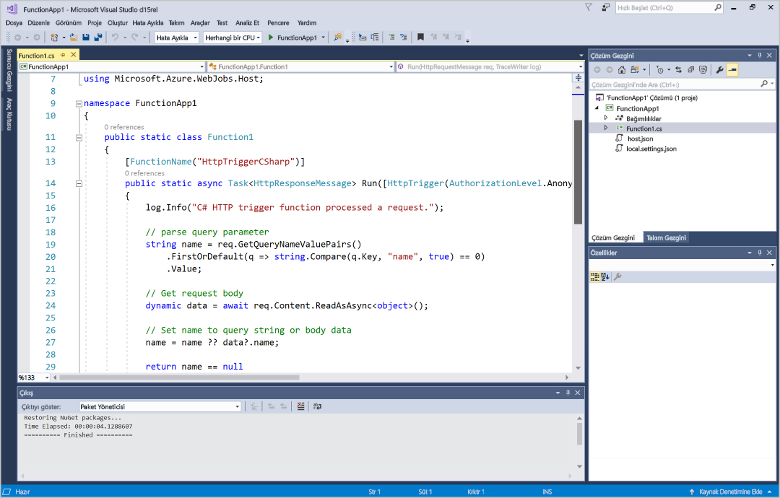
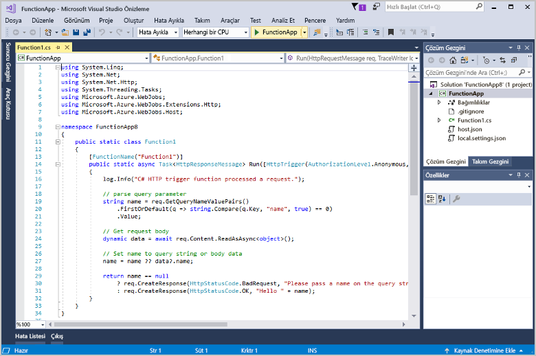
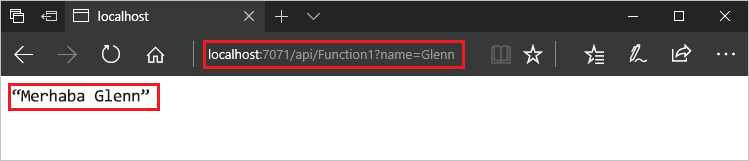
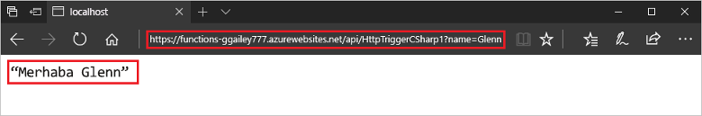

# Visual Studio kullanarak ilk işlevinizi oluşturma

Azure İşlevleri, öncelikle bir VM oluşturmak veya bir web uygulaması yayımlamak zorunda kalmadan kodunuzu [sunucusuz](https://azure.microsoft.com/overview/serverless-computing/) bir ortamda yürütmenize olanak tanır.

Bu makalede, yerel olarak bir “merhaba dünya” işlevi oluşturmak ve test etmek amacıyla Azure İşlevleri için Visual Studio 2017 araçlarını nasıl kullanacağınızı öğreneceksiniz. Ardından işlev kodunu Azure’da yayımlayacaksınız. Bu araçlar, Visual Studio 2017’de Azure geliştirme iş yükünün parçası olarak kullanılabilir.

Bu konuda bazı temel adımları anlatan [bir video](#watch-the-video) yer alır.

## Ön koşullar

Bu öğreticiyi tamamlamak için:

* **Azure geliştirme** iş yükünü içeren [Visual Studio 2017 sürüm 15.4](https://www.visualstudio.com/vs/) veya sonraki bir sürümünü yükleyin.

    

* Azure İşlevleri ve Web İşleri Araçları’nın güncel sürümlerine sahip olduğunuzdan emin olun. Bunu **Uzantılar ve Güncelleştirmeler**’de **Güncelleştirmeler** > **Visual Studio Market**’e giderek yapabilirsiniz.
    
[!INCLUDE [quickstarts-free-trial-note](../../includes/quickstarts-free-trial-note.md)] 

## İşlev uygulaması projesi oluşturma

[!INCLUDE [Create a project using the Azure Functions template](../../includes/functions-vstools-create.md)]

Visual Studio bir proje oluşturur ve bu projenin içinde seçili işlev türü için ortak kod içeren bir sınıf bulunur. Metottaki **FunctionName** özniteliği işlevin adını ayarlar. **HttpTrigger** özniteliği, işlevin bir HTTP isteği tarafından tetiklenip tetiklenmediğini belirtir. Ortak kod, istek gövdesi veya sorgu dizesinde yer alan bir değeri içeren bir HTTP yanıtı gönderir. Metoda uygun öznitelikleri uygulayarak, bir işleve giriş ve çıkış bağlamaları ekleyebilirsiniz. Daha fazla bilgi için, [Azure İşlevleri C# geliştirici başvurusu](functions-dotnet-class-library.md) konusunun [Tetikleyiciler ve bağlayıcılar](functions-dotnet-class-library.md#triggers-and-bindings) bölümüne göz atın.

İşlev projenizi ve HTTP ile tetiklenen işlev oluşturduğunuza göre, artık bunu yerel bilgisayarınızda test edebilirsiniz.

## İşlevi yerel olarak test etme

Azure İşlevleri Temel Araçları, Azure İşlevleri projenizi yerel geliştirme bilgisayarınızda çalıştırmanıza olanak sağlar. Visual Studio'da ilk kez bir işlev başlattığınızda bu araçları yüklemeniz istenir.  

1. İşlevinizi test etmek için F5’e basın. İstenirse Visual Studio'dan gelen Azure İşlevleri Temel (CLI) araçlarını indirme ve yükleme isteğini kabul edin. Aracın HTTP isteklerini işleyebilmesi için bir güvenlik duvarı özel durumu etkinleştirmeniz de gerekebilir.

2. Azure İşlevleri çalışma zamanı çıktısından işlevinizin URL'sini kopyalayın.  

    

3. HTTP isteğinin URL’sini tarayıcınızın adres çubuğuna yapıştırın. `?name=<yourname>` sorgu dizesini bu URL’ye ekleyip isteği yürütün. İşlevin döndürdüğü yerel GET isteğine tarayıcıda verilen yanıt aşağıda gösterilmiştir: 

    

4. Hata ayıklamayı durdurmak için Shift + F5 tuşuna basın.

İşlevin yerel bilgisayarınızda düzgün çalıştığını doğruladıktan sonra, projeyi Azure'da yayımlamanın zamanı gelmiştir.

## Projeyi Azure'da yayımlama

Projenizi yayımlayabilmeniz için önce Azure aboneliğinizde bir işlev uygulamanızın olması gerekir. Visual Studio'dan bir işlev uygulaması oluşturabilirsiniz.

[!INCLUDE [Publish the project to Azure](../../includes/functions-vstools-publish.md)]

## Azure'da işlevinizi test etme

1. Yayımlama profili sayfasından işlev uygulamasının temel URL'sini kopyalayın. İşlevi yerel olarak test ederken kullandığınız URL’nin `localhost:port` kısmını, yeni temel URL ile değiştirin. Daha önce olduğu gibi, `?name=<yourname>` sorgu dizesini bu URL’ye ekleyip isteği yürütmeyi unutmayın.

    HTTP tarafından tetiklenen işlevinizi çağıran URL aşağıdaki biçimde olmalıdır:

        http://<functionappname>.azurewebsites.net/api/<functionname>?name=<yourname> 

2. HTTP isteğinin yeni URL’sini tarayıcınızın adres çubuğuna yapıştırın. İşlevin döndürdüğü uzak GET isteğine tarayıcıda verilen yanıt aşağıda gösterilmiştir: 

    

## Videoyu izleme

> [!VIDEO https://www.youtube-nocookie.com/embed/DrhG-Rdm80k]

## Sonraki adımlar

HTTP ile tetiklenen basit bir işlevi kullanarak C# işlev uygulaması oluşturmak için Visual Studio’yu kullandınız. 

+ Projenizi diğer tetikleyici ve bağlama türlerini destekleyecek şekilde yapılandırma hakkında bilgi almak için, [Visual Studio için Azure İşlevleri Araçları](functions-develop-vs.md) makalesindeki [Yerel geliştirme için proje yapılandırma](functions-develop-vs.md#configure-the-project-for-local-development) bölümüne bakın.
+ Azure İşlevleri Temel Araçları ile yerel test ve hata ayıklama hakkında daha fazla bilgi için bkz. [Kod ve Azure İşlevleri’nin yerel olarak test edilmesi](functions-run-local.md). 
+ .NET sınıf kitaplıkları olarak işlevleri geliştirme hakkında daha fazla bilgi için bkz. [.NET sınıf kitaplıklarını Azure İşlevleri ile kullanma](functions-dotnet-class-library.md). 

