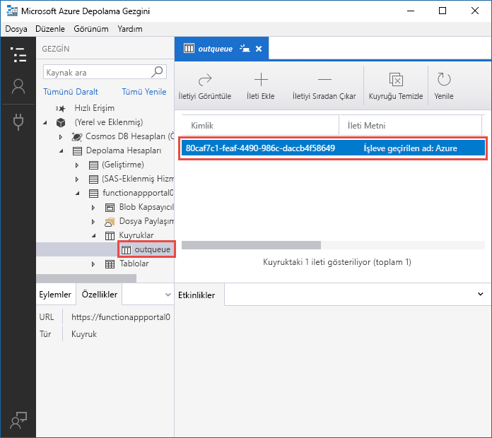
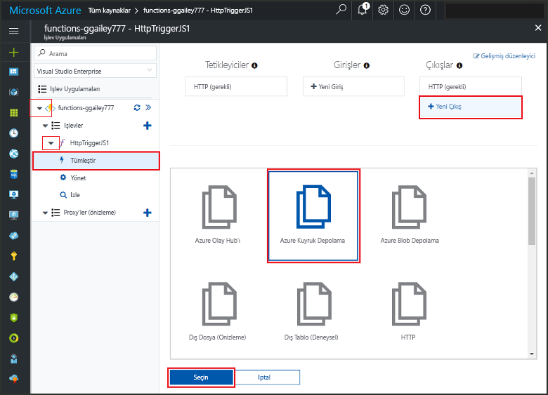
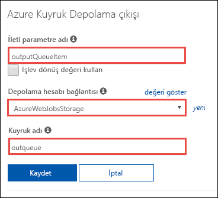
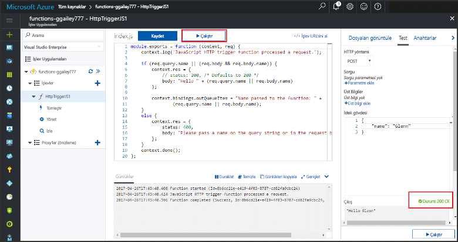
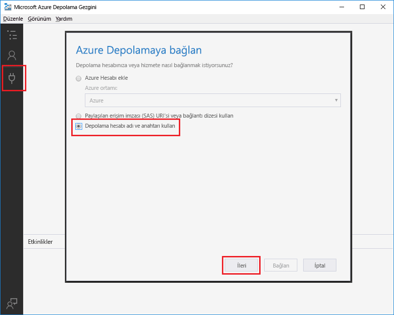
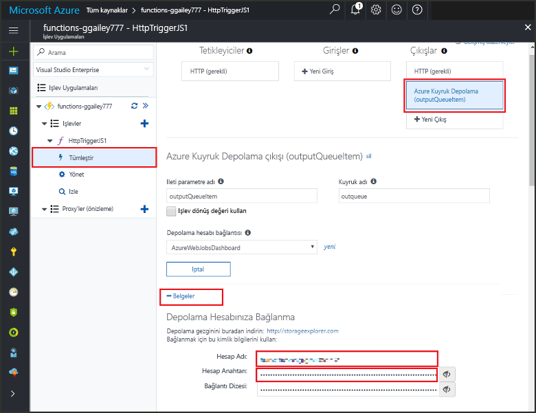
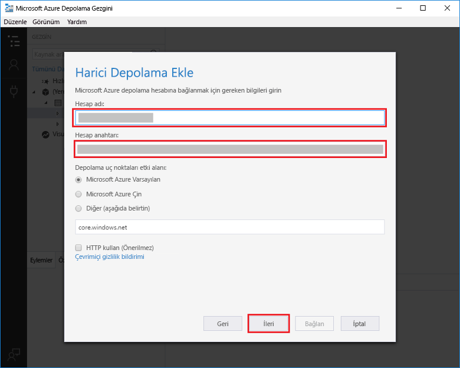

# <a name="add-messages-to-an-azure-storage-queue-using-functions"></a>İşlevleri kullanarak bir Azure Depolama kuyruğuna ileti ekleme

Azure İşlevleri’nde giriş ve çıkış bağlamaları, kodunuzda kullanılabilen dış hizmetlerden veri oluşturmanın bildirim temelli bir yöntemini sağlar. Bu hızlı başlangıçta, bir HTTP isteği tarafından işlev tetiklendiğinde kuyrukta bir ileti oluşturmak üzere çıkış bağlaması kullanırsınız. İşlevinizin oluşturduğu kuyruk iletilerini görüntülemek için Azure Depolama Gezgini’ni kullanın:



## <a name="prerequisites"></a>Ön koşullar 

Bu hızlı başlangıcı tamamlamak için:

* [Azure portalından ilk işlevinizi oluşturma](functions-create-first-azure-function.md) bölümündeki yönergeleri izleyin ve **Kaynakları temizleme** adımını uygulamayın. Bu hızlı başlangıç, burada kullandığınız işlev uygulamasını ve işlevi oluşturur.

* [Microsoft Azure Depolama Gezgini](http://storageexplorer.com/)'ni yükleyin. Bu, çıkış bağlamanızın oluşturduğu kuyruk iletilerini incelemek için kullanacağınız bir araçtır.

## <a name="add-binding"></a>Çıkış bağlaması ekleme

Bu bölümde, daha önce oluşturduğunuz işleve bir kuyruk depolama çıkış bağlaması eklemek üzere portal kullanıcı arabirimini kullanın. Bu bağlama, kuyrukta bir ileti oluşturmak üzere küçük bir kod yazmayı mümkün hale getirir. Depolama bağlantısı açma, kuyruk oluşturma veya bir kuyruk başvurusu alma gibi görevler için kod yazmanız gerekmez. Azure İşlevleri çalışma zamanı ve kuyruk çıkış bağlaması bu görevleri sizin için gerçekleştirir.

1. Azure portalında, [Azure portalından ilk işlevinizi oluşturma](functions-create-first-azure-function.md) bölümünde oluşturduğunuz işlev uygulamasına ait işlev uygulaması sayfasını açın. Bunu yapmak için **Tüm hizmetler > İşlev Uygulamaları**’nı ve ardından işlev uygulamanızı seçin.

2. Bu hızlı başlangıcın önceki kısımlarında oluşturduğunuz işlevi seçin.

1. **Tümleştir > Yeni çıkış > Azure Kuyruk depolama**’yı seçin.

1. **Seç**'e tıklayın.
    
    

3. **Azure Kuyruk Depolama çıkışı** altında, bu ekran görüntüsünden sonraki tabloda belirtilen ayarları kullanın: 

    

    | Ayar      |  Önerilen değer   | Açıklama                              |
    | ------------ |  ------- | -------------------------------------------------- |
    | **İleti parametre adı** | outputQueueItem | Çıkış bağlama parametresinin adı. | 
    | **Depolama hesabı bağlantısı** | AzureWebJobsStorage | İşlev uygulamanız tarafından kullanılmakta olan depolama hesabı bağlantısını kullanabilir veya yeni bir bağlantı oluşturabilirsiniz.  |
    | **Kuyruk adı**   | outqueue    | Depolama hesabınızdaki bağlantı kurulacak kuyruğun adı. |

4. Bağlamayı kaydetmek için **Kaydet**’e tıklayın.
 
Bir çıkış bağlaması tanımladığınıza göre, bir kuyruğa ileti eklemek üzere bağlamayı kullanmak için kodu güncelleştirmeniz gerekir.  

## <a name="add-code-that-uses-the-output-binding"></a>Çıkış bağlaması kullanan kod ekleme

Bu bölümde, çıkış kuyruğuna bir ileti yazan kodu ekleyeceksiniz. İleti, sorgu dizesinde HTTP tetikleyicisine geçirilen değeri içerir. Örneğin, sorgu dizesi `name=Azure` değerini içeriyorsa, kuyruk iletisi *İşleve geçirilen ad: Azure* şeklinde olur.

1. İşlev kodunu düzenleyicide görüntülemek için işlevinizi seçin. 

2. Bir C# işlevinde, bağlama için bir yöntem parametresi ekleyin ve kullanmak için kod yazın:

   Yöntem imzasına aşağıdaki örnekte gösterildiği gibi bir **outputQueueItem** parametresi ekleyin. Parametre adı, bağlamayı oluşturduğunuzda **İleti parametre adı** için girdiğiniz adla aynıdır.

   ```cs   
   public static async Task<HttpResponseMessage> Run(HttpRequestMessage req, 
       ICollector<string> outputQueueItem, TraceWriter log)
   {
       ...
   }
   ```

   C# işlevinin gövdesine `return` deyiminden hemen önce, kuyruk iletisi oluşturmak için parametreyi kullanan kodu ekleyin.

   ```cs
   outputQueueItem.Add("Name passed to the function: " + name);     
   ```

3. Bir JavaScript işlevi için, kuyruk iletisi oluşturmak üzere `context.bindings` nesnesinde çıkış bağlaması kullanan kodu ekleyin. Bu kodu `context.done` deyiminden önce ekleyin.

   ```javascript
   context.bindings.outputQueueItem = "Name passed to the function: " + 
               (req.query.name || req.body.name);
   ```

4. Değişiklikleri kaydetmek için **Kaydet**'i seçin.
 
## <a name="test-the-function"></a>İşlevi test etme 

1. Kod değişiklikleri kaydedildikten sonra **Çalıştır**'ı seçin. 

    

   **İstek gövdesinin** `name` değeri *Azure*’u içerdiğine dikkat edin. Bu değer, işlev çağrıldığında oluşturulan kuyruk iletisinde görüntülenir.

   Burada **Çalıştır**’ı seçmeye alternatif olarak, bir tarayıcıya URL girerek ve sorgu dizesinde `name` değerini belirterek işlevi çağırabilirsiniz. Tarayıcı yöntemi [önceki hızlı başlangıç](functions-create-first-azure-function.md#test-the-function) içinde gösterilmiştir.

2. İşlevin başarılı olduğundan emin olmak için günlükleri denetleyin. 

Çıkış bağlaması ilk kez kullanıldığında, Depolama hesabınızda İşlevler çalışma zamanı tarafından **outqueue** adlı yeni bir kuyruk oluşturulur. Kuyruğun ve içindeki iletinin oluşturulduğunu doğrulamak için Depolama Gezgini’ni kullanacaksınız.

### <a name="connect-storage-explorer-to-your-account"></a>Depolama Gezgini’ni hesabınıza bağlama

Depolama Gezgini’ni zaten yüklediyseniz ve bu hızlı başlangıçla birlikte kullandığınız depolama hesabına bağladıysanız bu bölümü atlayın.

2. [Microsoft Azure Depolama Gezgini](http://storageexplorer.com/) aracını çalıştırın, sol taraftaki bağlanma simgesini seçin, **Depolama hesabı adı ve anahtarı kullan**'ı seçip **İleri**'ye tıklayın.

    

1. Azure portalındaki işlevi uygulaması sayfasında işlevinizi seçin ve ardından **Tümleştir**’i seçin.

1. Önceki bir adımda eklediğiniz **Azure Kuyruk depolama** çıkış bağlamasını seçin.

1. Sayfanın altındaki **Belgeler** bölümünü genişletin. 

   Portal, depolama hesabına bağlanmak üzere Depolama Gezgini’nde kullanabileceğiniz kimlik bilgilerini gösterir.

   

1. Portaldan **Hesap Adı** değerini kopyalayın ve Depolama Gezgini’ndeki **Hesap adı** kutusuna yapıştırın.
 
1. Değeri göstermek için **Hesap Anahtarı**’nın yanındaki göster/gizle simgesine tıklayın ve sonra **Hesap Anahtarı** değerini kopyalayarak Depolama Gezgini’ndeki **Hesap anahtarı** kutusuna yapıştırın.
  
3. **İleri > Bağlan**’ı seçin.

   

### <a name="examine-the-output-queue"></a>Çıkış kuyruğunu inceleme

4. Depolama Gezgini'nde bu hızlı başlangıç için kullandığınız depolama hesabını seçin.

1. **Kuyruklar** düğümünü genişletin ve sonra **outqueue** adlı kuyruğu seçin. 

   Kuyruk, HTTP ile tetiklenen işlevi çalıştırdığınızda kuyruk çıkış bağlamasının oluşturduğu iletiyi içerir. İşlevi varsayılan `name` *Azure* değeri ile çağırdıysanız, kuyruk iletisi *İşleve geçirilen ad: Azure* şeklinde olur.

    

2. İşlevi yeniden çalıştırdığınızda kuyrukta yeni bir iletinin göründüğünü göreceksiniz.  

## <a name="clean-up-resources"></a>Kaynakları temizleme

[!INCLUDE [Clean up resources](../../includes/functions-quickstart-cleanup.md)]

## <a name="next-steps"></a>Sonraki adımlar

Bu hızlı başlangıçta, bar olan bir işleve çıkış bağlaması eklediniz. Kuyruk depolamaya bağlama hakkında daha fazla bilgi için bkz. [Azure İşlevleri Depolama kuyruğu bağlamaları](functions-bindings-storage-queue.md). 

[!INCLUDE [Next steps note](../../includes/functions-quickstart-next-steps.md)]
