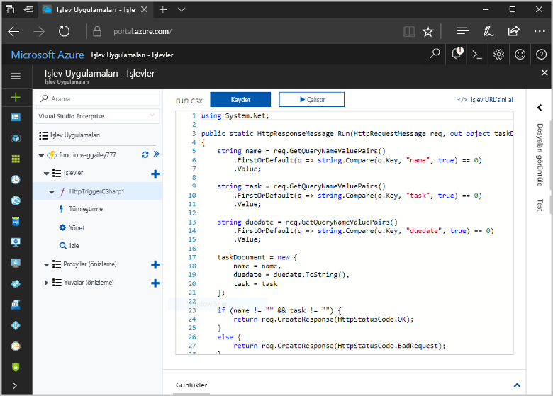
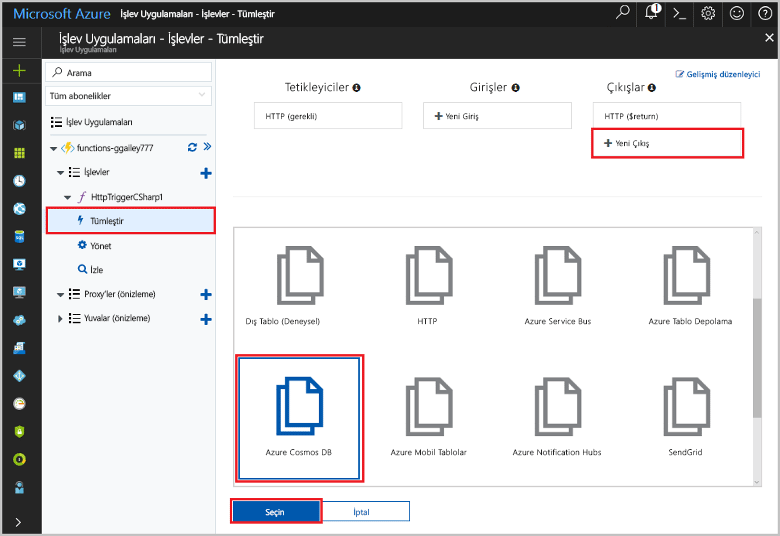
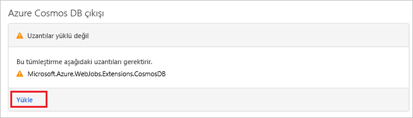
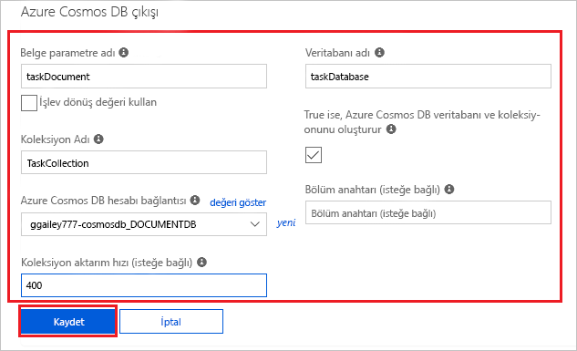
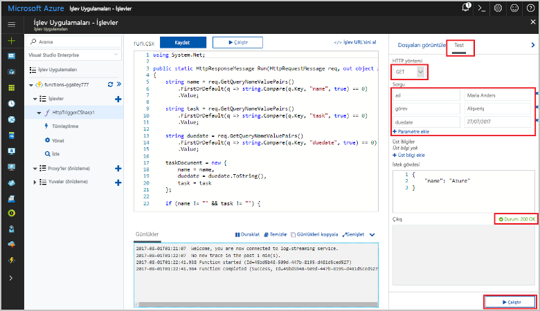
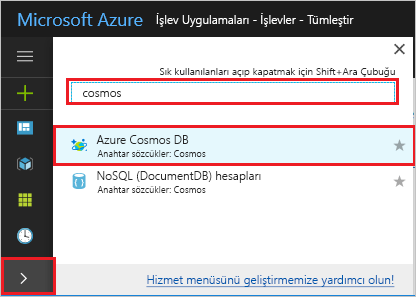
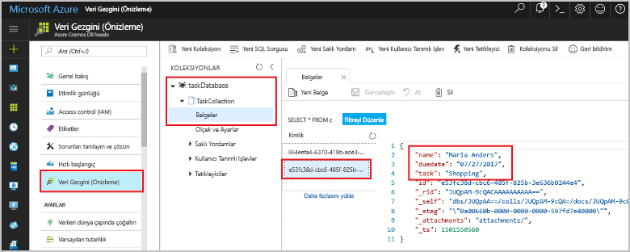

# <a name="store-unstructured-data-using-azure-functions-and-azure-cosmos-db"></a>Azure İşlevleri ve Azure Cosmos DB’yi kullanarak yapılandırılmamış verileri depolama

[Azure Cosmos DB](https://azure.microsoft.com/services/cosmos-db/), yapılandırılmamış verileri ve JSON verilerini depolamanın harika bir yoludur. Cosmos DB, Azure İşlevleri ile birlikte kullanıldığında verilerin ilişkisel bir veritabanında depolanmasına göre çok daha az kodla verileri hızlı ve kolay bir şekilde depolar.

> [!NOTE]
> Şu anda Azure Cosmos DB tetikleyicisi, giriş bağlamaları ve çıkış bağlamaları yalnızca SQL API ve Graph API hesaplarıyla çalışır.

Azure İşlevleri’nde giriş ve çıkış bağlamaları, işlevinizden dış hizmet verilerine bağlanmanın bildirim temelli bir yöntemini sağlar. Bu makalede, yapılandırılmamış verileri bir Azure Cosmos DB belgesinde depolayan bir çıktı bağlaması eklemek için var olan bir işlevi güncelleştirme hakkında bilgi edinin.



## <a name="prerequisites"></a>Önkoşullar

Bu öğreticiyi tamamlamak için:

[!INCLUDE [Previous quickstart note](../../includes/functions-quickstart-previous-topics.md)]

## <a name="create-an-azure-cosmos-db-account"></a>Azure Cosmos DB hesabı oluşturma

Çıkış bağlamasını oluşturabilmek için SQL API'sini kullanan bir Azure Cosmos DB hesabınızın olması gerekir.

[!INCLUDE [cosmos-db-create-dbaccount](../../includes/cosmos-db-create-dbaccount.md)]

## <a name="add-an-output-binding"></a>Çıktı bağlaması ekleme

1. Portalda önceden oluşturduğunuz işlev uygulamasına gidin ve hem işlev uygulamasını hem de işlevi genişletin.

1. **Tümleştir** öğesini ve sayfanın sağ üst kısmındaki **+ Yeni Çıktı**’yı seçin. **Azure Cosmos DB**’yi seçip **Seç**’e tıklayın.

    

1. **Uzantılar yüklü değil** iletisiyle karşılaşırsanız **Yükle**'yi seçerek Azure Cosmos DB bağlamaları uzantısını işlev uygulamasına yükleyin. Yükleme bir veya iki dakika sürebilir.

    

1. Tabloda belirtilen **Azure Cosmos DB çıktısı** ayarlarını kullanın:

    

    | Ayar      | Önerilen değer  | Açıklama                                |
    | ------------ | ---------------- | ------------------------------------------ |
    | **Belge parametre adı** | taskDocument | Kodda Cosmos DB nesnesine başvuran ad. |
    | **Veritabanı adı** | taskDatabase | Belgelerin kaydedileceği veritabanının adı. |
    | **Koleksiyon adı** | TaskCollection | Veritabanı koleksiyonunun adı. |
    | **True ise, Cosmos DB veritabanı ve koleksiyonunu oluşturur** | İşaretli | Koleksiyon henüz mevcut değil, bu yüzden oluşturun. |
    | **Azure Cosmos DB hesabı bağlantısı** | Yeni ayar | **Yeni**'yi ve ardından **Aboneliğinizi**, önceden oluşturduğunuz **Veritabanı hesabını** ve **Seç**'i belirtin. Hesap bağlantınız için bir uygulama ayarı oluşturulur. Bu ayar bağlama tarafından veritabanı bağlantısı için kullanılır. |
    | **Koleksiyon aktarım hızı** |400 RU| Daha sonra gecikme süresini azaltmak isterseniz aktarım hızının ölçeğini artırabilirsiniz. |

1. Bağlamayı oluşturmak için **Kaydet**'i seçin.

## <a name="update-the-function-code"></a>İşlev kodunu güncelleştirme

Mevcut işlev kodunu aşağıdan seçtiğiniz dildeki kodla değiştirin:

# <a name="ctabcsharp"></a>[C#](#tab/csharp)

Mevcut C# işlevini aşağıdaki kodla değiştirin:

```csharp
#r "Newtonsoft.Json"

using Microsoft.AspNetCore.Mvc;
using Microsoft.AspNetCore.Http;
using Microsoft.Extensions.Logging;

public static IActionResult Run(HttpRequest req, out object taskDocument, ILogger log)
{
    string name = req.Query["name"];
    string task = req.Query["task"];
    string duedate = req.Query["duedate"];

    // We need both name and task parameters.
    if (!string.IsNullOrEmpty(name) && !string.IsNullOrEmpty(task))
    {
        taskDocument = new
        {
            name,
            duedate,
            task
        };

        return (ActionResult)new OkResult();
    }
    else
    {
        taskDocument = null;
        return (ActionResult)new BadRequestResult();
    }
}
```

# <a name="javascripttabjavascript"></a>[JavaScript](#tab/javascript)

Mevcut JavaScript işlevini aşağıdaki kodla değiştirin:

```js
module.exports = async function (context, req) {

    // We need both name and task parameters.
    if (req.query.name && req.query.task) {

        // Set the output binding data from the query object.
        context.bindings.taskDocument = req.query;

        // Success.
        context.res = {
            status: 200
        };
    }
    else {
        context.res = {
            status: 400,
            body: "The query options 'name' and 'task' are required."
        };
    }
};
```
---

Bu kod örneği, HTTP İsteği sorgu dizelerini okur ve `taskDocument` nesnesindeki alanlara atar. `taskDocument` bağlaması bu bağlama parametresindeki nesne verilerini, bağlanan belge veritabanında depolanmak üzere gönderir. Veritabanı, işlev ilk kez çalıştırıldığında oluşturulur.

## <a name="test-the-function-and-database"></a>İşlevi ve veritabanını test etme

1. Sağ pencereyi genişletip **Test**’i seçin. **Sorgu** altında **+ Parametre ekle**’ye tıklayıp aşağıdaki parametreleri sorgu dizesine ekleyin:

    + `name`
    + `task`
    + `duedate`

1. **Çalıştır**’a tıklayın ve 200 durumunun döndürüldüğünü doğrulayın.

    

1. Azure portalının sol tarafındaki simge çubuğunu genişletin, arama alanına `cosmos` yazın ve **Azure Cosmos DB**’yi seçin.

    

1. Azure Cosmos DB hesabınızı seçin ve ardından **Veri Gezgini**’ni seçin.

1. **Koleksiyonlar** düğümünü genişletin, yeni belgeyi seçin ve belgenin sorgu dizesi değerlerinizin yanı sıra bazı ek meta verileri içerdiğini onaylayın.

    

Yapılandırılmamış verileri bir Azure Cosmos DB’de depolayan HTTP tetikleyicinize başarıyla bir bağlama eklediniz.

[!INCLUDE [Clean-up section](../../includes/clean-up-section-portal.md)]

## <a name="next-steps"></a>Sonraki adımlar

Cosmos DB veritabanına bağlama hakkında daha fazla bilgi için bkz. [Azure İşlevleri Cosmos DB bağlamaları](functions-bindings-cosmosdb.md).

[!INCLUDE [functions-quickstart-next-steps](../../includes/functions-quickstart-next-steps-2.md)]
