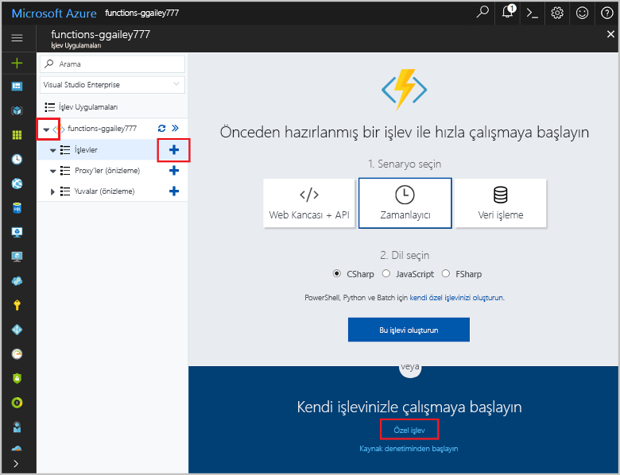

# <a name="create-an-openapi-definition-for-a-function"></a>Bir işlev için OpenAPI tanımı oluşturma

REST API’ler genellikle bir OpenAPI tanımı (eski adıyla [Swagger](https://swagger.io/) dosyası) kullanılarak açıklanır. Bu tanım, bir API’de hangi işlemlerin kullanılabildiğinin yanı sıra API için istek ve yanıt verilerinin nasıl yapılandırılması gerektiğiyle ilgili bilgileri içerir.

Bu öğreticide, bir rüzgar türbini için acil onarımın uygun maliyetli olup olmadığını belirleyen bir işlev oluşturursunuz. Daha sonra, işleve diğer uygulama ve hizmetlerden çağrı yapılabilmesi için işlev uygulamasına yönelik bir OpenAPI tanımı oluşturursunuz.

Bu öğreticide şunların nasıl yapıldığını öğreneceksiniz:

> [!div class="checklist"]
> * Azure’da işlev oluşturma
> * OpenAPI araçlarını kullanarak OpenAPI tanımı oluşturma
> * Tanımı ek meta veri sağlayacak şekilde değiştirme
> * İşleve çağrı yaparak tanımı test etme

> [!IMPORTANT]
> Openapı özelliği şu anda Önizleme aşamasındadır ve yalnızca sürüm için kullanılabilir Azure işlevleri çalışma zamanının 1.x.

## <a name="create-a-function-app"></a>İşlev uygulaması oluşturma

İşlevlerinizin yürütülmesini barındıran bir işlev uygulamasına sahip olmanız gerekir. İşlev uygulaması, kaynakların daha kolay yönetilmesi, dağıtılması, ölçeklendirilmesi ve paylaşılması için işlevleri bir mantıksal birim olarak gruplandırmanıza olanak tanır. 

[!INCLUDE [Create function app Azure portal](../../includes/functions-create-function-app-portal.md)]

## <a name="set-the-functions-runtime-version"></a>İşlevler çalışma zamanı sürümünü ayarlama

Varsayılan olarak, oluşturduğunuz işlev uygulamasının sürümünü kullanır. 2.x çalışma zamanı. İşlevinizin oluşturmadan önce çalışma zamanı sürümü 1.x sürümünden ayarlamanız gerekir.

[!INCLUDE [Set the runtime version in the portal](../../includes/functions-view-update-version-portal.md)]

## <a name="create-the-function"></a>İşlevi oluşturma

Bu öğreticide HTTP ile tetiklenen ve şu iki parametreyi alan bir işlev kullanılır: türbin onarımı için gereken tahmini süre (saat cinsinden) ve türbinin kapasitesi (kilovat cinsinden). Daha sonra, işlev tarafından onarım maliyetinin ne olacağı ve türbinin 24 saatlik bir dönemde ne kadar gelir kazandırabileceği hesaplanır.

1. İşlev uygulamanızı genişletin ve **İşlevler**'in yanındaki **+** düğmesini seçin. Bu, işlev uygulamanızdaki ilk işlevse **Özel işlev**'i seçin. Böylece işlev şablonlarının tamamı görüntülenir. 

    

1. Arama alanına `http` yazıp HTTP tetikleyici şablonunuz için **C#** dilini seçin. 

    

1. İşlevin **Ad** alanına `TurbineRepair` yazın, **[Kimlik doğrulama düzeyi](functions-bindings-http-webhook.md#http-auth)** için `Function` seçeneğini belirleyip **Oluştur**’u seçin.  

    

1. run.csx dosyasının içeriğini aşağıdaki kodla değiştirip **Kaydet**’e tıklayın:

    ```csharp
    using System.Net;

    const double revenuePerkW = 0.12;
    const double technicianCost = 250;
    const double turbineCost = 100;

    public static async Task<HttpResponseMessage> Run(HttpRequestMessage req, TraceWriter log)
    {
        //Get request body
        dynamic data = await req.Content.ReadAsAsync<object>();
        int hours = data.hours;
        int capacity = data.capacity;

        //Formulas to calculate revenue and cost
        double revenueOpportunity = capacity * revenuePerkW * 24;  
        double costToFix = (hours * technicianCost) +  turbineCost;
        string repairTurbine;

        if (revenueOpportunity > costToFix){
            repairTurbine = "Yes";
        }
        else {
            repairTurbine = "No";
        }

        return req.CreateResponse(HttpStatusCode.OK, new{
            message = repairTurbine,
            revenueOpportunity = "$"+ revenueOpportunity,
            costToFix = "$"+ costToFix
        });
    }
    ```

    Bu işlev kodu, acil onarımın uygun maliyetli olup olmadığının yanı sıra türbinin temsil ettiği gelir fırsatını ve türbin onarımının maliyetini gösteren `Yes` veya `No` şeklinde bir ileti döndürür. 

1. İşlevi test etmek için en sağdaki **Test** seçeneğine tıklayarak test sekmesini genişletin. **İstek gövdesi** için aşağıdaki değeri girip **Çalıştır**’a tıklayın.

    ```json
    {
    "hours": "6",
    "capacity": "2500"
    }
    ```

    

    Yanıtın gövdesinde aşağıdaki değer döndürülür.

    ```json
    {"message":"Yes","revenueOpportunity":"$7200","costToFix":"$1600"}
    ```

Acil onarımların maliyet açısından uygunluğunu belirleyen bir işleviniz oldu. Bir sonraki öğreticide, işlev uygulaması için bir OpenAPI tanımı oluşturup bu tanımı düzenleyeceksiniz.

## <a name="generate-the-openapi-definition"></a>OpenAPI tanımını oluşturma

Artık OpenAPI tanımını oluşturmaya hazırsınız. Bu tanımı API Uygulamaları, [PowerApps](functions-powerapps-scenario.md) ve [Microsoft Flow](../azure-functions/app-service-export-api-to-powerapps-and-flow.md) gibi diğer Microsoft teknolojilerinin yanı sıra [Postman](https://www.getpostman.com/docs/importing_swagger) ve [diğer birçok paket](https://swagger.io/tools/) gibi üçüncü taraf geliştirici araçları kullanabilir.

1. Yalnızca API'nizin desteklediği *fiilleri* (bu durumda POST) seçin. Bu, oluşturulan API tanımının daha temiz olmasını sağlar.

    1. Yeni HTTP Tetikleyici işlevinizin **Tümleştir** sekmesinde, **İzin verilen HTTP metotları**’nı **Seçili metotlar** olarak değiştirin

    1. **Seçili HTTP metotları** bölümünde **POST** dışındaki tüm seçenekleri temizleyip **Kaydet**’e tıklayın.

        

1. İşlev uygulamanızın adı (**function-demo-energy** gibi) > **Platform özellikleri** > **API tanımı**’na tıklayın.

    

1. **API tanımı** sekmesinde **İşlev**’e tıklayın.

    

    Bu adım, işlev uygulamanız için işlev uygulamanızın etki alanından bir OpenAPI dosyasının barındırılmasına yönelik uç nokta, [OpenAPI Düzenleyicisi](https://editor.swagger.io)’nin satır içi bir kopyası ve bir API tanım şablonu oluşturucu dahil olmak üzere bir dizi OpenAPI seçeneğini etkinleştirir.

1. **API tanımı şablonu oluşturun** > **Kaydet**’e tıklayın.

    

    Azure, işlev uygulamanızdaki HTTP Tetikleyicisi işlevlerini tarar ve functions.json dosyasındaki bilgileri kullanarak bir OpenAPI tanımı oluşturur. Oluşturulan tanım şudur:

    ```yaml
    swagger: '2.0'
    info:
    title: function-demo-energy.azurewebsites.net
    version: 1.0.0
    host: function-demo-energy.azurewebsites.net
    basePath: /
    schemes:
    - https
    - http
    paths:
    /api/TurbineRepair:
        post:
        operationId: /api/TurbineRepair/post
        produces: []
        consumes: []
        parameters: []
        description: >-
            Replace with Operation Object
            #https://swagger.io/specification/#operationObject
        responses:
            '200':
            description: Success operation
        security:
            - apikeyQuery: []
    definitions: {}
    securityDefinitions:
    apikeyQuery:
        type: apiKey
        name: code
        in: query
    ```

    Bu tanımın tam bir OpenAPI tanımı olabilmesi için daha fazla meta veri gerektiğinden tanım bir _şablon_ olarak tanımlanmıştır. Bu tanımı bir sonraki adımda değiştireceksiniz.

## <a name="modify-the-openapi-definition"></a>OpenAPI tanımını değiştirme

Bir şablon tanımınız olduğuna göre API işlemleri ve veri yapıları hakkında ek meta veriler sağlamak üzere değiştirin. **API tanımı**’nda, tanımın altındaki `post` bölümünden oluşturulan tanımı silin, içeriği aşağıya yapıştırın ve **Kaydet**’e tıklayın.

```yaml
    post:
      operationId: CalculateCosts
      description: Determines if a technician should be sent for repair
      summary: Calculates costs
      x-ms-summary: Calculates costs
      x-ms-visibility: important
      produces:
        - application/json
      consumes:
        - application/json
      parameters:
        - name: body
          in: body
          description: Hours and capacity used to calculate costs
          x-ms-summary: Hours and capacity
          x-ms-visibility: important
          required: true
          schema:
            type: object
            properties:
              hours:
                description: The amount of effort in hours required to conduct repair
                type: number
                x-ms-summary: Hours
                x-ms-visibility: important
              capacity:
                description: The max output of a turbine in kilowatts
                type: number
                x-ms-summary: Capacity
                x-ms-visibility: important
      responses:
        200:
          description: Message with cost and revenue numbers
          x-ms-summary: Message
          schema:
           type: object
           properties:
            message:
              type: string
              description: Returns Yes or No depending on calculations
              x-ms-summary: Message 
            revenueOpportunity:
              type: string
              description: The revenue opportunity cost
              x-ms-summary: RevenueOpportunity 
            costToFix:
              type: string
              description: The cost in $ to fix the turbine
              x-ms-summary: CostToFix
      security:
        - apikeyQuery: []
definitions: {}
securityDefinitions:
  apikeyQuery:
    type: apiKey
    name: code
    in: query
```

Bu durumda yalnızca güncelleştirilen meta verileri yapıştırabilirsiniz, ancak varsayılan şablonda yaptığımız değişiklik türlerinin anlaşılması önemlidir:

* API’nin verileri bir JSON biçiminde ürettiğini ve tükettiğini belirttik.

* Adları ve veri türleriyle birlikte gerekli parametreleri belirttik.

* Başarılı bir yanıt için döndürülen değerleri adları ve veri türleriyle birlikte belirttik.

* API ile ona ait işlemler ve parametreler için kolay özetler ve açıklamalar sağladık. Bu, işlevi kullanacak kişiler için önemlidir.

* Kullanıcı arabiriminde Microsoft Flow ve Logic Apps için kullanılan x-ms-summary ve x-ms-visibility öğelerini ekledik. Daha fazla bilgi için bkz. [Microsoft Flow’da özel API’ler için OpenAPI uzantıları](https://preview.flow.microsoft.com/documentation/customapi-how-to-swagger/).

> [!NOTE]
> API anahtarının varsayılan kimlik doğrulama metodunu içeren güvenlik tanımını olduğu gibi bıraktık. Farklı bir kimlik doğrulama türü kullansaydınız tanımın bu bölümünü değiştirmeniz gerekirdi.

API işlemlerini tanımlama hakkında daha fazla bilgi için bkz. [OpenAPI belirtimi](https://swagger.io/specification/#operationObject).

## <a name="test-the-openapi-definition"></a>OpenAPI tanımını test etme

API tanımı kullanmadan önce Azure İşlevleri kullanıcı arabiriminde test etmek iyi bir fikirdir.

1. İşlevinizin **Yönet** sekmesindeki **Ana Bilgisayar Anahtarları** bölümünden **varsayılan** anahtarı kopyalayın.

    

    > [!NOTE]
    >Test için kullanılan bu anahtarı bir uygulama veya hizmetten API’ye çağrı yaparken de kullanırsınız.

1. API tanımına dönün: **function-demo-energy** > **Platform özellikleri** > **API tanımı**.

1. Sağ bölmeden **Kimlik Doğrula**’ya tıklayıp kopyaladığınız API anahtarını girin ve **Kimlik Doğrula**‘ya tıklayın.

    

1. Ekranı aşağı kaydırıp **Bu işlemi dene**’ye tıklayın.

    

1. **Saat** ve **kapasite** değerlerini girin.

    

    Kullanıcı arabiriminin API tanımından alınan açıklamaları kullandığına dikkat edin.

1. **İsteği Gönder**’e tıklayın ve sonra çıktıyı görmek için **Düzgün** sekmesine tıklayın.

    

## <a name="next-steps"></a>Sonraki adımlar

Bu öğreticide, şunların nasıl yapıldığını öğrendiniz:

> [!div class="checklist"]
> * Azure’da işlev oluşturma
> * OpenAPI araçlarını kullanarak OpenAPI tanımı oluşturma
> * Tanımı ek meta veri sağlayacak şekilde değiştirme
> * İşleve çağrı yaparak tanımı test etme

Oluşturduğunuz OpenAPI tanımını kullanan bir PowerApps uygulaması oluşturmayı öğrenmek için bir sonraki konuya geçin.

> [!div class="nextstepaction"]
> [PowerApps’ten bir işlev çağırma](functions-powerapps-scenario.md)
