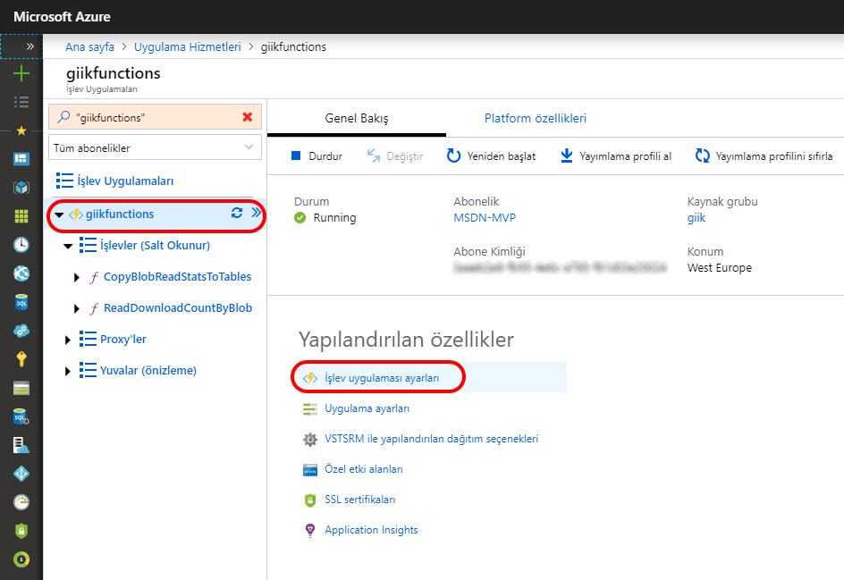

# <a name="how-to-target-azure-functions-runtime-versions"></a>Azure işlevleri çalışma zamanı sürümlerini hedeflemek nasıl

Bir işlev uygulaması, belirli bir Azure işlevleri çalışma zamanı sürümünde çalışır. İki ana sürümü vardır: [1.x ve 2.x'i](functions-versions.md). Sürümü oluşturulan uygulama varsayılan olarak, işlev 2.x çalışma zamanı. Bu makalede seçtiğiniz sürüm üzerinde çalıştırmak için azure'da bir işlev uygulaması yapılandırma açıklanmaktadır. Belirli bir sürümü için bir yerel geliştirme ortamı yapılandırma hakkında daha fazla bilgi için bkz: [kod ve test, Azure işlevleri yerel olarak](functions-run-local.md).

> [!NOTE]
> Bir veya daha fazla işlev sahip bir işlev uygulaması için çalışma zamanı sürümünü değiştiremezsiniz. Çalışma zamanı sürümü değiştirmek için Azure portalını kullanmanız gerekir.

## <a name="automatic-and-manual-version-updates"></a>Otomatik ve el ile sürüm güncelleştirmeleri

İşlevleri kullanarak çalışma zamanının belirli bir sürümü hedeflemesini sağlar `FUNCTIONS_EXTENSION_VERSION` bir işlev uygulaması uygulama ayarı. İşlev uygulaması, yeni bir sürümüne taşımak seçtiğiniz kadar belirtilen ana sürümü üzerinde tutulur.

Yalnızca birincil sürüm ("~" için 2 2.x veya "~ 1" 1.x) belirtirseniz, mevcut olduklarında işlev uygulaması için yeni ikincil sürümleri çalışma zamanı otomatik olarak güncelleştirilir. Yeni ikincil sürümler, bozucu değişiklikleri İstemediğimiz. Bir ikincil sürüm (örneğin, "2.0.12345") belirtirseniz, işlev uygulamasını açıkça değiştirene kadar belirli bir sürümüne sabitlenir.

Yeni bir sürümü genel kullanıma açık olduğunda, Portalı'nda isteme bu sürümüne nahoru almanıza şans tanır. Yeni bir sürüme taşıdıktan sonra her zaman kullanabilirsiniz `FUNCTIONS_EXTENSION_VERSION` önceki bir sürüme geri taşımak için uygulama ayarı.

Bir değişiklik çalışma zamanı sürümüne yeniden başlatmak bir işlev uygulaması neden olur.

İçinde ayarlanan değerlerle `FUNCTIONS_EXTENSION_VERSION` otomatik güncelleştirmeleri etkinleştirmek üzere bu ayarı uygulama şu anda "~ 1" 1.x çalışma zamanı ve "~" için 2 2.x için.

## <a name="view-and-update-the-current-runtime-version"></a>Görüntüleme ve geçerli çalışma zamanı sürümünü güncelleştirme

Şu anda bir işlev uygulaması tarafından kullanılan çalışma zamanı sürümünü görüntülemek için aşağıdaki yordamı kullanın.

1. İçinde [Azure portalında](https://portal.azure.com), işlev uygulamanızı bulun.

1. Altında **yapılandırılan özellikler**, seçin **işlev uygulaması ayarları**.

    

1. İçinde **işlev uygulaması ayarları** sekmesinde, bulmak **çalışma zamanı sürümü**. Belirli bir çalışma zamanı sürümünü ve istenen sürümle unutmayın. Aşağıdaki örnekte, sürüm kümesine `~2`.

   

1. İşlev uygulamanızı sürüm 1.x çalışma zamanı sabitlemek seçin **yaklaşık 1** altında **çalışma zamanı sürümü**. İşlev uygulamanızda olduğunda bu anahtar devre dışı bırakıldı.

1. Çalışma zamanı sürümü değişti, dönün **genel bakış** sekmesini **yeniden** uygulamayı yeniden başlatmanız.  Sürüm 1.x çalışma zamanı üzerinde çalışan işlev uygulamasını yeniden başlatır ve işlevleri oluşturduğunuzda sürüm 1.x şablonları kullanılır.

## <a name="view-and-update-the-runtime-version-using-azure-cli"></a>Görüntüleme ve Azure CLI kullanarak çalışma zamanı sürümünü güncelleştirme

Ayrıca görüntülemek ve ayarlamak `FUNCTIONS_EXTENSION_VERSION` Azure clı'dan.

>[!NOTE]
>Diğer ayarlar çalışma zamanı sürümü tarafından etkilenebilir, çünkü sürüm portalında değiştirmeniz gerekir. Çalışma zamanı sürümleri değiştirdiğinizde portalın diğer gerekli güncelleştirmeleri, Node.js sürümü ve çalışma zamanı yığını gibi otomatik olarak yapar.  

Azure CLI'yı kullanarak, geçerli çalışma zamanı sürümüyle görüntülemek [az functionapp config appsettings set](/cli/azure/functionapp/config/appsettings#set) komutu.

```azurecli-interactive
az functionapp config appsettings list --name <function_app> \
--resource-group <my_resource_group>
```

Bu kod içinde `<function_app>` işlev uygulamanızın adıyla. Ayrıca değiştirin `<my_resource_group>` işlev uygulamanız için kaynak grubunun adıyla. 

Gördüğünüz `FUNCTIONS_EXTENSION_VERSION` aşağıdaki Çıkışta, hangi kesildi açıklık için:

```output
[
  {
    "name": "FUNCTIONS_EXTENSION_VERSION",
    "slotSetting": false,
    "value": "~2"
  },
  {
    "name": "FUNCTIONS_WORKER_RUNTIME",
    "slotSetting": false,
    "value": "dotnet"
  },
  
  ...
  
  {
    "name": "WEBSITE_NODE_DEFAULT_VERSION",
    "slotSetting": false,
    "value": "8.11.1"
  }
]
```

Güncelleştirebilirsiniz `FUNCTIONS_EXTENSION_VERSION` işlev uygulaması ayarı [az functionapp config appsettings set](/cli/azure/functionapp/config/appsettings#set) komutu.

```azurecli-interactive
az functionapp config appsettings set --name <function_app> \
--resource-group <my_resource_group> \
--settings FUNCTIONS_EXTENSION_VERSION=<version>
```

Değiştirin `<function_app>` işlev uygulamanızın adıyla. Ayrıca değiştirin `<my_resource_group>` işlev uygulamanız için kaynak grubunun adıyla. Ayrıca, değiştirin `<version>` 1.x çalışma zamanı, geçerli bir sürüm ile veya `~2` sürümü için 2.x.

Bu komutu çalıştırabilirsiniz [Azure Cloud Shell](../cloud-shell/overview.md) seçerek **deneyin** önceki kod örneğinde. Ayrıca [Azure CLI'yi yerel olarak](/cli/azure/install-azure-cli) yürütüldükten sonra bu komutu yürütmek için [az login](/cli/azure/reference-index#az-login) oturum açmak için.

## <a name="next-steps"></a>Sonraki adımlar

> [!div class="nextstepaction"]
> [Yerel geliştirme ortamınızda 2.0 çalışma zamanını hedef](functions-run-local.md)

> [!div class="nextstepaction"]
> [Çalışma zamanı sürümleri için yayın notlarına bakın](https://github.com/Azure/azure-webjobs-sdk-script/releases)
