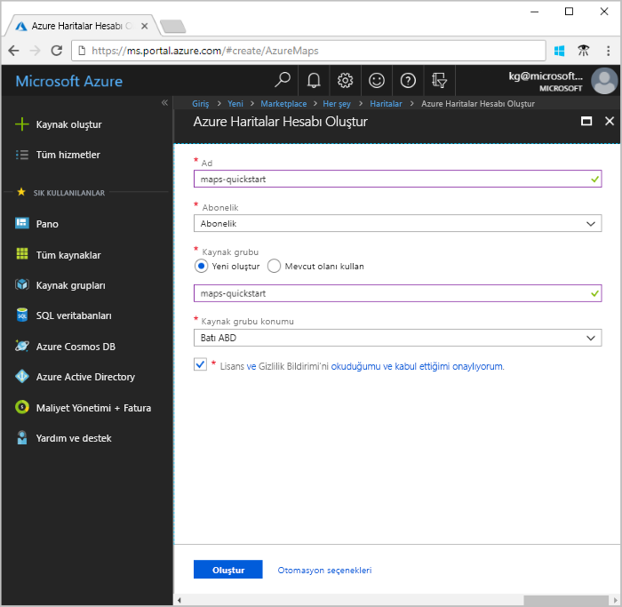
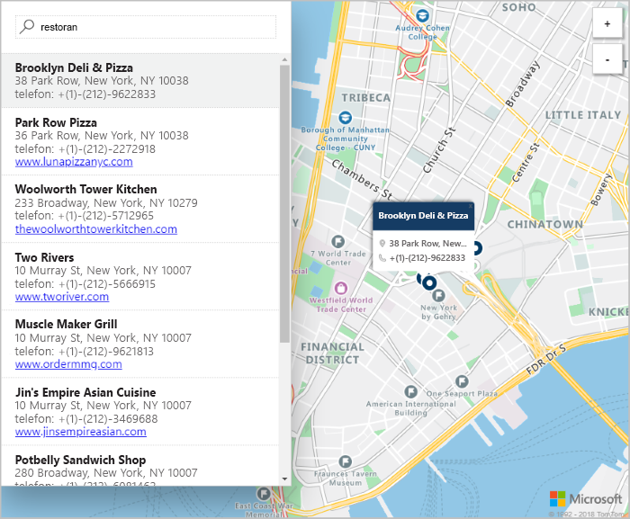

# Azure haritalar'ı kullanarak bir etkileşimli arama eşlemesi oluşturma

Bu makalede, Azure Haritalar’ın kullanıcılara etkileşimli arama deneyimi sunan bir harita oluşturmaya yönelik özellikler gösterilmektedir. Bu, şu temel adımlarda size yol gösterir:
* Kendi Azure haritalar hesabı oluşturun.
* Demo web uygulamasında kullanmak üzere hesap anahtarınızı alın.

Azure aboneliğiniz yoksa başlamadan önce [ücretsiz bir hesap](https://azure.microsoft.com/free/?WT.mc_id=A261C142F) oluşturun.

## Azure portalında oturum açın

[Azure Portal](https://portal.azure.com/) oturum açın.

## Hesap oluşturma ve anahtarınızı alma

1. Sol alt köşesindeki [Azure portalında](https://portal.azure.com)seçin **kaynak Oluştur**.
2. İçinde **markette Ara** kutusuna **haritalar**.
3. **Sonuçlar** içinden **Haritalar**’ı seçin. Seçin **Oluştur** haritanın altında görüntülenen düğme.
4. Üzerinde **Azure haritalar hesabı oluştur** sayfasında, aşağıdaki değerleri girin:
   - Yeni hesabınıza verilen **Ad**.
   - Bu hesap için kullanmak istediğiniz **Abonelik**.
   - Bu hesap için **Kaynak grubu**. Tercih edebileceğiniz **Yeni Oluştur** veya **var olanı kullan** kaynak grubu.
   - Seçin **fiyatlandırma katmanı** tercih ettiğiniz.
   - Okuma **lisans** ve **gizlilik bildirimi**. Koşulları kabul etmek için onay kutusunu işaretleyin.
   - Son olarak, seçin **Oluştur** düğmesi.

     

5. Hesabınız başarıyla oluşturulduktan sonra açın ve hesap menüsünden ayarları bölümünü bulun. Seçin **anahtarları** Azure haritalar hesabınız için birincil ve ikincil anahtarları görüntülemek için. **Birincil Anahtar** değerini sonraki bölümde kullanmak üzere yerel panonuza kopyalayın.

## Uygulamayı indirme

1. [interactiveSearch.html](https://github.com/Azure-Samples/AzureMapsCodeSamples/blob/master/AzureMapsCodeSamples/Tutorials/interactiveSearch.html) dosyasının içeriklerini indirin veya kopyalayın.
2. Bu dosyanın içeriği yerel kaydetmek **AzureMapDemo.html**. Bir metin düzenleyicisinde açın.
3. Arama dizesi için `<Your Azure Maps Key>`. Yerine konacak **birincil anahtar** değerini ise önceki bölümden.

## Uygulamayı açma

1. **AzureMapDemo.html** dosyasını istediğiniz bir tarayıcıda açın.
2. Şehir, Los Angeles, gösterilen haritasına bakın. Yakınlaştırma düzeyine bağlı olarak haritanın daha fazla veya daha az bilgiyle nasıl işlendiğini görmek için yakınlaştırma ve uzaklaştırma yapın. 
3. Haritanın varsayılan merkezini değiştirin. **AzureMapDemo.html** dosyasında, **center** adlı değişkeni arayın. Bu değişkenin boylam ve enlem çiftini, yeni **[-74.0060, 40.7128]** değerleriyle değiştirin. Dosyayı kaydedin ve tarayıcınızı yenileyin.
4. Etkileşimli arama deneyimini deneyin. Arama kutusuna demo web uygulamasının sol üst köşedeki arama **restoranlar**.
5. Adres ve arama kutusunun altında görünen konumları listesi üzerinde fareyi hareket ettirin. Bu konum hakkında bilgileri nasıl karşılık gelen PIN harita üzerinde yükseklikteki dikkat edin. Özel işletmelerin gizliliğini korumak için kurgusal ad ve adresler gösterilir.

    

## Kaynakları temizleme

Öğreticileri kullanın ve Azure haritalar hesabınız ile yapılandırma hakkında ayrıntılı olarak açıklanmaktadır. Bu hızlı başlangıçta oluşturulan kaynakları temizleyin, öğreticilere geçin planladığınız yok. Devam etmeyi planlamıyorsanız, kaynakları temizlemek için aşağıdaki adımları uygulayın:

1. Çalıştıran Tarayıcıyı kapatın **AzureMapDemo.html** web uygulaması.
2. Azure portalında sol menüden seçim yapın **tüm kaynakları**. Ardından, Azure haritalar hesabı seçin. Üst kısmındaki **tüm kaynakları** dikey penceresinde **Sil**.

## Sonraki adımlar

Bu hızlı başlangıçta, Azure haritalar hesabınızda oluşturduğunuz ve bir tanıtım uygulaması oluşturdunuz. Azure haritalar hakkında bilgi edinmek için aşağıdaki öğreticilere göz atın:

> [!div class="nextstepaction"]
> [Azure haritalar'ı kullanarak ilgi noktalarını arama](tutorial-search-location.md)

Daha fazla kod örnekleri ve etkileşimli bir kodlama deneyimi için bu kılavuzlara bakın:

> [!div class="nextstepaction"]
> [Azure haritalar arama hizmetini kullanarak bir adres Bul](how-to-search-for-address.md)

> [!div class="nextstepaction"]
> [Azure haritalar harita denetimini kullanma](how-to-use-map-control.md)
