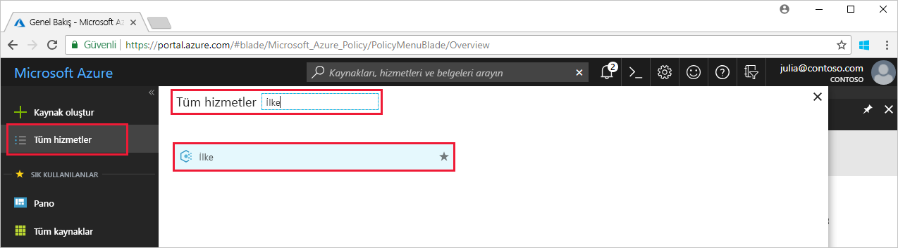
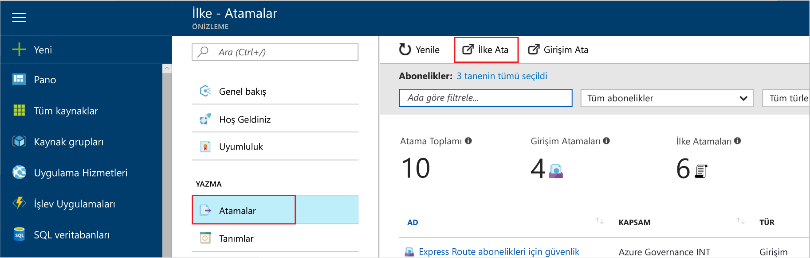
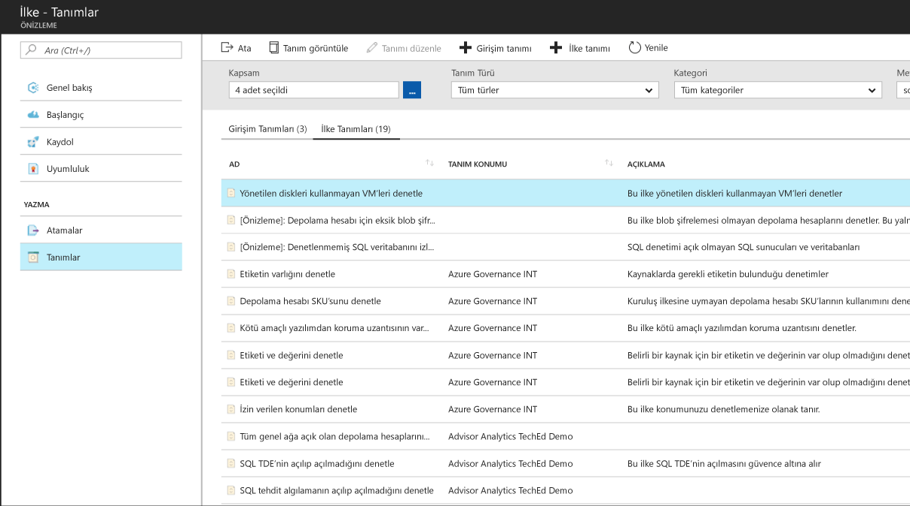
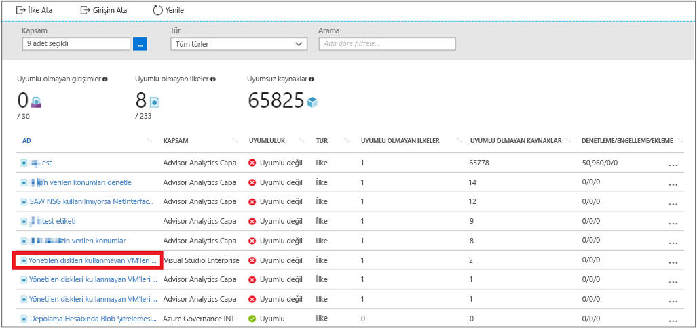
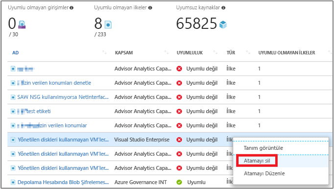

# Azure ortamınızda uyumlu olmayan kaynakları belirlemek için bir ilke ataması oluşturma

Azure’da uyumluluğu anlamanın ilk adımı, kaynaklarınızın durumunu belirlemektir. Bu hızlı başlangıç, yönetilen disk kullanmayan sanal makineleri belirlemek üzere ilke ataması oluşturma işleminde size yol gösterir.

Bu işlemin sonunda, yönetilen disk kullanmayan sanal makineleri başarılı bir şekilde belirlemiş olacaksınız. Bu sanal makineler, ilke ataması ile *uyumsuzdur*.

Azure aboneliğiniz yoksa başlamadan önce [ücretsiz](https://azure.microsoft.com/free/) bir hesap oluşturun.

## İlke ataması oluşturma

Bu hızlı başlangıçta, bir ilke ataması oluşturup *Yönetilen Diskleri Olmayan Sanal Makineleri Denetle* ilke tanımını atayacaksınız.

1. Azure portalında **Tüm hizmetler**’e tıkladıktan sonra **İlke**'yi arayıp seçerek Azure İlkesi hizmetini başlatın.

   

2. Azure İlkesi sayfasının sol tarafından **Atamalar**'ı seçin. Atama, belirli bir kapsamda gerçekleşmesi için atanmış olan bir ilkedir.
3. **İlke - Atamalar** sayfasının üst kısmından **İlke Ata**'yı seçin.

   

4. **İlke Ata** sayfasında üç noktaya tıklayıp bir abonelik (gerekli) ve kaynak grubu (isteğe bağlı) seçerek **Kapsam**’ı belirleyin. Kapsam, ilke atamasının hangi kaynaklarda veya kaynak gruplarında uygulanacağını belirler.  Ardından **Kapsam** sayfasının alt kısmından **Seç**’e tıklayın.

   Bu örnekte **Contoso Aboneliği** kullanılır. Sizin aboneliğiniz farklı olacaktır.

5. Bir veya daha fazla kaynak grubunu (kapsamı yalnızca belirli bir aboneliğe ayarladıysanız) veya bir kaynak grubundaki belirli kaynakları (her iki kapsam durumunda da) dışlamak istiyorsanız, ilke atama bölümünden **Dışlamalar** özelliğini kullanabilirsiniz. Şimdilik boş bırakın.

6. **İlke tanımı** üç nokta öğesini seçerek kullanılabilen tanımların listesini açın. Azure İlkesi, kullanabileceğiniz yerleşik ilke tanımlarıyla birlikte gelir. Aşağıdakiler gibi birçok yerleşik ilke sunulmaktadır:

   - Etiketi ve değerini zorla
   - Etiketi ve değerini uygula
   - SQL Server sürüm 12.0 gerektir

    Kullanılabilir tüm yerleşik ilkelerin tam listesi için bkz. [İlke şablonları](json-samples.md).

7. İlke tanımları listenizde *Yönetilen disk kullanmayan VM'leri denetle* tanımını arayın. Bu ilkeye tıklayın ve **Seç**'e tıklayın.

   

8. **Atama adı** otomatik olarak seçtiğiniz ilke adıyla doldurulur, ancak bunu değiştirebilirsiniz. Bu örnek için *Yönetilen disk kullanmayan VM'leri denetle* ayarını değiştirmeyin. İsteğe bağlı bir **Açıklama** da ekleyebilirsiniz. Açıklama, bu ilke atamasıyla ilgili ayrıntıları sağlar.

9. **Ata**'ya tıklayın.

Artık ortamınızın uyumluluk durumunu anlamak için uyumlu olmayan kaynakları belirlemeye hazırsınız.

## Uyumlu olmayan kaynakları belirleme

Sayfanın sol tarafından **Uyumluluk**’u seçin ve oluşturduğunuz **Yönetilen disk kullanmayan VM'leri denetleme** ilke atamasını bulun.

Bu yeni atamayla uyumlu olmayan mevcut kaynaklar varsa **Uyumlu olmayan kaynaklar** altında görünür.

Bir koşul mevcut kaynaklarınıza göre değerlendirilip true sonucunu verdiğinde, bu kaynaklar ilkeyle uyumlu değil olarak işaretlenir. Aşağıdaki tabloda, elde edilen uyumluluk durumu için farklı ilke etkilerinin koşul değerlendirmesi ile nasıl çalıştığı gösterilmektedir. Azure portalında değerlendirme mantığı görünmese de, uyumluluk durumu sonuçları gösterilir. Uyumluluk durumu sonucu uyumlu veya uyumsuz şeklindedir.

| **Kaynak Durumu** | **Etki** | **İlke Değerlendirmesi** | **Uyumluluk Durumu** |
| --- | --- | --- | --- |
| Var | Deny, Audit, Append\*, DeployIfNotExist\*, AuditIfNotExist\* | True | Uyumlu Değil |
| Var | Deny, Audit, Append\*, DeployIfNotExist\*, AuditIfNotExist\* | False | Uyumlu |
| Yeni | Audit, AuditIfNotExist\* | True | Uyumlu Değil |
| Yeni | Audit, AuditIfNotExist\* | False | Uyumlu |

\* Append, DeployIfNotExist ve AuditIfNotExist etkileri IF deyiminin TRUE olmasını gerektirir. Etkiler ayrıca varlık koşulunun uyumlu olmaması için FALSE olmasını gerektirir. TRUE olduğunda, IF koşulu ilgili kaynaklar için varlık koşulunun değerlendirilmesini tetikler.

## Kaynakları temizleme

Bu koleksiyondaki diğer kılavuzlar, bu hızlı başlangıcı temel alır. Sonraki kılavuzlarla çalışmaya devam etmeyi planlıyorsanız bu hızlı başlangıçta oluşturulan kaynakları temizlemeyin. Devam etmeyi planlamıyorsanız Azure portalında bu hızlı başlangıç ile oluşturulan tüm kaynakları silmek için aşağıdaki adımları kullanın.

1. Azure İlkesi sayfasının sol tarafından **Uyumluluk**’u (veya **Atamalar**’ı) seçin ve oluşturduğunuz **Yönetilen disk kullanmayan VM'leri denetle** ilke atamasını bulun.

2. **Yönetilen disk kullanmayan VM'leri denetle** ilke atamasına sağ tıklayıp **Atamayı sil**’i seçin

   

## Sonraki adımlar

Bu hızlı başlangıçta bir kapsama ilke tanımı atadınız ve bunun uyumluluk raporunu değerlendirdiniz. İlke tanımı, kapsamdaki tüm kaynakların uyumlu olmasını sağlar ve hangilerinin uyumlu olmadığını belirler.

ilkeleri atama hakkında daha fazla bilgi edinmek ve **gelecekte** oluşturulacak kaynakların uyumlu olduğundan emin olmak için şu öğreticiyle devam edin:

> [!div class="nextstepaction"]
> [İlke oluşturma ve yönetme](create-manage-policy.md)