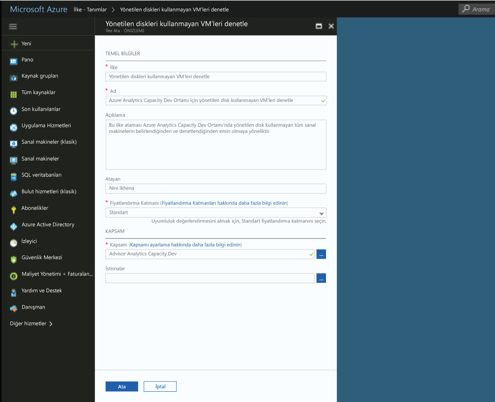

# Azure ortamınızda uyumlu olmayan kaynakları tanımlamak için bir ilke atamasını oluşturma
Azure'da anlama uyumluluk ilk adımı, kendi geçerli kaynaklarla göze burada bilmektir. Bu hızlı başlangıç yönetilen diskleri kullanmıyorsanız sanal makineleri tanımak amacıyla bir ilke atamasını oluşturma sürecinde adımları.

Bu işlemin sonunda, başarılı bir şekilde yönetilen diskleri kullanmıyorsanız ve bu nedenle sanal makineleri tanımladınız *uyumlu olmayan*.

Azure aboneliğiniz yoksa başlamadan önce [ücretsiz bir hesap](https://azure.microsoft.com/free/?WT.mc_id=A261C142F) oluşturun.

## Azure ilke kabul

Azure ilke genel Önizleme'de kullanıma sunulmuştur ve erişim isteyen kaydetmeniz gerekir.

1. Git Azure ilke https://aka.ms/getpolicy ve select **kaydolun** sol bölmede.

   

2. Katılımı Azure aboneliklerini seçerek İlkesi **abonelik** çalışmak istediğiniz listesi. Ardından **kaydetmek**.

   

   İsteğiniz Önizleme için otomatik olarak onaylanır. Lütfen sisteme kaydınızı işlemek 30 dakika bekleyin.

## Bir ilke atamasını oluşturma

Bu hızlı başlangıç biz bir ilke ataması oluşturmak ve atamak *yönetilen diski olmayan sanal makineler denetim* ilke tanımı.

1. Seçin **atamaları** Azure İlkesi sayfasının sol bölmede.
2. Seçin **atama İlkesi** üstünden **atamaları** bölmesi.

   

3. Üzerinde **atama İlkesi** sayfasında,  yanına **İlkesi** alan kullanılabilir tanımları listesini açın.

   

   Azure ilke ile birlikte gelen zaten yerleşik ilke tanımlarında kullanabilirsiniz. Yerleşik ilke tanımları gibi bakın:

   - Etiket ve değerini zorla
   - Etiket ve değerini Uygula
   - SQL Server sürümü 12.0 gerektirir

4. Arama bulmak için İlke tanımları aracılığıyla *yönetilen diskleri kullanmayın denetim VM'ler* tanımı. Bu ilkenin üzerine tıklayın ve tıklayın **atamak**.

   

5. Bir görüntü sağlamak **adı** ilke ataması için. Bu durumda, kullanalım *yönetilen diskleri kullanmayın denetim VM'ler*. Ayrıca, isteğe bağlı bir ekleyebilirsiniz **açıklama**. Açıklama, bu ilke ataması tüm bu ortamda oluşturulan sanal yönetilen diskleri kullanmayan makineleri nasıl tanımlayan hakkında ayrıntılı bilgi sağlar.
6. Fiyatlandırma katmanını değiştirmek **standart** ilkesi var olan kaynaklara uygulanma emin olmak için.

   Azure ilke içinde– iki fiyatlandırma katmanı vardır *serbest* ve *standart*. Ücretsiz katmanı ile ilkeleri yalnızca uygulayabilirsiniz gelecekteki kaynaklardaki standart sırada, ayrıca bunları uyumluluk durumu daha iyi anlamak için var olan kaynakların zorunlu kılabilir. Biz sınırlı önizlemede olduğundan seçmek için bir fatura almaz için henüz bir fiyatlandırma modelini yayımlandı değil *standart*. Daha fazla bilgi için fiyatlandırma hakkında bakın: [fiyatlandırma Azure İlkesi](https://azure.microsoft.com/pricing/details/azure-policy/).

7. Seçin **kapsam** uygulanacak ilke istiyorsunuz.  Kaynakları gruplandırma ilke ataması üzerinde zorlanan ya da hangi kaynakların bir kapsamı belirler. Bir abonelik için kaynak gruplarını aralığında.
8. Abonelik (veya kaynak grubu) seçin, daha önce Azure ilkesine tercih ettiğinizde kayıtlı. Bu örnekte, bu abonelik - kullanıyoruz **Azure Analytics kapasite geliştirme**, ancak seçeneklerinizi farklılık gösterir.

   

9. Seçin **atamak**.

Artık ortamınız uyumluluk durumunu anlamak için uyumlu olmayan kaynakları tanımlamak hazırsınız.

## Uyumlu olmayan kaynakları belirleyin

Seçin **Uyumluluk** sol bölmesinde ve oluşturduğunuz ilke ataması arayın.

Bu yeni atama ile uyumlu olmayan tüm mevcut kaynaklar varsa, bunlar altında görünür **uyumsuz kaynakları** sekmesi.

Bir koşul mevcut kaynaklarınız arasında değerlendirilir ve bunların bazıları için true gelir, bu kaynakları ilkesiyle uyumlu olmayan olarak işaretlenir. Bir tablonun bugün kullanılabilen sahibiz farklı eylemler koşul değerlendirme sonucu ve kaynaklarınızın uyumluluk durumunu ile nasıl çalışacağını aşağıda verilmiştir.

|Kaynak  |İlkedeki koşul değerlendirilirse  |Eylem İlkesi   |Uyumluluk durumu  |
|-----------|---------|---------|---------|
|Var     |True     |Reddet     |Uyumlu |
|Var     |False    |Reddet     |Uyumlu     |
|Var     |True     |Ekle   |Uyumlu |
|Var     |False    |Ekle   |Uyumlu     |
|Var     |True     |Denetim    |Uyumlu |
|Var     |False    |Denetim    |Uyumlu |

## Kaynakları temizleme

Bu koleksiyondaki diğer kılavuzlarını Bu hızlı başlangıç oluşturun. Sonraki öğreticilerde ile çalışmaya devam etmeyi planlıyorsanız, temiz bu quickstart oluşturulan kaynakları yukarı değil. Devam etmeyi planlamıyorsanız Azure portalında bu hızlı başlangıç ile oluşturulan tüm kaynakları silmek için aşağıdaki adımları kullanın.
1. Seçin **atamaları** sol bölmede.
2. Yeni oluşturduğunuz atama arayın.

   

3.  Seçin **silmek atama**.

## Sonraki adımlar

Bu hızlı başlangıç kapsam, uyumlu tüm kaynakları emin olmak için ve hangilerinin kullanılmadığını belirlemek için bir kapsam için bir ilke tanımı atanır.

Emin olmak için ilke atama hakkında daha fazla bilgi edinmek için **gelecekteki** oluşturulmasına kaynakları uyumlu, Öğretici için devam edin:

> [!div class="nextstepaction"]
> [Oluşturma ve ilkelerini yönetme](./create-manage-policy.md)
