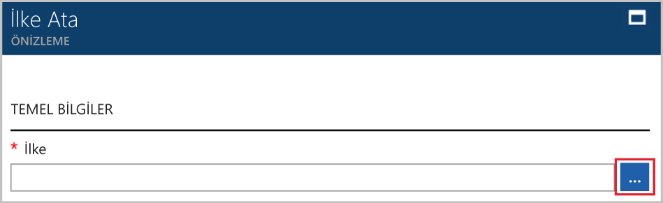

# <a name="create-and-manage-policies-to-enforce-compliance"></a>Uyumluluğu zorlamak üzere ilkeleri oluşturun ve yönetin

Azure'da ilkeleri oluşturun ve yönetin nasıl giderildiğini anlamak, Kurumsal standartları ve hizmet düzeyi sözleşmeleri ile uyumlu sağlama için önemlidir. Bu öğreticide, bazı oluşturma, atama ve ilkelerini yönetme, kuruluşunuz genelindeki gibi ilgili daha yaygın görevleri yapmak için Azure ilke kullanmayı öğreneceksiniz:

> [!div class="checklist"]
> * Gelecekte oluşturacağınız kaynakları için bir koşul uygulamak için bir ilke atama
> * Oluşturma ve birden çok kaynak için uyumluluğu izlemek amacıyla bir girişimi tanımı atama
> * Uyumlu olmayan veya reddedilen kaynak çözümleyin
> * Bir kuruluş genelinde yeni bir ilke uygulama

Azure aboneliğiniz yoksa başlamadan önce [ücretsiz bir hesap](https://azure.microsoft.com/free/?WT.mc_id=A261C142F) oluşturun.

## <a name="opt-in-to-azure-policy"></a>Azure ilke kabul

Erişim isteğinde bulunmak için kaydetmeniz gerekir böylece azure ilke sınırlı Önizleme'de kullanıma sunulmuştur.

1. Git Azure ilke https://aka.ms/getpolicy ve select **kaydolun** sol bölmede.

   

2. Katılımı Azure aboneliklerini seçerek İlkesi **abonelik** çalışmak istediğiniz listesi. Ardından **kaydetmek**.

   Abonelik listeniz tüm Azure abonelikleri içerir.

   

   İsteğe bağlı olarak, birkaç gün için bize kayıt İsteğiniz kabul etmek için kadar sürebilir. İsteğiniz kabul sonra size e-posta aracılığıyla hizmet kullanmaya başlayabilirsiniz bildirilecek.

## <a name="assign-a-policy"></a>Bir ilke atama

Azure ilkesiyle zorlamayı ilk adımı, bir ilke tanımı atamaktır. Bir ilke tanımı hangi koşul bir ilke uygulanır ve hangi eylemin yapılacağını altında tanımlar. Bu örnekte, biz adlı yerleşik ilke tanımı atamak *gerektiren SQL Server sürümü 12.0*, tüm SQL Server veritabanlarını uyumlu olmasını v12.0 olmalıdır koşul zorlamak için.

1. Arama ve seçerek Azure portalında Azure İlkesi Hizmeti başlatma **İlkesi** sol bölmede.

   

2. Seçin **atamaları** Azure İlkesi sayfasının sol bölmede. Atama, belirli bir kapsamda gerçekleşmesi için atanan bir ilkedir.
3. Seçin **atama İlkesi** üstünden **atamaları** bölmesi.

   

4. Üzerinde **atama İlkesi** sayfasında,  yanına **İlkesi** alan kullanılabilir tanımları listesini açın.

   

5. Seçin **SQL Server sürümü 12.0 gerektiren**.

   

6. Bir görüntü sağlamak **adı** ilke ataması için. Bu durumda, kullanalım *gerektiren SQL Server sürümü 12.0*. Ayrıca, isteğe bağlı bir ekleyebilirsiniz **açıklama**. Bu ilke ataması bu ortamda oluşturulan tüm SQL sunucuları nasıl sağlar hakkında ayrıntılar sürüm 12.0 olan açıklama sağlar.
7. Fiyatlandırma katmanını değiştirmek **standart** ilkesi var olan kaynaklara uygulanma emin olmak için.

   Azure ilke içinde– iki fiyatlandırma katmanı vardır *serbest* ve *standart*. Ücretsiz katmanı ile ilkeleri yalnızca uygulayabilirsiniz gelecekteki kaynaklardaki standart sırada, ayrıca bunları uyumluluk durumu daha iyi anlamak için var olan kaynakların zorunlu kılabilir. Biz sınırlı önizlemede olduğundan seçmek için bir fatura almaz için henüz bir fiyatlandırma modelini yayımlandı değil *standart*. Daha fazla bilgi için fiyatlandırma hakkında bakın: [fiyatlandırma Azure İlkesi](https://acom-milestone-ignite.azurewebsites.net/pricing/details/azure-policy/).

8. Seçin **kapsam** -Azure ilkesine tercih ettiğinizde abonelik (veya kaynak grubu), önceden kayıtlı. Kaynakları gruplandırma ilke ataması üzerinde zorlanan ya da hangi kaynakların bir kapsamı belirler. Bir abonelik için kaynak gruplarını aralığında.

   Bu abonelik - kullanarak Biz bu örneğin **Azure Analytics kapasite geliştirme**. Aboneliğinizi farklılık gösterir.

10. Seçin **atamak**.

## <a name="implement-a-new-custom-policy"></a>Yeni bir özel ilke uygulama

Biz ilke tanımı atadığınız, ortamınızda çoğaltmanın oluşturulan VM'ler G serisinde olamaz sağlayarak maliyetleri kaydetmek için yeni bir ilke oluşturmak için yapacağız. Kurumsal bir kullanıcı VM G serisinde oluşturmayı dener her zaman bu şekilde isteğini reddetti.

1. Seçin **tanımı** altında **yazma** sol bölmede.

   

2. Seçin **+ ilke tanımı**.
3. Aşağıdakileri girin:

   - İlke tanımı - adını *VM SKU G serisi küçük gerektirir*
   - İlke tanımı yapmak için – yöneliktir açıklaması Bu ilke tanımı bu kapsamda oluşturulan tüm sanal makineleri SKU'ları maliyetini azaltmak G serisi daha küçük olmasını zorlar.
   - İlke tanımı Canlı – bu durumda, bizim ilke tanımı Live'da abonelik **Danışmanı Analytics kapasite geliştirme**. Abonelik listeniz farklılık gösterir.
   - Json koduyla yazma:
      - İlke parametreleri.
      - İlke kuralları /, bu durumda – VM SKU boyutunu G seriye eşit koşulları
      - Bu durumda – ilke etkili **reddetme**.

   İşte json aşağıdaki gibi görünmelidir

```json
{
    "policyRule": {
      "if": {
        "allOf": [
          {
            "field": "type",
            "equals": "Microsoft.Compute/virtualMachines"
          },
          {
            "field": "Microsoft.Compute/virtualMachines/sku.name",
            "like": "Standard_G*"
          }
        ]
      },
      "then": {
        "effect": "deny"
      }
    }
}
```

<!-- Update the following link to the top level samples page
-->
   Json kodunu örneklerini görüntülemek için bu makalenin - Ara [kaynak ilkesine genel bakış](../azure-resource-manager/resource-manager-policy.md)

4. **Kaydet**’i seçin.

## <a name="create-a-policy-definition-with-rest-api"></a>REST API'si ile bir ilke tanımı oluşturun

İlke tanımları için REST API ile bir ilke oluşturabilirsiniz. REST API oluşturmak ve ilke tanımları silmek ve varolan tanımları hakkında bilgi almak etkinleştirir.
Bir ilke tanımı oluşturmak için aşağıdaki örneği kullanın:

```
PUT https://management.azure.com/subscriptions/{subscription-id}/providers/Microsoft.authorization/policydefinitions/{policyDefinitionName}?api-version={api-version}

```
Aşağıdaki örneğe benzer bir istek gövdesi şunları içerir:

```
{
  "properties": {
    "parameters": {
      "allowedLocations": {
        "type": "array",
        "metadata": {
          "description": "The list of locations that can be specified when deploying resources",
          "strongType": "location",
          "displayName": "Allowed locations"
        }
      }
    },
    "displayName": "Allowed locations",
    "description": "This policy enables you to restrict the locations your organization can specify when deploying resources.",
    "policyRule": {
      "if": {
        "not": {
          "field": "location",
          "in": "[parameters('allowedLocations')]"
        }
      },
      "then": {
        "effect": "deny"
      }
    }
  }
}
```

## <a name="create-a-policy-definition-with-powershell"></a>PowerShell ile bir ilke tanımı oluşturma

PowerShell örnek işlemine devam etmeden önce Azure PowerShell'in en son sürümünü yüklediğinizden emin olun. İlke parametreleri sürüm 3.6.0 eklendi. Önceki bir sürümü varsa, örnekleri parametresi bulunamıyor belirten bir hata döndürür.

Kullanarak bir ilke tanımı oluşturabilirsiniz `New-AzureRmPolicyDefinition` cmdlet'i.

Bir dosyadan bir ilke tanımı oluşturmak için dosya yolu geçirin. Dış bir dosya için aşağıdaki örneği kullanın:

```
$definition = New-AzureRmPolicyDefinition `
    -Name denyCoolTiering `
    -DisplayName "Deny cool access tiering for storage" `
    -Policy 'https://raw.githubusercontent.com/Azure/azure-policy-samples/master/samples/Storage/storage-account-access-tier/azurepolicy.rules.json'
```

Bir yerel dosya, aşağıdaki örneği kullanın:

```
$definition = New-AzureRmPolicyDefinition `
    -Name denyCoolTiering `
    -Description "Deny cool access tiering for storage" `
    -Policy "c:\policies\coolAccessTier.json"
```

Bir ilke tanımı sahip bir satır içi kuralı oluşturmak için aşağıdaki örneği kullanın:

```
$definition = New-AzureRmPolicyDefinition -Name denyCoolTiering -Description "Deny cool access tiering for storage" -Policy '{
  "if": {
    "allOf": [
      {
        "field": "type",
        "equals": "Microsoft.Storage/storageAccounts"
      },
      {
        "field": "kind",
        "equals": "BlobStorage"
      },
      {
        "not": {
          "field": "Microsoft.Storage/storageAccounts/accessTier",
          "equals": "cool"
        }
      }
    ]
  },
  "then": {
    "effect": "deny"
  }
}'
```

Çıktı depolanan bir `$definition` ilke ataması sırasında kullanılan nesne.
Aşağıdaki örnek, parametreleri içeren bir ilke tanımı oluşturur:

```
$policy = '{
    "if": {
        "allOf": [
            {
                "field": "type",
                "equals": "Microsoft.Storage/storageAccounts"
            },
            {
                "not": {
                    "field": "location",
                    "in": "[parameters(''allowedLocations'')]"
                }
            }
        ]
    },
    "then": {
        "effect": "Deny"
    }
}'

$parameters = '{
    "allowedLocations": {
        "type": "array",
        "metadata": {
          "description": "The list of locations that can be specified when deploying storage accounts.",
          "strongType": "location",
          "displayName": "Allowed locations"
        }
    }
}'

$definition = New-AzureRmPolicyDefinition -Name storageLocations -Description "Policy to specify locations for storage accounts." -Policy $policy -Parameter $parameters
```

## <a name="view-policy-definitions"></a>Görünüm ilke tanımları

Aboneliğinizdeki tüm ilke tanımları görmek için aşağıdaki komutu kullanın:

```
Get-AzureRmPolicyDefinition
```

Yerleşik ilkeleri de dahil olmak üzere tüm kullanılabilir ilke tanımları döndürür. Her ilke şu biçimde verilir:

```
Name               : e56962a6-4747-49cd-b67b-bf8b01975c4c
ResourceId         : /providers/Microsoft.Authorization/policyDefinitions/e56962a6-4747-49cd-b67b-bf8b01975c4c
ResourceName       : e56962a6-4747-49cd-b67b-bf8b01975c4c
ResourceType       : Microsoft.Authorization/policyDefinitions
Properties         : @{displayName=Allowed locations; policyType=BuiltIn; description=This policy enables you to
                     restrict the locations your organization can specify when deploying resources. Use to enforce
                     your geo-compliance requirements.; parameters=; policyRule=}
PolicyDefinitionId : /providers/Microsoft.Authorization/policyDefinitions/e56962a6-4747-49cd-b67b-bf8b01975c4c
```

## <a name="create-a-policy-definition-with-azure-cli"></a>Azure CLI ile bir ilke tanımı oluşturun

İlke tanımı komutu ile Azure CLI kullanarak bir ilke tanımı oluşturabilirsiniz.
Bir ilke tanımı sahip bir satır içi kuralı oluşturmak için aşağıdaki örneği kullanın:

```
az policy definition create --name denyCoolTiering --description "Deny cool access tiering for storage" --rules '{
  "if": {
    "allOf": [
      {
        "field": "type",
        "equals": "Microsoft.Storage/storageAccounts"
      },
      {
        "field": "kind",
        "equals": "BlobStorage"
      },
      {
        "not": {
          "field": "Microsoft.Storage/storageAccounts/accessTier",
          "equals": "cool"
        }
      }
    ]
  },
  "then": {
    "effect": "deny"
  }
}'
```

## <a name="view-policy-definitions"></a>Görünüm ilke tanımları

Aboneliğinizdeki tüm ilke tanımları görmek için aşağıdaki komutu kullanın:

```
az policy definition list
```

Yerleşik ilkeleri de dahil olmak üzere tüm kullanılabilir ilke tanımları döndürür. Her ilke şu biçimde verilir:

```
{                                                            
  "description": "This policy enables you to restrict the locations your organization can specify when deploying resources. Use to enforce your geo-compliance requirements.",                      
  "displayName": "Allowed locations",
  "id": "/providers/Microsoft.Authorization/policyDefinitions/e56962a6-4747-49cd-b67b-bf8b01975c4c",
  "name": "e56962a6-4747-49cd-b67b-bf8b01975c4c",
  "policyRule": {
    "if": {
      "not": {
        "field": "location",
        "in": "[parameters('listOfAllowedLocations')]"
      }
    },
    "then": {
      "effect": "Deny"
    }
  },
  "policyType": "BuiltIn"
}
```

## <a name="create-and-assign-an-initiative-definition"></a>Oluşturun ve girişimi tanımı atayın

Bir girişimi tanımıyla bir değerlendiriyoruz elde etmek için birkaç ilke tanımları gruplandırabilirsiniz. Kaynakları tanımı kapsamında girişimi tanımını oluşturan ilke tanımları uyumlu kalmasını sağlamak için bir girişimi tanımı oluşturun.  Bkz: [Azure ilkesine genel bakış](./azure-policy-introduction.md) girişimi tanımları hakkında daha fazla bilgi için.

### <a name="create-an-initiative-definition"></a>Girişimi tanımı oluşturun

1. Seçin **tanımları** altında **yazma** sol bölmede.

   

2. Seçin **Initiative tanımı** bu seçim, sayfanın en üstünde alır **Initiative tanımı** formu.
3. Ad ve açıklama girişiminin girin.

   Kaynaklardır güvenli alma hakkında ilke tanımları uyumlu, Initiative adı olacaktır olmak istiyoruz Bu örnekte, **alma güvenli**, açıklama olacaktır: **Bu girişim yapıldı kaynakların güvenliğini sağlama ile ilişkili tüm ilke tanımları işlemek için oluşturulan**.

   

4. Listesine göz **kullanılabilir tanımları** ve o Initiative eklemek istediğiniz ilke tanımlarını seçin. İçin bizim **güvenli alma** girişimi, ilke tanımları yerleşik aşağıdakileri ekleyin:
   - SQL Server sürüm 12.0 gerektirir
   - Güvenlik Merkezi'nde korumasız web uygulamalarını izleyin.
   - Güvenlik Merkezi'nde izin veren ağ üzerinden izleyin.
   - Olası uygulama uygulamaları güvenilir listeye almayı Güvenlik Merkezi'nde izleyin.
   - Güvenlik Merkezi'nde şifrelenmemiş VM diskleri izleyin.

   

   İlke tanımları listeden seçtikten sonra altında görürsünüz **ilkeleri ve parametreleri**, yukarıda gösterildiği gibi.

5. **Oluştur**’u seçin.

### <a name="assign-an-initiative-definition"></a>Bir girişimi tanımı atayın

1. Git **tanımları** altında sekmesinde **yazma**.
2. Arama **güvenli alma** oluşturduğunuz girişimi tanımı.
3. Girişimi tanımı'nı seçin ve ardından **atamak**.

   

4. Doldurmak **atama** girerek form:
   - Ad: Get güvenli atama
   - Açıklama: Bu Grup İlkesi tanımlarında zorlamayı doğrultusunda bu girişimi atama uyarlanmış **Azure Danışmanı kapasite geliştirme** abonelik
   - Fiyatlandırma katmanı: standart
   - uygulanan bu atama gibi kapsamı: **Azure Danışmanı kapasite geliştirme**

5. Seçin **atamak**.

## <a name="resolve-a-non-compliant-or-denied-resource"></a>Uyumlu olmayan veya reddedilen kaynak çözümleyin

SQL server sürümü 12.0 gerektirecek şekilde ilke tanımı atama sonra yukarıdaki örnekte,, farklı bir sürümü ile oluşturulmuş bir SQL server reddedildi. Bu bölümde, biz oluşturulan bir SQL server farklı sürümün bulunduğu bir reddedilen girişimi çözümünde size taramasını.

1. Seçin **atamaları** sol bölmede.
2. Tüm ilke atamalarını göz atın ve başlatma *gerektiren SQL Server sürümü 12.0* atama.
3. SQL server oluşturmaya çalıştığınız kaynak grupları için bir dışlama isteyin. Bu durumda, biz Microsoft.Sql/servers/databases hariç: *baconandbeer/Cheetos* ve *baconandbeer/Chorizo*.

   

   Reddedilen bir kaynak çözmek diğer yolları içerir: SQL server tarafından oluşturulan gerek ve erişimi varsa ilkeyi doğrudan düzenlemek için güçlü bir gerekçe varsa, ilkeyle ilişkili kişiye ulaşmasını.

4. **Kaydet**’i seçin.

Bu bölümde, bir SQL server sürümüyle 12.0, dışlama kaynaklara isteyerek oluşturma girişimi, reddi çözümlendi.

## <a name="clean-up-resources"></a>Kaynakları temizleme

Sonraki öğreticilerde ile çalışmaya devam etmeyi planlıyorsanız, temiz bu Kılavuzu'nda oluşturulan kaynakları yukarı değil. Devam etmek düşünmüyorsanız atamaları ya da yukarıda oluşturduğunuz tanımları silmek için aşağıdaki adımları kullanın:

1. Seçin **tanımları** (veya **atamaları** atama silmeyi denediğiniz varsa) sol bölmedeki.
2. Yeni Initiative veya ilke tanımı (veya atama) yeni oluşturulan arayın.
3. Üç nokta tanımı veya atama ucundaki ve seçin **silmek tanımı** (veya **silmek atama**).

## <a name="next-steps"></a>Sonraki adımlar

Bu öğreticide, başarılı bir şekilde aşağıdaki gerçekleştirdiniz:

> [!div class="checklist"]
> * Gelecekte oluşturacağınız kaynakları için bir koşul uygulamak için bir ilke atanan
> * Oluşturulan ve birden çok kaynak için uyumluluğu izlemek amacıyla bir girişimi tanımı atayın
> * Uyumlu olmayan veya reddedilen kaynak çözümlendi
> * Yeni bir ilke bir kuruluş genelinde uygulanmadı

İlke tanımları yapılar hakkında daha fazla bilgi için bu makalenin bakın:

> [!div class="nextstepaction"]
> [Azure ilke tanımı yapısı](policy-definition.md)
