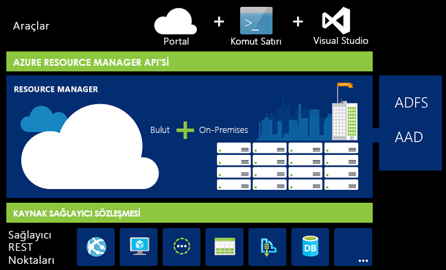
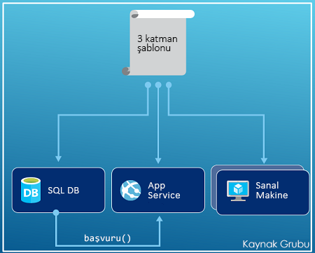
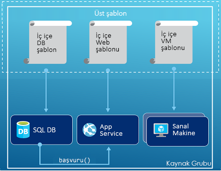
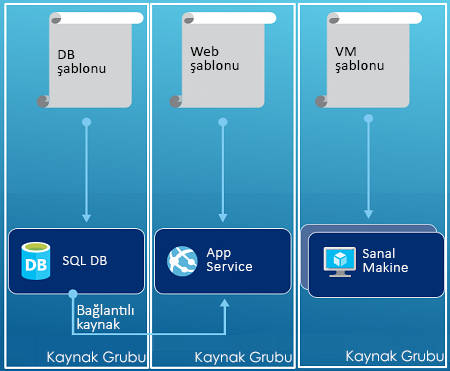

# <a name="azure-resource-manager-overview"></a>Azure Resource Manager genel bakış

Azure Resource Manager Azure için dağıtım ve yönetim hizmetidir. Bu, oluşturmak, güncelleştirmek ve Azure aboneliğinizdeki kaynakları silmek sağlayan bir tutarlı yönetim katmanı sağlar. Güvenli ve dağıtımdan sonra kaynaklarınızı düzenlemek için denetleme ve etiketleme özellikleri kendi erişim denetimini kullanabilirsiniz.

Portal, PowerShell, Azure CLI, REST API veya istemci SDK'ları aracılığıyla eylemleri, Azure Resource Manager API'si isteği işler. Aynı API aracılığıyla işlenen tüm istekleri dolayı tutarlı sonuçlar ve farklı araçlar özelliklerini görebilirsiniz. Portalda mevcut olan tüm özellikleri, ayrıca PowerShell, Azure CLI, REST API'leri ve istemci SDK'ları kullanılabilir. İlk olarak API'lerle başlatılan işlevler 180 gün içinde portalda kullanıma sunulacaktır.

Aşağıdaki görüntüde nasıl tüm araçları, Azure Resource Manager API ile etkileşim kurar. API, istekleri kimlik doğrulamasından geçiren ve yetkilendiren Resource Manager hizmetine iletir. Kaynak Yöneticisi'ni, sonra istekleri uygun hizmete yönlendirir.



## <a name="terminology"></a>Terminoloji

Azure Resource Manager’ı kullanmaya yeni başladıysanız bilmiyor olabileceğiniz bazı terimler vardır.

* **kaynak** - Azure ile kullanılabilen yönetilebilir bir öğe. Sanal makineler, depolama hesapları, web uygulamaları, veritabanları ve sanal ağlar kaynakları örnekleridir.
* **kaynak grubu** - Bir Azure çözümü için ilgili kaynakları bir arada tutan bir kapsayıcıdır. Kaynak grubu yalnızca bir grup olarak yönetmek istediğiniz kaynakları içerir. Kaynak grupları kuruluşunuz için en uygun kılan bağlı kaynakları ayırmak nasıl karar sizin. Bkz. [Kaynak grupları](#resource-groups).
* **Kaynak sağlayıcısı** -Azure kaynakları sağlayan bir hizmettir. Örneğin, ortak bir kaynak sağlayıcısı olan **Microsoft.Compute**, sanal makine kaynağı sağlar. **Microsoft.Storage** başka bir ortak kaynak sağlayıcısıdır. Bkz. [Kaynak sağlayıcıları](#resource-providers).
* **Resource Manager şablonu** -bir kaynak grubuna veya aboneliğe dağıtmak için bir veya daha fazla kaynağı tanımlayan bir JavaScript nesne gösterimi (JSON) dosyası. Şablon, kaynakları tutarlı ve sürekli olarak dağıtmak için kullanılabilir. Bkz. [Şablon dağıtımı](#template-deployment).
* **bildirim temelli söz dizimi** - Oluşturmaya yönelik programlama komutları dizisini yazmak zorunda kalmadan "Oluşturmak istediğiniz şeyi" belirtmenize imkan tanıyan söz dizimi. Resource Manager şablonu, bildirim temelli söz diziminin bir örneğidir. Dosya içinde Azure’a dağıtılacak altyapının özelliklerini tanımlarsınız.

## <a name="the-benefits-of-using-resource-manager"></a>Resource Manager’ı kullanmanın avantajları

Resource Manager çeşitli avantajlar sunar:

* Çözümünüzdeki tüm kaynakları ayrı ayrı ele almak yerine bunları grup halinde dağıtabilir, yönetebilir ve izleyebilirsiniz.
* Çözümünüzü geliştirme yaşam döngüsü boyunca defalarca dağıtabilirsiniz. Kaynaklarınızın tutarlı bir durumda dağıtılması da size güven verir.
* Altyapınızı betikler yerine bildirim temelli şablonları kullanarak yönetebilirsiniz.
* Doğru sırayla dağıtılmalarını sağlamak için kaynaklarınız arasındaki bağımlılıkları tanımlayabilirsiniz.
* Rol Tabanlı Erişim Denetimi (RBAC) yönetim platformuyla doğrudan tümleşik olduğu için kaynak grubunuzdaki tüm hizmetlere erişim denetimi uygulayabilirsiniz.
* Aboneliğinizdeki tüm kaynakları mantıksal olarak düzenlemek için kaynaklarınıza etiketler ekleyebilirsiniz.
* Aynı etiketi paylaşan bir kaynak grubunun maliyetlerini görüntüleyerek kuruluşunuzun faturalarına açıklık getirebilirsiniz.

## <a name="understand-management-scope"></a>Yönetim kapsamı anlama

Azure, dört yönetim kapsam düzeyleri sağlar: [Yönetim grupları](../governance/management-groups/index.md), abonelikler, [kaynak grupları](#resource-groups)ve kaynaklar. Aşağıdaki resimde bu katmanlara ait bir örnek gösterilir.


Yönetim ayarlarını bu kapsam düzeylerinden birinde uygularsınız. Seçtiğiniz düzey, ayarın ne kadar yaygın olarak uygulanacağını belirler. Düşük düzeyler, yüksek düzeylerdeki ayarları devralır. Uyguladığınızda Örneğin, bir [ilke](../governance/policy/overview.md) aboneliğe tüm kaynak grupları ve aboneliğinizdeki kaynaklara ilke uygulanır. Bir ilke uygulandığında ilke kaynak grubunu, kaynak grubunu ve tüm kaynaklarını uygulanır. Ancak, başka bir kaynak grubu, ilke ataması yok.

## <a name="guidance"></a>Rehber

Çözümleriniz üzerinde çalışırken aşağıdaki önerilerden yararlanarak Resource Manager’dan tam anlamıyla yararlanabilirsiniz.

* Altyapınızı kesinlik temelli komutlar yerine Resource Manager şablonlarındaki bildirim temelli söz dizimini kullanarak tanımlayabilir ve dağıtabilirsiniz.
* Şablondaki tüm dağıtım ve yapılandırma adımlarını tanımlayın. Çözümünüzü ayarlarken el ile yapılan hiçbir adım olmaması gerekir.
* Kaynaklarınızı yönetirken, örneğin bir uygulamayı veya makineyi başlatırken ya da durdururken, kesinlik temelli komutlar çalıştırın.
* Kaynak grubundaki aynı yaşam döngüsüne sahip kaynakları düzenleyin. Diğer tüm düzenleyici kaynaklar için etiketler kullanın.

Kuruluşların abonelikleri etkili bir şekilde yönetmek için Resource Manager'ı nasıl kullanabileceği hakkında yönergeler için bkz. [Azure kurumsal iskelesi: öngörücü abonelik idaresi](/azure/architecture/cloud-adoption-guide/subscription-governance?toc=%2fazure%2fazure-resource-manager%2ftoc.json).

Resource Manager şablonları oluşturmaya ilişkin öneriler için bkz. [Azure Resource Manager şablonu iyi](template-best-practices.md).

## <a name="resource-groups"></a>Kaynak grupları
Kaynak gruplarınızı tanımlarken göz önüne almanız gereken bazı önemli faktörler bulunur:

* Grubunuzdaki tüm kaynaklar aynı yaşam döngüsünü paylaşmalıdır. Bunları birlikte dağıtır, güncelleştirir ve silersiniz. Veritabanı sunucusu gibi bir kaynağın farklı bir dağıtım döngüsünde bulunması gerekiyorsa, bu kaynak farklı bir kaynak grubuna konulmalıdır.
* Her kaynak yalnızca bir kaynak grubunda yer alabilir.
* Bir kaynak grubuna dilediğiniz zaman kaynak ekleyebilir veya kaldırabilirsiniz.
* Bir kaynağı, bir kaynak grubundan bir diğerine taşıyabilirsiniz. Daha fazla bilgi için bkz. [Kaynakları yeni kaynak grubuna veya aboneliğe taşıma](resource-group-move-resources.md).
* Bir kaynak grubu farklı bölgelerde bulunan kaynakları içerebilir.
* Bir kaynak grubu, yönetim eylemleri için erişim denetimini incelemek üzere kullanılabilir.
* Bir kaynak diğer kaynak gruplarındaki kaynaklarla etkileşim kurabilir. İki kaynak ilişkili olmasına karşın aynı yaşam döngüsünü paylaşmadığında (örneğin, bir veritabanına bağlanan web uygulamaları) bu etkileşim yaygın olarak görülür.

Bir kaynak grubu oluştururken bu kaynak grubu için bir konum belirtmeniz gerekir. "Bir kaynak grubu için neden konum gerekli olsun? Ayrıca kaynaklar kaynak grubundan farklı konumlarda olabiliyorsa kaynak grubu konumu neden önemli olsun?" diye soruyor olabilirsiniz Kaynak grubu, kaynaklarla ilgili meta verileri depolar. Bu nedenle, kaynak grubu için bir konum belirttiğinizde meta verilerin nereye depolanacağını belirtirsiniz. Uyumluluk nedeniyle verilerinizin belirli bir bölgeye depolandığından emin olmanız gerekebilir.

Kaynak grubunun bölge geçici olarak kullanılamıyorsa, kaynak grubundaki kaynaklar meta veriler kullanılamaz durumda olduğundan güncelleştirilemiyor. Diğer bölgelerdeki kaynaklara beklendiği gibi çalışmaya devam eder ancak bunları güncelleştirilemiyor. Riski en aza indirmek için aynı bölgede kaynak grubu ve kaynakları bulun.

## <a name="resource-providers"></a>Kaynak sağlayıcıları

Her kaynak sağlayıcısı, bir dizi kaynak ve bu kaynaklarla çalışmak için işlem sunar. Örneğin, anahtarları ve parolaları saklamak isterseniz **Microsoft.KeyVault** kaynak sağlayıcısı ile çalışırsınız. Bu kaynak sağlayıcısı, anahtar kasasını oluşturmak için **vaults** adlı bir kaynak türü sağlar.

Kaynak türü adı şu biçimdedir: **{kaynak-sağlayıcısı}/{kaynak-türü}**. Kaynak türü için bir anahtar kasası **Microsoft.KeyVault/vaults**.

Kaynaklarınızı dağıtmaya başlamadan önce kullanılabilir kaynak sağlayıcılarını anlamanız gerekir. Kaynak sağlayıcılarının ve kaynakların adlarını bilmeniz, Azure’a dağıtmak istediğiniz kaynakları tanımlamanıza yardımcı olur. Ayrıca her bir kaynak türü için geçerli konumları ve API sürümlerini bilmeniz gerekir. Daha fazla bilgi için bkz. [Kaynak sağlayıcıları ve türleri](resource-manager-supported-services.md).

Kaynak sağlayıcıları tarafından sunulan tüm işlemler için bkz: [Azure REST API'leri](/rest/api/azure/).

## <a name="template-deployment"></a>Şablon dağıtımı

Resource Manager’ı kullanarak Azure çözümünüzün altyapısını ve yapılandırmasını tanımlayan bir şablon (JSON biçiminde) oluşturabilirsiniz. Bir şablon kullanarak çözümünü yaşam döngüsü boyunca defalarca dağıtabilir ve kaynaklarınızın tutarlı bir durumda dağıtıldığından emin olabilirsiniz.

Biçimi şablon ve nasıl oluşturulacağı hakkında bilgi edinmek için [yapısını ve Azure Resource Manager şablonları söz dizimini anlamak](resource-group-authoring-templates.md). Kaynak türleri için JSON söz dizimini görüntülemek üzere bkz. [Azure Resource Manager şablonlarında kaynak tanımlama](/azure/templates/).

Resource Manager şablonu diğer istekler gibi işler. Şablonu ayrıştırarak söz dizimini ilgili kaynak sağlayıcıları için REST API işlemlerine dönüştürür. Örneğin, Resource Manager aşağıdaki kaynak tanımına sahip bir şablonu aldığında:

```json
"resources": [
  {
    "apiVersion": "2016-01-01",
    "type": "Microsoft.Storage/storageAccounts",
    "name": "mystorageaccount",
    "location": "westus",
    "sku": {
      "name": "Standard_LRS"
    },
    "kind": "Storage",
    "properties": {
    }
  }
]
```

Tanımı aşağıdaki REST API işlemine dönüştürerek Microsoft.Storage kaynak sağlayıcısına gönderir:

```HTTP
PUT
https://management.azure.com/subscriptions/{subscriptionId}/resourceGroups/{resourceGroupName}/providers/Microsoft.Storage/storageAccounts/mystorageaccount?api-version=2016-01-01
REQUEST BODY
{
  "location": "westus",
  "properties": {
  }
  "sku": {
    "name": "Standard_LRS"
  },
  "kind": "Storage"
}
```

Şablonları ve kaynak gruplarını tanımlama şekli tamamen size ve çözümünüzü yönetme biçiminize bağlıdır. Örneğin, üç katmanlı uygulamanızı tek bir şablondan tek bir kaynak grubuna dağıtabilirsiniz.



Ancak, bütün altyapınızı tek bir şablonda tanımlamak zorunda değilsiniz. Genellikle, en uygun seçenek dağıtım gereksinimlerinizi hedeflenen, amaca yönelik bir dizi şablona bölüştürmektir. Bu şablonları farklı çözümler için kolayca yeniden kullanabilirsiniz. Belirli bir çözümü dağıtmak için gerekli tüm şablonların bağlandığı bir ana şablon oluşturun. Aşağıdaki görüntüde üç katmanlı çözümün iç içe üç şablon içeren ana şablon aracılığıyla nasıl dağıtıldığı gösterilmektedir.



Katmanlarınızın farklı yaşam döngülerine sahip olacağını düşünüyorsanız, üç katmanı farklı kaynak gruplarına dağıtabilirsiniz. Kaynaklar diğer kaynak gruplarındaki kaynaklara bağlanmaya devam edebilir.



İç içe geçmiş şablonlar hakkında daha fazla bilgi için bkz. [Azure Resource Manager ile bağlı şablonları kullanma](resource-group-linked-templates.md).

Azure Resource Manager kaynakların doğru sırada oluşturulmasını sağlamak için bağımlılıkları analiz eder. Bir kaynak başka bir kaynaktaki değere bağımlıysa (diskler için depolama hesabına ihtiyaç duyan bir sanal makine gibi) bir bağımlılık ayarlayın. Daha fazla bilgi için bkz. [Azure Resource Manager’da bağımlılıkları tanımlama](resource-group-define-dependencies.md).

Ayrıca, şablonu altyapıda yapılan güncelleştirmeler için kullanabilirsiniz. Örneğin, çözümünüze bir kaynak ekleyebilir ve zaten dağıtılmış kaynaklar için yapılandırma kuralları ekleyebilirsiniz. Şablon zaten var olan bir kaynak tanımlıyorsa, Resource Manager yeni bir tane oluşturmak yerine var olan kaynak güncelleştirir.

Resource Manager, kurulumun içermediği belirli bir yazılımı yükleme gibi ek işlemlere ihtiyaç duymanız halinde size uzantılar sunar. Zaten DSC, Chef veya Puppet gibi bir yapılandırma yönetim hizmeti kullanıyorsanız, uzantıları kullanarak bu hizmetle çalışmaya devam edebilirsiniz. Sanal makine uzantıları hakkında daha fazla bilgi için bkz. [Sanal makine uzantıları ve özellikleri hakkında](../virtual-machines/windows/extensions-features.md?toc=%2fazure%2fvirtual-machines%2fwindows%2ftoc.json).

Portaldan bir çözüm oluşturduğunuzda çözüm otomatik olarak bir dağıtım şablonu içerir. Bir şablonla başlayacağınız ve bu şablonu size özel ihtiyaçlara göre özelleştirebileceğiniz için yeni bir şablon oluşturmanız gerekmez. Bir örnek için bkz. [hızlı başlangıç: Oluşturma ve Azure portalını kullanarak Azure Resource Manager şablonlarını dağıtma](./resource-manager-quickstart-create-templates-use-the-portal.md). Ayrıca kaynak grubunun mevcut durumunu dışarı aktararak veya belirli bir dağıtım için kullanılan şablonu görüntüleyerek mevcut kaynak grubu için bir şablon elde edebilirsiniz. [Dışarı aktarılan şablonu](./manage-resource-groups-portal.md#export-resource-groups-to-templates) görüntülemek şablon söz dizimi hakkında bilgi edinmek için yararlı bir yoldur.

Son olarak, uygulamanızın kaynak kodunun bir parçası haline gelir. Bunu kaynak kod deponuza dahil edebilir ve uygulamanız geliştikçe buna göre güncelleştirebilirsiniz. Visual Studio üzerinden şablonu düzenleyebilirsiniz.

Şablonunuzu tanımladıktan sonra kaynakları Azure'a dağıtmak için hazır olursunuz. Kaynakları dağıtmak için bkz:

* [Kaynakları Resource Manager şablonları ve Azure PowerShell ile dağıtma](resource-group-template-deploy.md)
* [Kaynakları Resource Manager şablonları ve Azure CLI ile dağıtma](resource-group-template-deploy-cli.md)
* [Kaynakları Resource Manager şablonları ve Azure portalı ile dağıtma](resource-group-template-deploy-portal.md)
* [Kaynakları Resource Manager şablonları ve Resource Manager REST API’si ile dağıtma](resource-group-template-deploy-rest.md)

## <a name="safe-deployment-practices"></a>Güvenli dağıtım uygulamaları

Karmaşık bir hizmeti Azure’a dağıtırken, hizmetinizi birden çok bölgeye dağıtmanız ve bir sonraki adıma geçmeden önce sistem durumunu kontrol etmeniz gerekebilir. Hizmetin aşamalı kullanıma sunulmasını koordine etmek için [Azure Deployment Manager](deployment-manager-overview.md)’ı kullanın. Hizmetinizi aşamalı kullanıma sunarak, tüm bölgelere dağıtılmadan önce olası sorunları bulabilirsiniz. Bu önlemlere ihtiyacınız yoksa, önceki bölümde yer alan dağıtım işlemleri daha iyi seçenektir.

Dağıtım Yöneticisi şu anda özel önizleme aşamasındadır.

[!INCLUDE [arm-tutorials-quickstarts](../../includes/resource-manager-tutorials-quickstarts.md)]

## <a name="next-steps"></a>Sonraki adımlar

Bu makalede, Azure’daki kaynakların dağıtımı, yönetimi ve erişim denetimi için Azure Resource Manager’ın nasıl kullanılacağını öğrendiniz. İlk Azure Resource Manager şablonunuzu nasıl oluşturacağınızı öğrenmek için sonraki makaleye geçin.

> [!div class="nextstepaction"]
> [Hızlı Başlangıç: Oluşturma ve Azure portalını kullanarak Azure Resource Manager şablonlarını dağıtma](./resource-manager-quickstart-create-templates-use-the-portal.md)
