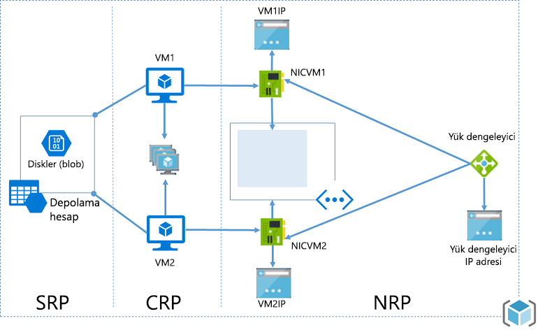

# <a name="azure-resource-manager-vs-classic-deployment-understand-deployment-models-and-the-state-of-your-resources"></a>Azure Resource Manager ve klasik dağıtım: Dağıtım modellerini ve kaynaklarınızın durumunu anlama

> [!NOTE]
> Bu makalede sağlanan bilgiler, yalnızca klasik dağıtımdan Azure Resource Manager dağıtımına geçiş yaptığınızda kullanılır.

Bu makalede Azure Resource Manager ve klasik dağıtım modelleri hakkında bilgi edineceksiniz. Resource Manager ve klasik dağıtım modelleri, Azure çözümlerinizi dağıtmanın ve yönetmenin iki farklı yolunu temsil eder. Bu dağıtım modelleriyle iki farklı API kümesi aracılığıyla çalışırsınız ve dağıtılan kaynaklar önemli farklılıklar içerebilir. İki model birbiriyle uyumlu değildir. Bu makalede söz konusu farklılıklar açıklanmaktadır.

Microsoft, kaynakların dağıtımını ve yönetimini kolaylaştırmak amacıyla tüm yeni kaynaklar için Resource Manager kullanmanızı önerir. Microsoft, mümkünse var olan kaynakları Resource Manager ile yeniden dağıtmanızı önerir.

Resource Manager kullanmaya yeni başladıysanız, öncelikle [Azure Resource Manager'a genel bakış](resource-group-overview.md) bölümünde tanımlanan terimleri gözden geçirmek isteyebilirsiniz.

[!INCLUDE [updated-for-az](../../includes/updated-for-az.md)]

## <a name="history-of-the-deployment-models"></a>Dağıtım modellerinin geçmişi
Azure başlangıçta yalnızca klasik dağıtım modelini sağlamıştır. Bu modelde her kaynak bağımsız bir şekilde mevcuttu ve ilgili kaynakları gruplandırmanın bir yolu yoktu. Bunun yerine, çözümünüzü ya da uygulamanızı oluşturan kaynakları el ile izlemeniz ve eşgüdümlü bir şekilde yönetmeyi unutmamanız gerekiyordu. Bir çözümü dağıtmak için her bir kaynağı portal aracılığıyla tek tek oluşturmanız ya da tüm kaynakları doğru sırayla dağıtan bir betik oluşturmanız zorunluydu. Çözümü silmek için her bir kaynağı ayrı ayrı silmeniz gerekiyordu. İlgili kaynaklar için erişim denetimi ilkelerini kolayca uygulayamaz ve güncelleştiremezdiniz. Son olarak, kaynaklarınızı izlemenize ve faturalandırmayı yönetmenize yardımcı olacak terimlerle kaynaklara etiket uygulayamazdınız.

Azure, kaynak grubu kavramını ortaya çıkaran Resource Manager’ı 2014 yılında kullanıma sundu. Kaynak grubu, ortak bir yaşam döngüsünü paylaşan kaynaklara yönelik bir kapsayıcıdır. Resource Manager dağıtım modeli çeşitli avantajlar sunar:

* Çözümünüze yönelik tüm hizmetleri ayrı ayrı ele almak yerine grup halinde dağıtabilir, yönetebilir ve izleyebilirsiniz.
* Çözümünüzü yaşam döngüsü boyunca defalarca dağıtabilir ve kaynaklarınızın tutarlı bir durumda dağıtıldığından emin olabilirsiniz.
* Kaynak grubunuzdaki tüm kaynaklara erişim denetimi uygulayabilirsiniz. Kaynak grubuna yeni kaynaklar eklendiğinde bu ilkeler otomatik olarak uygulanır.
* Aboneliğinizdeki tüm kaynakları mantıksal olarak düzenlemek için kaynaklarınıza etiketler ekleyebilirsiniz.
* Çözümünüzün altyapısını tanımlamak için JavaScript Nesne Gösterimi (JSON) kullanabilirsiniz. JSON dosyası bir Resource Manager şablonu olarak bilinir.
* Doğru sırayla dağıtılmalarını sağlamak için kaynaklarınız arasındaki bağımlılıkları tanımlayabilirsiniz.

Resource Manager eklendiğinde, tüm kaynaklar geriye dönük olarak varsayılan kaynak gruplarına eklenmiştir. Artık klasik dağıtım modeliyle bir kaynak oluşturursanız, bir kaynak grubunu dağıtımda belirtmemiş olsanız bile, kaynak söz konusu hizmetin varsayılan kaynak grubu içinde otomatik olarak oluşturulur. Ancak, yalnızca bir kaynak grubu içinde var olması kaynağın Resource Manager modeline dönüştürüldüğü anlamına gelmez.

## <a name="understand-support-for-the-models"></a>Modellere yönelik desteği anlama

Dikkat edilmesi gereken üç senaryo vardır:

1. Cloud Services, Resource Manager dağıtım modelini desteklemez.
2. Sanal makineler, depolama hesapları ve sanal ağlar hem Resource Manager hem de klasik dağıtım modellerini destekler.
3. Diğer tüm Azure hizmetleri, Resource Manager’ı destekler.

Sanal makineler, depolama hesapları ve sanal ağlar için kaynak klasik dağıtımla oluşturulmuşsa, kaynağı klasik işlemlerle çalıştırmaya devam etmeniz gerekir. Sanal makine, depolama hesabı ya da sanal ağ Resource Manager dağıtımı ile oluşturulmuşsa, Resource Manager işlemlerini kullanarak devam etmeniz gerekir. Aboneliğinizde Resource Manager ve klasik dağıtım ile oluşturulmuş kaynakların bir karışımı olduğunda bu farklılık kafa karıştırıcı olabilir. Kaynakların bu birleşimi, kaynaklar aynı işlemleri desteklemediği için beklenmeyen sonuçlar oluşturabilir.

Bazı durumlarda, bir Resource Manager komutu klasik dağıtımla oluşturulmuş bir kaynağa ilişkin bilgileri alabilir veya klasik bir kaynağı başka bir kaynak grubuna taşımak gibi bir yönetim görevi gerçekleştirebilir. Ancak, bu örnekler bu türün Resource Manager işlemlerini desteklediği izlenimini vermemelidir. Örneğin, klasik dağıtım ile oluşturulmuş sanal makine içeren bir kaynak grubunuzun olduğunu varsayalım. Aşağıdaki Resource Manager PowerShell komutu çalıştırırsanız:

```powershell
Get-AzResource -ResourceGroupName ExampleGroup -ResourceType Microsoft.ClassicCompute/virtualMachines
```

Şu sanal makineyi döndürür:

```powershell
Name              : ExampleClassicVM
ResourceId        : /subscriptions/{guid}/resourceGroups/ExampleGroup/providers/Microsoft.ClassicCompute/virtualMachines/ExampleClassicVM
ResourceName      : ExampleClassicVM
ResourceType      : Microsoft.ClassicCompute/virtualMachines
ResourceGroupName : ExampleGroup
Location          : westus
SubscriptionId    : {guid}
```

Ancak, Resource Manager cmdlet **Get-AzVM** yalnızca Resource Manager üzerinden dağıtılan sanal makinelerin döndürür. Aşağıdaki komut, klasik dağıtım ile oluşturulmuş sanal makineyi döndürmez.

```powershell
Get-AzVM -ResourceGroupName ExampleGroup
```

Yalnızca Resource Manager ile oluşturulan kaynaklar etiketleri destekler. Klasik kaynaklara etiket uygulayamazsınız.

## <a name="changes-for-compute-network-and-storage"></a>İşlem, ağ ve depolama ile ilgili değişiklikler
Aşağıdaki diyagramda, Resource Manager ile dağıtılan işlem, ağ ve depolama kaynakları gösterilmiştir.



Kaynaklar arasındaki aşağıdaki ilişkilere dikkat edin:

* Tüm kaynaklar bir kaynak grubu içinde mevcuttur.
* Sanal makine, Depolama kaynak sağlayıcısı içinde blob depolamada diskleri depolamak (zorunlu) üzere tanımlanmış belirli bir depolama hesabına bağımlıdır.
* Sanal makine, Ağ kaynak sağlayıcısında tanımlanmış belirli bir NIC’ye (zorunlu) ve İşlem kaynak sağlayıcısında tanımlanmış bir kullanılabilirlik kümesine (isteğe bağlı) başvurur.
* NIC, sanal makineye atanan IP adresine (zorunlu), sanal makinenin sanal ağ alt ağına (zorunlu) ve bir Ağ Güvenlik Grubuna (isteğe bağlı) başvurur.
* Bir sanal ağ içindeki alt ağ, bir Ağ Güvenlik Grubuna (isteğe bağlı) başvurur.
* Yük dengeleyici örneği, bir sanal makinenin NIC’sini içeren IP adresleri arka uç havuzuna (isteğe bağlı) ve bir yük dengeleyici genel ya da özel IP adresine (isteğe bağlı) başvurur.

Klasik dağıtım bileşenleri ve aralarındaki ilişkiler aşağıda verilmiştir:


Bir sanal makineyi barındırmaya yönelik klasik çözüm şunları içerir:

* Sanal makineleri barındırmaya yönelik bir kapsayıcı olarak görev yapan zorunlu bir bulut hizmeti (işlem). Sanal makinelere otomatik olarak bir ağ arabirimi kartı (NIC) ile Azure tarafından atanmış bir IP adresi otomatik olarak sağlanır. Ayrıca, bulut hizmeti bir dış yük dengeleyici örneği, bir ortak IP adresi ve Windows tabanlı sanal makineler için uzak masaüstü ile uzaktan PowerShell trafiğine, Linux tabanlı sanal makineler için de Secure Shell (SSH) trafiğine izin veren varsayılan uç noktalar içerir.
* Bir sanal makine için işletim sistemi, geçici ve ek veri diskleri dahil olmak üzere VHD’leri depolayan zorunlu bir depolama hesabı (depolama).
* İçinde alt ağa alınmış bir yapı oluşturabileceğiniz ve sanal makinenin bulunduğu alt ağı belirleyebileceğiniz ek kapsayıcı olarak görev yapan isteğe bağlı bir sanal ağ (ağ).

Aşağıdaki tabloda İşlem, Ağ ve Depolama kaynak sağlayıcılarının etkileşimlerinde meydana gelen değişiklikler açıklanmıştır:

| Öğe | Klasik | Resource Manager |
| --- | --- | --- |
| Virtual Machines için Bulut Hizmeti |Bulut Hizmeti, platformdan ve Yük Dengeleme’den Uygunluk gereken sanal makineleri barındırmak için bir kapsayıcıydı. |Bulut Hizmeti artık yeni modeli kullanarak bir Sanal Makine oluşturmak için gereken nesne değildir. |
| Sanal Ağlar |Sanal ağ, sanal makine için isteğe bağlıdır. Eklenmişse, sanal ağ Resource Manager ile dağıtılamaz. |Sanal makine, Resource Manager ile dağıtılmış bir sanal ağ gerektirir. |
| Depolama Hesapları |Sanal makine, işletim sistemi, geçici ve ek veri diskleri için VHD’leri depolayan zorunlu bir depolama hesabı gerektirir. |Sanal makine, disklerini blob depolamada depolamak için bir depolama hesabı gerektirir. |
| Kullanılabilirlik Kümeleri |Platformun uygunluğu Sanal Makinelerde "AvailabilitySetName" yapılandırılarak belirtilirdi. Hata etki alanlarının en yüksek sayısı 2’ydi. |Kullanılabilirlik kümesi, Microsoft.Compute Sağlayıcısı tarafından sağlanan bir kaynaktır. Yüksek kullanılabilirliğin gerektiği Sanal Makineler Kullanılabilirlik Kümesi içinde bulunmalıdır. Hata etki alanlarının en yüksek sayısı artık 3’tür. |
| Benzeşim Grupları |Benzeşim Grupları Sanal Ağlar oluşturmak için gerekliydi. Ancak, Bölgesel Sanal Aağlar girişiyle artık gerekmiyordu. |Basitleştirmek için, Benzeşim Grupları kavramı Azure Resource Manager aracılığıyla sunulan API'lerde yok. |
| Yük Dengeleme |Bulut Hizmeti oluşturulması dağıtılan Virtual Machines için örtük yük dengeleyici sağlar. |Load Balancer, Microsoft.Network sağlayıcısı tarafından sunulan bir kaynaktır. Yük dengeli olması gereken Virtual Machines’in birincil ağ arabirimi yük dengeleyiciye baş vurmalıdır. Yük Dengeleyiciler dahili ve harici olabilir. Bir yük dengeleyici örneği, bir sanal makinenin NIC’sini içeren IP adresleri arka uç havuzuna (isteğe bağlı) ve bir yük dengeleyici genel ya da özel IP adresine (isteğe bağlı) başvurur. |
| Sanal IP Adresi |Bulut hizmetine bir VM eklendiğinde, Cloud Services varsayılan VIP’yi (Sanal IP Adresi) alır. Sanal IP Adresi örtük yük dengeleyiciyle ilişkili adrestir. |Genel IP Adresi, Microsoft.Network sağlayıcısı tarafından sunulan bir kaynaktır. Genel IP adresi statik (ayrılmış) veya dinamik olabilir. Dinamik genel IP’ler bir Yük Dengeleyiciye atanabilir. Genel IP’ler Güvenlik Grupları kullanılarak güvenli hale getirilebilir. |
| Ayrılmış IP Adresi |Azure’da bir IP adresini ayırabilir ve IP Adresinin yapışkan olmasını sağlamak için bunu Bulut Hizmetiyle ilişkilendirebilirsiniz. |Genel IP adresi, statik modda oluşturulabilir ve bir ayrılmış IP adresi ile aynı özelliği sunar. |
| Genel IP Adresi (PIP) / VM |Genel IP Adresleri ayrıca bir VM ile doğrudan ilişkilendirilebilir. |Genel IP Adresi, Microsoft.Network sağlayıcısı tarafından sunulan bir kaynaktır. Genel IP Adresi statik (ayrılmış) veya dinamik olabilir. |
| Uç Noktalar |Giriş Uç Noktaları, belirli bağlantı noktaları bağlantısının açık olması için bir Sanal Makinede yapılandırılmalıdır. Sanal makinelere bağlanmanın yaygın modlarında biri de giriş uç noktaları ayarlanarak yapılır. |Gelen NAT kuralları, VM’lere bağlanması için belirli bağlantı noktalarındaki uç noktaların etkinleştirilmesiyle aynı beceriyi gerçekleştirmek için Yük Dengeleyicilerde yapılandırılabilir. |
| DNS Adı |Bulut hizmeti örtük bir genel benzersiz DNS Adı almalıdır. Örneğin: `mycoffeeshop.cloudapp.net`. |DNS Adları, Genel IP Adresi kaynağında belirtilebilen isteğe bağlı parametrelerdir. FQDN şu biçimdedir: `<domainlabel>.<region>.cloudapp.azure.com`. |
| Ağ Arabirimleri |Birincil ve İkincil Ağ Arabirimi ve özellikleri Sanal makinenin ağ yapılandırması olarak tanımlanmıştı. |Ağ Arabirimi, Microsoft.Network Sağlayıcısı tarafından sunulan bir kaynaktır. Ağ Arabiriminin yaşam döngüsü bir Sanal Makineye bağlı değildir. Sanal makineye atanan IP adresine (zorunlu), sanal makinenin sanal ağ alt ağına (zorunlu) ve bir Ağ Güvenlik Grubuna (isteğe bağlı) başvurur. |

Farklı dağıtım modellerinden sanal ağları bağlama hakkında bilgi almak için bkz. [Portalda farklı dağıtım modellerinden sanal ağları bağlama](../vpn-gateway/vpn-gateway-connect-different-deployment-models-portal.md).

## <a name="migrate-from-classic-to-resource-manager"></a>Klasikten Resource Manager’a geçiş
Kaynaklarınızı klasik dağıtımdan Resource Manager dağıtımına geçirmeye hazırsanız aşağıdaki makalelere bakın:

1. [Klasik modelden Azure Resource Manager’a platform destekli geçişe ayrıntılı teknik bakış](../virtual-machines/windows/migration-classic-resource-manager-deep-dive.md)
2. [IaaS kaynaklarının Klasik modelden Azure Resource Manager’a platform destekli geçişi](../virtual-machines/windows/migration-classic-resource-manager-overview.md)
3. [Azure PowerShell’i kullanarak IaaS kaynaklarını klasik modelden Azure Resource Manager’a geçirme](../virtual-machines/windows/migration-classic-resource-manager-ps.md)
4. [Azure CLI kullanarak IaaS kaynaklarını klasik modelden Azure Resource Manager’a geçirme](../virtual-machines/virtual-machines-linux-cli-migration-classic-resource-manager.md)

## <a name="frequently-asked-questions"></a>Sık sorulan sorular
**Klasik dağıtım kullanılarak oluşturulan bir sanal ağı dağıtmak için Resource Manager kullanarak sanal makine oluşturabilir miyim?**

Bu yapılandırma desteklenmez. Klasik dağıtım kullanılarak oluşturulan bir sanal ağa, Resource Manager kullanarak sanal makine dağıtamazsınız.

**Klasik dağıtım modeli kullanılarak oluşturulmuş bir kullanıcı görüntüsünden Resource Manager kullanarak bir sanal makine oluşturabilir miyim?**

Bu yapılandırma desteklenmez. Ancak, klasik dağıtım modeli kullanılarak oluşturulmuş bir depolama hesabından VHD dosyalarını kopyalayabilir ve Resource Manager ile oluşturulmuş yeni bir hesaba ekleyebilirsiniz.

**Aboneliğimle ilgili kotaya etkisi nedir?**

Azure Resource Manager ile oluşturulan sanal makineler, sanal ağlar ve depolama hesaplarının kotaları diğer kotalardan ayrıdır. Her abonelik, yeni API'leri kullanarak kaynak oluşturmak için kotalar alır. Ek kotalar hakkında daha fazla bilgiyi [burada](../azure-subscription-service-limits.md) okuyabilirsiniz.

**Azure Resource Manager API’leri ile sanal makineleri, sanal ağları ve depolama hesaplarını sağlamak için otomatik betiklerimi kullanmaya devam edebilir miyim?**

Derlediğiniz tüm otomasyon ve betikler, Azure Hizmet Yönetimi modu altında oluşturulan mevcut sanal makineler ve sanal ağlar için çalışmaya devam edecektir. Ancak, Resource Manager aracılığıyla aynı kaynakların oluşturulmasında yeni şemayı kullanmak için betikler güncelleştirilmelidir.

**Azure Resource Manager şablonlarının örneklerini nerede bulabilirim?**

Yeni başlayanlar için kapsamlı bir şablon dizisi, [Azure Resource Manager Hızlı Başlangıç Şablonları](https://azure.microsoft.com/documentation/templates/) bölümünde bulunabilir.

## <a name="next-steps"></a>Sonraki adımlar

* Sanal makine, depolama hesabı ve sanal ağı tanımlayan bir şablon oluşturma adımları için bkz. [Resource Manager şablon kılavuzu](resource-manager-template-walkthrough.md).
* Şablon dağıtma komutlarını görmek için bkz. [Azure Resource Manager şablonu ile uygulama dağıtma](resource-group-template-deploy.md).

