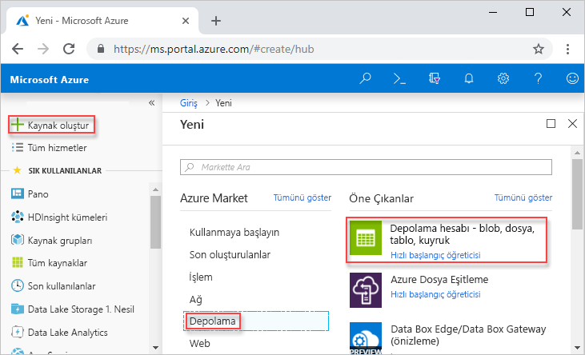
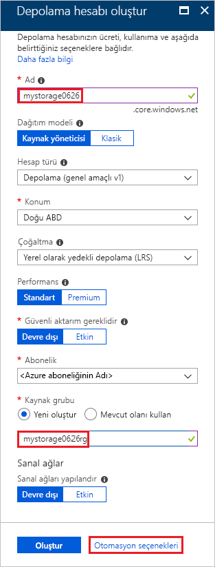
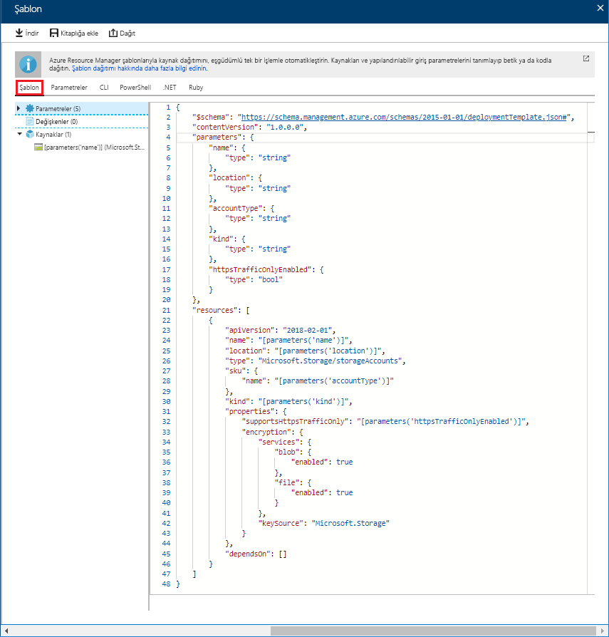
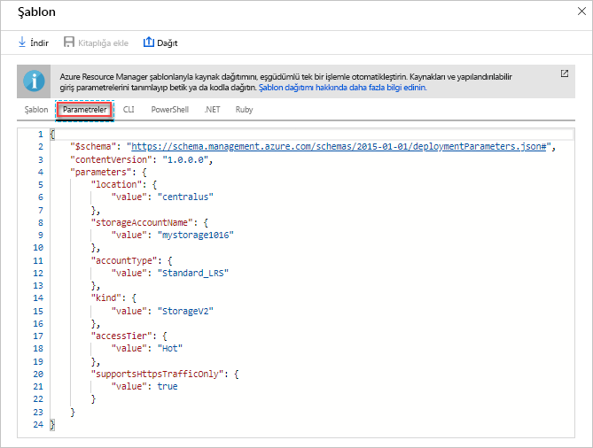
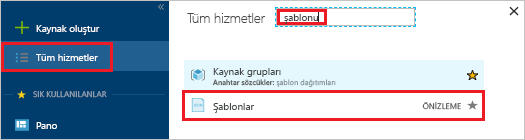
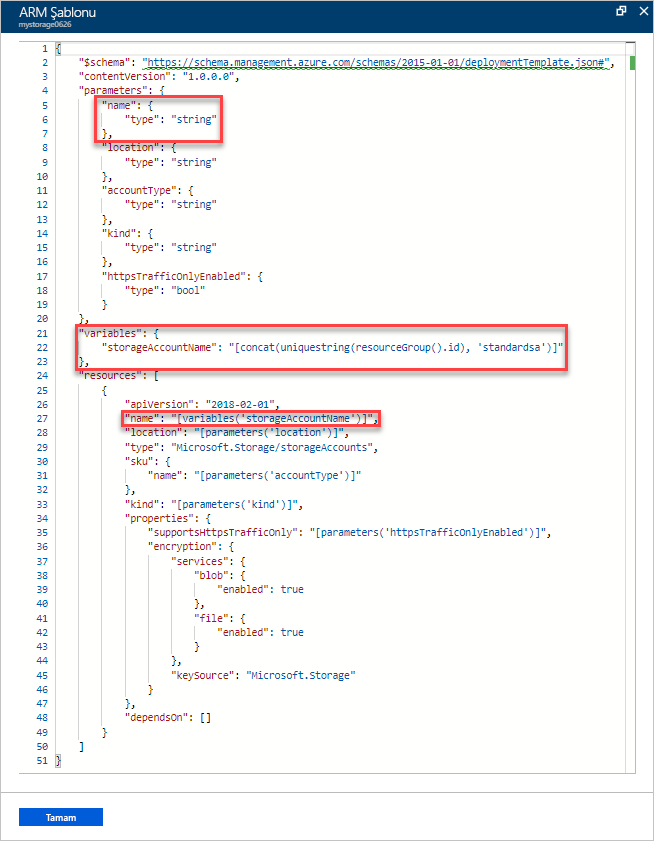
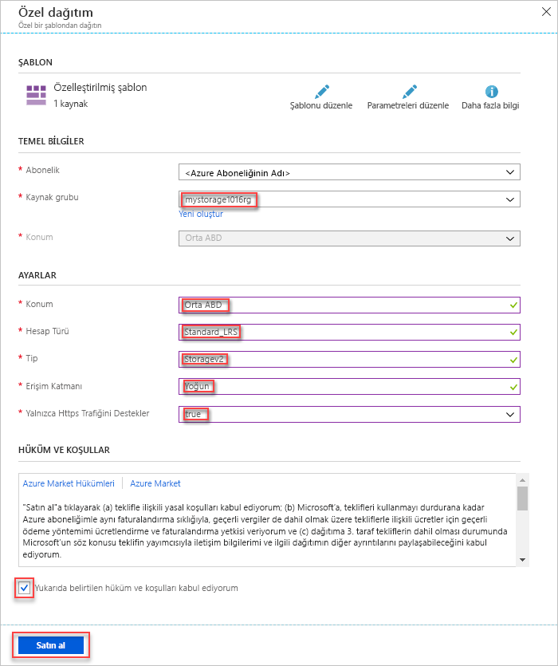
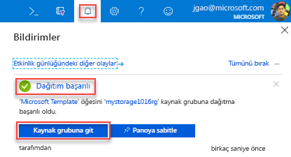
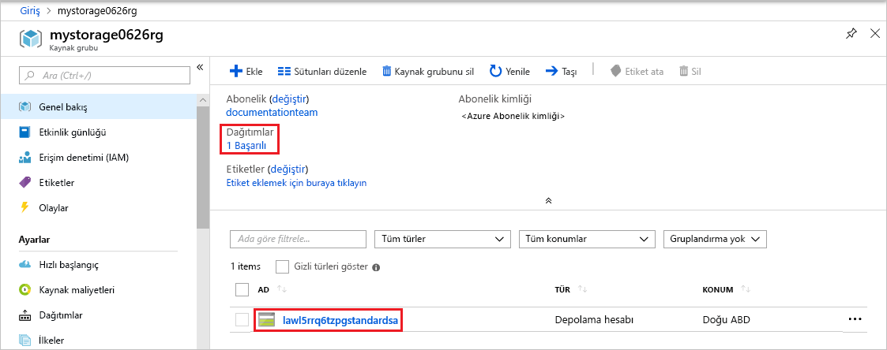

# <a name="quickstart-create-and-deploy-azure-resource-manager-templates-by-using-the-azure-portal"></a>Hızlı Başlangıç: Oluşturma ve Azure portalını kullanarak Azure Resource Manager şablonlarını dağıtma

Azure portalı ve düzenleme ve portal şablondan dağıtma işlemini bir Resource Manager şablonu oluşturma hakkında bilgi edinin. Resource Manager şablonları, çözümünüz için dağıtmanız gereken kaynakları tanımlayan JSON dosyalarıdır. Azure çözümlerinizi dağıtma ve yönetmeyle ilgili kavramları anlamak için bkz. [Azure Resource Manager’a genel bakış](resource-group-overview.md).


Öğreticiyi tamamladıktan sonra bir Azure depolama hesabı dağıtın. Aynı işlem, diğer Azure kaynakları dağıtmak için kullanılabilir.

Azure aboneliğiniz yoksa başlamadan önce [ücretsiz bir hesap oluşturun](https://azure.microsoft.com/free/).

## <a name="generate-a-template-using-the-portal"></a>Portalı kullanarak şablon oluşturma

Sıfırdan bir Resource Manager şablonu oluşturarak bir kolayca görev özellikle Azure dağıtımı için yenidir ve JSON biçimiyle ilgili bilgi sahibi değilseniz değildir. Azure portalını kullanarak, bir kaynak, örneğin bir Azure depolama hesabı yapılandırabilirsiniz. Kaynak dağıtmadan önce bir Resource Manager şablonuyla yapılandırmanızı dışarı aktarabilirsiniz. Şablonu kaydedebilir ve daha sonra yeniden kullanabilirsiniz.

Pek çok deneyimli şablon Geliştirici ile tanıdık olmayan Azure kaynaklarını dağıtın çalıştıklarında şablonları oluşturmak için bu yöntemi kullanın. Portalı kullanarak şablonları dışarı aktarma hakkında daha fazla bilgi için bkz. [kaynak grupları için şablonları dışarı aktarma](./manage-resource-groups-portal.md#export-resource-groups-to-templates). Bir çalışma şablonu bulmak için diğer bir yolu [Azure hızlı başlangıç şablonları](https://azure.microsoft.com/resources/templates/).

1. [Azure Portal](https://portal.azure.com) oturum açın.
2. **Kaynak oluştur** > **Depolama** > **Depolama hesabı - blob, dosya, tablo, sorgu**'yu seçin.

    
3. Aşağıdaki bilgileri girin:

    |Ad|Değer|
    |----|----|
    |**Kaynak grubu**|Seçin **Yeni Oluştur**, tercih ettiğiniz bir kaynak grubu adı belirtin. Ekran görüntüsünde kaynak grubu adı *mystorage1016rg* olarak belirtilmiştir. Kaynak grubu, Azure kaynakları için bir kapsayıcıdır. Kaynak grubu, Azure kaynaklarını yönetmek kolaylaştırır. |
    |**Ad**|Depolama hesabınızın benzersiz bir ad verin. Depolama hesabı adı tüm Azure genelinde benzersiz olmalıdır ve yalnızca küçük harflerden ve rakamlardan içerdiği. Ad 3 ile 24 karakter arasında olmalıdır. "'Mystorage1016' depolama hesabı adı zaten alınmış" diyen bir hata mesajı alırsanız kullanmayı deneyin  **&lt;adınız > depolama&lt;MMDD bugünün tarihi >** , örneğin  **johndolestorage1016**. Daha fazla bilgi için [adlandırma kuralları ve kısıtlamalar](/azure/architecture/best-practices/naming-conventions#naming-rules-and-restrictions).|

    Diğer özellikler için varsayılan değerleri kullanabilirsiniz.

    

    > [!NOTE]
    > Dışarı aktarılan şablonların bazılarını kullanabilmeniz için yapmanız gereken düzenlemeler vardır.

4. Ekranın alt tarafından **Gözden geçir + oluştur**'u seçin. Seçmeyin **Oluştur** sonraki adımda.
5. Ekranın alt tarafından **Otomasyon için bir şablon indir**'i seçin. Portalda oluşturulan şablon gösterilir:

    

    Şablon ana bölmede gösterilir. Altı - üst düzey öğeleri içeren bir JSON dosyası olduğu `schema`, `contentVersion`, `parameters`, `variables`, `resources`, ve `output`. Daha fazla bilgi için bkz. [Azure Resource Manager şablonlarının yapısını ve söz dizimini anlama](./resource-group-authoring-templates.md)

    Tanımlı altı parametre bulunur. Bunlardan biri **storageAccountName** olarak adlandırılmıştır. Önceki ekran görüntüsünde vurgulanan ikinci bölümün şablonu bu parametrede yapmayı gösterir. Sonraki bölümde şablonu düzenleyerek depolama hesabı için oluşturulan bir adı kullanacaksınız.

    Şablonda bir Azure kaynağı tanımlanmıştır. Türü `Microsoft.Storage/storageAccounts`. Kaynak nasıl tanımlanır, bir görünüm ve tanım yapısı yararlanın.
6. Seçin **indirme** ekranın üst.
7. İndirilen ZIP dosyasını açın ve ardından kaydedin **template.json** bilgisayarınıza. Sonraki bölümde bir şablon dağıtım aracı kullanarak şablonu düzenleyeceksiniz.
8. Parametre için sağladığınız değerleri görmek üzere **Parametre** sekmesini seçin. Bu değerleri not alın. Bir sonraki bölümde şablonu dağıtırken ihtiyacınız olacak.

    

    Şablon dosyası hem parametre dosyasını kullanarak, bir kaynak, bu öğreticide, Azure depolama hesabı oluşturabilirsiniz.

## <a name="edit-and-deploy-the-template"></a>Şablonu düzenleme ve dağıtma

Basit şablon düzenleme işlemleri için Azure portalı kullanabilirsiniz. Bu hızlı başlangıçta *Şablon Dağıtımı* adlı bir portal aracını kullanacaksınız. *Şablon dağıtımı* tek bir arabirim - Azure portalını kullanarak tüm öğreticiyi tamamlamak için Bu öğreticide kullanılır. Daha karmaşık bir şablonu düzenlemek için kullanmayı [Visual Studio Code](./resource-manager-quickstart-create-templates-use-visual-studio-code.md), daha zengin düzenleme işlevleri sağlar.

> [!IMPORTANT]
> Şablon dağıtımı olan basit şablonlarla test etmek için bir arabirim sağlar. Üretim ortamında bu özelliği kullanmak için önerilmez. Bunun yerine, bir Azure depolama hesabı veya GitHub gibi kaynak kodu deposu Şablonlarınızı depolayın.

Azure'daki her Azure hizmetinin adının benzersiz olması gerekir. Zaten bir depolama hesabı adı girerseniz, dağıtım başarısız. Bu sorunu önlemek için bir şablon işlevi çağrısı için kullanılacak şablon değiştirme `uniquestring()` benzersiz depolama hesabı adı oluşturmak için.

1. Azure portalda **Kaynak oluştur**’u seçin.
2. **Market içinde ara** alanına **şablon dağıtımı** yazın ve **ENTER** tuşuna basın.
3. **Şablon dağıtımı**'nı seçin.

    
4. **Oluştur**’u seçin.
5. **Düzenleyicide kendi şablonunuzu oluşturun**'u seçin.
6. **Dosya yükle**'yi seçin ve ardından yönergeleri izleyerek önceki bölümde indirdiğiniz template.json dosyasını yükleyin.
7. Aşağıdaki üç değişiklikleri yapın:

    

   - Kaldırma **storageAccountName** önceki ekran görüntüsünde gösterildiği gibi parametre.
   - Adlı bir değişken ekleyin **storageAccountName** önceki ekran görüntüsünde gösterildiği gibi:

       ```json
       "storageAccountName": "[concat(uniqueString(subscription().subscriptionId), 'storage')]"
       ```

       İki şablon işlevi burada kullanılır: `concat()` ve `uniqueString()`.
   - **Microsoft.Storage/storageAccounts** kaynağının name öğesini parametre yerine yeni tanımlanan değişkeni kullanacak şekilde güncelleştirin:

       ```json
       "name": "[variables('storageAccountName')]",
       ```

     Şablonun son halinin şu şekilde olması gerekir:

     ```json
     {
       "$schema": "https://schema.management.azure.com/schemas/2015-01-01/deploymentTemplate.json#",
       "contentVersion": "1.0.0.0",
       "parameters": {
           "location": {
               "type": "string"
           },
           "accountType": {
               "type": "string"
           },
           "kind": {
               "type": "string"
           },
           "accessTier": {
               "type": "string"
           },
           "supportsHttpsTrafficOnly": {
               "type": "bool"
           }
       },
       "variables": {
           "storageAccountName": "[concat(uniqueString(subscription().subscriptionId), 'storage')]"
       },
       "resources": [
           {
               "name": "[variables('storageAccountName')]",
               "type": "Microsoft.Storage/storageAccounts",
               "apiVersion": "2018-07-01",
               "location": "[parameters('location')]",
               "properties": {
                   "accessTier": "[parameters('accessTier')]",
                   "supportsHttpsTrafficOnly": "[parameters('supportsHttpsTrafficOnly')]"
               },
               "dependsOn": [],
               "sku": {
                   "name": "[parameters('accountType')]"
               },
               "kind": "[parameters('kind')]"
           }
       ],
       "outputs": {}
     }
     ```
8. **Kaydet**’i seçin.
9. Aşağıdaki değerleri girin:

    |Ad|Değer|
    |----|----|
    |**Kaynak grubu**|Son bölümde oluşturduğunuz kaynak grubu adı seçin. |
    |**Konum**|Depolama hesabı için bir konum seçin. Örneğin, **Orta ABD**. |
    |**Hesap türü**|Girin **Standard_LRS** Bu Hızlı Başlangıç için. |
    |**tür**|Girin **StorageV2** Bu Hızlı Başlangıç için. |
    |**Erişim katmanı**|Girin **etkin** Bu Hızlı Başlangıç için. |
    |**HTTPS trafiği yalnızca etkin**| Bu hızlı başlangıç için **true** değerini seçin. |
    |**Hüküm ve koşulları yukarıda belirtilen kabul ediyorum**|(seçim)|

    Örnek bir dağıtımın ekran görüntüsü:

    

10. **Satın al**'ı seçin.
11. Dağıtım durumunu görmek için ekranın en üstündeki zil simgesini (bildirimler) seçin. Göreceksiniz **dağıtım sürüyor**. Dağıtım tamamlanana kadar bekleyin.

    

12. Bildirim bölmesinden **Kaynak grubuna git**'i seçin. Şuna benzer bir ekran görmeniz gerekir:

    

    Dağıtım durumunun başarılı olduğunu ve kaynak grubunda yalnızca bir depolama hesabı olduğunu görebilirsiniz. Depolama hesabı adı, şablon tarafından oluşturulan benzersiz bir dizedir. Azure depolama hesapları kullanma hakkında daha fazla bilgi edinmek için [hızlı başlangıç: Karşıya yükleme, indirme ve Azure portalını kullanarak blobları listeleme](../storage/blobs/storage-quickstart-blobs-portal.md).

## <a name="clean-up-resources"></a>Kaynakları temizleme

Artık Azure kaynakları gerekli değilse, kaynak grubunu silerek dağıttığınız kaynakları temizleyin.

1. Azure portalda, sol menüden **Kaynak grubu**’nu seçin.
2. **Ada göre filtrele** alanına kaynak grubu adını girin.
3. Kaynak grubu adını seçin.  Depolama hesabı kaynak grubunda bulunmalıdır.
4. Üstteki menüden **Kaynak grubunu sil**'i seçin.

## <a name="next-steps"></a>Sonraki adımlar

Bu öğreticide, Azure portaldan şablon oluşturmayı ve portalı kullanarak şablonu dağıtmayı öğrendiniz. Bu Hızlı Başlangıçta kullanılan şablon, tek bir Azure kaynağına sahip basit bir şablondur. Şablon karmaşık olduğunda geliştirme için Visual Studio Code veya Visual Studio uygulamasını kullanmak daha kolaydır. Sonraki öğreticide Azure PowerShell ve Azure Komut Satırı Arabirimi (CLI) kullanarak nasıl şablon dağıtacağınız da gösterilmektedir.

> [!div class="nextstepaction"]
> [Visual Studio Code kullanarak şablon oluşturma](./resource-manager-quickstart-create-templates-use-visual-studio-code.md)
