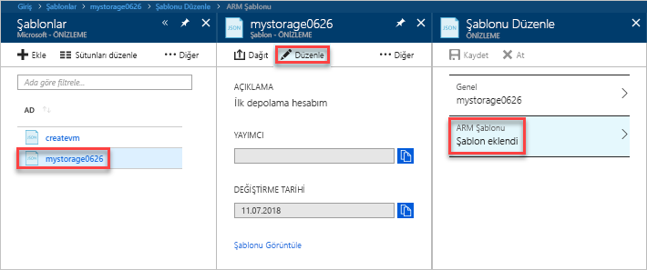

# <a name="quickstart-create-and-deploy-azure-resource-manager-templates-by-using-the-azure-portal"></a>Hızlı başlangıç: Azure portalı kullanarak Azure Resource Manager şablonu oluşturma ve dağıtma

Azure portalı kullanarak ilk Azure Resource Manager şablonunuzu oluşturma ve bu şablonu portaldan düzenleyip dağıtmayı öğrenin.

Resource Manager şablonları, çözümünüz için dağıtmanız gereken kaynakları tanımlayan JSON dosyalarıdır. Şablon oluşturmak için her zaman sıfırdan başlamanız gerekmez. Bu öğreticide Azure portaldan bir şablon oluşturmayı öğreneceksiniz. Ardından oluşturduğunuz şablonu özelleştirebilir ve dağıtabilirsiniz.

Bu öğreticideki yönergeler bir Azure Depolama hesabı oluşturur. Aynı işlemi kullanarak başka Azure kaynakları da oluşturabilirsiniz.

Azure aboneliğiniz yoksa başlamadan önce [ücretsiz bir hesap oluşturun](https://azure.microsoft.com/free/).

## <a name="generate-a-template-using-the-portal"></a>Portalı kullanarak şablon oluşturma

Bu bölümde Azure portalı kullanarak bir depolama hesabı oluşturacaksınız. Depolama hesabını dağıtmadan önce portal tarafından yapılandırmalarınıza göre oluşturulan şablonu keşfedebilirsiniz. Şablonu kaydedebilir ve daha sonra yeniden kullanabilirsiniz.

1. [Azure Portal](https://portal.azure.com) oturum açın.
2. **Kaynak oluştur** > **Depolama** > **Depolama hesabı - blob, dosya, tablo, sorgu**'yu seçin.

    
3. Aşağıdaki bilgileri girin. Dağıtılmadan önce şablonu görebilmek için bir sonraki adımda **Oluştur** yerine **Otomasyon seçenekleri**'ni belirlediğinizden emin olun.

    - **Ad**: Depolama hesabınıza benzersiz bir ad verin. Ekran görüntüsünde bu ad *mystorage0626* olarak belirtilmiştir.
    - **Kaynak grubu**: Yeni bir Azure kaynak grubu oluşturun ve istediğiniz adı verin. Ekran görüntüsünde kaynak grubu adı *mystorage0626rg* olarak belirtilmiştir.

    Diğer özellikler için varsayılan değerleri kullanabilirsiniz.

    

    > [!NOTE]
    > Dışarı aktarılan şablonların bazılarını kullanabilmeniz için yapmanız gereken düzenlemeler vardır.

4. Ekranın en altındaki **Otomasyon seçenekleri**'ni belirleyin. Şablon, portalın **Şablon** sekmesinde gösterilir:

    

    Şablon ana bölmede gösterilir. Dört üst düzey öğeye sahip bir JSON dosyasıdır. Daha fazla bilgi için bkz. [Azure Resource Manager şablonlarının yapısını ve söz dizimini anlama](./resource-group-authoring-templates.md)

    **Parametre** öğesinin altında tanımlı beş parametre vardır. Dağıtım sırasında sağladığınız değerleri görmek için **Parametreler** sekmesini seçin.

    

    Bunlar, önceki bölümde yapılandırdığınız değerlerdir. Şablon ve parametreler dosyalarını kullanarak bir Azure depolama hesabı kullanabilirsiniz.

5. Sekmelerin en üstünde üç menü öğesi bulunur:

    - **İndir**: Şablonu ve parametreler dosyasını yerel bilgisayarınıza indirin.
    - **Kitaplığa ekle**: Şablonu ileride yeniden kullanmak üzere kitaplığa ekleyin.
    - **Dağıt**: Azure depolama hesabını Azure'a dağıtın.

    Bu öğreticide **Kitaplığa ekle** seçeneğini kullanacaksınız.

6. **Kitaplığa ekle**'yi seçin.
7. **Ad** ve **Açıklama** girip **Kaydet**'i seçin.

> [!NOTE]
> Şablon kitaplığı özelliği önizleme sürümündedir. Kullanıcıların çoğu, şablonlarını yerel bilgisayara veya GitHub gibi genel bir depolama alanına kaydetmeyi tercih eder.  

## <a name="edit-and-deploy-the-template"></a>Şablonu düzenleme ve dağıtma

Bu bölümde şablon kitaplığına kaydettiğiniz şablonu açacak, portalda düzenleyecek ve düzenlediğiniz şablonu dağıtacaksınız. Daha karmaşık bir şablonu düzenlemek için daha gelişmiş düzenleme işlevleri sunan Visual Studio Code uygulamasını kullanabilirsiniz.

1. Azure portalda sol taraftaki menüden **Tüm hizmetler**'i seçin, filtre kutusuna **şablon** yazın ve **Şablon (ÖNİZLEME)** girişini seçin.

    
2. Bir önceki bölümde kaydettiğiniz şablonu seçin. Ekran görüntüsünde bu ad *mystorage0626* olarak belirtilmiştir.
3. **Düzenle**'yi ve ardından **Şablon eklendi**'yi seçin.

    

4. **variables** öğesi ekleyin ve ardından aşağıdaki ekran görüntüsünde gösterildiği gibi bir değişken ekleyin:

    ```json
    "variables": {
        "storageAccountName": "[concat(uniquestring(resourceGroup().id), 'standardsa')]"
    },
    ```
    

    Burada iki işlev kullanılmıştır: *concat()* ve *uniqueString()*. uniqueString(), kaynak için benzersiz bir ad oluşturulmasını sağlar.

5. Bir önceki ekran görüntüsünde vurgulanan **name** parametresini kaldırın.
6. **Microsoft.Storage/storageAccounts** kaynağının name öğesini parametre yerine yeni tanımlanan değişkeni kullanacak şekilde güncelleştirin:

    ```json
    "name": "[variables('storageAccountName')]",
    ```

    Şablonun son halinin şu şekilde olması gerekir:

    ```json
    {
        "$schema": "https://schema.management.azure.com/schemas/2015-01-01/deploymentTemplate.json#",
        "contentVersion": "1.0.0.0",
        "parameters": {
            "location": {
                "type": "string"
            },
            "accountType": {
                "type": "string"
            },
            "kind": {
                "type": "string"
            },
            "httpsTrafficOnlyEnabled": {
                "type": "bool"
            }
        },
        "variables": {
            "storageAccountName": "[concat(uniquestring(resourceGroup().id), 'standardsa')]"
        },
        "resources": [
            {
                "apiVersion": "2018-02-01",
                "name": "[variables('storageAccountName')]",
                "location": "[parameters('location')]",
                "type": "Microsoft.Storage/storageAccounts",
                "sku": {
                    "name": "[parameters('accountType')]"
                },
                "kind": "[parameters('kind')]",
                "properties": {
                    "supportsHttpsTrafficOnly": "[parameters('httpsTrafficOnlyEnabled')]",
                    "encryption": {
                        "services": {
                            "blob": {
                                "enabled": true
                            },
                            "file": {
                                "enabled": true
                            }
                        },
                        "keySource": "Microsoft.Storage"
                    }
                },
                "dependsOn": []
            }
        ]
    }
    ```
7. **Tamam**'ı seçin ve ardından **Kaydet**'i seçerek değişiklikleri kaydedin.
8. **Dağıt**'ı seçin.
9. Aşağıdaki değerleri girin:

    - **Abonelik**: Azure aboneliğinizi seçin.
    - **Kaynak grubu**: Kaynak grubunuza benzersiz bir ad verin.
    - **Konum**: Kaynak grubu için bir konum seçin.
    - **Konum**: Depolama hesabı için bir konum seçin.  Kaynak grubu ile aynı konumu kullanabilirsiniz.
    - **Hesap Türü**: Bu hızlı başlangıç için **Standard_LRS** yazın.
    - **Tür**: Bu hızlı başlangıç için **Depolama** yazın.
    - **Yalnızca HTTPS Trafiği Etkin**.  Bu hızlı başlangıç için **false** değerini seçin.
    - **Yukarıda belirtilen hüküm ve koşulları kabul ediyorum**: (seçin)

    Örnek bir dağıtımın ekran görüntüsü:

    

10. **Satın al**'ı seçin.
11. Dağıtım durumunu görmek için ekranın en üstündeki zil simgesini (bildirimler) seçin.

## <a name="clean-up-resources"></a>Kaynakları temizleme

Artık Azure kaynakları gerekli değilse, kaynak grubunu silerek dağıttığınız kaynakları temizleyin.

1. Azure portalda, sol menüden **Kaynak grubu**’nu seçin.
2. **Ada göre filtrele** alanına kaynak grubu adını girin.
3. Kaynak grubu adını seçin.  Depolama hesabı kaynak grubunda bulunmalıdır.
4. Üstteki menüden **Kaynak grubunu sil**'i seçin.

## <a name="next-steps"></a>Sonraki adımlar

Bu öğreticide, Azure portaldan şablon oluşturmayı ve portalı kullanarak şablonu dağıtmayı öğrendiniz. Bu Hızlı Başlangıçta kullanılan şablon, tek bir Azure kaynağına sahip basit bir şablondur. Şablon karmaşık olduğunda geliştirme için Visual Studio Code veya Visual Studio uygulamasını kullanmak daha kolaydır.

> [!div class="nextstepaction"]
> [Visual Studio Code kullanarak şablon oluşturma](./resource-manager-quickstart-create-templates-use-visual-studio-code.md)
