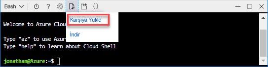
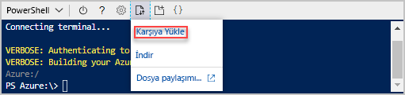

# <a name="quickstart-create-azure-resource-manager-templates-by-using-visual-studio-code"></a>Hızlı Başlangıç: Visual Studio Code kullanarak Azure Resource Manager şablonları oluşturma

Visual Studio Code ve Azure Resource Manager Araçları uzantısı kullanarak Azure Resource Manager şablonları oluşturmayı ve düzenlemeyi öğrenin. Uzantı olmadan Visual Studio Code'da Resource Manager şablonları oluşturabilirsiniz, ancak uzantı, şablon geliştirmeyi kolaylaştıran otomatik tamamlama seçenekleri sağlar. Azure çözümlerinizi dağıtma ve yönetmeyle ilgili kavramları anlamak için bkz. [Azure Resource Manager’a genel bakış](resource-group-overview.md).

Bu öğreticide, bir depolama hesabı dağıtın:


Azure aboneliğiniz yoksa başlamadan önce [ücretsiz bir hesap oluşturun](https://azure.microsoft.com/free/).

## <a name="prerequisites"></a>Önkoşullar

Bu makaleyi tamamlamak için gerekenler:

- [Visual Studio Code](https://code.visualstudio.com/).
- Resource Manager Araçları uzantısı. Yüklemek için şu adımları kullanın:

    1. Visual Studio Code'u açın.
    2. Uzantılar bölmesini açmak için **CTRL+SHIFT+X** tuşlarına basın
    3. **Azure Resource Manager Araçları**’nı arayın ve sonra **Yükle**’yi seçin.
    4. Uzantı yüklemesini tamamlamak için **Yeniden Yükle**’yi seçin.

## <a name="open-a-quickstart-template"></a>Hızlı başlangıç şablonunu açma

Sıfırdan şablon oluşturmak yerine, [Azure Hızlı Başlangıç Şablonları](https://azure.microsoft.com/resources/templates/)’ndan bir şablon açarsınız. Azure Hızlı Başlangıç Şablonları, Resource Manager şablonları için bir depolama alanıdır.

Bu hızlı başlangıçta kullanılan şablon [Standart depolama hesabı oluşturma](https://azure.microsoft.com/resources/templates/101-storage-account-create/) olarak adlandırılır. Şablon, Azure Depolama hesabı kaynağını tanımlar.

1. Visual Studio Code’dan **Dosya**>**Dosya Aç**’ı seçin.
2. **Dosya adı**’na şu URL’yi yapıştırın:

    ```url
    https://raw.githubusercontent.com/Azure/azure-quickstart-templates/master/101-storage-account-create/azuredeploy.json
    ```

3. Dosyayı açmak için **Aç**’ı seçin.
4. Dosyayı yerel bilgisayarınıza **azuredeploy.json** olarak kaydetmek için **Dosya**>**Farklı Kaydet**’i seçin.

## <a name="edit-the-template"></a>Şablonu düzenleme

Visual Studio Code'u kullanarak bir şablon düzenleme deneyimi için daha fazla tek bir öğede eklemeniz `outputs` depolama URI'si göstermek için bölümü.

1. Bir veya birden çok çıkışı dışarı aktarılan şablona ekleyin:

    ```json
    "storageUri": {
      "type": "string",
      "value": "[reference(variables('storageAccountName')).primaryEndpoints.blob]"
    }
    ```

    Bitirdiğinizde çıkışlar bölümü şöyle görünür:

    ```json
    "outputs": {
      "storageAccountName": {
        "type": "string",
        "value": "[variables('storageAccountName')]"
      },
      "storageUri": {
        "type": "string",
        "value": "[reference(variables('storageAccountName')).primaryEndpoints.blob]"
      }
    }
    ```

    Kodu kopyalayıp Visual Studio Code'un içine yapıştırdıysanız, Resource Manager Araçları uzantısının IntelliSense özelliğini denemek için **value** öğesini bir kez daha yazmayı deneyin.

    

2. Dosyayı kaydetmek için **Dosya**>**Kaydet**’e tıklayın.

## <a name="deploy-the-template"></a>Şablonu dağıtma

Şablonları dağıtmak için birçok yöntem vardır. Bu hızlı başlangıçta, Azure Cloud Shell'i kullanılır. Cloud shell, Azure CLI ve Azure PowerShell hem destekler. PowerShell ve CLI arasında seçim için sekmesinde seçiciyi kullanın.

[!INCLUDE [updated-for-az](../../includes/updated-for-az.md)]

1. [Azure Cloud Shell](https://shell.azure.com)'de oturum açın.

2. Tercih ettiğiniz ortam ya da seçerek **PowerShell** veya **Bash**(CLI) sol üst köşesinde bulunan.  Geçiş yaptığınızda kabuğun yeniden başlatılması gerekir.

    # <a name="clitabcli"></a>[CLI](#tab/CLI)

    

    # <a name="powershelltabpowershell"></a>[PowerShell](#tab/PowerShell)

    

    ---

3. **Dosyaları karşıya yükle/indir**'i seçin ve sonra da **Karşıya Yükle**'yi seçin.

    # <a name="clitabcli"></a>[CLI](#tab/CLI)

    
   
    # <a name="powershelltabpowershell"></a>[PowerShell](#tab/PowerShell)
    
    
    
    ---

    Önceki bölümde kaydettiğiniz dosyayı seçin. Varsayılan ad **azuredeploy.json** olur. Şablon dosyası Kabuğu'ndan erişilebilir olmalıdır.

    İsteğe bağlı olarak kullanabileceğiniz **ls** komut ve **cat** komut dosyası başarıyla karşıya doğrulayın. 

    # <a name="clitabcli"></a>[CLI](#tab/CLI)

    
   
    # <a name="powershelltabpowershell"></a>[PowerShell](#tab/PowerShell)
    
    
    
    ---
4. Cloud Shell’den aşağıdaki komutları çalıştırın. PowerShell kodunu veya CLI kodunu gösteren sekmeyi seçin.

    # <a name="clitabcli"></a>[CLI](#tab/CLI)
    ```azurecli
    echo "Enter the Resource Group name:" &&
    read resourceGroupName &&
    echo "Enter the location (i.e. centralus):" &&
    read location &&
    az group create --name $resourceGroupName --location "$location" &&
    az group deployment create --resource-group $resourceGroupName --template-file "$HOME/azuredeploy.json"
    ```
   
    # <a name="powershelltabpowershell"></a>[PowerShell](#tab/PowerShell)
    
    ```azurepowershell
    $resourceGroupName = Read-Host -Prompt "Enter the Resource Group name"
    $location = Read-Host -Prompt "Enter the location (i.e. centralus)"
    
    New-AzResourceGroup -Name $resourceGroupName -Location "$location"
    New-AzResourceGroupDeployment -ResourceGroupName $resourceGroupName -TemplateFile "$HOME/azuredeploy.json"
    ```
    
    ---

    Dosyayı **azuredeploy.json** dışında bir adla kaydederseniz şablon dosyasının adını güncelleştirin. 

    Aşağıdaki ekran görüntüsünde bir örnek dağıtım gösterilmektedir:

    # <a name="clitabcli"></a>[CLI](#tab/CLI)

    
   
    # <a name="powershelltabpowershell"></a>[PowerShell](#tab/PowerShell)
    
    
    
    ---

    Çıktı bölümündeki depolama hesabı adı ve depolama URL'si ekran görüntüsünde vurgulanmıştır. Bir sonraki adımda depolama hesabına ihtiyacınız olacak.

5. Yeni oluşturulan depolama hesabını listelemek için aşağıdaki CLI komutunu çalıştırın:

    # <a name="clitabcli"></a>[CLI](#tab/CLI)
    ```azurecli
    echo "Enter the Resource Group name:" &&
    read resourceGroupName &&
    echo "Enter the Storage Account name:" &&
    read storageAccountName &&
    az storage account show --resource-group $resourceGroupName --name $storageAccountName
    ```
   
    # <a name="powershelltabpowershell"></a>[PowerShell](#tab/PowerShell)
    
    ```azurepowershell
    $resourceGroupName = Read-Host -Prompt "Enter the Resource Group name"
    $storageAccountName = Read-Host -Prompt "Enter the Storage Account name"
    Get-AzStorageAccount -ResourceGroupName $resourceGroupName -Name $storageAccountName
    ```
    
    ---

Azure depolama hesapları kullanma hakkında daha fazla bilgi edinmek için [hızlı başlangıç: Karşıya yükleme, indirme ve Azure portalını kullanarak blobları listeleme](../storage/blobs/storage-quickstart-blobs-portal.md).

## <a name="clean-up-resources"></a>Kaynakları temizleme

Artık Azure kaynakları gerekli değilse, kaynak grubunu silerek dağıttığınız kaynakları temizleyin.

1. Azure portalda, sol menüden **Kaynak grubu**’nu seçin.
2. **Ada göre filtrele** alanına kaynak grubu adını girin.
3. Kaynak grubu adını seçin.  Kaynak grubundaki toplam altı kaynak görüyor olmalısınız.
4. Üstteki menüden **Kaynak grubunu sil**’i seçin.

## <a name="next-steps"></a>Sonraki adımlar

Bu hızlı başlangıcın ana odak noktası, Visual Studio Code kullanarak Azure Hızlı Başlangıç şablonlarındaki mevcut bir şablon düzenlemektir. Ayrıca Azure Cloud shell'den CLI veya PowerShell kullanarak şablonu dağıtmak nasıl öğrendiniz. Azure Hızlı Başlangıç şablonlarındaki şablonlar size ihtiyacınız olan her şeyi sağlamayabilir. Sonraki öğreticide şifrelenmiş bir Azure Depolama hesabı oluşturmak için şablon referansından nasıl bilgi bulacağınız gösterilmektedir.

> [!div class="nextstepaction"]
> [Şifrelenmiş depolama hesabı oluşturma](./resource-manager-tutorial-create-encrypted-storage-accounts.md)
