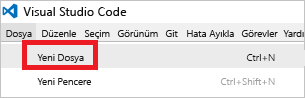
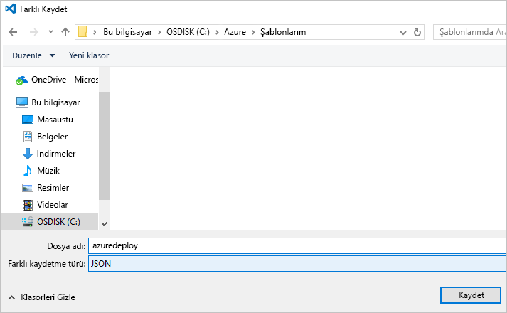

# <a name="use-visual-studio-code-extension-to-create-azure-resource-manager-template"></a>Azure Resource Manager şablonu oluşturmak için Visual Studio Code uzantısı kullanma
Bu makalede, Visual Studio Code içinde Azure Resource Manager Araçları uzantısını kullanmanın avantajları gösterilir. VS Code'da uzantısı olmadan Resource Manager şablonları oluşturabilirsiniz, ancak uzantı, şablon geliştirmeyi kolaylaştıran otomatik tamamlama seçenekleri sağlar. Şablon işlevleri, parametreler ve şablonda kullanılabilir değişkenler önerir.

Bu makaleyi tamamlamak için [Visual Studio Code](https://code.visualstudio.com/) gerekir.

Azure çözümlerinizi dağıtma ve yönetmeyle ilgili kavramları anlamak için bkz. [Azure Resource Manager’a genel bakış](resource-group-overview.md).

## <a name="create-the-template"></a>Şablonu oluşturma

Bu makalede, [İlk Azure Resource Manager şablonunuzu oluşturma ve dağıtma](resource-manager-create-first-template.md) bölümünde oluşturduğunuz şablon kullanılmıştır. Bu şablon zaten varsa, bu bölümü atlayabilirsiniz.

1. Şablonu oluşturmanız gerekiyorsa, VS Code'u başlatın. **Dosya** > **Yeni Dosya**’yı seçin. 

   

2. Aşağıdaki JSON söz dizimini kopyalayıp dosyanıza yapıştırın:

   ```json
   {
     "$schema": "http://schema.management.azure.com/schemas/2015-01-01/deploymentTemplate.json#",
     "contentVersion": "1.0.0.0",
     "parameters": {
       "storageSKU": {
         "type": "string",
         "allowedValues": [
           "Standard_LRS",
           "Standard_ZRS",
           "Standard_GRS",
           "Standard_RAGRS",
           "Premium_LRS"
         ],
         "defaultValue": "Standard_LRS",
         "metadata": {
           "description": "The type of replication to use for the storage account."
         }
       },   
       "storageNamePrefix": {
         "type": "string",
         "maxLength": 11,
         "defaultValue": "storage",
         "metadata": {
           "description": "The value to use for starting the storage account name. Use only lowercase letters and numbers."
         }
       }
     },
     "variables": {
       "storageName": "[concat(toLower(parameters('storageNamePrefix')), uniqueString(resourceGroup().id))]"
     },
     "resources": [
       {
         "name": "[variables('storageName')]",
         "type": "Microsoft.Storage/storageAccounts",
         "apiVersion": "2016-01-01",
         "sku": {
           "name": "[parameters('storageSKU')]"
         },
         "kind": "Storage",
         "location": "[resourceGroup().location]",
         "tags": {},
         "properties": {
           "encryption":{
             "services":{
               "blob":{
                 "enabled":true
               }
             },
             "keySource":"Microsoft.Storage"
           }
         }
       }
     ],
     "outputs": {  }
   }
   ```

3. Bu dosyayı yerel bir klasöre **azuredeploy.json** olarak kaydedin.

   

## <a name="install-the-extension"></a>Uzantıyı yükleme

1. VS Code'da **Uzantılar**’ı seçin.

   

2. **Azure Resource Manager Araçları**’nı arayıp **Yükle**’yi seçin.

   

3. Uzantı yüklemesini tamamlamak için **Yeniden Yükle**’yi seçin.

## <a name="edit-the-template"></a>Şablonu düzenleme

1. azuredeploy.json dosyasını açın.

2. Uzantı, tüm kullanılabilir [şablon işlevlerini](resource-group-template-functions.md) alır. Ayrıca, şablonda tanımladığınız parametreleri ve değişkenleri okur. Bu işlevi görmek için çıkış bölümüne iki değer ekleyin. Şablonda çıktılar bölümünü aşağıdakilerle değiştirin:

   ```json
   "outputs": { 
       "groupLocation": {
         "type": "string",
         "value": ""
       },
       "storageUri": {
         "type": "string",
         "value": ""
       }
   }
   ```

3. İmleci **groupLocation** değerinin tırnak işaretleri arasına yerleştirin. Sol parantez karakteri girin (`[`). Uzantı hemen kullanılabilir şablon işlevlerini önerecektir.

   

4. **resourceGroup** yazmaya başlayın. `resourceGroup()` işlevi görüntülendiğinde Sekme veya Enter tuşuna basın.

   

5. Uzantı işlev sözdizimini doldurur. [ResourceGroup](resource-group-template-functions-resource.md#resourcegroup) işlevi parametre kabul etmez. Sağ parantezden sonra bir nokta ekleyin. Uzantı, `resourceGroup()` işlevi tarafından döndürülen nesne için kullanılabilen özellikleri sağlar. `location` öğesini seçin.

   

6. **location** değerinden sonra sağ ayraç ekleyin.

   ```json
   "outputs": { 
       "groupLocation": {
         "type": "string",
         "value": "[resourceGroup().location]"
       },
       "storageUri": {
         "type": "string",
         "value": ""
       }
   }
   ```

7. Şimdi imleci **storageUri** değerinin tırnak işaretleri arasına yerleştirin. Bir kez daha sol parantez karakteri girin. **reference** yazmaya başlayın. Bu işlev seçildiğinde Sekme veya Enter tuşuna basın.

   

8. [reference](resource-group-template-functions-resource.md#reference), parametre olarak kaynak kimliğini veya kaynak adını kabul eder. Depolama hesabı adı zaten bir değişken olarak vardır. **var** yazın ve Ctrl+boşluk tuşlarına basın. Uzantı, değişkenler işlevini önerir.

   

   Sekme veya Enter tuşuna basın.

9. [variables](resource-group-template-functions-deployment.md#variables) işlevi değişkeninin adını gerektirir. Parantez içinde tek tırnak işareti ekleyin. Uzantı şablonda tanımladığınız değişkenlerin adlarını sağlar.

    

10. **storageName** değişkenini seçin. Sağ köşeli ayraç ekleyin. Aşağıdaki örnekte çıkış bölümü gösterilmektedir:

   ```json
   "outputs": { 
       "groupLocation": {
         "type": "string",
         "value": "[resourceGroup().location]"
       },
       "storageUri": {
         "type": "string",
         "value": "[reference(variables('storageName'))]"
       }
   }
   ```

Son şablon şöyledir:

```json
{
  "$schema": "http://schema.management.azure.com/schemas/2015-01-01/deploymentTemplate.json#",
  "contentVersion": "1.0.0.0",
  "parameters": {
    "storageSKU": {
      "type": "string",
      "allowedValues": [
        "Standard_LRS",
        "Standard_ZRS",
        "Standard_GRS",
        "Standard_RAGRS",
        "Premium_LRS"
      ],
      "defaultValue": "Standard_LRS",
      "metadata": {
        "description": "The type of replication to use for the storage account."
      }
    },   
    "storageNamePrefix": {
      "type": "string",
      "maxLength": 11,
      "defaultValue": "storage",
      "metadata": {
        "description": "The value to use for starting the storage account name. Use only lowercase letters and numbers."
      }
    }
  },
  "variables": {
    "storageName": "[concat(toLower(parameters('storageNamePrefix')), uniqueString(resourceGroup().id))]"
  },
  "resources": [
    {
      "name": "[variables('storageName')]",
      "type": "Microsoft.Storage/storageAccounts",
      "apiVersion": "2016-01-01",
      "sku": {
        "name": "[parameters('storageSKU')]"
      },
      "kind": "Storage",
      "location": "[resourceGroup().location]",
      "tags": {},
      "properties": {
        "encryption":{
          "services":{
            "blob":{
              "enabled":true
            }
          },
          "keySource":"Microsoft.Storage"
        }
      }
    }
  ],
  "outputs": { 
    "groupLocation": {
      "type": "string",
      "value": "[resourceGroup().location]"
    },
    "storageUri": {
      "type": "string",
      "value": "[reference(variables('storageName'))]"
    }
  }
}
```

## <a name="deploy-template"></a>Şablon dağıtma

Bu şablonu dağıtmaya hazırsınız. Bir kaynak grubu oluşturmak için PowerShell veya Azure CLI kullanın. Ardından, bu kaynak grubuna bir depolama hesabı dağıtın.

* PowerShell için, şablonu içeren klasörden aşağıdaki komutları kullanın:

   ```powershell
   Login-AzureRmAccount
   
   New-AzureRmResourceGroup -Name examplegroup -Location "South Central US"
   New-AzureRmResourceGroupDeployment -ResourceGroupName examplegroup -TemplateFile azuredeploy.json
   ```

* Yerel bir Azure CLI yüklemesi için, şablonu içeren klasörden aşağıdaki komutları kullanın:

   ```azurecli
   az login

   az group create --name examplegroup --location "South Central US"
   az group deployment create --resource-group examplegroup --template-file azuredeploy.json
   ```

Dağıtım tamamlandığında, çıktı değerleri döndürülür.

## <a name="clean-up-resources"></a>Kaynakları temizleme

Artık gerekli değilse, kaynak grubunu silerek dağıttığınız kaynakları temizleyin.

PowerShell için şunu kullanın:

```powershell
Remove-AzureRmResourceGroup -Name examplegroup
```

Azure CLI için şunu kullanın:

```azurecli
az group delete --name examplegroup
```

## <a name="next-steps"></a>Sonraki adımlar
* Bir şablonun yapısı hakkında daha fazla bilgi edinmek için bkz. [Azure Resource Manager şablonları yazma](resource-group-authoring-templates.md).
* Bir depolama hesabının özellikleri hakkında bilgi edinmek için bkz. [depolama hesapları şablon başvurusu](/azure/templates/microsoft.storage/storageaccounts).
* Farklı türlerde çözümler için tam şablonları görüntülemek üzere bkz. [Azure Hızlı Başlangıç Şablonları](https://azure.microsoft.com/documentation/templates/).
