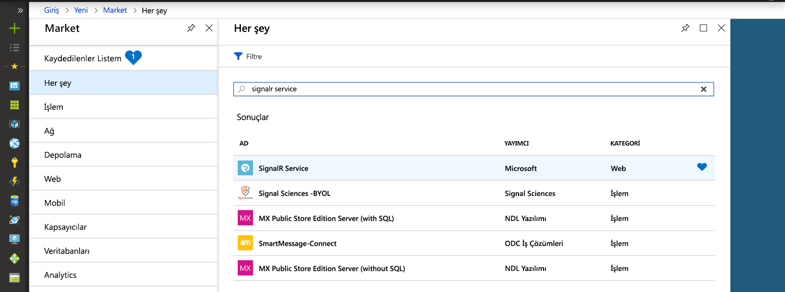
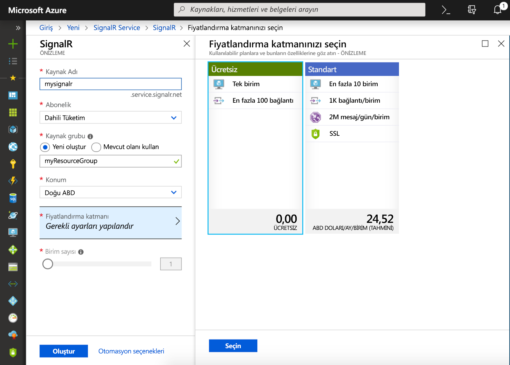

## Azure SignalR Hizmeti örneği oluşturma

Uygulamanız Azure’da bir SignalR hizmeti örneğine bağlanır.

1. Azure portalın sol üst köşesinde bulunan Yeni düğmesini seçin. Yeni ekranda arama kutusuna *SignalR hizmeti* yazın ve Enter tuşuna basın.

    

1. Arama sonuçlarından **SignalR Hizmeti**’ni seçtikten sonra **Oluştur**’u seçin.

1. Aşağıdaki ayarları girin.

    | Ayar      | Önerilen değer  | Açıklama                                        |
    | ------------ |  ------- | -------------------------------------------------- |
    | **Kaynak adı** | Genel olarak benzersiz bir ad | Yeni SignalR Hizmeti örneğinizi tanımlayan ad. Geçerli karakterler: `a-z`, `0-9`, ve `-`.  | 
    | **Abonelik** | Aboneliğiniz | Yeni SignalR Hizmeti örneğinin oluşturulacağı abonelik. | 
    | **[Kaynak Grubu](../../azure-resource-manager/resource-group-overview.md)** |  myResourceGroup | SignalR Hizmeti örneğinizin oluşturulacağı yeni kaynak grubunun adı. | 
    | **Konum** | Batı ABD | Size yakın bir [bölge](https://azure.microsoft.com/regions/) seçin. |
    | **Fiyatlandırma katmanı** | Ücretsiz | Azure SignalR Hizmetini ücretsiz deneyin. |
    | **Birim sayısı** |  Uygulanamaz | Birim sayısı, SignalR Hizmeti örneğinizin kaç bağlantı kabul edebileceğini belirtir. Bu yalnızca Standart katmanda yapılandırılabilir. |

    

1. SignalR Hizmeti örneğini dağıtmaya başlamak için **Oluştur**’u seçin.

1. Örneği dağıtıldıktan sonra portalda açın ve kendi ayarları sayfasını bulun. Hizmet Modu ayarını *sunucusuz*.

    