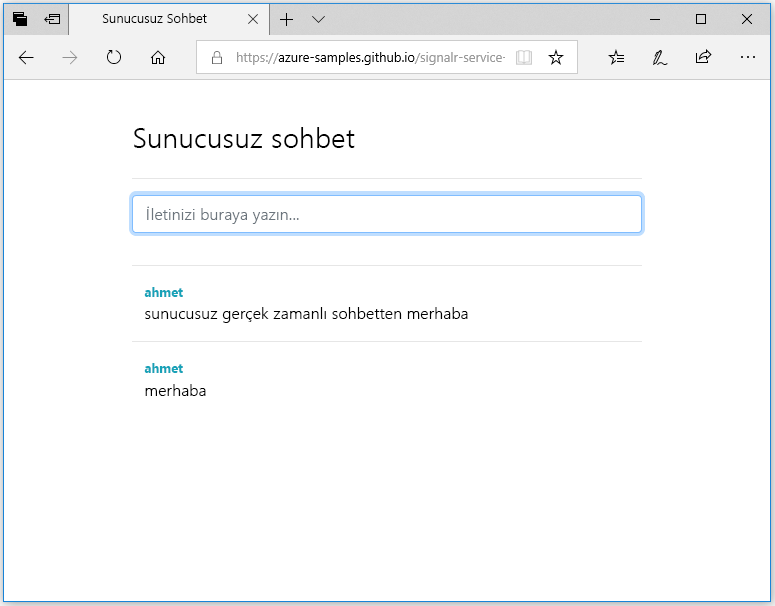

## Web uygulamasını çalıştırma

1. Sizin için GitHub'da tek sayfalı örnek bir web uygulaması barındırılmaktadır. Tarayıcınızda [https://azure-samples.github.io/signalr-service-quickstart-serverless-chat/demo/chat-v2/](https://azure-samples.github.io/signalr-service-quickstart-serverless-chat/demo/chat-v2/) bağlantısını açın.

    > [!NOTE]
    > Kaynak HTML dosyası şu konumdadır [/docs/demo/chat-v2/index.html](https://github.com/Azure-Samples/signalr-service-quickstart-serverless-chat/blob/master/docs/demo/chat-v2/index.html).

1. İşlev uygulaması temel URL'si istendiğinde girin `http://localhost:7071`.

1. İstenildiğinde bir kullanıcı adı girin.

1. Web uygulaması, Azure SignalR Hizmetine bağlanmak amacıyla bağlantı bilgilerini almak için işlev uygulamasındaki *GetSignalRInfo* işlevini çağırır. Bağlantı tamamlandığında sohbet iletisi giriş kutusu görünür.

1. Bir ileti yazın ve Enter tuşuna basın. Uygulama, iletiyi Azure işlev uygulamasındaki *SendMessage* işlevine gönderir, bu da bağlı tüm istemcilere iletiyi yaymak için SignalR çıkış bağlamasını kullanır. Her şey düzgün çalışıyorsa iletinin uygulamada görünmesi gerekir.

    

1. Farklı bir tarayıcı penceresinde web uygulamasının başka bir örneğini açın. Gönderilen tüm iletilerin uygulamanın tüm örneklerinde göründüğünü görürsünüz.

> [!IMPORTANT]
> HTTPS kullanarak HTML sayfası sunulur, ancak yerel Azure işlevleri çalışma zamanı varsayılan olarak HTTP kullanarak için tarayıcınızı (Firefox gibi) bir karışık içerik ilke engelleyen işlevlerinizi web sayfasından isteklerine şart koşabilir. Bunu çözmek için bu kısıtlama olması veya yerel bir HTTP sunucusu gibi başlatın bir tarayıcı kullanın [http-server](https://www.npmjs.com/package/http-server) içinde */docs/demo/chat-v2* dizin. Kaynak eklenir olun `CORS` ayarı *local.settings.json*.