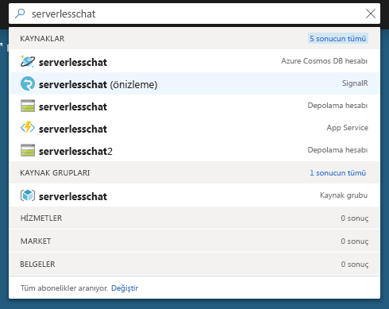
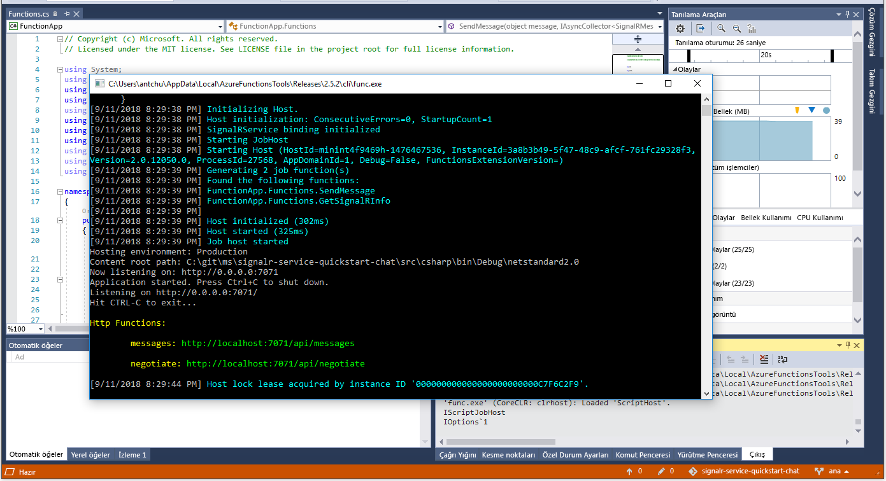

# <a name="quickstart-create-a-chat-room-with-azure-functions-and-signalr-service-using-c"></a>Hızlı Başlangıç: SignalR C kullanarak Service ve Azure işlevleri ile sohbet odası oluşturamadı.\#

Azure SignalR hizmeti uygulamanıza kolayca gerçek zamanlı işlevsellik eklemenizi sağlar. Azure İşlevleri, herhangi bir altyapı yönetimine gerek kalmadan kodunuzu çalıştırmanıza olanak tanıyan sunucusuz bir platformdur. Bu hızlı başlangıçta, SignalR Hizmeti ve İşlevlerini sunucusuz ve gerçek zamanlı bir sohbet uygulaması oluşturmak için kullanmayı öğrenin.

## <a name="prerequisites"></a>Önkoşullar

Henüz Visual Studio 2017’yi yüklemediyseniz, **ücretsiz** [Visual Studio 2017 Community Edition](https://www.visualstudio.com/downloads/)’ı indirip kullanabilirsiniz. Visual Studio kurulumu sırasında **Azure dağıtımını** etkinleştirdiğinizden emin olun.

Bu öğreticide komut satırında (macOS, Windows veya Linux) çalışabilir kullanarak [Azure Functions Core Tools (v2)](https://github.com/Azure/azure-functions-core-tools#installing), [.NET Core SDK'sı](https://dotnet.microsoft.com/download)ve en sevdiğiniz Kod Düzenleyici.

[!INCLUDE [quickstarts-free-trial-note](../../includes/quickstarts-free-trial-note.md)]

## <a name="log-in-to-azure"></a>Azure'da oturum açma

Azure hesabınızla Azure portalında <https://portal.azure.com/> sayfasında oturum açın.

[!INCLUDE [Create instance](includes/signalr-quickstart-create-instance.md)]

[!INCLUDE [Clone application](includes/signalr-quickstart-clone-application.md)]

## <a name="configure-and-run-the-azure-function-app"></a>Azure İşlev Uygulamasını yapılandırıp çalıştırma

1. Visual Studio (veya başka bir kod Düzenleyicisi'ni) başlatın ve bir çözüm açın *src/sohbet/csharp* kopyalanan deponun klasör.

1. Azure portalın açık olduğu tarayıcıda portalın üst kısmındaki arama kutusundan adını arayarak önceden dağıttığınız SignalR Hizmeti örneğinin başarılı bir şekilde oluşturulduğundan emin olun. Açmak için örneği seçin.

    

1. SignalR Hizmeti örneğinin bağlantı dizelerini görüntülemek için **Anahtarlar**’ı seçin.

1. Birincil bağlantı dizesini seçerek kopyalayın.

1. Visual Studio’ya dönerek Çözüm Gezgininde *local.settings.sample.json* dosyasının adını *local.settings.json* olarak değiştirin.

1. **local.settings.json** dosyasının içinde, bağlantı dizesini **AzureSignalRConnectionString** ayarının değerine yapıştırın. Dosyayı kaydedin.

1. **Functions.cs**’yi açın. Bu işlev uygulamasında iki adet HTTP ile tetiklenen işlev vardır:

    - **GetSignalRInfo** - Geçerli bağlantı bilgileri döndürmek için *SignalRConnectionInfo* giriş bağlamasını kullanır.
    - **SendMessage** - İstek gövdesinde bir sohbet iletisi alır ve iletiyi bağlı olan tüm istemci uygulamalara yaymak için *SignalR* çıkış bağlamasını kullanır.

1. Azure işlev uygulaması yerel olarak başlatmak için aşağıdaki seçeneklerden birini kullanın.

    - **Visual Studio**: Uygulamayı çalıştırmak için *Hata Ayıklama* menüsünde *Hata Ayıklamayı Başlat*’ı seçin.

        

    - **Komut satırı**: İşlev konak başlatmak için aşağıdaki komutu yürütün.

        ```bash
        func start
        ```

[!INCLUDE [Run web application](includes/signalr-quickstart-run-web-application.md)]

[!INCLUDE [Cleanup](includes/signalr-quickstart-cleanup.md)]

## <a name="next-steps"></a>Sonraki adımlar

Bu hızlı başlangıçta, oluşturulan ve gerçek zamanlı bir sunucusuz uygulama Visual Studio'da çalıştı. Bir sonraki adımda Visual Studio ile nasıl Azure İşlevlerini geliştirip dağıtacağınızı öğrenin.

> [!div class="nextstepaction"]
> [Visual Studio ile Azure İşlevleri geliştirme](../azure-functions/functions-develop-vs.md)