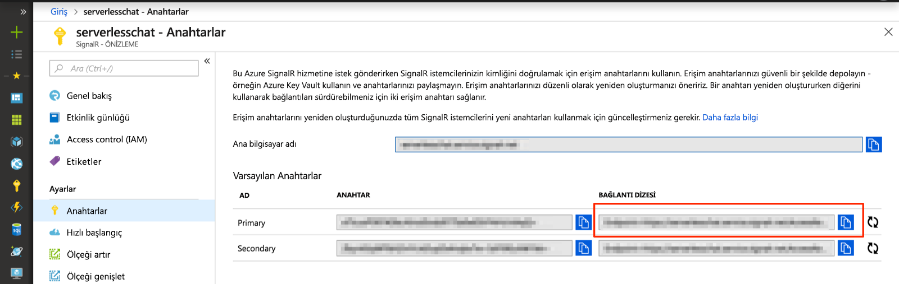

# <a name="quickstart-create-a-chat-room-with-azure-functions-and-signalr-service-using-java"></a>Hızlı Başlangıç: SignalR Java kullanarak Service ve Azure işlevleri ile sohbet odası oluşturamadı.

Azure SignalR hizmeti uygulamanıza kolayca gerçek zamanlı işlevsellik eklemenizi sağlar. Azure İşlevleri, herhangi bir altyapı yönetimine gerek kalmadan kodunuzu çalıştırmanıza olanak tanıyan sunucusuz bir platformdur. Bu hızlı başlangıçta, SignalR Hizmeti ve İşlevlerini sunucusuz ve gerçek zamanlı bir sohbet uygulaması oluşturmak için kullanmayı öğrenin.

## <a name="prerequisites"></a>Önkoşullar

Bu hızlı başlangıç; macOS, Windows veya Linux üzerinde çalıştırılabilir.

[Visual Studio Code](https://code.visualstudio.com/) gibi bir kod editörünün yüklü olduğundan emin olun.

Azure İşlevleri uygulamalarını yerel olarak çalıştırmak için [Azure İşlevleri Çekirdek Araçları (v2)](https://github.com/Azure/azure-functions-core-tools#installing) öğesini yükleyin.

> [!NOTE]
> SignalR hizmet bağlamaları Java'da yapma emin 2.4.419 sürümü kullandığınız ya da üst sürümünü Azure işlevleri çekirdek Araçları'nı (ana sürüm 2.0.12332) kullanılacak.

Azure İşlevleri Çekirdek Araçları, uzantı yüklemek için [.NET Core SDK'sının](https://www.microsoft.com/net/download) yüklü olmasını gerektirir. Ancak JavaScript Azure İşlev uygulamaları oluşturmak için .NET bilgisi gerekmemektedir.

Java ile işlev uygulamaları geliştirebilmeniz için şunlar yüklü olmalıdır:

* [Java Developer Kit](https://www.azul.com/downloads/zulu/), sürüm 8.
* [Apache Maven](https://maven.apache.org), sürüm 3.0 veya üzeri.

[!INCLUDE [quickstarts-free-trial-note](../../includes/quickstarts-free-trial-note.md)]

## <a name="log-in-to-azure"></a>Azure'da oturum açma

Azure hesabınızla Azure portalında <https://portal.azure.com/> sayfasında oturum açın.

[!INCLUDE [Create instance](includes/signalr-quickstart-create-instance.md)]

[!INCLUDE [Clone application](includes/signalr-quickstart-clone-application.md)]

## <a name="configure-and-run-the-azure-function-app"></a>Azure İşlev Uygulamasını yapılandırıp çalıştırma

1. Azure portalın açık olduğu tarayıcıda portalın üst kısmındaki arama kutusundan adını arayarak önceden dağıttığınız SignalR Hizmeti örneğinin başarılı bir şekilde oluşturulduğundan emin olun. Açmak için örneği seçin.

    

1. SignalR Hizmeti örneğinin bağlantı dizelerini görüntülemek için **Anahtarlar**’ı seçin.

1. Birincil bağlantı dizesini seçerek kopyalayın.

    

1. Kod düzenleyicisinde açın *src/sohbet/java* kopyalanmış bir depoda klasör.

1. *local.settings.sample.json* dosyasını *local.settings.json* olarak yeniden adlandırın.

1. **local.settings.json** dosyasının içinde, bağlantı dizesini **AzureSignalRConnectionString** ayarının değerine yapıştırın. Dosyayı kaydedin.

1. İşlevler içeren ana dosyasını bulunduğunuz *src/chat/java/src/main/java/com/function/Functions.java*:

    - **negotiate** - Geçerli bağlantı bilgileri döndürmek için *SignalRConnectionInfo* giriş bağlamasını kullanır.
    - **SendMessage** - istek gövdesinde bir Sohbet iletisi alır ve kullandığı *SignalR* bağlı istemci uygulamaları tüm ileti yayınlamak için çıktı bağlama.

1. Terminalde, içinde olduğundan emin olun *src/sohbet/java* klasör. İşlev uygulaması oluşturun.

    ```bash
    mvn clean package
    ```

1. İşlev uygulamasını yerel olarak çalıştırın.

    ```bash
    mvn azure-functions:run
    ```

[!INCLUDE [Run web application](includes/signalr-quickstart-run-web-application.md)]

[!INCLUDE [Cleanup](includes/signalr-quickstart-cleanup.md)]

## <a name="next-steps"></a>Sonraki adımlar

Bu hızlı başlangıçta, oluşturulan ve Maven kullanarak gerçek zamanlı ve sunucusuz bir uygulamayı çalıştırdınız. Ardından, Azure işlevleri Java sıfırdan oluşturma hakkında bilgi edinin.

> [!div class="nextstepaction"]
> [Java ve Maven ile ilk işlevinizi oluşturma](../azure-functions/functions-create-first-java-maven.md)