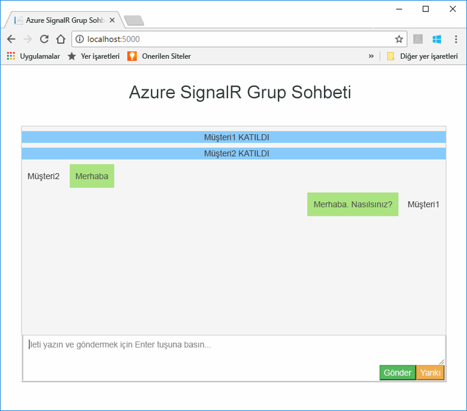

# <a name="quickstart-create-a-chat-room-by-using-signalr-service"></a>Hızlı Başlangıç: SignalR hizmetini kullanarak sohbet odası oluşturamadı.


Azure SignalR Hizmeti, geliştiricilerin gerçek zamanlı özelliklerle web uygulamalarını kolayca derlemesine yardımcı olan bir Azure hizmetidir. Bu hizmet [ASP.NET Core 2.0 için SignalR](https://docs.microsoft.com/aspnet/core/signalr/introduction)’yi temel alır.

Bu makalede Azure SignalR Hizmeti ile çalışmaya başlama işlemi gösterilmektedir. Bu hızlı başlangıçta, bir ASP.NET Core MVC web uygulaması kullanarak sohbet uygulaması oluşturacaksınız. Bu uygulama, gerçek zamanlı içerik güncelleştirmelerini etkinleştirmek üzere Azure SignalR Hizmeti kaynağınızla bağlantı kuracaktır. Web uygulamasını yerel olarak barındırmak ve birden çok tarayıcı istemcileriyle bağlanmak. Her istemci, diğer tüm istemcilere içerik güncelleştirmeleri gönderebilecektir. 

Bu hızlı başlangıçtaki adımları tamamlamak için herhangi bir kod düzenleyicisini kullanabilirsiniz. Bir seçenek [Visual Studio Code](https://code.visualstudio.com/), Windows, macOS ve Linux platformlarını kullanılabilir olduğu.

Bu öğreticinin kodu [AzureSignalR-samples GitHub deposundan](https://github.com/aspnet/AzureSignalR-samples/tree/master/samples/ChatRoom) indirilebilir. Ayrıca takip ederek, bu hızlı başlangıçta kullanılan Azure kaynaklarını oluşturabilirsiniz [SignalR hizmeti betik oluşturma](scripts/signalr-cli-create-service.md).

[!INCLUDE [quickstarts-free-trial-note](../../includes/quickstarts-free-trial-note.md)]


## <a name="prerequisites"></a>Önkoşullar

* Yükleme [.NET Core SDK'sı](https://www.microsoft.com/net/download/windows).
* İndirin veya kopyalayın [AzureSignalR örnek](https://github.com/aspnet/AzureSignalR-samples) GitHub deposu. 

## <a name="create-an-azure-signalr-resource"></a>Azure SignalR kaynağı oluşturma

[!INCLUDE [azure-signalr-create](../../includes/signalr-create.md)]

## <a name="create-an-aspnet-core-web-app"></a>ASP.NET Core web uygulaması oluşturma

Bu bölümde, kullandığınız [.NET Core komut satırı arabirimi (CLI)](https://docs.microsoft.com/dotnet/core/tools/) bir ASP.NET Core MVC web uygulaması projesi oluşturmak için. Visual Studio üzerinde .NET Core CLI kullanmanın avantajı, Windows, macOS ve Linux platformlar arasında kullanılabilir olmasıdır. 

1. Projeniz için bir klasör oluşturun. Bu hızlı başlangıçta kullanılmaktadır *E:\Testing\chattest* klasör.

2. Yeni klasör içinde projeyi oluşturmak için aşağıdaki komutu çalıştırın:

        dotnet new mvc


## <a name="add-secret-manager-to-the-project"></a>Projeye Gizli Dizi Yöneticisi ekleme

Bu bölümde, ekleyeceksiniz [gizli dizi Yöneticisi aracını](https://docs.microsoft.com/aspnet/core/security/app-secrets) projenize. Gizli dizi Yöneticisi aracını, proje ağacı dışında geliştirme çalışması için hassas verileri depolar. Bu yaklaşım, özel olarak kaynak kodunda yanlışlıkla uygulama sırrı paylaşılmasını önlemeye yardımcı olur.

1. *.csproj* dosyanızı açın. *Microsoft.Extensions.SecretManager.Tools* öğesini dahil etmek için bir `DotNetCliToolReference` öğesi ekleyin. Ayrıca bir `UserSecretsId` için aşağıdaki kodda gösterildiği gibi öğesi *chattest.csproj*ve dosyayı kaydedin.

    ```xml
    <Project Sdk="Microsoft.NET.Sdk.Web">
    <PropertyGroup>
        <TargetFramework>netcoreapp2.0</TargetFramework>
        <UserSecretsId>SignalRChatRoomEx</UserSecretsId>
    </PropertyGroup>
    <ItemGroup>
        <PackageReference Include="Microsoft.AspNetCore.All" Version="2.0.0" />
    </ItemGroup>
    <ItemGroup>
        <DotNetCliToolReference Include="Microsoft.VisualStudio.Web.CodeGeneration.Tools" Version="2.0.0" />
        <DotNetCliToolReference Include="Microsoft.Extensions.SecretManager.Tools" Version="2.0.0" />
    </ItemGroup>
    </Project>    
    ```

## <a name="add-azure-signalr-to-the-web-app"></a>Web uygulamasına Azure SignalR ekleme

1. Bir başvuru ekleyin `Microsoft.Azure.SignalR` aşağıdaki komutu çalıştırarak NuGet paketi:

        dotnet add package Microsoft.Azure.SignalR

2. Projeniz için paketler geri yüklemek için aşağıdaki komutu çalıştırın:

        dotnet restore

3. Gizli Dizi Yöneticisi’ne *Azure:SignalR:ConnectionString* adlı bir gizli dizi ekleyin. 

    Bu gizli dizi, SignalR Hizmetinizin kaynağına erişmeye yarayan bağlantı dizesini içerir. *Azure: SignalR:ConnectionString* SignalR arayan bir bağlantı kurmak için varsayılan yapılandırma anahtardır. Aşağıdaki komutta değeri, SignalR hizmet kaynağınızın bağlantı dizesiyle değiştirin.

    Aynı dizinde bu komutu çalıştırmanız gerekir *.csproj* dosya.

    ```
    dotnet user-secrets set Azure:SignalR:ConnectionString "<Your connection string>"    
    ```

    Gizli dizi Yöneticisi'ni yerel olarak barındırılan sırasında yalnızca web uygulamasını test etmek için kullanılır. Bir sonraki öğreticide, Azure için Sohbet web uygulamasına dağıtacaksınız. Web uygulamasını Azure'a dağıtıldıktan sonra bağlantı dizesi ile gizli dizi Yöneticisi depolamak yerine bir uygulama ayarı kullanacaksınız.

    Bu gizli dizi yapılandırma API'si ile erişilir. İki nokta üst üste (:) Yapılandırma adı tüm desteklenen platformlarda yapılandırma API'si ile çalışır. Bkz: [ortama göre yapılandırma](https://docs.microsoft.com/aspnet/core/fundamentals/configuration/index?tabs=basicconfiguration&view=aspnetcore-2.0). 


4. *Startup.cs* dosyasını açın ve `services.AddSignalR().AddAzureSignalR()` yöntemini çağırarak `ConfigureServices` yöntemini Azure SignalR Hizmeti’ni kullanacak şekilde güncelleştirin:

    ```csharp
    public void ConfigureServices(IServiceCollection services)
    {
        services.AddMvc();
        services.AddSignalR().AddAzureSignalR();
    }
    ```

    Bir parametre geçmiyor tarafından `AddAzureSignalR()`, bu kod, SignalR hizmet kaynak bağlantı dizesi için varsayılan yapılandırma anahtarı kullanır. Varsayılan yapılandırma anahtarı *Azure: SignalR:ConnectionString*.

5. *Startup.cs* dosyasında da `app.UseStaticFiles()` çağrısını aşağıdaki kod ile değiştirerek `Configure` yöntemini güncelleştirin ve dosyayı kaydedin.

    ```csharp
    app.UseFileServer();
    app.UseAzureSignalR(routes =>
    {
        routes.MapHub<Chat>("/chat");
    });
    ```            

### <a name="add-a-hub-class"></a>Hub sınıfı ekleme

SignalR öğesinde bir hub istemciden çağrılan yöntemler kümesi gösterir bir çekirdek bileşenidir. Bu bölümde, iki yöntemle bir hub sınıf tanımlayacaksınız: 

* `Broadcast`: Bu yöntem, tüm istemciler için bir ileti yayımlar.
* `Echo`: Bu yöntem çağırana geri bir ileti gönderir.

Her iki yöntem kullanmak `Clients` sağlayan ASP.NET Core SignalR SDK'sı arabirimi. Bu arabirim, istemcilerinize içerik gönderebilmek için şekilde bağlanan tüm istemciler için erişmenizi sağlar.

1. Proje dizininizde *Hub* adlı yeni bir klasör ekleyin. Yeni klasöre *Chat.cs* adlı yeni bir hub kod dosyası ekleyin.

2. Aşağıdaki kodu ekleyin *Chat.cs* hub sınıfınıza tanımlama ve dosyayı kaydedin. 

    *Chattest* dışında bir proje adı kullandıysanız bu sınıfın ad alanını güncelleştirin.

    ```csharp
    using Microsoft.AspNetCore.SignalR;

    namespace chattest
    {

        public class Chat : Hub
        {
            public void BroadcastMessage(string name, string message)
            {
                Clients.All.SendAsync("broadcastMessage", name, message);
            }

            public void Echo(string name, string message)
            {
                Clients.Client(Context.ConnectionId).SendAsync("echo", name, message + " (echo from server)");
            }
        }
    }
    ```

### <a name="add-the-client-interface-for-the-web-app"></a>Web uygulaması için istemci arabirimini ekleyin

Bu sohbet odası uygulama için istemci kullanıcı arabirimi, HTML ve JavaScript adındaki bir dosyaya oluşacaktır *index.html* içinde *wwwroot* dizin.

Kopyalama *index.html* dosyası *css* klasöründe ve *betikleri* klasöründen *wwwroot* klasörü [örnekleri Depo](https://github.com/aspnet/AzureSignalR-samples/tree/master/samples/ChatRoom/wwwroot). Bunları projenizin yapıştırın *wwwroot* klasör.

Ana kodunu işte *index.html*: 

```javascript
var connection = new signalR.HubConnectionBuilder()
                            .withUrl('/chat')
                            .build();
bindConnectionMessage(connection);
connection.start()
    .then(function () {
        onConnected(connection);
    })
    .catch(function (error) {
        console.error(error.message);
    });
```    

Kodda *index.html* çağrıları `HubConnectionBuilder.build()` Azure SignalR kaynak için bir HTTP bağlantısı yapma.

Bağlantı başarılı olursa, o bağlantı `bindConnectionMessage` konumuna geçirilir ve istemciye gönderilen gelen içerik için olay işleyicileri ekler. 

`HubConnection.start()`, hub ile iletişim başlatır. Ardından, `onConnected()` düğmesi olay işleyicisi ekler. Bu işleyiciler, bağlantıyı kullanarak bu istemcinin tüm bağlı istemcilere içerik güncelleştirmeleri göndermesine olanak tanır.

## <a name="add-a-development-runtime-profile"></a>Geliştirme çalışma zamanı profili ekleme

Bu bölümde, ASP.NET Core için geliştirme çalışma zamanı ortamı ekleyeceksiniz. Daha fazla bilgi için [ASP.NET Core birden çok ortamda çalışın](https://docs.microsoft.com/aspnet/core/fundamentals/environments).

1. Adlı bir klasör oluşturun *özellikleri* projenizdeki.

2. Adlı yeni bir dosya ekleyin *launchSettings.json* klasörüne aşağıdaki içeriğe sahip ve dosyayı kaydedin.

    ```json
    {
        "profiles" : 
        {
            "ChatRoom": 
            {
                "commandName": "Project",
                "launchBrowser": true,
                "environmentVariables": 
                {
                    "ASPNETCORE_ENVIRONMENT": "Development"
                },
                "applicationUrl": "http://localhost:5000/"
            }
        }
    }
    ```


## <a name="build-and-run-the-app-locally"></a>Derleme ve uygulamayı yerel olarak çalıştırma

1. .NET Core CLI'yı kullanarak uygulamayı oluşturmak için komut kabuğu'nda aşağıdaki komutu çalıştırın:

        dotnet build

2. Yapılandırma başarıyla tamamlandıktan sonra web uygulamasını yerel olarak çalıştırmak için aşağıdaki komutu çalıştırın:

        dotnet run

    Uygulama bizim geliştirme çalışma zamanı profilinde yapılandırılan 5000 numaralı yerel olarak barındırılacak:

        E:\Testing\chattest>dotnet run
        Hosting environment: Development
        Content root path: E:\Testing\chattest
        Now listening on: http://localhost:5000
        Application started. Press Ctrl+C to shut down.    

3. İki tarayıcı penceresi açın. Her tarayıcıda Git `http://localhost:5000`. Adınızı girmeniz istenir. İstemcileri hem de test kullanarak her iki istemci arasında ileti içeriği gönderme için istemci adını **Gönder** düğmesi.

    


## <a name="clean-up-resources"></a>Kaynakları temizleme

Sonraki öğreticiye devam edeceğiz, bu hızlı başlangıçta oluşturulan kaynakları tutmak ve bunları yeniden kullanın.

Hızlı Başlangıç örnek uygulaması ile tamamlanan, ücretlerden kaçınmak için bu hızlı başlangıçta oluşturulan Azure kaynaklarını silebilirsiniz. 

> [!IMPORTANT]
> Bir kaynak grubu silme işlemi geri alınamaz ve gruptaki tüm kaynakları içerir. Yanlış kaynak grubunu veya kaynakları yanlışlıkla silmediğinizden emin olun. Bu örnek, korumak istediğiniz kaynakları içeren mevcut bir kaynak grubunda barındırmak için kaynaklar oluşturduysanız, her kaynak ayrı ayrı kaynak grubunun silinmesi yerine kendi dikey penceresinden silebilirsiniz.
> 
> 

[Azure portalda](https://portal.azure.com) oturum açın ve **Kaynak grupları**’nı seçin.

İçinde **ada göre filtrele** metin kutusuna, kaynak grubunuzun adını yazın. Bu hızlı başlangıçtaki yönergelerde *SignalRTestResources* adlı bir kaynak grubu kullanılmıştır. Sonuç listesinde, kaynak grubu üzerinde üç noktayı seçin (**...** ) > **Kaynak grubunu Sil**.

   


Kaynak grubunun silinmesini onaylamanız istenir. Onayla ve kaynak grubunuzun adını girin **Sil**.
   
Birkaç dakika sonra kaynak grubu ve bu gruptaki kaynakların tümü silinir.


## <a name="next-steps"></a>Sonraki adımlar

Bu hızlı başlangıçta, yeni bir Azure SignalR hizmeti kaynağı oluşturdunuz. Ardından ASP.NET Core web uygulaması ile içerik güncelleştirmeleri gerçek zamanlı olarak birden fazla bağlı istemcilere göndermek için kullanılır. Azure SignalR hizmeti kullanma hakkında daha fazla bilgi edinmek için kimlik doğrulaması gösteren öğreticiye devam edin.

> [!div class="nextstepaction"]
> [Azure SignalR Hizmeti kimlik doğrulaması](./signalr-concept-authenticate-oauth.md)


