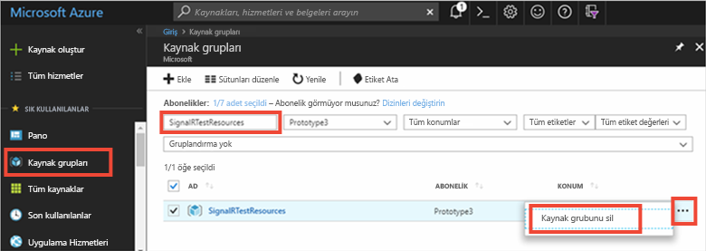

# <a name="quickstart-create-a-chat-room-with-aspnet-and-signalr-service"></a>Hızlı Başlangıç: ASP.NET SignalR hizmeti ile sohbet odası oluşturamadı.

Azure SignalR hizmeti temel [ASP.NET Core 2.0 için SignalR](https://docs.microsoft.com/aspnet/core/signalr/introduction), olduğu **değil** %100 ASP.NET SignalR ile uyumlu. Azure SignalR hizmeti hakkında en yeni ASP.NET Core technoledges tabanlı ASP.NET SignalR Veri Protokolü'nü yeniden uygulanır. Azure SignalR hizmeti için ASP.NET SignalR kullanırken bazı ASP.NET SignalR özellikleri artık desteklenir, istemci bağlandığında, Azure SignalR iletileri yeniden değil. Ayrıca, her zaman çerçevesini aktarım ve JSONP destek değildir. Bazı kod değişiklikleri ve bağımlı kitaplıkları uygun sürümünün ASP.NET SignalR uygulama SignalR hizmet ile çalışması için gereklidir. 

Başvurmak [sürümü farkları doc](https://docs.microsoft.com/aspnet/core/signalr/version-differences?view=aspnetcore-2.2) ASP.NET SignalR ve ASP.NET Core SignalR arasında özellik karşılaştırması tam listesi için.

Bu hızlı başlangıçta, ASP.NET ve Azure SignalR hizmeti ile benzer bir kullanmaya nasıl başlayacağınızı öğreneceksiniz [sohbet odası uygulama](./signalr-quickstart-dotnet-core.md).


[!INCLUDE [quickstarts-free-trial-note](../../includes/quickstarts-free-trial-note.md)]
## <a name="prerequisites"></a>Önkoşullar

* [Visual Studio 2019](https://visualstudio.microsoft.com/downloads/)
* [.NET 4.6.1](https://www.microsoft.com/net/download/windows)
* [ASP.NET SignalR 2.4.1](https://www.nuget.org/packages/Microsoft.AspNet.SignalR/)

## <a name="sign-in-to-azure"></a>Azure'da oturum açma

Azure hesabınızla [Azure portalında](https://portal.azure.com/) oturum açın.

[!INCLUDE [Create instance](includes/signalr-quickstart-create-instance.md)]

*Sunucusuz* modu ASP.NET SignalR uygulamalar için desteklenmez. Her zaman *varsayılan* veya *Klasik* Azure SignalR hizmeti örneği.

Bu hızlı başlangıçta ile kullanılan Azure kaynakları da oluşturabilirsiniz [SignalR hizmeti betik oluşturma](scripts/signalr-cli-create-service.md).

## <a name="clone-the-sample-application"></a>Örnek uygulamayı kopyalama

Hizmet dağıtılırken kod ile çalışmaya geçiş yapalım. [GitHub'dan örnek uygulamayı](https://github.com/aspnet/AzureSignalR-samples/tree/master/aspnet-samples/ChatRoom) kopyalayın, SignalR Hizmetinin bağlantı dizesini ayarlayın ve uygulamayı yerel olarak çalıştırın.

1. Bir git terminal penceresi açın. Örnek projeyi kopyalamak istediğiniz klasöre gidin.

1. Örnek depoyu kopyalamak için aşağıdaki komutu çalıştırın. Bu komut bilgisayarınızda örnek uygulamanın bir kopyasını oluşturur.

    ```bash
    git clone https://github.com/aspnet/AzureSignalR-samples.git
    ```

## <a name="configure-and-run-chat-room-web-app"></a>Yapılandırma ve sohbet odası web uygulamasını çalıştırma

1. Visual Studio'yu başlatın ve bir çözüm açın *aspnet-samples/odası/* kopyalanan deponun klasör.

1. Azure portalında nerede açıldığında, tarayıcıda bulun ve oluşturduğunuz örneğini seçin.

1. SignalR Hizmeti örneğinin bağlantı dizelerini görüntülemek için **Anahtarlar**’ı seçin.

1. Birincil bağlantı dizesini seçerek kopyalayın.

1. Şimdi web.config dosyasında bağlantı dizesini ayarlayalım.

    ```xml
    <configuration>
    <connectionStrings>
        <add name="Azure:SignalR:ConnectionString" connectionString="<Replace By Your Connection String>"/>
    </connectionStrings>
    ...
    </configuration>
    ```

1. İçinde *Startup.cs*, çağırmak yerine `MapSignalR()`, çağırmanız gerekir `MapAzureSignalR({your_applicationName})` ve uygulama yerine tek başına SignalR barındırma hizmetine bağlanmak için bağlantı dizesini geçirin. Değiştirin `{YourApplicationName}` uygulamanızın adı. Bu ad, bu uygulama, diğer uygulamalardan ayırt etmek için benzersiz bir addır. Kullanabileceğiniz `this.GetType().FullName` değeri.

    ```cs
    public void Configuration(IAppBuilder app)
    {
        // Any connection or hub wire up and configuration should go here
        app.MapAzureSignalR(this.GetType().FullName);
    }
    ```

    Ayrıca, SDK hizmeti, bu API'leri kullanmadan önce başvurmanız gerekir. Açık **araçları | NuGet Paket Yöneticisi | Paket Yöneticisi Konsolu** ve komutu çalıştırın:

    ```powershell
    Install-Package Microsoft.Azure.SignalR.AspNet
    ```

    Bu değişiklikler dışındaki her şey aynı kalır, zaten iş mantığı yazmak için alışık olduğunuz hub arabirimi kullanmaya devam edebilirsiniz.

    > [!NOTE]
    > Uygulamasında bir uç nokta `/signalr/negotiate` anlaşması Azure SignalR hizmeti SDK'sı tarafından sunulur. İstemcileri bağlanmak ve istemcilerin bağlantı dizesinde tanımlanmış hizmet uç noktasına yönlendirmek çalıştığında bir özel anlaşma yanıtı döndürür.

1. Tuşuna **F5** projeyi hata ayıklama modunda çalıştırın. Uygulama çalışırken yerel olarak görebilirsiniz. Uygulama tarafından bir SignalR çalışma zamanı barındırma yerine bunu şimdi Azure SignalR hizmeti için bağlar.

[!INCLUDE [Cleanup](includes/signalr-quickstart-cleanup.md)]


> [!IMPORTANT]
> Bir kaynak grubunu silme işlemi geri alınamaz ve kaynak grubunun ve içindeki tüm kaynaklar kalıcı olarak silinir. Yanlış kaynak grubunu veya kaynakları yanlışlıkla silmediğinizden emin olun. Bu örneği, tutmak istediğiniz kaynakları içeren mevcut bir kaynak grubunda barındırmak için kaynaklar oluşturduysanız, kaynak grubunu silmek yerine her kaynağı kendi ilgili dikey penceresinden tek tek silebilirsiniz.
> 
> 

[Azure portalında](https://portal.azure.com) oturum açın ve **Kaynak grupları**’na tıklayın.

**Ada göre filtrele...** metin kutusuna kaynak grubunuzun adını girin. Bu hızlı başlangıçtaki yönergelerde *SignalRTestResources* adlı bir kaynak grubu kullanılmıştır. Sonuç listesindeki kaynak grubunuzda **...** ve sonra **Kaynak grubunu sil**’e tıklayın.

   


Birkaç dakika sonra kaynak grubu ve içerdiği kaynakların tümü silinir.

## <a name="next-steps"></a>Sonraki adımlar

Bu hızlı başlangıçta, yeni bir Azure SignalR hizmeti kaynak oluşturduğunuz ve bir ASP.NET web uygulaması kullanılır. Ardından, Azure SignalR hizmeti ile ASP.NET Core kullanarak gerçek zamanlı uygulamalar geliştirmeyi öğrenin.

> [!div class="nextstepaction"]
> [ASP.NET Core ile Azure SignalR hizmeti](./signalr-quickstart-dotnet-core.md)
