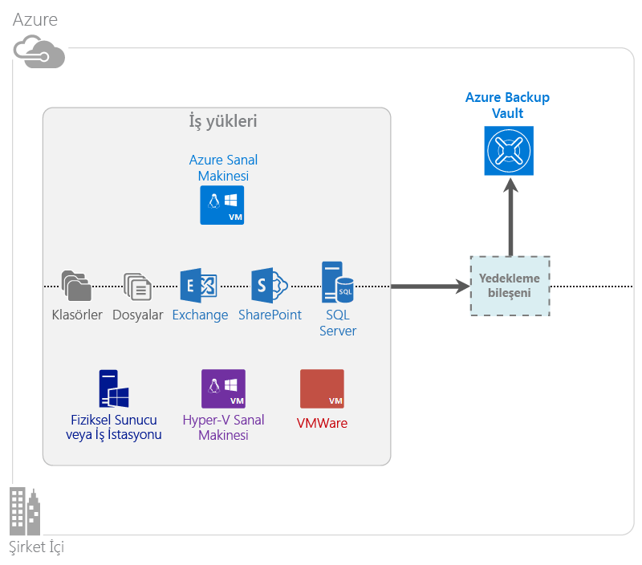

# Azure Backup nedir?
Azure Backup, verilerinizi Microsoft bulutunda yedeklemek ve geri yüklemek için kullandığınız hizmettir. Var olan şirket içi veya şirket dışı yedekleme çözümünüzün yerine, güvenilir, güvenli ve maliyet açısından rekabetçi bir bulut tabanlı çözüm sunar. Ayrıca, bulutta çalıştırılan varlıkları korumaya yardımcı olur. Azure Backup ölçeklenebilir, dayanıklı ve yüksek oranda kullanılabilir olan birinci sınıf bir altyapı üzerine kurulmuş kurtarma hizmetleri sağlar.

[Azure Backup'a yönelik video genel bakışını izleyin](https://azure.microsoft.com/documentation/videos/what-is-azure-backup/)

## Azure Backup'ı neden kullanmalısınız?
Geleneksel yedekleme çözümleri, bulutu disk veya bantlara benzer bir uç nokta olarak işleyecek şekilde gelişim göstermiştir. Bu yaklaşım basit olmakla birlikte, aynı zamanda sınırlıdır. Bu yaklaşım, alttaki bulut platformundan tam anlamıyla faydalanmaz ve verimsiz, pahalı bir çözüme dönüşür.
Buna karşılık, Azure Backup güçlü ve uygun maliyetli bir bulut yedekleme çözümünün sağladığı tüm avantajları sunar. Azure Backup'ın sağladığı en önemli avantajlardan bazıları aşağıda verilmiştir.

| Özellik | Avantaj |
| --- | --- |
| Otomatik depolama yönetimi |Şirket içi depolama cihazlar için büyük sermaye harcamalarına gerek duyulmaz. Azure Backup, yedekleme alanını otomatik olarak ayırıp yönetir ve "kullandıkça öde" tüketim modelini kullanır. |
| Sınırsız ölçekleme |Bakım ve izleme işlemlerinin ek yükü olmadan, yüksek kullanılabilirlik garantilerinden faydalanın. Azure Backup, izinsiz olmayan otomatik ölçeklendirme özelliklerine sahip Azure bulutunun temelindeki güçten ve ölçeğinden faydalanır. |
| Birden çok depolama seçeneği |İhtiyaca göre yedekleme alanınızı seçin:<li>Yerel olarak yedekli depolama blok blobu, fiyat açısından temkinli davranan müşteriler için ideal niteliktedir ve yine de verilerin yerel donanım arızalarına karşı korunmasına yardımcı olur. <li>Coğrafi çoğaltma depolama blok blobu, eşleştirilmiş bir veri merkezinde üç ek kopya sağlar. Bu ek kopyalar, Azure sitesi düzeyinde bir olağanüstü durum oluştuğunda dahi yedekleme verilerinizin yüksek oranda kullanılabilir olmasının sağlanmasına yardımcı olur. |
| Sınırsız veri aktarımı |Backup kasasından gerçekleştirilen bir geri yükleme işlemi sırasında herhangi bir çıkış (giden) veri aktarımı için ücret tahsil edilmez. Azure'a gelen veriler de ücretsizdir. Kullanılabilir olduğunda, içeri aktarma hizmeti ile çalışır. |
| Veri şifrelemesi |Veri şifrelemesi, genel bulutta müşteri verilerinin güvenli şekilde iletilmesini ve depolanmasını olanaklı kılar. Şifreleme parolası kaynakta depolanır ve hiçbir zaman Azure'a iletilmez veya burada depolanmaz. Şifreleme anahtarı, verilerin herhangi bir kısmının geri yüklenmesi için gereklidir ve yalnızca müşteri, hizmetteki verilere tam erişim sahibidir. |
| Uygulamayla tutarlı yedekleme |Windows üzerindeki uygulamayla tutarlı yedeklemeler, geri yükleme sırasında düzeltme gereksiniminin ortadan kaldırılmasına yardımcı olur; bu da kurtarma süresi hedefini kısaltır. Bu, müşterilerin çalışır duruma daha hızlı bir şekilde dönmesine olanak tanır. |
| Uzun vadeli bekletme |Müşteriler, şirket dışı bant yedekleme çözümlerine harcama yapmak yerine, bant benzeri cazip bir çözümü uygun maliyetle sunan Azure'a yedekleme yapabilir. |

## Azure Backup bileşenleri
Backup bir karma yedekleme çözümü olduğundan, uçtan uca yedeklemeyi ve geri yükleme iş akışlarını olanaklı kılmak üzere birlikte çalışan birden çok bileşenden oluşur.

### Dağıtım senaryoları
| Bileşen | Azure'da dağıtılabilir mi? | Şirket içinde dağıtılabilir mi? | Hedef depolama desteklenir |
| --- | --- | --- | --- |
| Azure Backup aracısı |
**Evet**
 
Azure Backup aracısı, Azure'da çalışan herhangi bir Windows Server VM üzerinde dağıtılabilir.
 |
**Evet**
 
Azure Backup aracısı, herhangi bir Windows Server VM veya fiziksel makinesi üzerinde dağıtılabilir.
 |
Azure Backup kasası
 |
| System Center Data Protection Manager (DPM) |
**Evet**

[System Center DPM'yi kullanarak Azure'da iş yüklerini koruma](http://blogs.technet.com/b/dpm/archive/2014/09/02/azure-iaas-workload-protection-using-data-protection-manager.aspx) hakkında daha fazla bilgi edinin.
 |
**Evet**
 
[Veri merkezinizde iş yüklerini ve VM'leri koruma](https://technet.microsoft.com/library/hh758173.aspx) hakkında daha fazla bilgi edinin.
 |
Yerel olarak bağlı disk,
 
Azure Backup kasası,
 
bant (yalnızca şirket içi)
 |
| Azure Backup Sunucusu |
**Evet**

[Azure Backup'ı kullanarak Azure'da iş yüklerini koruma](backup-azure-microsoft-azure-backup.md) hakkında daha fazla bilgi edinin.
 |
**Evet**
 
[Azure Backup'ı kullanarak Azure'da iş yüklerini koruma](backup-azure-microsoft-azure-backup.md) hakkında daha fazla bilgi edinin.
 |
Yerel olarak bağlı disk,
 
Azure Backup kasası
 |
| Azure Backup (VM uzantısı) |
**Evet**

Azure yapısının parçası

[Hizmet olarak Azure altyapısı (IaaS) sanal makinelerinin yedeklemesine](backup-azure-vms-introduction.md) yöneliktir.
 |
**Hayır**
 
Veri merkezinizdeki sanal makineleri yedeklemek için System Center DPM'yi kullanın.
 |
Azure Backup kasası
 |

### Bileşen düzeyinde avantajlar ve sınırlamalar
| Bileşen | Avantajlar | Sınırlamalar | Kurtarma ayrıntı düzeyi |
| --- | --- | --- | --- |
| Azure Backup (MARS) aracısı |<li>Windows işletim sisteminin yüklü olduğu fiziksel veya sanal bir makinede (VM'ler şirket içinde veya Azure üzerinde herhangi bir konumda olabilir) dosya ve klasörleri yedekleyin.<li>Ayrı bir yedekleme sunucusu gerekli değildir<li>Azure Backup Kasası'nı kullanır |<li>Günde üç kez gerçekleştirilen yedekleme/dosya düzeyinde geri yükleme<li>Yalnızca dosya/klasör/birim düzeyinde geri yükleme (uygulama kullanılmaz)<li>Linux desteği yok |dosyalar/klasörler/birimler |
| System Center Data Protection Manager |<li>Uygulama kullanan anlık görüntüler (VSS)<li>Yedeklemelerin alınma zamanı için tam esneklik<li>Kurtarma ayrıntı düzeyi (tümü)<li>Azure Backup kasasını kullanabilir<li>Linux desteği (Hyper-V üzerinde barındırılıyorsa) |<li>Heterojen destek eksikliği (VMware VM yedekleme, Oracle iş yükü yedekleme). |dosyalar/klasörler/birimler /VM'ler/uygulamalar |
| Microsoft Azure Backup Sunucusu |<li>Uygulama kullanan anlık görüntüler (VSS)<li>Yedeklemelerin alınma zamanı için tam esneklik<li>Kurtarma ayrıntı düzeyi (tümü)<li>Azure Backup kasasını kullanabilir<li>Linux desteği (Hyper-V üzerinde barındırılıyorsa)<li>System Center lisansı gerektirmez |<li>Heterojen destek eksikliği (VMware VM yedekleme, Oracle iş yükü yedekleme).<li>Her zaman canlı Azure aboneliği gerektirir<li>Bant yedekleme desteği yoktur |dosyalar/klasörler/birimler /VM'ler/uygulamalar |
| Azure IaaS VM Backup |<li>Windows/Linux için yerel yedeklemeler<li>Belirli bir aracı yüklemesi gerekmez<li>Yedekleme altyapısı gerekmeden yapı düzeyinde yedekleme |<li>Günde bir kez yedekleme/disk düzeyinde geri yükleme<li>Şirket içi yedekleme gerçekleştirilemez |VM'ler Tüm diskler (PowerShell kullanarak) |

## Hangi uygulamalar ve iş yükleri yedeklenebilir?
| İş yükü | Kaynak makine | Azure Backup çözümü |
| --- | --- | --- |
| Dosyalar ve klasörler |Windows Server |
[Azure Backup aracısı](backup-configure-vault.md),
 
[System Center DPM](backup-azure-dpm-introduction.md) (+ Azure Backup aracısı),
 
[Azure Backup Sunucusu](backup-azure-microsoft-azure-backup.md) (Azure Backup aracısını içerir)
 |
| Dosyalar ve klasörler |Windows istemcisi |
[Azure Backup aracısı](backup-configure-vault.md),
 
[System Center DPM](backup-azure-dpm-introduction.md) (+ Azure Backup aracısı),
 
[Azure Backup Sunucusu](backup-azure-microsoft-azure-backup.md) (Azure Backup aracısını içerir)
 |
| Hyper-V sanal makine (Windows) |Windows Server |
[System Center DPM](backup-azure-backup-sql.md) (+ Azure Backup aracısı),
 
[Azure Backup Sunucusu](backup-azure-microsoft-azure-backup.md) (Azure Backup aracısını içerir)
 |
| Hyper-V sanal makine (Linux) |Windows Server |
[System Center DPM](backup-azure-backup-sql.md) (+ Azure Backup aracısı),
 
[Azure Backup Sunucusu](backup-azure-microsoft-azure-backup.md) (Azure Backup aracısını içerir)
 |
| Microsoft SQL Server |Windows Server |
[System Center DPM](backup-azure-backup-sql.md) (+ Azure Backup aracısı),
 
[Azure Backup Sunucusu](backup-azure-microsoft-azure-backup.md) (Azure Backup aracısını içerir)
 |
| Microsoft SharePoint |Windows Server |
[System Center DPM](backup-azure-backup-sql.md) (+ Azure Backup aracısı),
 
[Azure Backup Sunucusu](backup-azure-microsoft-azure-backup.md) (Azure Backup aracısını içerir)
 |
| Microsoft Exchange |Windows Server |
[System Center DPM](backup-azure-backup-sql.md) (+ Azure Backup aracısı),
 
[Azure Backup Sunucusu](backup-azure-microsoft-azure-backup.md) (Azure Backup aracısını içerir)
 |
| Azure IaaS VM'ler (Windows) |- |[Azure Backup (VM uzantısı)](backup-azure-vms-introduction.md) |
| Azure IaaS VM'ler (Linux) |- |[Azure Backup (VM uzantısı)](backup-azure-vms-introduction.md) |

## ARM ve Linux desteği
| Bileşen | ARM Desteği | Linux (Azure destekli) Desteği |
| --- | --- | --- |
| Azure Backup (MARS) aracısı |Evet |Hayır (Yalnızca Windows tabanlı aracı) |
| System Center Data Protection Manager |Evet (Konuktaki aracı) |Yalnızca Hyper-V (Azure VM değil) Yalnızca dosyayla tutarlı yedekleme mümkündür |
| Azure Backup Sunucusu (MABS) |Evet (Konuktaki aracı) |Yalnızca Hyper-V (Azure VM değil) Yalnızca dosyayla tutarlı yedekleme mümkündür (DPM ile aynı) |
| Azure IaaS VM Backup |Evet |Evet |

[!INCLUDE [learn-about-deployment-models](../../includes/learn-about-deployment-models-include.md)]

## Premium Storage VM'lerini Yedekleme ve Geri Yükleme
Azure Yedekleme hizmeti artık Premium Storage VM'leri koruma altına alır.

### Premium Storage VM'lerini yedekleme
Premium Storage VM'lerini yedeklerken, Backup hizmeti, Premium Storage hesabında geçici bir hazırlama konumu oluşturur. "AzureBackup-" adlı hazırlama konumu, VM'ye bağlı premium disklerin toplam veri boyutuna eşittir.

> [!NOTE]
> Hazırlama konumunu değiştirmeyin veya düzenlemeyin.
> 
> 

Yedekleme işi tamamlandıktan sonra, hazırlama konumu silinir. Hazırlama konumu için kullanılan depolama alanının fiyatı tüm [Premium depolama fiyatlandırması](../storage/storage-premium-storage.md#pricing-and-billing) ile tutarlıdır.

### Premium Storage VM'lerini geri yükleme
Premium Depolama sanal makinesi Premium Depolama veya normal depolama birimine geri yüklenebilir. Premium Storage VM'si kurtarma noktasının Premium Storage'a geri yüklenmesi genel bir geri yükleme işlemidir. Ancak Premium Storage VM'si kurtarma noktasının standart depolamaya geri yüklenmesi uygun maliyetli olabilir. Bu tür bir geri yükleme işlemi, VM'den bir dosya alt kümesine ihtiyaç duymanız halinde kullanılabilir.

## İşlev
Bu beş tablo, yedekleme işlevinin her bir bileşende nasıl ele alındığını özetler.

### Depolama
| Özellik | Azure Backup aracısı | System Center DPM | Azure Backup Sunucusu | Azure Backup (VM uzantısı) |
| --- | --- | --- | --- | --- |
| Azure Backup kasası |![Evet][green] |![Evet][green] |![Evet][green] |![Evet][green] |
| Disk depolama | |![Evet][green] |![Evet][green] | |
| Bant depolama | |![Evet][green] | | |
| Sıkıştırma (yedekleme kasasında) |![Evet][green] |![Evet][green] |![Evet][green] | |
| Artımlı yedekleme |![Evet][green] |![Evet][green] |![Evet][green] |![Evet][green] |
| Disk için yinelenenleri kaldırma | |![Kısmi][yellow] |![Kısmi][yellow] | |

Backup kasası, tüm bileşenler genelinde tercih edilen depolama hedefidir. System Center DPM ve Backup Sunucusu da yerel disk kopyası bulundurma seçeneğini sağlar. Ancak yalnızca System Center DPM, bir bant depolama cihazına veri yazma seçeneği sağlar.

#### Artımlı yedekleme
Her bileşen, hedef depolamadan (disk, bant, yedekleme kasası) bağımsız olarak artımlı yedeklemeyi destekler. Artımlı yedekleme, yalnızca son yedeklemeden sonra yapılan değişiklikleri aktararak yedeklemelerin depolama ve zaman açısından verimli olmasını sağlar.

#### Sıkıştırma
Yedeklemeler, gerekli depolama alanını azaltmak için sıkıştırılır. Sıkıştırma kullanmayan tek bileşen, VM uzantısıdır. VM uzantısı ile, tüm yedekleme verileri müşteri depolama hesabından aynı bölgedeki yedekleme kasasına sıkıştırma olmadan kopyalanır. Şıkıştırma olmaması, kullanılan depolama alanını bir miktar doldursa da verilerin sıkıştırılmadan depolanması daha hızlı geri yükleme işlemlerini mümkün kılar.

#### Yinelenenleri kaldırma
Yinelenenleri kaldırma, [bir Hyper-V sanal makinesinde dağıtıldığında](http://blogs.technet.com/b/dpm/archive/2015/01/06/deduplication-of-dpm-storage-reduce-dpm-storage-consumption.aspx), Backup Sunucusu ve System Center DPM için desteklenir. Yinelenenleri kaldırma, yedekleme alanı olarak sanal makineye bağlanmış olan sanal makine sabit diskleri (VHD'ler) üzerinde Windows Server yinelenenleri kaldırma özelliği kullanılarak ana bilgisayar düzeyinde gerçekleştirilir.

> [!WARNING]
> Yinelenenleri kaldırma, Azure'da Backup bileşenlerinden herhangi biri için kullanılamaz. System Center DPM ve Backup Sunucusu Azure'da dağıtıldığında, VM'ye bağlı depolama diskleri için yinelenenler kaldırılamaz.
> 
> 

### Güvenlik
| Özellik | Azure Backup aracısı | System Center DPM | Azure Backup Sunucusu | Azure Backup (VM uzantısı) |
| --- | --- | --- | --- | --- |
| Ağ güvenliği (Azure için) |![Evet][green] |![Evet][green] |![Evet][green] |![Kısmi][yellow] |
| Veri güvenliği (Azure'da) |![Evet][green] |![Evet][green] |![Evet][green] |![Kısmi][yellow] |

Sunucularınızdan Backup kasasına giden tüm yedekleme trafiği, Gelişmiş Şifreleme Standardı 256 kullanılarak şifrelenir. Veriler güvenli bir HTTPS bağlantısı üzerinden gönderilir. Ayrıca yedekleme verileri, şifreli biçimde Backup kasasında depolanır. Yalnızca müşteri bu verilerin kilidini açmak için kullanılan parolaya sahiptir. Microsoft herhangi bir noktada yedekleme verilerinin şifresini çözemez.

> [!WARNING]
> Yedekleme verilerini şifrelemek için kullanılan anahtar yalnızca müşteride bulunur. Microsoft, Azure üzerinde anahtarın bir kopyasını tutmaz ve anahtara erişim sahibi değildir. Anahtarın kaybedilmesi durumunda Microsoft yedekleme verilerini kurtaramaz.
> 
> 

Azure VM'lerin yedeklenmesi için şifrelemenin sanal makine *içinde* ayarlanması gerekir. Windows sanal makinelerde BitLocker'ı ve Linux sanal makinelerde **dm-crypt** özelliğini kullanın. Azure Backup, bu yol üzerinden gelen yedekleme verilerini otomatik olarak şifrelemez.

### Desteklenen iş yükleri
| Özellik | Azure Backup aracısı | System Center DPM | Azure Backup Sunucusu | Azure Backup (VM uzantısı) |
| --- | --- | --- | --- | --- |
| Windows Server makinesi - dosyalar ve klasörler |![Evet][green] |![Evet][green] |![Evet][green] | |
| Windows istemci makinesi - dosyalar ve klasörler |![Evet][green] |![Evet][green] |![Evet][green] | |
| Hyper-V sanal makine (Windows) | |![Evet][green] |![Evet][green] | |
| Hyper-V sanal makine (Linux) | |![Evet][green] |![Evet][green] | |
| Microsoft SQL Server | |![Evet][green] |![Evet][green] | |
| Microsoft SharePoint | |![Evet][green] |![Evet][green] | |
| Microsoft Exchange | |![Evet][green] |![Evet][green] | |
| Azure sanal makine (Windows) | | | |![Evet][green] |
| Azure sanal makine (Linux) | | | |![Evet][green] |

### Ağ
| Özellik | Azure Backup aracısı | System Center DPM | Azure Backup Sunucusu | Azure Backup (VM uzantısı) |
| --- | --- | --- | --- | --- |
| Ağ sıkıştırma (yedekleme sunucusuna) | |![Evet][green] |![Evet][green] | |
| Ağ sıkıştırma (yedekleme kasasına) |![Evet][green] |![Evet][green] |![Evet][green] | |
| Ağ protokolü (yedekleme sunucusuna) | |TCP |TCP | |
| Ağ protokolü (yedekleme kasasına) |HTTPS |HTTPS |HTTPS |HTTPS |

VM uzantısı verileri doğrudan depolama ağı aracılığıyla Azure depolama hesabından okuduğu için bu trafiğin iyileştirilmesi gerekmez. Trafik, Azure veri merkezindeki yerel depolama ağı üzerinden sağlanır; bu nedenle, bant genişliği ile ilgili nedenlerden ötürü sıkıştırma gereksinimi çok düşük düzeydedir.

Verilerinizi bir yedekleme sunucusuna (DPM veya Backup Sunucusu) yedekliyorsanız bant genişliği tasarrufu sağlamak üzere birincil sunucudan yedekleme sunucusuna giden trafik sıkıştırılabilir.

#### Ağ Azaltma
Azure Backup aracı, veri aktarımı sırasında ağ bant genişliğinin nasıl kullanıldığını denetlemenizi sağlayan azaltma özelliğini sunar. Azaltma özelliği, çalışma saatlerinde veri yedeklemesi yapmanız gerektiğinde ancak yedekleme işleminin diğer İnternet trafiğine engel olmasını istemediğinizde faydalı olabilir. Veri aktarımına yönelik azaltma, yedekleme ve geri yükleme etkinlikleri için geçerlidir.

### Yedekleme ve bekletme
|  | Azure Backup aracısı | System Center DPM | Azure Backup Sunucusu | Azure Backup (VM uzantısı) |
| --- | --- | --- | --- | --- |
| Yedekleme sıklığı (yedekleme kasasına) |Günde üç yedekleme |Günde iki yedekleme |Günde iki yedekleme |Günde bir yedekleme |
| Yedekleme sıklığı (diske) |Uygulanamaz |
SQL Server için 15 dakikada bir
 
Diğer iş yükleri için saatte bir
 |
SQL Server için 15 dakikada bir
 
Diğer iş yükleri için saatte bir
 |Uygulanamaz |
| Bekletme seçenekleri |Günlük, haftalık, aylık, yıllık |Günlük, haftalık, aylık, yıllık |Günlük, haftalık, aylık, yıllık |Günlük, haftalık, aylık, yıllık |
| Bekletme süresi |En fazla 99 yıl |En fazla 99 yıl |En fazla 99 yıl |En fazla 99 yıl |
| Backup kasasındaki kurtarma noktaları |Sınırsız |Sınırsız |Sınırsız |Sınırsız |
| Yerel diskteki kurtarma noktaları |Uygulanamaz |Dosya Sunucuları için 64  Uygulama Sunucuları için 448 |Dosya Sunucuları için 64  Uygulama Sunucuları için 448 |Uygulanamaz |
| Banttaki kurtarma noktaları |Uygulanamaz |Sınırsız |Uygulanamaz |Uygulanamaz |

## Kasa kimlik bilgileri dosyası nedir?
Kasa kimlik bilgileri dosyası, her bir yedekleme kasası için portal tarafından oluşturulan bir sertifikadır. Portal daha sonra ortak anahtarı Access Control Service'e (ACS) yükler. Özel anahtar, kimlik bilgilerini indirme sırasında kullanıcıya sağlanır ve ardından makine kaydı sırasında girilir. Özel anahtar, yedekleme verilerini Azure Backup hizmetindeki tanımlanmış bir kasaya göndermek üzere makinenin kimliğini doğrular.

Kasa kimlik bilgileri yalnızca kayıt iş akışı sırasında kullanılır. Kasa kimlik bilgileri dosyasının gizliliğinin tehlikeye girmemesini sağlamak sizin sorumluluğunuzdadır. Yetkisiz bir kullanıcının eline geçmesi durumunda, söz konusu kasaya diğer makinelerin kaydedilebilmesi için kasa kimlik bilgileri dosyası kullanılabilir. Ancak yedekleme verileri yalnızca müşteriye ait bir parola kullanılarak şifrelendiğinden, var olan yedekleme verilerinin gizliliği tehlikeye giremez. Bu endişenin ortadan kaldırılabilmesi için kasa kimlik bilgileri 48 saat içinde süresi dolacak şekilde ayarlanmıştır. Bir yedekleme kasasının kasa kimlik bilgilerini indirme işlemini istediğiniz kadar tekrarlayabilirsiniz ancak kayıt iş akışı sırasında yalnızca en son dosya geçerli olur.

## Azure Backup'ın Azure Site Recovery'den farkı nedir?
Birçok müşteri, yedekleme kurtarma ve olağanüstü durum kurtarma işlemlerini birbirine karıştırmaktadır. Her ikisi de veri yakalar ve geri yükleme semantiği sağlar ancak temel değer önermeleri farklıdır.

Azure Backup, verileri şirket içinde ve bulutta yedekler. Azure Site Recovery, sanal makine ve fiziksel sunucu çoğaltma, yük devretme ve yeniden çalışma işlemlerini düzenler. Olağanüstü durum kurtarma çözümünüzün verilerinizin güvenli ve kurtarılabilir kalmasını sağlaması (Backup) *ve* kesintiler meydana geldiğinde, iş yüklerinizin kullanılabilirliğini koruması (Site Recovery) gerektiği için her iki hizmet de önemlidir.

Aşağıdaki kavramlar, yedekleme ve olağanüstü durum kurtarma ile ilgili önemli kararları almanıza yardımcı olur.

| Kavram | Ayrıntılar | Backup | Olağanüstü durum kurtarma (DR) |
| --- | --- | --- | --- |
| Kurtarma noktası hedefi (RPO) |Kurtarma işleminin gerekli olduğu durumlarda kabul edilebilir veri kaybı miktarı. |Backup çözümleri, kabul edilebilir RPO değerlerinde büyük bir değişkenliğe sahiptir. Sanal makine yedeklemeleri genellikle bir günlük bir RPO'ya sahipken, veritabanı yedeklemelerinin RPO değerleri 15 dakika kadar düşük olabilir. |Olağanüstü durum kurtarma çözümleri düşük RPO'lara sahiptir. DR kopyalama, birkaç saniye veya birkaç dakika geride olabilir. |
| Kurtarma süresi hedefi (RTO) |Bir geri yükleme veya kurtarma işlemini tamamlamak için geçen süre. |Daha büyük RPO nedeniyle, bir yedekleme çözümünün işlemesi gereken veri miktarı genellikle çok daha yüksektir; bu da daha uzun RTO'lara yol açar. Örneğin, bandın şirket dışı bir konumdan taşınması için harcanan süreye bağlı olarak, bantlardan veri geri yükleme işlemi birkaç gün sürebilir. |Olağanüstü durum kurtarma çözümleri, kaynakla aralarındaki eşitlemenin daha yüksek olması nedeniyle daha küçük RTO'lara sahiptir. Daha az değişikliğin işlenmesi gerekir. |
| Bekletme |Verilerin depolanması gereken süre |İşletimsel kurtarma gerektiren senaryolar (veri bozulması, yanlışlıkla dosya silme, işletim sistemi arızası) için, yedekleme verileri genellikle 30 gün veya daha kısa süreyle elde tutulur. Uyumluluk açısından verilerin aylarca ve hatta yıllarca depolanması gerekebilir. Bu gibi durumlarda arşivleme için yedekleme verileri ideal niteliktedir. |Olağanüstü durum kurtarma için yalnızca işletimsel kurtarma verilerine gerek duyulur; bu, genellikle birkaç saat veya en fazla bir gün sürer. DR çözümlerinde kullanılan ayrıntılı veri yakalama işlemi nedeniyle, uzun vadeli bekletme için DR verilerinin kullanılması önerilmez. |

## Sonraki adımlar
Basit bir Azure Backup işlemi deneyin. Yönergeler için şu öğreticilerden birine bakın:

* [Azure Backup'ı deneyin](backup-try-azure-backup-in-10-mins.md)
* [Azure VM Backup'ı deneyin](backup-azure-vms-first-look.md)

Bu öğreticiler hızlı bir şekilde yedekleme yapmanıza yardımcı olmayı amaçladığından, size yalnızca verilerinizi yedeklemeye yönelik en dolaysız yolu gösterir. Gerçekleştirmek istediğiniz yedekleme türü hakkında ek bilgi için bkz.

* [Windows makinesini yedekleme](backup-configure-vault.md)
* [Uygulama iş yüklerini yedeklemeye](backup-azure-microsoft-azure-backup.md)
* [Azure IaaS VM'lerini yedekleme](backup-azure-vms-prepare.md)

[yeşil]: ./media/backup-introduction-to-azure-backup/green.png
[yellow]: ./media/backup-introduction-to-azure-backup/yellow.png
[red]: ./media/backup-introduction-to-azure-backup/red.png

<!--HONumber=Sep16_HO3-->

