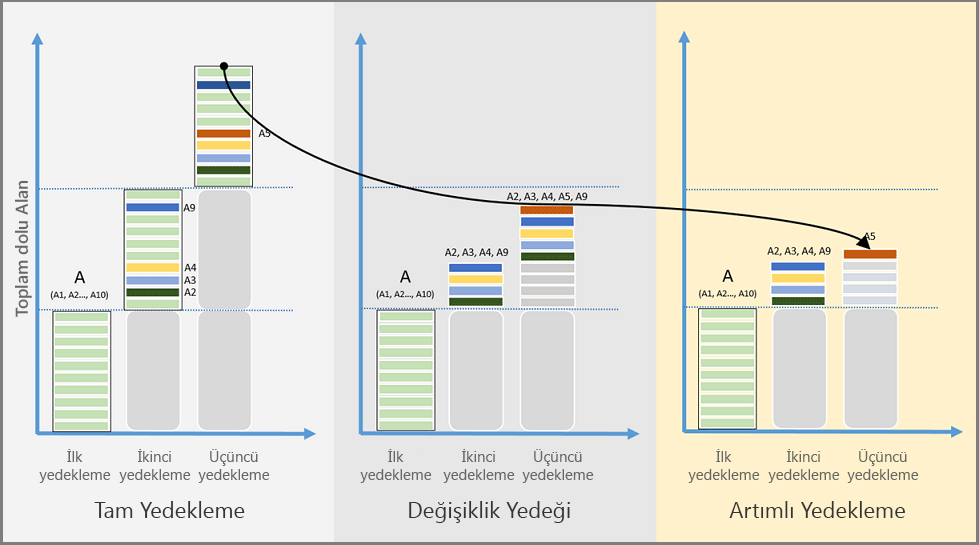

# Azure Backup özelliklerine genel bakış
Azure Backup, verilerinizi Microsoft bulutunda yedeklemek (veya korumak) ve geri yüklemek için kullanabileceğiniz Azure tabanlı bir hizmettir. Azure Backup, var olan şirket içi veya şirket dışı yedekleme çözümünüzün yerine, güvenilir, güvenli ve maliyet açısından rekabetçi bir bulut tabanlı çözüm sunar. Azure Backup, indirdikten sonra uygun bilgisayar, sunucu veya buluta dağıtabileceğiniz birden fazla bileşene sahiptir. Dağıtacağınız bileşen veya aracı, korumak istediğiniz nesnelere göre değişiklik gösterir. Tüm Azure Backup bileşenleri (koruduğunuz veriler şirket içi veya bulut verileri olabilir), verileri Azure’daki bir Kurtarma Hizmetleri kasasına yedeklemek için kullanılabilir. Belirli verileri, uygulamaları veya iş yüklerini korumak için kullanılacak bileşenler hakkında bilgi almak için [Azure Backup bileşen tablosuna](backup-introduction-to-azure-backup.md#which-azure-backup-components-should-i-use) (bu makalenin ilerleyen bölümlerinde) bakın.

[Azure Backup'a genel bakış videosunu izleyin](https://azure.microsoft.com/documentation/videos/what-is-azure-backup/)

## Azure Backup'ı neden kullanmalısınız?
Geleneksel yedekleme çözümleri, bulutu disk veya bantlara benzer bir uç nokta veya statik depolama hedefi olarak işleyecek şekilde gelişmiştir. Bulut platformunun tüm avantajlarından faydalanamayan bu basit yaklaşım sınırlı, pahalı ve verimsiz bir çözüm sunmaktadır. Yanlış veya ihtiyacınız olmayan depolama bileşenleri satın almanızı gerektiren diğer çözümler yüksek maliyetlidir. Diğer çözümler, ihtiyacınız olan depolama türünü veya miktarını sunmadığından ya da yönetimsel görevler çok uzun zaman aldığından verimli değildir. Buna karşılık Azure Backup şu önemli avantajlara sahiptir:

**Otomatik depolama yönetimi** - Karma ortamlar genelde heterojen depolamaya (bazıları şirket içi, bazıları ise bulutta olan) ihtiyaç duyar. Azure Backup çözümünde, şirket içi depolama cihazlarının kullanımıyla ilişkili maliyetler yoktur. Azure Backup, yedekleme alanını otomatik olarak ayırıp yönetir ve "kullandıkça öde" modelini kullanır. Kullandıkça öde yöntemiyle yalnızca kullandığınız depolama alanı için ödeme yaparsınız. Daha fazla bilgi için bkz. [Azure fiyatlandırma makalesi](https://azure.microsoft.com/pricing/details/backup).

**Sınırsız ölçekleme** - Azure Backup, yüksek kullanılabilirlik sunmak için Azure bulutunun gücünü ve sınırsız ölçekleme özelliğini kullanır. Üstelik bakım ve izleme maliyetleri yoktur. Olaylar hakkında bilgi almak için uyarılar oluşturabilirsiniz ancak buluttaki verilerinizin yüksek kullanılabilirliği konusunda endişelenmeniz gerekmez.

**Birden çok depolama seçeneği** - Yüksek kullanılabilirliğin bir özelliği de depolama çoğaltmadır. Azure Backup iki tür çoğaltma sunar: [Yerel olarak yedekli depolama](../storage/common/storage-redundancy-lrs.md) ve [coğrafi olarak yedekli depolama](../storage/common/storage-redundancy-grs.md). İhtiyacınız olan yedek depolama seçeneğini belirleyin:

* Yerel olarak yedekli depolama (LRS), verilerinizi veri merkezine yer alan bir depolama ölçek birimine üç kez kopyalar (verilerinizin üç kopyasını oluşturur). Verilerin tüm kopyaları aynı bölgenin içinde yer alır. LRS, verilerinizi yerel donanım hatalarına karşı korumak için düşük maliyetli bir seçenektir.

* Coğrafi olarak yedekli depolama (GRS), varsayılan ve önerilen çoğaltma seçeneğidir. GRS verilerinizin olan bir ikincil bölgeye çoğaltır [Azure eşleştirilmiş bölgeleri](../best-practices-availability-paired-regions.md) (mil uzaktaki kaynak verilerin birincil konumundan yüzlerce). GRS’nin maliyeti LRS’den yüksektir ancak bölgesel kesintiler olsa bile daha yüksek veri dayanıklılık düzeyi sunar.

**Sınırsız veri aktarımı** - Azure Backup, aktardığınız verilerde aşağı ya da yukarı yönlü bir sınırlama yapmaz. Azure Backup ayrıca aktarılan veriler için ücret talep etmez. Ancak, büyük miktarda veriyi içeri aktarmak için Azure İçeri/Dışarı Aktarma hizmetini kullanırsanız gelen verilerden ücret alınır. Bu maliyet hakkında daha fazla bilgi için bkz. [Azure Backup’ta çevrimdışı yedekleme iş akışı](backup-azure-backup-import-export.md). Giden veriler, geri yükleme işlemi sırasında bir Kurtarma Hizmetleri kasasından aktarılan verileri tanımlar.

**Veri şifreleme**:
- Şirket içi, Taşınmakta olan veriler AES256 kullanılarak şirket içi makinede şifrelenir. İletilen veriler, depolama ve yedekleme HTTPS tarafından korunur. İSCSI protokolü, yedekleme ve kullanıcı makine arasında aktarılan verilerin güvenliğini sağlar. Güvenli bir tünel iSCSI kanalı korumak için kullanılır.
- Şirket içi için Azure yedekleme, azure'daki şifreli yedekleme sağladığınız parolayı kullanarak bekleyen verilerdir. Hiçbir zaman aktarılan veya Azure'da depolanan anahtar ve parola. Verileri geri yüklemeniz gerekirse, şifreleme parolası veya anahtarı yalnızca sizde olur.
- Azure Vm'leri için veriler şifrelenir sıfırlama sırasında depolama hizmeti şifrelemesi (SSE) kullanma. Yedekleme verileri depolamadan önce otomatik olarak şifreler. Azure depolama, almadan önce verilerin şifresini çözer.
- Backup, Azure Azure Disk şifrelemesi (ADE) kullanılarak şifrelenmiş VM'ler de destekler. [Daha fazla bilgi edinin](backup-azure-vms-introduction.md#encryption-of-azure-vm-backups).

**Uygulamayla tutarlı yedekleme** - Uygulamayla tutarlı yedekleme, bir kurtarma noktasının yedek kopyayı geri yüklemek için gerekli tüm verilere sahip olduğu anlamına gelir. Azure Backup, verileri geri yüklerken ek düzeltmelere gerek kalmaması için uygulamayla tutarlı yedeklemeler yapılmasını sağlar. Uygulamayla tutarlı verilerin geri yüklenmesi, geri yükleme süresini azaltarak hizmetlerinizin kısa süre içinde çalışır hale gelmesini sağlar.

**Uzun süreli saklama** - Kısa süreli ve uzun süreli veri saklama için Kurtarma Hizmetleri kasasını kullanabilirsiniz. Azure, bir Kurtarma Hizmetleri kasasında verileri saklama süresini kısıtlamaz. Verileri bir kasada dilediğiniz süre boyunca bekletebilirsiniz. Azure Backup, korunan her örnek için 9999 kurtarma noktası sınırına sahiptir. Bu sınırın yedekleme gereksinimlerinizi nasıl etkileyebileceği hakkında bir açıklama için bu makaledeki [Yedekleme ve bekletme](backup-introduction-to-azure-backup.md#backup-and-retention) bölümüne bakın.

## Hangi Azure Backup bileşenlerini kullanmalıyım?
Azure Backup bileşeniyle neleri koruyabileceğiniz hakkında bilgi edinmek için aşağıdaki tabloyu kullanın.

| Bileşen | Avantajlar | Sınırlar | Neler korunuyor? | Yedekler nerede saklanıyor? |
| --- | --- | --- | --- | --- |
| Azure Backup (MARS) aracısı |<li>Fiziksel veya sanal Windows işletim sistemi üzerindeki dosya ve klasörleri yedekler (VM’ler şirket içinde veya Azure’da olabilir)<li>Ayrı bir yedekleme sunucusu gerekli değildir. |<li>Günde 3 kez yedekleme <li>Uygulamayı algılamaz; yalnızca dosya, klasör ve birim düzeyinde geri yükleme, <li>  Linux desteği yok. |<li>Dosyalar, <li>Klasörler, <li>Sistem Durumu |Kurtarma Hizmetleri kasası |
| System Center DPM |<li>Uygulama kullanan anlık görüntüler (VSS)<li>Yedeklemelerin alınma zamanı için tam esneklik<li>Kurtarma ayrıntı düzeyi (tümü)<li>Kurtarma Hizmetleri kasasını kullanabilir<li>Hyper-V ve VMware VM’lerinde Linux desteği <li>DPM 2012 R2 kullanarak VMware WM’lerini yedekleme ve geri yükleme |Oracle iş yükü yedeklenemiyor.|<li>Dosyalar, <li>Klasörler,<li> Birimler, <li>VM’ler,<li> Uygulamalar,<li> İş yükleri <li>Sistem Durumu |<li>Kurtarma Hizmetleri kasası,<li> Yerel olarak bağlı disk,<li>  Bant (yalnızca şirket içi) |
| Azure Backup Sunucusu |<li>Uygulama kullanan anlık görüntüler (VSS)<li>Yedeklemelerin alınma zamanı için tam esneklik<li>Kurtarma ayrıntı düzeyi (tümü)<li>Kurtarma Hizmetleri kasasını kullanabilir<li>Hyper-V ve VMware VM’lerinde Linux desteği<li>VMware VM’lerini yedekleme ve geri yükleme <li>System Center lisansı gerektirmez |<li>Oracle iş yükü yedeklenemiyor.<li>Her zaman canlı Azure aboneliği gerektirir<li>Bant yedekleme desteği yoktur |<li>Dosyalar, <li>Klasörler,<li> Birimler, <li>VM’ler,<li> Uygulamalar,<li> İş yükleri, <li>Sistem Durumu |<li>Kurtarma Hizmetleri kasası,<li> Yerel olarak bağlı disk |
| Azure IaaS VM Backup |<li>Uygulama kullanan anlık görüntüler (VSS)<li>Windows/Linux için yerel yedeklemeler<li>Belirli bir aracı yüklemesi gerekmez<li>Yedekleme altyapısı gerekmeden yapı düzeyinde yedekleme |<li>VM’leri günde bir kez yedekleme <li>VM’leri yalnızca disk düzeyinde geri yükleme<li>Şirket içi yedekleme gerçekleştirilemez |<li>VM’ler, <li>Tüm diskler (PowerShell kullanarak) |
Kurtarma Hizmetleri kasası
 |

## Her bileşen için dağıtım senaryoları nelerdir?

| Bileşen | Azure'da dağıtılabilir mi? | Şirket içinde dağıtılabilir mi? | Hedef depolama desteklenir |
| --- | --- | --- | --- |
| Azure Backup (MARS) aracısı |
**Evet**
 
Azure Backup aracısı, Azure'da çalışan herhangi bir Windows Server VM üzerinde dağıtılabilir.
 |
**Evet**
 
Azure Backup aracısı, herhangi bir Windows Server VM veya fiziksel makinesi üzerinde dağıtılabilir.
 |
Kurtarma Hizmetleri kasası
 |
| System Center DPM |
**Evet**

[System Center DPM'yi kullanarak Azure'da iş yüklerini koruma](backup-azure-dpm-introduction.md) hakkında daha fazla bilgi edinin.
 |
**Evet**
 
[Veri merkezinizde iş yüklerini ve VM'leri koruma](https://technet.microsoft.com/system-center-docs/dpm/data-protection-manager) hakkında daha fazla bilgi edinin.
 |
Yerel olarak bağlı disk,
 
Kurtarma Hizmetleri kasası,
 
bant (yalnızca şirket içi)
 |
| Azure Backup Sunucusu |
**Evet**

[Azure Backup'ı kullanarak Azure'da iş yüklerini koruma](backup-azure-microsoft-azure-backup.md) hakkında daha fazla bilgi edinin.
 |
**Evet**
 
[Azure Backup'ı kullanarak Azure'da iş yüklerini koruma](backup-azure-microsoft-azure-backup.md) hakkında daha fazla bilgi edinin.
 |
Yerel olarak bağlı disk,
 
Kurtarma Hizmetleri kasası
 |
| Azure IaaS VM Backup |
**Evet**

Azure yapısının parçası

[Hizmet olarak Azure altyapısı (IaaS) sanal makinelerinin yedeklemesine](backup-azure-vms-introduction.md) yöneliktir.
 |
**Hayır**
 
Veri merkezinizdeki sanal makineleri yedeklemek için System Center DPM'yi kullanın.
 |
Kurtarma Hizmetleri kasası
 |

## Hangi uygulamalar ve iş yükleri yedeklenebilir?
Aşağıdaki tabloda Azure Backup kullanarak koruma altına alınabilecek veriler ve iş yükleri verilmiştir. Azure Backup çözümü sütununda ilgili çözüme ait dağıtım belgelerine bağlantı sunulmuştur.

| Veri veya İş Yükü | Kaynak ortamı | Azure Backup çözümü |
| --- | --- | --- |
| Dosyalar ve klasörler |Windows Server |
[Azure Backup aracısı](backup-configure-vault.md),
 
[System Center DPM](backup-azure-dpm-introduction.md) (+ Azure Backup aracısı),
 
[Azure Backup Sunucusu](backup-azure-microsoft-azure-backup.md) (Azure Backup aracısını içerir)
 |
| Dosyalar ve klasörler |Windows bilgisayar |
[Azure Backup aracısı](backup-configure-vault.md),
 
[System Center DPM](backup-azure-dpm-introduction.md) (+ Azure Backup aracısı),
 
[Azure Backup Sunucusu](backup-azure-microsoft-azure-backup.md) (Azure Backup aracısını içerir)
 |
| Hyper-V sanal makine (Windows) |Windows Server |
[System Center DPM](backup-azure-backup-sql.md) (+ Azure Backup aracısı),
 
[Azure Backup Sunucusu](backup-azure-microsoft-azure-backup.md) (Azure Backup aracısını içerir)
 |
| Hyper-V sanal makine (Linux) |Windows Server |
[System Center DPM](backup-azure-backup-sql.md) (+ Azure Backup aracısı),
 
[Azure Backup Sunucusu](backup-azure-microsoft-azure-backup.md) (Azure Backup aracısını içerir)
 |
| VMware sanal makinesi |Windows Server |
[System Center DPM](backup-azure-backup-sql.md) (+ Azure Backup aracısı),
 
[Azure Backup Sunucusu](backup-azure-microsoft-azure-backup.md) (Azure Backup aracısını içerir)
 |
| Microsoft SQL Server |Windows Server |
[System Center DPM](backup-azure-backup-sql.md) (+ Azure Backup aracısı),
 
[Azure Backup Sunucusu](backup-azure-microsoft-azure-backup.md) (Azure Backup aracısını içerir)
 |
| Microsoft SharePoint |Windows Server |
[System Center DPM](backup-azure-backup-sql.md) (+ Azure Backup aracısı),
 
[Azure Backup Sunucusu](backup-azure-microsoft-azure-backup.md) (Azure Backup aracısını içerir)
 |
| Microsoft Exchange |Windows Server |
[System Center DPM](backup-azure-backup-sql.md) (+ Azure Backup aracısı),
 
[Azure Backup Sunucusu](backup-azure-microsoft-azure-backup.md) (Azure Backup aracısını içerir)
 |
| Azure IaaS VM'ler (Windows) |Azure’da çalışan |[Azure Backup (VM uzantısı)](backup-azure-vms-introduction.md) |
| Azure IaaS VM'ler (Linux) |Azure’da çalışan |[Azure Backup (VM uzantısı)](backup-azure-vms-introduction.md) |

## Linux desteği
Aşağıdaki tabloda, Linux için desteklenen Azure Backup bileşenleri gösterilmektedir.  

**Bileşen** | **Linux (Azure destekli)**
--- | ---
Azure Backup (MARS) aracısı | (Windows tabanlı aracı yalnızca)
System Center DPM | Hyper-V ve VMWare üzerinde Linux Konuk VM’lerinin dosyayla tutarlı yedeklemesi   Hyper-V ve VMWare Linux Konuk Vm'lerinin VM geri yükleme   Dosyayla tutarlı yedekleme Azure Vm'leri için kullanılamıyor
Azure Backup Sunucusu | Hyper-V ve VMWare üzerinde Linux Konuk VM’lerinin dosyayla tutarlı yedeklemesi   Hyper-V ve VMWare Linux Konuk Vm'lerinin VM geri yükleme   Dosyayla tutarlı yedekleme Azure Vm'leri için kullanılamıyor
Azure IaaS VM Backup | Uygulamayla tutarlı Yedekleme kullanarak [betik öncesi ve betik sonrası çerçeve](backup-azure-linux-app-consistent.md)   [Dosya düzeyinde kurtarma](backup-azure-restore-files-from-vm.md)   [Geri yüklenen diskten VM oluşturma](backup-azure-arm-restore-vms.md#restore-disks)   [Bir kurtarma noktasından bir VM oluşturma](backup-azure-arm-restore-vms.md#create-a-vm).

## Premium depolama Vm'leri Azure Backup ile kullanma
Azure Backup, premium depolama Vm'lerini korur. Azure premium depolama, katı hal sürücüsü (SSD)-tabanlı depolama g/Ç açısından yoğun iş yüklerini desteklemek için tasarlanmıştır. Premium Depolama, sanal makine (VM) iş yükleri için idealdir. Premium depolama ve diğer disk türleri hakkında daha fazla bilgi için bkz [bir disk türü seçin](../virtual-machines/windows/disks-types.md).

### Premium depolama Vm'leri yedekleme
Premium Storage Vm'lerini, Backup hizmeti yedekleme geçici bir hazırlama konumu oluşturur, ancak "AzureBackup-" premium depolama hesabı adı. Hazırlama konumunun boyutu, kurtarma noktası anlık görüntüsünü boyutuna eşittir. Premium depolama hesabında geçici hazırlama konumu barındırmak için yeterli boş alan olduğundan emin olun. Daha fazla bilgi için makaleye bakın [Azure depolama ölçeklenebilirlik hedefleri](../storage/common/storage-scalability-targets.md). Yedekleme işi tamamlandıktan sonra, hazırlama konumu silinir. Hazırlama konumu için kullanılan depolama alanının fiyatı tüm [Premium depolama fiyatlandırması](../virtual-machines/windows/disks-types.md) ile tutarlıdır.

> [!NOTE]
> Hazırlama konumunu değiştirmeyin veya düzenlemeyin.
>
>

### Premium depolama Vm'lerini geri yükleme
Premium Depolama VM’lerini Premium Depolama veya Standart Depolama birimine geri yükleyebilirsiniz. Premium Depolama VM'si kurtarma noktasının Premium Depolama'ya geri yüklenmesi tipik bir işlemidir. Ancak VM’den dosyaların bir alt kümesine ihtiyacınız varsa Premium Depolama VM'si kurtarma noktasının Standart Depolama’ya geri yüklenmesi uygun maliyetli olabilir.

## Yönetilen disk sanal makinelerini Azure Backup ile kullanma
Azure Backup, yönetilen disk sanal makinelerini korur. Yönetilen diskler, sanal makinelerin depolama hesaplarını yönetme sorumluluğunuzu ortadan kaldırır ve VM sağlama işlemini önemli ölçüde kolaylaştırır.

### Yönetilen disk sanal makinelerini yedekleme
Yönetilen diskler üzerindeki VM'lerin yedeklenmesi, Resource Manager VM'lerin yedeklenmesinden farklı değildir. Azure portalında yedekleme işini doğrudan Sanal Makine görünümünden veya Kurtarma Hizmetleri kasası görünümünden yapılandırabilirsiniz. Yönetilen diskler üzerindeki VM'ler, yönetilen diskler üzerinde oluşturulmuş RestorePoint koleksiyonları ile yedeklenebilir. Azure Backup ayrıca Azure Disk şifrelemesi (ADE) kullanılarak şifrelenmiş yönetilen disk VM'lerinin yedeklenmesini destekler.

### Yönetilen disk sanal makinelerini geri yükleme
Azure Backup, yönetilen disklerle tüm VM'yi geri yüklemenize veya yönetilen diskleri bir depolama hesabına geri yüklemenize olanak tanır. Geri yükleme işlemi sırasında yönetilen diskleri Azure yönetir. Geri yükleme işleminin bir parçası olarak oluşturulan depolama hesabını ise siz (müşteri olarak) yönetirsiniz. Yönetilen şifrelenmiş VM'leri geri yüklerken, geri yükleme işlemini başlatmadan önce VM’lerin anahtar ve gizli dizilerinin anahtar kasasında zaten mevcut olması gerekir.

## Her bir Azure Backup bileşeninin özellikleri nelerdir?
Aşağıdaki bölümlerde her bir Azure Backup bileşeninin kullanılabilirliğini veya desteklediği özellikleri özetleyen tablolar yer almaktadır. Ek destek bilgileri veya ayrıntılar için her tablonun altındaki bilgileri inceleyin.

### Depolama

| Özellik | Azure Backup aracısı | System Center DPM | Azure Backup Sunucusu | Azure IaaS VM Backup |
| --- | --- | --- | --- | --- |
| Kurtarma Hizmetleri kasası |![Evet][green] |![Evet][green] |![Evet][green] |![Evet][green] |
| Disk depolama | |![Evet][green] |![Evet][green] | |
| Bant depolama | |![Evet][green] | | |
| Sıkıştırma  (Kurtarma hizmetleri kasasında) |![Evet][green] |![Evet][green] |![Evet][green] | |
| Artımlı yedekleme |![Evet][green] |![Evet][green] |![Evet][green] |![Evet][green] |
| Disk için yinelenenleri kaldırma | |![Kısmi][yellow] |![Kısmi][yellow] | |

Kurtarma Hizmetleri kasası, tüm bileşenler genelinde tercih edilen depolama hedefidir. System Center DPM ve Azure Backup Sunucusu da yerel disk kopyası bulundurma seçeneğini sağlar. Ancak yalnızca System Center DPM, bir bant depolama cihazına veri yazma seçeneği sağlar.

#### Sıkıştırma
Yedeklemeler, gerekli depolama alanını azaltmak için sıkıştırılır. Sıkıştırma kullanmayan tek bileşen, VM uzantısıdır. VM uzantısı, depolama hesabınızdaki tüm yedekleme verilerini aynı bölgedeki Kurtarma Hizmetleri kasasına kopyalar. Veri aktarımı sırasında sıkıştırma yapılmaz. Veriler, sıkıştırma kullanılmadan aktarıldığı için kullanılan depolama alanı biraz fazla olur. Ancak verilerin sıkıştırma olmadan depolanması, ilgili kurtarma noktasına ihtiyaç duymanız halinde geri yüklemenin daha hızlı gerçekleştirilmesini sağlar.

#### Disk İçin Yinelenenleri Kaldırma
[Hyper-V sanal makinesinde](https://blogs.technet.com/b/dpm/archive/2015/01/06/deduplication-of-dpm-storage-reduce-dpm-storage-consumption.aspx) System Center DPM veya Azure Backup Sunucusu dağıttığınızda disk için yinelenenleri kaldırma özelliğinden faydalanabilirsiniz. Windows Server, yedekleme alanı olarak sanal makineye bağlanmış olan sanal makine sabit diskleri (VHD'ler) üzerinde yinelenenleri kaldırma özelliğini kullanır.

> [!NOTE]
> Yinelenenleri kaldırma, Azure Backup bileşenlerinden herhangi biri için kullanılamaz. System Center DPM ve Backup Sunucusu Azure'da dağıtıldığında, VM'ye bağlı depolama diskleri için yinelenenler kaldırılamaz.
>
>

### Artımlı yedekleme açıklaması
Her Azure Backup bileşeni, hedef depolamadan (disk, bant, Kurtarma Hizmetleri kasası) bağımsız olarak artımlı yedeklemeyi destekler. Artımlı yedekleme, yalnızca son yedeklemeden sonra yapılan değişiklikleri aktararak yedeklemelerin depolama ve zaman açısından verimli olmasını sağlar.

#### Tam Yedekleme, Değişiklik Yedeği ve Artımlı Yedekleme karşılaştırması

Her yedekleme yönteminin depolama alanı tüketimi, kurtarma süresi hedefi (RTO) ve ağ tüketimi diğerinden farklıdır. Yedekleme toplam sahip olma maliyetini (TCO) düşük tutmak için en iyi yedekleme çözümünü nasıl seçeceğinizi anlamanız gerekir. Aşağıdaki görüntüde Tam Yedekleme, Değişiklik Yedeği ve Artımlı Yedekleme karşılaştırılmıştır. Görüntüde veri kaynağı A, aylık yedeklenen 10 depolama blokuna (A1-A10) sahiptir. A2, A3, A4 ve A9 blokları ilk ayda, A5 bloku ise sonraki ayda değişmektedir.

**Tam Yedekleme** seçeneğinde her yedek kopyası, veri kaynağının tamamını içerir. Tam yedeklemede her yedek kopyası aktarımında çok fazla ağ bant genişliği ve depolama alanı kullanılır.

**Değişiklik Yedeği** yalnızca ilk tam yedeklemeden sonra değiştirilen blokları depolar ve sonuç olarak ağ ve depolama alanı tüketimi daha az olur. Değişiklik yedekleri, değişmeyen verilerin gereksiz kopyalarını tutmaz. Ancak takip eden yedeklerin arasında değiştirilmeyen veri blokları aktarıldığı ve depolandığı için değişiklik yedekleri verimli değildir. İkinci ayda değiştirilen A2, A3, A4 ve A9 blokları yedeklenir. Üçüncü ayda değiştirilen A5 blokuna ek olarak aynı bloklar tekrar yedeklenir. Sonraki tam yedeklemeye kadar değiştirilen bloklar yedeklenmeye devam eder.

**Artımlı Yedekleme** yalnızca önceki yedekleme sonrasında değiştirilen veri bloklarını depolayarak depolama alanı ve ağ konusunda yüksek verimlilik sunar. Artımlı yedekleme ile düzenli tam yedeklemeler yapmaya gerek yoktur. Bu örnekte ilk ay tam yedekleme yapıldıktan sonra A2, A3, A4 ve A9 blokları değiştirilmiş olarak işaretlenir ve ikinci aya aktarılır. Üçüncü ayda yalnızca değiştirilen A5 bloku işaretlenir ve aktarılır. Daha az verinin taşınması depolama ve ağ kaynaklarından tasarruf edilmesini ve TCO'nun düşürülmesini sağlar.

### Güvenlik

| Özellik | Azure Backup aracısı | System Center DPM | Azure Backup Sunucusu | Azure IaaS VM Backup |
| --- | --- | --- | --- | --- |
| Ağ güvenliği  (Azure’a) |![Evet][green] |![Evet][green] |![Evet][green] |![Evet][green] |
| Veri güvenliği  (Azure’da) |![Evet][green] |![Evet][green] |![Evet][green] |![Evet][green] |

#### Ağ güvenliği
Sunucularınızdan Kurtarma Hizmetleri kasasına giden tüm yedekleme trafiği, Gelişmiş Şifreleme Standardı 256 kullanılarak şifrelenir. Yedekleme verileri güvenli bir HTTPS bağlantısı üzerinden gönderilir. Ayrıca yedekleme verileri, şifreli biçimde Kurtarma Hizmetleri kasasında depolanır. Yalnızca Azure müşterisi olarak siz bu verilerin kilidini açmak için kullanılan parolaya sahip olursunuz. Microsoft herhangi bir noktada yedekleme verilerinin şifresini çözemez.

> [!WARNING]
> Kurtarma Hizmetleri kasasını oluşturduktan sonra şifreleme anahtarına yalnızca sizin erişiminiz olur. Microsoft, şifreleme anahtarınızın bir kopyasını saklamaz ve bu anahtara asla erişimi yoktur. Anahtarın kaybedilmesi durumunda Microsoft yedekleme verilerini kurtaramaz.
>
>

#### Veri güvenliği
Azure VM'lerin yedeklenmesi için şifrelemenin sanal makine *içinde* ayarlanması gerekir. Azure Backup, Windows sanal makinelerde BitLocker, Linux sanal makinelerde ise **dm-crypt** kullanan Azure Disk Şifrelemesi özelliğini destekler. Azure Backup arka uçta bekleyen verileri koruyan [Azure Depolama Hizmeti şifrelemesini](../storage/common/storage-service-encryption.md) kullanır.

### Ağ

| Özellik | Azure Backup aracısı | System Center DPM | Azure Backup Sunucusu | Azure IaaS VM Backup |
| --- | --- | --- | --- | --- |
| Ağ sıkıştırma  (**backup sunucusuna**) | |![Evet][green] |![Evet][green] | |
| Ağ sıkıştırma  (**Kurtarma hizmetleri kasasına**) |![Evet][green] |![Evet][green] |![Evet][green] | |
| Ağ protokolü  (**backup sunucusuna**) | |TCP |TCP | |
| Ağ protokolü  (**Kurtarma hizmetleri kasasına**) |HTTPS |HTTPS |HTTPS |HTTPS |

VM uzantısı (IaaS VM üzerindeki) verileri doğrudan depolama ağı aracılığıyla Azure depolama hesabından okuduğu için bu trafiğin sıkıştırılması gerekmez.

İkincil yedekleme sunucusu olarak bir System Center DPM sunucusu veya Azure Backup Sunucusu kullanıyorsanız, birincil sunucudan yedekleme sunucusuna giden verileri sıkıştırın. Verileri DPM veya Azure Backup Sunucusu'na yedeklemeden önce sıkıştırdığınızda daha az bant genişliği kullanmış olursunuz.

#### Ağ Kapasitesi Azaltma
Azure Backup aracı, veri aktarımı sırasında ağ bant genişliğinin nasıl kullanıldığını denetlemenizi sağlayan ağ kapasitesi azaltma özelliğine sahiptir. Azaltma özelliği, çalışma saatlerinde veri yedeklemesi yapmanız gerektiğinde ancak yedekleme işleminin diğer İnternet trafiğine engel olmasını istemediğinizde faydalı olabilir. Veri aktarımına yönelik azaltma, yedekleme ve geri yükleme etkinlikleri için geçerlidir.

## Yedekleme ve bekletme

Azure Backup’ta, *korumalı örnek* başına 9999 kurtarma noktası (yedekleme kopyası veya anlık görüntü olarak da bilinir) sınırı vardır. Korumalı örnek, verileri Azure’a yedeklemek için yapılandırılmış bir bilgisayar, sunucu (fiziksel veya sanal) veya iş yüküdür. Daha fazla bilgi için [Korumalı örnek nedir?](backup-introduction-to-azure-backup.md#what-is-a-protected-instance) bölümüne bakın. Verilerin yedek kopyası kaydedildiğinde örnek, korumalı hale gelir. Verilerin yedek kopyası, korumayı oluşturur. Kaynak veriler, kaybolmaları veya bozulmaları durumunda yedek kopya kullanılarak geri yüklenebilir. Aşağıdaki tablo, her bileşen için en fazla yedekleme sıklığını gösterir. Kurtarma noktalarını hangi hızla tükettiğiniz, yedekleme ilkesi yapılandırmanız tarafından belirlenir. Örneğin, her gün bir kurtarma noktası oluşturursanız; kurtarma noktalarınızı 27 yıl boyunca bitmeden tutabilirsiniz. Aylık kurtarma noktası alırsanız, kurtarma noktalarınızı 833 yıl süreyle saklayabilirsiniz. Backup hizmeti, kurtarma noktası üzerinde bir sona erme süresi ayarlamaz.

|  | Azure Backup aracısı | System Center DPM | Azure Backup Sunucusu | Azure IaaS VM Backup |
| --- | --- | --- | --- | --- |
| Yedekleme sıklığı  (Kurtarma hizmetleri kasasına) |Günde üç yedekleme |Günde iki yedekleme |Günde iki yedekleme |Günde bir yedekleme |
| Yedekleme sıklığı  (diske) |Uygulanamaz |<li>SQL Server için 15 dakikada bir <li>Diğer iş yükleri için saatte bir |<li>SQL Server için 15 dakikada bir <li>Diğer iş yükleri için saatte bir
 |Uygulanamaz |
| Bekletme seçenekleri |Günlük, haftalık, aylık, yıllık |Günlük, haftalık, aylık, yıllık |Günlük, haftalık, aylık, yıllık |Günlük, haftalık, aylık, yıllık |
| Korumalı örnek başına en fazla kurtarma noktası |9999|9999|9999|9999|
| En uzun bekletme süresi |Yedekleme sıklığına bağlıdır |Yedekleme sıklığına bağlıdır |Yedekleme sıklığına bağlıdır |Yedekleme sıklığına bağlıdır |
| Yerel diskteki kurtarma noktaları |Uygulanamaz |<li>Dosya Sunucuları için 64<li>Uygulama Sunucuları için 448 |<li>Dosya Sunucuları için 64<li>Uygulama Sunucuları için 448 |Uygulanamaz |
| Banttaki kurtarma noktaları |Uygulanamaz |Sınırsız |Uygulanamaz |Uygulanamaz |

## Korumalı örnek nedir?
Korumalı örnek, Azure’a yedeklemek için yapılandırılmış bir Windows bilgisayar, sunucu (fiziksel veya sanal) veya SQL veritabanı için genel bir başvurudur. Bilgisayar, sunucu veya veritabanı için bir yedekleme ilkesi yapılandırdığınızda ve verilerin yedek kopyasını oluşturduğunuzda örnek, korumalı hale gelir. Bu korumalı örnek için yedek verilerin sonraki kopyaları (kurtarma noktası olarak adlandırılır), kullanılan depolama alanı miktarını artırır. Korumalı bir örnek için en çok 9999 kurtarma noktası oluşturabilirsiniz. Bir kurtarma noktasını depolamadan silerseniz, 9999 kurtarma noktası toplamı içinde sayılmaz.
Korumalı örneklere sanal makineler, uygulama sunucuları, veritabanları ve Windows işletim sistemi çalıştıran kişisel bilgisayarlar örnek olarak verilebilir. Örneğin:

* Hyper-V veya Azure IaaS hiper yönetici yapısı çalıştıran bir sanal makine. Sanal makine için konuk işletim sistemleri Windows Server veya Linux olabilir.
* Bir uygulama sunucusu: Uygulama sunucusu, bir fiziksel veya yedeklenmesi gereken verileri ile Windows Server ve iş yüklerini çalıştıran sanal makine olabilir. Ortak iş yükleri; Microsoft SQL Server, Microsoft Exchange sunucusu, Microsoft SharePoint sunucusu ve Windows Server üzerindeki Dosya Sunucusu rolüdür. Bu iş yüklerini yedeklemek için System Center Data Protection Manager (DPM) veya Azure Backup Sunucusu gerekir.
* Windows işletim sistemi çalıştıran kişisel bilgisayar, iş istasyonu veya dizüstü bilgisayar.

## Kurtarma Hizmetleri kasası nedir?
Kurtarma Hizmetleri kasası Azure'da yedek kopyalar, kurtarma noktaları ve yedekleme ilkeleri gibi verilerin tutulması için kullanılan bir çevrimiçi depolama varlığıdır. Azure hizmetleri, şirket içi sunucular ve iş istasyonları için yedekleme verilerini tutmak üzere Kurtarma Hizmetleri kasalarını kullanabilirsiniz. Kurtarma Hizmetleri kasaları, yedekleme verilerinizi düzenlemeyi kolaylaştırırken yönetim zorluklarını da en aza indirir. Her Azure aboneliğinde, Azure bölgesi başına en çok 500 Kurtarma Hizmetleri kasası oluşturabilirsiniz. Verilerinizi nereye depolayacağınızı düşünürken, tüm bölgelerin aynı olmadığını unutmayın. Bölge eşleştirmeleri ve ek depolama alanı konuları hakkında bilgi edinmek için [Coğrafi olarak yedekli depolama](../storage/common/storage-redundancy-grs.md) bölümüne bakın.

Azure Service Manager'a dayalı Yedekleme kasaları ilk kasa sürümüdür. Azure Resource Manager modeli özelliklerinin eklendiği Kurtarma Hizmetleri kasaları kasanın ikinci sürümüdür. Özellikler arasındaki farkların kapsamlı açıklamaları için [Kurtarma Hizmetleri kasasına genel bakış makalesine](backup-azure-recovery-services-vault-overview.md) göz atın. Artık Yedekleme kasaları oluşturamazsınız ve var olan tüm Yedekleme kasaları Kurtarma Hizmetleri kasalarına yükseltilmiştir. Kurtarma Hizmetleri kasalarına yükseltilmiş kasaları yönetmek için Azure portalını kullanabilirsiniz.

## Azure Backup'ın Azure Site Recovery'den farkı nedir?
Azure Backup ve Azure Site Recovery, veri yedekleme ve geri yükleme özelliklerine sahip olmaları açısından aynıdır. Ancak, bu hizmetler işletmenizde iş sürekliliği sağlama ve olağanüstü durum kurtarma konularında farklı amaçlara hizmet eder. Verileri daha ayrıntılı bir düzeyde korumak ve geri yüklemek için Azure Backup’ı kullanın. Örneğin, bir dizüstü bilgisayardaki sunu bozulduysa, sunuyu geri yüklemek için Azure Backup kullanabilirsiniz. Bir VM üzerindeki yapılandırma ve verileri başka bir veri merkezine çoğaltmak istediyseniz, Azure Site Recovery’yi kullanın.

Azure Backup, şirket içinde ve bulutta yer alan verileri korur. Azure Site Recovery, sanal makine ve fiziksel sunucu çoğaltma, yük devretme ve yeniden çalışma işlemlerini düzenler. Olağanüstü durum kurtarma çözümünüzün verilerinizin güvenli ve kurtarılabilir kalmasını sağlaması (Backup) *ve* kesintiler meydana geldiğinde, iş yüklerinizin kullanılabilirliğini koruması (Site Recovery) gerektiği için her iki hizmet de önemlidir.

Aşağıdaki kavramlar, yedekleme ve olağanüstü durum kurtarma ile ilgili önemli kararları almanıza yardımcı olabilir.

| Kavram | Ayrıntılar | Backup | Olağanüstü durum kurtarma (DR) |
| --- | --- | --- | --- |
| Kurtarma noktası hedefi (RPO) |Kurtarma işleminin gerekli olduğu durumlarda kabul edilebilir veri kaybı miktarı. |Backup çözümleri, kabul edilebilir RPO değerlerinde büyük bir değişkenliğe sahiptir. Sanal makine yedeklemeleri genellikle bir günlük bir RPO'ya sahipken, veritabanı yedeklemelerinin RPO değerleri 15 dakika kadar düşük olabilir. |Olağanüstü durum kurtarma çözümleri düşük RPO'lara sahiptir. DR kopyalama, birkaç saniye veya birkaç dakika geride olabilir. |
| Kurtarma süresi hedefi (RTO) |Bir geri yükleme veya kurtarma işlemini tamamlamak için geçen süre. |Daha büyük RPO nedeniyle, bir yedekleme çözümünün işlemesi gereken veri miktarı genellikle çok daha yüksektir; bu da daha uzun RTO'lara yol açar. Örneğin, bandın şirket dışı bir konumdan taşınması için harcanan süreye bağlı olarak, bantlardan veri geri yükleme işlemi birkaç gün sürebilir. |Olağanüstü durum kurtarma çözümleri, kaynakla aralarındaki eşitlemenin daha yüksek olması nedeniyle daha küçük RTO'lara sahiptir. Daha az değişikliğin işlenmesi gerekir. |
| Bekletme |Verilerin depolanması gereken süre |İşletimsel kurtarma gerektiren senaryolar (veri bozulması, yanlışlıkla dosya silme, işletim sistemi arızası) için, yedekleme verileri genellikle 30 gün veya daha kısa süreyle elde tutulur. Uyumluluk açısından verilerin aylarca ve hatta yıllarca depolanması gerekebilir. Bu gibi durumlarda arşivleme için yedekleme verileri ideal niteliktedir. |Olağanüstü durum kurtarma için yalnızca işletimsel kurtarma verilerine gerek duyulur; bu, genellikle birkaç saat veya en fazla bir gün sürer. DR çözümlerinde kullanılan ayrıntılı veri yakalama işlemi nedeniyle, uzun vadeli bekletme için DR verilerinin kullanılması önerilmez. |

## Sonraki adımlar
Aşağıda yer alan Windows Server üzerindeki verileri veya Azure’daki bir sanal makinede (VM) bulunan verileri koruma altına almayı ayrıntılı ve adım adım gösteren öğreticileri inceleyebilirsiniz:

* [Dosya ve Klasörleri yedekleme](backup-try-azure-backup-in-10-mins.md)
* [Azure Sanal Makinelerini yedekleme](backup-azure-vms-first-look-arm.md)

Diğer iş yüklerini koruma hakkında ayrıntılı bilgi için şu makaleleri inceleyin:

* [Windows Server verilerinizi yedekleme](backup-configure-vault.md)
* [Uygulama iş yüklerini yedekleme](backup-azure-microsoft-azure-backup.md)
* [Azure IaaS VM'lerini yedekleme](backup-azure-arm-vms-prepare.md)

[green]: ./media/backup-introduction-to-azure-backup/green.png
[yellow]: ./media/backup-introduction-to-azure-backup/yellow.png
[red]: ./media/backup-introduction-to-azure-backup/red.png
