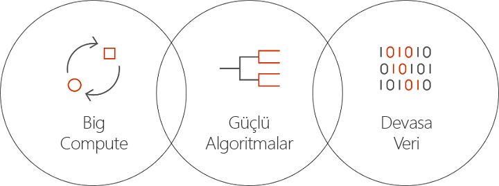

# Azure’da Batch AI nedir?
Batch AI, veri bilimcilerinin ve yapay zeka araştırmacılarının, GPU desteğine sahip sanal makineler dahil, Azure sanal makine kümelerindeki yapay zeka ve diğer makine öğrenmesi modellerini eğitmesini sağlayan bir yönetilen hizmettir. Siz işinizin gereksinimlerini, girdilerin nerede bulunacağını ve çıktıların nerede depolanacağını açıklarsınız, gerisini Batch AI yapar.  
 
## Neden Batch AI? 
Güçlü yapay zeka algoritmalarının geliştirilmesi, bilgi işlem açısından yoğun ve yinelemeli bir işlemdir. Veri bilimcileri ve yapay zeka araştırmacıları, her geçen gün daha büyük veri kümeleriyle çalışmaktadır. Daha fazla katman içeren modeller geliştirmekte ve bunu hyper parametresi ayarlama işleminde ağ tasarımı üzerinde daha fazla deney yoluyla gerçekleştirmektedir. Bunun verimli şekilde yapılması için model başına birden fazla CPU veya GPU, deneylerin paralel şekilde çalıştırılması ve eğitim verileri, günlükler ve model çıktıları için paylaşılan depolama alanı olması gerekir.   
 

Veri bilimcileri ve yapay zeka araştırmacıları kendi alanlarında uzmandır, öte yandan belirli bir ölçekte altyapı da yönetir. Belirli bir ölçekte yapay zeka geliştirmek için birçok altyapı görevi gerekir: sanal makine kümelerinin sağlanması, yazılım ve kapsayıcıların yüklenmesi, işin kuyruğa alınması, işlerin önceliklendirilmesi ve zamanlanması, hataların işlenmesi, verilerin dağıtılması, sonuçların paylaşılması, maliyetleri yönetmek için kaynakların ölçeklendirilmesi ve araçlar ve iş akışları ile tümleştirme gerçekleştirilmesi. Batch AI bu görevleri işler. 
 
## Batch AI nedir? 

Batch AI, yapay zeka eğitim ve testi için özelleştirilmiş kaynak yönetimi ve iş zamanlaması sağlar. Temel işlevler şunlardır: 

* Uzun süren toplu işler çalıştırma, yinelemeli deney ve etkileşimli eğitim 
* GPU veya CPU kullanılarak sanal makine kümelerinin otomatik ya da el ile ölçeklendirmesi 
* Sanal makineler arasında ve uzaktan erişim için SSH iletişimini yapılandırma 
* [Microsoft Cognitive Toolkit](https://github.com/Microsoft/CNTK) (CNTK), [TensorFlow](https://www.tensorflow.org/) ve [Chainer](https://chainer.org/) gibi popüler araç setleri için iyileştirilmiş yapılandırma işleviyle tüm Ayrıntılı Öğrenme veya makine öğrenmesi çerçeveleri desteği 
* Kümeleri paylaşmak ve düşük öncelikli sanal makinelerden ve Azure ayrılmış örneklerinden yararlanmak için öncelik tabanlı iş kuyruğu  
* Azure Dosyaları ve yönetilen NFS sunucusu da dahil esnek depolama seçenekleri 
* Uzak dosya paylaşımlarını sanal makineye ve isteğe bağlı kapsayıcıya bağlama 
* İş durumu sağlama ve sanal makine hataları olması durumunda yeniden başlatma 
* Azure Depolama’dan gelen akışlar da dahil, çıktı günlüklerine, stdout, stderr ve modellere erişim 
* Azure [komut satırı arabirimi](/cli/azure) (CLI), [Python](https://github.com/Azure/azure-sdk-for-python), [C#](https://www.nuget.org/packages/Microsoft.Azure.Management.BatchAI/1.0.0-preview) ve Java için SDK’lar, Azure Portal’da izleme ve Microsoft AI araçlarıyla tümleştirme 

Batch AI SDK, eğitim işlem hatlarını yönetmek ve araçlarla tümleştirme gerçekleştirmek için betiklerin veya uygulamaların yazılmasını destekler. SDK şu anda Python, C#, Java ve REST API’lerini sağlar.  
 

Batch AI, denetim düzlemi işlemleri (oluşturma, listeleme, alma, silme) için Azure Resource Manager’ı kullanır. Azure Active Directory, kimlik doğrulaması ve rol tabanlı erişim denetimi için kullanılır.  
 
## Batch AI kullanma 

Batch AI kullanmak için *kümeleri* ve *işleri* tanımlar ve yönetirsiniz. 

 
**Kümeler**, bilgi işlem gereksinimlerinizi açıklar: 
* Çalışmak istediğiniz Azure bölgesi 
* Kullanılacak sanal makine ailesi ve boyutu; örneğin, 4 NVIDIA K80 GPU’yu içeren bir NC24 VM 
* Sanal makine sayısı veya otomatik ölçeklendirme için minimum ve maksimum sayı 
* Sanal makine görüntüsü; örneğin, Ubuntu 16.04 LTS veya [Microsoft Ayrıntılı Öğrenme Sanal Makinesi](https://azuremarketplace.microsoft.com/marketplace/apps/microsoft-ads.dsvm-deep-learning)
* Örneğin, Batch AI tarafından yönetilen NFS sunucusundan veya Azure Dosyaları’ndan bağlanacak uzak dosya paylaşımı birimleri 
* Hata ayıklama için etkileşimli oturum açmayı etkinleştirmek amacıyla sanal makinelerde yapılandırılacak kullanıcı adı ve SSH anahtarı ya da parolası  
 

**İşler** şunları açıklar: 
* Kullanılacak küme ve bölge 
* İş için kullanılacak sanal makine sayısı 
* Başlatma sırasında işe geçirilecek girdi ve çıktı dizinleri. Bu genellikle küme kurulumu sırasında bağlanan paylaşılan dosya sistemini kullanır 
* Yazılım veya yükleme betiğinizi çalıştırmak için isteğe bağlı bir kapsayıcı 
* İşi başlatmak için komut satırı ve parametreler veya AI çerçevesine özgü yapılandırma 
 

Kümeler ve işler için yapılandırma dosyaları ve [Azure CLI](/cli/azure) ile Batch AI uygulamasını kullanmaya başlayın. Gerektiğinde hızlı şekilde kümenizi oluşturmak ve ağ tasarımıyla veya hyper-parametreleriyle deneme yapmak amacıyla işleri çalıştırmak için bu yaklaşımı kullanın.  
 

Batch AI, birden fazla GPU ile paralel çalışmayı kolaylaştırır. İşlerin birden fazla GPU arasında ölçeklendirmesi gerektiğinde Batch AI, sanal makineler arasında güvenli ağ bağlantısı kurar. InfiniBand kullanıldığında Batch AI, sürücüleri yapılandırır ve bir işteki düğümler arasında MPI başlatır.  

## Veri yönetimi
Batch AI, eğitim betikleriniz, verileriniz ve çıktılarınız için esnek seçenekler sağlar:
  
* Başlangıç deneyleri ve daha küçük veri kümeleri için **yerel disk** kullanın. Bu senaryo için, betikleri düzenlemek ve günlükleri okumak için SSH üzerinden sanal makineye bağlanmak isteyebilirsiniz. 

* Eğitim verilerini birden fazla iş arasında paylaşmak ve çıktı günlüklerini ve modellerini tek bir konumda depolamak için **Azure Dosyaları**’nı kullanın 

* Eğitim için daha geniş bir veri ve sanal makine ölçeğini desteklemek amacıyla bir **NFS sunucusunu** ayarlayın. Batch AI, disklerin Azure Depolama’da yedeklendiği özel bir küme türü olarak sizin için bir NFS sunucusu ayarlayabilir. 
 
* **Paralel dosya sistemi**, paralel eğitim ve veriler için daha fazla ölçeklendirilebilirlik sağlar. Batch AI, paralel dosya sistemlerini yönetmese de, Lustre, Gluster ve BeeGFS için örnek dağıtım şablonları mevcuttur.  

## Sonraki adımlar

* [Azure CLI](quickstart-cli.md) veya [Python](quickstart-python.md) kullanarak ilk Batch AI eğitim işinizi oluşturmaya başlayın.
* Farklı çerçeveler için örnek [eğitim tariflerine](https://github.com/Azure/BatchAI) göz atın.

