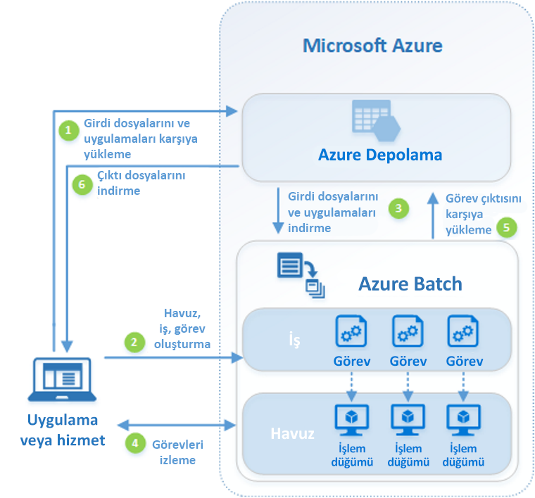

# Azure Batch nedir?

Büyük ölçekli paralel ve yüksek performanslı bilgi işlem (HPC) toplu işlerini Azure’da verimli bir şekilde çalıştırmak için Azure Batch’i kullanın. Azure Batch bir işlem düğümleri (sanal makine) havuzu oluşturup yönetir, çalıştırmak istediğiniz uygulamaları yükler ve düğümler üzerinde çalışacak işleri zamanlar. Herhangi bir küme veya iş zamanlama yazılımının yüklenmesi, yönetilmesi ya da ölçeklendirilmesi gerekli değildir. Bunun yerine, işlerinizi yapılandırmak, yönetmek ve izlemek için [Batch API ve araçları](batch-apis-tools.md), komut satırı betikleri veya Azure portalını kullanırsınız. 

Geliştiriciler, büyük ölçekli yürütmenin gerekli olduğu SaaS uygulamalarını veya istemci uygulamaları derlemek için Batch’i bir platform hizmeti olarak kullanabilir. Örneğin, Batch ile bir finansal hizmet şirketi için Monte Carlo risk simülasyonu çalıştırmak ya da çok sayıda görüntüyü işlemek üzere bir hizmet oluşturun.

Batch kullanımından ek ücret alınmaz. Yalnızca sanal makineler, depolama ve ağ gibi kullanılan temel kaynaklar için ödeme yaparsınız.

Batch ve azure'daki diğer HPC çözüm seçenekleri arasında bir karşılaştırma için bkz. [yüksek performanslı bilgi işlem (HPC) azure'da](https://docs.microsoft.com/azure/architecture/topics/high-performance-computing/).

## Paralel iş yükleri çalıştırma
Batch, doğası gereği paralel ("utandırıcı derecede paralel" olarak da bilinir) iş yükleriyle düzgün çalışır. Doğası gereği paralel iş yükleri, uygulamaların birbirinden bağımsız olarak çalışabildiği ve her örneğin işin bir kısmını tamamladığı iş yükleridir. Uygulamalar yürütülürken bazı ortak verilere erişebilir, ancak uygulamanın diğer örnekleri iletişim kurmazlar. Bu nedenle doğası gereği paralel iş yükleri, uygulamaları eşzamanlı çalıştırmak için kullanılabilen işlem kaynaklarının miktarına göre belirlenen büyük bir ölçekte çalışır.

Batch ile kullanabileceğiniz doğası gereği paralel iş yüklerinin bazı örnekleri şunlardır:

* Monte Carlo simülasyonlarını kullanarak finansal risk modelleme
* VFX ve 3B görüntü işleme
* Görüntü analizi ve işleme
* Medya kodlama dönüştürme
* Genetik dizi analizi
* Optik karakter tanıma (OCR)
* Veri alımı, işleme ve ETL işlemleri
* Yazılım testi yürütme

Ayrıca, Batch kullanarak [sıkıca bağlı iş yüklerini çalıştırabilirsiniz](batch-mpi.md); bunlar, çalıştırdığınız uygulamaların birbirinden bağımsız çalışmanın aksine birbirleriyle iletişim kurması gereken iş yükleridir. Sıkıca bağlı uygulamalar normalde İleti Geçirme Arabirimi (MPI) API’sini kullanır. Sıkıca bağlı iş yüklerinizi, [Microsoft MPI](https://msdn.microsoft.com/library/bb524831(v=vs.85).aspx) veya Intel MPI kullanarak Batch ile çalıştırabilirsiniz. Özel [HPC](../virtual-machines/linux/sizes-hpc.md) ve [GPU bakımından iyileştirilmiş](../virtual-machines/linux/sizes-gpu.md) VM boyutları ile uygulama performansını artırın.

Sıkıca bağlı iş yüklerinin bazı örnekleri şunlardır:
* Sınırlı öğe analizi
* Sıvı dinamiği
* Çok düğümlü AI eğitimi

Sıkıca bağlı işlerin çoğu, Batch kullanılarak paralel olarak çalıştırılabilir. Örneğin, kanal genişlikleri değişen bir kanal içinden sıvı akışının birden fazla simülasyonunu gerçekleştirin.

## Ek Batch özellikleri

Azure Batch için daha yüksek düzeyli, iş yüküne özel özellikler de kullanılabilir:
* Batch; Autodesk Maya, 3ds Max, Arnold ve V-Ray gibi işleme araçları ile büyük ölçekli [işleme iş yüklerini](batch-rendering-service.md) destekler. 
* R kullanıcıları, Batch havuzlarında R algoritmalarının yürütülmesini kolayca ölçeklendirmek için [doAzureParallel R paketi](https://github.com/Azure/doAzureParallel) yükleyebilir.

[Azure Data Factory](../data-factory/transform-data-using-dotnet-custom-activity.md) gibi araçlarla yönetilen Batch işlerini, veri dönüştürmeye yönelik daha büyük bir Azure iş akışının parçası olarak da kullanabilirsiniz.

## Nasıl çalışır?
Batch için yaygın bir senaryo, işlem düğümlerinin havuzunda 3B görüntülerin işlenmesi gibi paralel işi aslında ölçeklendirmeyi kapsar. Bu işlem düğümleri havuzu, işleme işinize onlarca, yüzlerce, hatta binlerce çekirdek sağlayan size ait bir "işleme çiftliği" olabilir.

Aşağıdaki diyagramda, istemci uygulamasının yanı sıra paralel iş yükünü çalıştıracak Batch’i kullanan barındırma hizmetiyle birlikte yaygın bir Batch iş akışının adımları gösterilmektedir.

|Adım  |Açıklama  |
|---------|---------|
|1.  **Giriş dosyalarını** ve Azure Depolama hesabınıza bu dosyaları işleyecek **uygulamaları** indirin.     |Giriş dosyaları uygulamanızın işleyeceği herhangi bir veri olabilir; örneğin, finansal modelleme verileri veya dönüştürülecek video dosyaları. Uygulama dosyaları, medya kod dönüştürücüsü gibi veri işleyen betik ya da uygulamaları içerebilir.|
|2.  Batch hesabınızda bir Batch işlem düğümleri **havuzu**, havuzda iş yükünü çalıştırmak için bir **iş** ve iş içinde **görevler** oluşturun.     | Havuz düğümleri, görevlerinizi yürüten VM'lerdir. Düğümlerin sayısı ve boyutu gibi özellikleri, bir Windows veya Linux VM görüntüsünü ve sonra düğümler havuza katıldığında yüklenecek uygulamayı belirtin. [Düşük öncelikli VM’ler](batch-low-pri-vms.md) kullanarak veya iş yükü değiştikçe düğüm sayısını [otomatik ölçeklendirerek](batch-automatic-scaling.md) havuz maliyetini ve boyutunu yönetin.   Bir işe görev eklediğinizde, Batch hizmeti havuzundaki işlem düğümlerinde yürütülmesi için görevleri otomatik olarak zamanlar. Her görev, girdi dosyalarını işlemek için yüklediğiniz uygulamayı kullanır. |
|3.  **Giriş dosyalarını** ve **uygulamaları** Batch’e indirme     |Bir görev yürütülmeden önce, atandığı işlem düğümünde işlenmesi için giriş verilerini indirebilir. Uygulama henüz havuz düğümlerine yüklenmediyse, burada da indirilebilir. Azure Depolama’dan indirme işlemleri tamamlandığında, görev atanan düğüm üzerinde yürütülür.|
|4.  **Görev yürütmeyi** izleme     |Görevler çalışırken, işin ve ona ait görevlerin ilerleyişini izlemek için Batch’i sorgulayın. İstemci uygulamanız veya hizmetiniz, Batch hizmetiyle HTTPS üzerinden iletişim kurabilir. Binlerce işlem düğümünde çalışan binlerce görevi izliyor olabileceğinizden [Batch hizmetini verimli şekilde sorguladığınızdan](batch-efficient-list-queries.md) emin olun.|
|5.  **Görev çıkışını** karşıya yükleme     |Görevler tamamlanınca sonuç verilerini Azure Storage’a yükleyebilirler. Dosyaları doğrudan bir işlem düğümündeki dosya sisteminden de alabilirsiniz.|
|6.  **Çıkış dosyalarını** indirme     |İzleme işleminiz işinizdeki görevlerin tamamlandığını algıladığında, istemci uygulamanız veya hizmetiniz daha fazla işleme için çıktı verilerini indirebilir.|

Bunun, Batch’i kullanma yollarından yalnızca biri olduğunu ve bu senaryoda yalnızca bazı özelliklerin açıklandığını unutmayın. Örneğin, her işlem düğümünde [birden fazla görevi paralel olarak](batch-parallel-node-tasks.md) yürütebilirsiniz. Veya [iş hazırlama ve tamamlama görevlerini](batch-job-prep-release.md) kullanarak düğümleri işleriniz için hazırlayabilir, daha sonra temizleyebilirsiniz. 

Havuzlar, düğümler, işler ve görevler ile Batch uygulamanızı oluştururken kullanabileceğiniz birçok API özelliği hakkında daha ayrıntılı bilgi için bkz. [Geliştiriciler için Batch özelliğine genel bakış](batch-api-basics.md). Ayrıca en son [Toplu İşlem hizmet güncelleştirmeleri](https://azure.microsoft.com/updates/?product=batch)’ne bakın.

## Sonraki adımlar

Şu hızlı başlangıçlardan biriyle Azure Batch kullanmaya başlayın:
* [Azure CLI ile ilk Batch işinizi çalıştırma](quick-create-cli.md)
* [Azure portalı ile ilk Batch işinizi çalıştırma](quick-create-portal.md)
* [.NET API kullanarak ilk Batch işinizi çalıştırma](quick-run-dotnet.md)
* [Python API kullanarak ilk Batch işinizi çalıştırma](quick-run-python.md)

