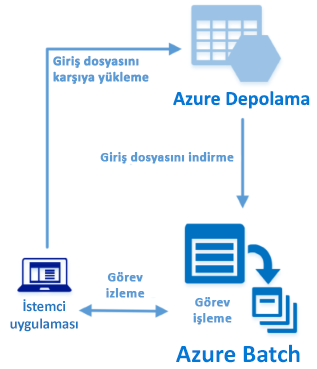

# <a name="quickstart-run-your-first-azure-batch-job-with-the-net-api"></a>Hızlı Başlangıç: .NET API ile ilk Azure Batch işinizi çalıştırma

Bu hızlı başlangıç, Azure Batch .NET API üzerinde derlenmiş bir C# uygulamasından Azure Batch işi çalıştırır. Uygulama, Azure depolamaya birkaç veri dosyası yükler ve sonra Batch işlem düğümlerinin (sanal makine) *havuzunu* oluşturur. Daha sonra, temel bir komut kullanarak havuz üzerindeki her bir giriş dosyasını işlemek üzere *görevler* çalıştıran örnek bir *iş* oluşturur. Bu hızlı başlangıcı tamamladıktan sonra, Batch hizmetinin temel kavramlarını anlayacak ve Batch’i daha büyük ölçekte daha gerçekçi iş yükleri ile denemeye hazır olacaksınız.



[!INCLUDE [quickstarts-free-trial-note.md](../../includes/quickstarts-free-trial-note.md)]

## <a name="prerequisites"></a>Önkoşullar

* [Visual Studio 2017](https://www.visualstudio.com/vs) veya Linux, macOS ya da Windows için [.NET Core 2.1](https://www.microsoft.com/net/download/dotnet-core/2.1). 

* Bir Batch hesabı ve bağlı bir Azure Depolama hesabı. Bu hesapları oluşturmak için [Azure portalı](quick-create-portal.md) veya [Azure CLI](quick-create-cli.md) kullanan Batch hızlı başlangıçlarına bakın. 

## <a name="sign-in-to-azure"></a>Azure'da oturum açma

[https://portal.azure.com](https://portal.azure.com) adresinden Azure portalında oturum açın.

[!INCLUDE [batch-common-credentials](../../includes/batch-common-credentials.md)]

## <a name="download-the-sample"></a>Örneği indirme

GitHub’dan [örnek uygulamayı indirin veya kopyalayın](https://github.com/Azure-Samples/batch-dotnet-quickstart). Örnek uygulama deposunu bir Git istemcisi ile kopyalamak için aşağıdaki komutu kullanın:

```
git clone https://github.com/Azure-Samples/batch-dotnet-quickstart.git
```

Visual Studio `BatchDotNetQuickstart.sln` çözüm dosyasını içeren dizine gidin.

Çözüm dosyasını Visual Studio'da açın ve `Program.cs` içindeki kimlik bilgisi dizelerini hesaplarınız için edindiğiniz değerlerle güncelleştirin. Örneğin:

```csharp
// Batch account credentials
private const string BatchAccountName = "mybatchaccount";
private const string BatchAccountKey  = "xxxxxxxxxxxxxxxxE+yXrRvJAqT9BlXwwo1CwF+SwAYOxxxxxxxxxxxxxxxx43pXi/gdiATkvbpLRl3x14pcEQ==";
private const string BatchAccountUrl  = "https://mybatchaccount.mybatchregion.batch.azure.com";

// Storage account credentials
private const string StorageAccountName = "mystorageaccount";
private const string StorageAccountKey  = "xxxxxxxxxxxxxxxxy4/xxxxxxxxxxxxxxxxfwpbIC5aAWA8wDu+AFXZB827Mt9lybZB1nUcQbQiUrkPtilK5BQ==";
```

[!INCLUDE [batch-credentials-include](../../includes/batch-credentials-include.md)]

## <a name="build-and-run-the-app"></a>Uygulamayı derleme ve çalıştırma

Batch iş akışını uygulamalı olarak görmek için uygulamayı Visual Studio'da veya `dotnet build` ve `dotnet run` komutlarıyla komut satırında derleyip çalıştırın. Uygulamayı çalıştırdıktan sonra, uygulamanın her bir parçasının ne işe yaradığını öğrenmek üzere kodu gözden geçirin. Örneğin Visual Studio'da:

* Çözüm Gezgini'nde çözüme sağ tıklayın ve **Derleme Çözümü**’ne tıklayın. 

* İstenirse, herhangi bir NuGet paketinin geri yüklenmesini onaylayın. Eksik paketleri indirmeniz gerekirse, [NuGet Paket Yöneticisi](https://docs.nuget.org/consume/installing-nuget)’nin yüklü olduğundan emin olun.

Ardından çalıştırın. Örnek uygulamayı çalıştırdığınızda, konsol çıktısı aşağıdakine benzer. Yürütme sırasında, havuzun işlem düğümleri başlatıldığı sırada `Monitoring all tasks for 'Completed' state, timeout in 00:30:00...` konumunda bir duraklama yaşarsınız. Görevler, ilk işlem düğümünü çalışır çalışmaz çalışmak üzere kuyruğa alınır. Havuz, işlem düğümleri, iş ve görevleri izlemek için [Azure portalında](https://portal.azure.com) Batch hesabınıza gidin.

```
Sample start: 11/16/2018 4:02:54 PM

Container [input] created.
Uploading file taskdata0.txt to container [input]...
Uploading file taskdata1.txt to container [input]...
Uploading file taskdata2.txt to container [input]...
Creating pool [DotNetQuickstartPool]...
Creating job [DotNetQuickstartJob]...
Adding 3 tasks to job [DotNetQuickstartJob]...
Monitoring all tasks for 'Completed' state, timeout in 00:30:00...
```

Görevleri tamamladıktan sonra her görev için aşağıdakine benzer bir çıktı görürsünüz:

```
Printing task output.
Task: Task0
Node: tvm-2850684224_3-20171205t000401z
Standard out:
Batch processing began with mainframe computers and punch cards. Today it still plays a central role in business, engineering, science, and other pursuits that require running lots of automated tasks....
stderr:
...
```

Varsayılan yapılandırmasında uygulama çalıştırıldığında tipik yürütme süresi yaklaşık 5 dakikadır. En çok süren işlem ilk havuz kurulumudur. İşi yeniden çalıştırmak için önceki çalıştırmadan işi silin ve havuzu silmeyin. Önceden yapılandırılmış bir havuzda işin tamamlanması birkaç saniye sürer.


## <a name="review-the-code"></a>Kodu gözden geçirin

Bu hızlı başlangıçtaki .NET uygulaması şunları yapar:

* Azure depolama hesabınızdaki blob kapsayıcısına üç küçük metin dosyası yükler. Bu dosyalar, Batch tarafından işlenecek girişlerdir.
* Windows Server çalıştıran bir işlem düğümleri havuzu oluşturur.
* Düğümler üzerinde çalıştırılacak bir iş ve üç görev oluşturur. Her görev bir Windows komut satırı kullanarak giriş dosyalarından birini işler. 
* Görevler tarafından döndürülen dosyaları gösterir.

Ayrıntılar için `Program.cs` dosyasına ve aşağıdaki bölümlere bakın. 

### <a name="preliminaries"></a>Başlangıç bilgileri

Bir depolama hesabı ile etkileşimde bulunmak üzere uygulama, .NET için Azure Depolama İstemci Kitaplığı’nı kullanır. [CloudStorageAccount](/dotnet/api/microsoft.azure.cosmos.table.cloudstorageaccount) ile hesaba bir başvuru oluşturur ve buradan da bir [CloudBlobClient](/dotnet/api/microsoft.azure.storage.blob.cloudblobclient) oluşturur.

```csharp
CloudBlobClient blobClient = storageAccount.CreateCloudBlobClient();
```

Uygulama, depolama hesabında bir kapsayıcı oluşturmak ve kapsayıcıya veri dosyaları yüklemek için `blobClient` başvurusunu kullanır. Depolama alanındaki dosyalar, Batch hizmetinin daha sonra işlem düğümlerine indirebileceği Batch [ResourceFile](/dotnet/api/microsoft.azure.batch.resourcefile) nesneleri olarak tanımlanır.

```csharp
List<string> inputFilePaths = new List<string>
{
    "taskdata0.txt",
    "taskdata1.txt",
    "taskdata2.txt"
};

List<ResourceFile> inputFiles = new List<ResourceFile>();

foreach (string filePath in inputFilePaths)
{
    inputFiles.Add(UploadFileToContainer(blobClient, inputContainerName, filePath));
}
```

Uygulama, Batch hizmetinde havuz, iş ve görevleri oluşturup yönetmek üzere bir [BatchClient](/dotnet/api/microsoft.azure.batch.batchclient) nesnesi oluşturur. Örnekteki Batch istemcisi, paylaşılan anahtar kimlik doğrulaması kullanır. (Batch, Azure Active Directory kimlik doğrulamasını da destekler.)

```csharp
BatchSharedKeyCredentials cred = new BatchSharedKeyCredentials(BatchAccountUrl, BatchAccountName, BatchAccountKey);

using (BatchClient batchClient = BatchClient.Open(cred))
...
```

### <a name="create-a-pool-of-compute-nodes"></a>İşlem düğümleri havuzu oluşturma

Bir Batch havuzu oluşturmak için uygulama, düğüm sayısını, VM boyutunu ve havuz yapılandırmasını ayarlamak üzere [BatchClient.PoolOperations.CreatePool](/dotnet/api/microsoft.azure.batch.pooloperations.createpool) yöntemini kullanır. Burada [VirtualMachineConfiguration](/dotnet/api/microsoft.azure.batch.virtualmachineconfiguration) nesnesi, Azure Market’te yayımlanmış bir Windows Server görüntüsüne [ImageReference](/dotnet/api/microsoft.azure.batch.imagereference) belirtir. Batch, Azure Market’te çok çeşitli Linux ve Windows Server görüntülerinin yanı sıra özel VM görüntülerini destekler.

Düğüm sayısı (`PoolNodeCount`) ve VM boyutu (`PoolVMSize`), tanımlı sabitlerdir. Varsayılan olarak, örnek 2 boyutunda *Standard_A1_v2* düğümleri havuzu oluşturur. Önerilen boyut, bu hızlı örnek için performans ile maliyetin iyi bir dengesini sunar.

[Commit](/dotnet/api/microsoft.azure.batch.cloudpool.commit) yöntemi, havuzu Batch hizmetine gönderir.

```csharp

private static VirtualMachineConfiguration CreateVirtualMachineConfiguration(ImageReference imageReference)
{
    return new VirtualMachineConfiguration(
        imageReference: imageReference,
        nodeAgentSkuId: "batch.node.windows amd64");
}

private static ImageReference CreateImageReference()
{
    return new ImageReference(
        publisher: "MicrosoftWindowsServer",
        offer: "WindowsServer",
        sku: "2016-datacenter-smalldisk",
        version: "latest");
}

private static void CreateBatchPool(BatchClient batchClient, VirtualMachineConfiguration vmConfiguration)
{
    try
    {
        CloudPool pool = batchClient.PoolOperations.CreatePool(
            poolId: PoolId,
            targetDedicatedComputeNodes: PoolNodeCount,
            virtualMachineSize: PoolVMSize,
            virtualMachineConfiguration: vmConfiguration);

        pool.Commit();
    }
...

```

### <a name="create-a-batch-job"></a>Batch işi oluşturma

Batch işi bir veya daha fazla görevin mantıksal gruplandırmasıdır. Bir iş, öncelik gibi görevler arasında ortak olan ayarları ve görevlerin çalıştırılacağı havuzu içerir. Uygulama, havuzunuzda bir iş oluşturmak üzere [BatchClient.JobOperations.CreateJob](/dotnet/api/microsoft.azure.batch.joboperations.createjob) yöntemini kullanır.

[Commit](/dotnet/api/microsoft.azure.batch.cloudjob.commit) yöntemi, işi Batch hizmetine gönderir. Başlangıçta iş hiçbir görev içermez.

```csharp
try
{
    CloudJob job = batchClient.JobOperations.CreateJob();
    job.Id = JobId;
    job.PoolInformation = new PoolInformation { PoolId = PoolId };

    job.Commit();
}
...
```

### <a name="create-tasks"></a>Görev oluşturma

Uygulama, [CloudTask](/dotnet/api/microsoft.azure.batch.cloudtask) nesnelerinin bir listesini oluşturur. Her görev, [CommandLine](/dotnet/api/microsoft.azure.batch.cloudtask.commandline) özelliği kullanarak giriş `ResourceFile` nesnesini işler. Örnekte, komut satırı giriş dosyasını göstermek üzere Windows `type` komutunu çalıştırır. Bu komut, tanıtım amaçlı basit bir örnektir. Batch kullandığınızda komut satırı, uygulamanızı veya betiğinizi belirttiğiniz yerdir. Batch, işlem düğümlerine uygulama ve betik dağıtmanın birkaç yolunu sağlar.

Sonra uygulama, [AddTask](/dotnet/api/microsoft.azure.batch.joboperations.addtask) yöntemi ile görevleri işe ekler ve işlem düğümleri üzerinde çalışmak üzere kuyruğa alır.

```csharp
for (int i = 0; i < inputFiles.Count; i++)
{
    string taskId = String.Format("Task{0}", i);
    string inputFilename = inputFiles[i].FilePath;
    string taskCommandLine = String.Format("cmd /c type {0}", inputFilename);

    CloudTask task = new CloudTask(taskId, taskCommandLine);
    task.ResourceFiles = new List<ResourceFile> { inputFiles[i] };
    tasks.Add(task);
}

batchClient.JobOperations.AddTask(JobId, tasks);
```

### <a name="view-task-output"></a>Görev çıkışını görüntüleme

Uygulama, tamamlandığından emin olmak üzere görevleri izlemek için bir [TaskStateMonitor](/dotnet/api/microsoft.azure.batch.taskstatemonitor) oluşturur. Daha sonra uygulama, [CloudTask.ComputeNodeInformation](/dotnet/api/microsoft.azure.batch.cloudtask.computenodeinformation) özelliğini kullanarak her bir tamamlanmış görevin oluşturduğu `stdout.txt` dosyasını gösterir. Görev başarıyla çalıştırıldığında, görev komutunun çıkışı `stdout.txt` dosyasına yazılır:

```csharp
foreach (CloudTask task in completedtasks)
{
    string nodeId = String.Format(task.ComputeNodeInformation.ComputeNodeId);
    Console.WriteLine("Task: {0}", task.Id);
    Console.WriteLine("Node: {0}", nodeId);
    Console.WriteLine("Standard out:");
    Console.WriteLine(task.GetNodeFile(Constants.StandardOutFileName).ReadAsString());
}
```

## <a name="clean-up-resources"></a>Kaynakları temizleme

Uygulama kendi oluşturduğu depolama kapsayıcısını otomatik olarak siler ve Batch havuzu ve işini silme seçeneğini sunar. Zamanlanmış bir iş olmasa bile, düğümler çalışırken havuz için sizden ücret alınır. Havuz artık gerekli değilse silin. Havuzu sildiğinizde düğümler üzerindeki tüm görev çıkışları silinir.

Kaynak grubunu, Batch hesabını ve depolama hesabını artık gerekli değilse silin. Azure portalında bu işlemi yapmak için Batch hesabına ait kaynak grubunu seçin ve **Kaynak Grubunu Sil**’e tıklayın.

## <a name="next-steps"></a>Sonraki adımlar

Bu hızlı başlangıçta, bir Batch havuzu ve bir Batch işi oluşturmak amacıyla Batch .NET API’si kullanılarak oluşturulan küçük bir uygulamayı çalıştırdınız. İş, örnek görevler çalıştırmış ve düğümler üzerinde oluşturulan çıktıyı indirmiştir. Batch hizmetinin temel kavramlarını anladıktan sonra, Batch’i daha büyük ölçekte daha gerçekçi iş yükleri ile denemeye hazırsınız. Azure Batch hakkında daha fazla bilgi almak ve bir gerçek yaşam uygulaması ile paralel iş yükü açıklaması görmek için Batch .NET öğreticisine geçin.


> [!div class="nextstepaction"]
> [.NET ile paralel iş yükü işleme](tutorial-parallel-dotnet.md)
