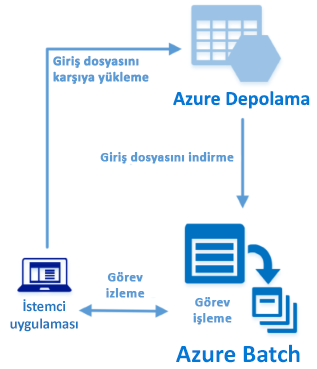

# <a name="quickstart-run-your-first-batch-job-with-the-python-api"></a>Hızlı Başlangıç: Python API'si ile ilk Batch işinizi çalıştırma

Bu hızlı başlangıç, Azure Batch Python API üzerinde derlenmiş bir uygulamadan Azure Batch işi çalıştırır. Uygulama, Azure depolamaya birkaç veri dosyası yükler ve sonra Batch işlem düğümlerinin (sanal makine) *havuzunu* oluşturur. Daha sonra, temel bir komut kullanarak havuz üzerindeki her bir giriş dosyasını işlemek üzere *görevler* çalıştıran örnek bir *iş* oluşturur. Bu hızlı başlangıcı tamamladıktan sonra, Batch hizmetinin temel kavramlarını anlayacak ve Batch’i daha büyük ölçekte daha gerçekçi iş yükleri ile denemeye hazır olacaksınız.
 


[!INCLUDE [quickstarts-free-trial-note.md](../../includes/quickstarts-free-trial-note.md)]

## <a name="prerequisites"></a>Önkoşullar

* [Python sürüm 2.7 veya 3.3 ya da üzeri](https://www.python.org/downloads/)

* [pip](https://pip.pypa.io/en/stable/installing/) paket yöneticisi

* Bir Azure Batch hesabı ve bağlı bir Azure Depolama hesabı. Bu hesapları oluşturmak için [Azure portalı](quick-create-portal.md) veya [Azure CLI](quick-create-cli.md) kullanan Batch hızlı başlangıçlarına bakın. 

## <a name="sign-in-to-azure"></a>Azure'da oturum açma

[https://portal.azure.com](https://portal.azure.com) adresinden Azure portalında oturum açın.

[!INCLUDE [batch-common-credentials](../../includes/batch-common-credentials.md)]

## <a name="download-the-sample"></a>Örneği indirme

GitHub’dan [örnek uygulamayı indirin veya kopyalayın](https://github.com/Azure-Samples/batch-python-quickstart). Örnek uygulama deposunu bir Git istemcisi ile kopyalamak için aşağıdaki komutu kullanın:

```
git clone https://github.com/Azure-Samples/batch-python-quickstart.git
```

`python_quickstart_client.py` Python betiğini içeren dizine gidin.

Python geliştirme ortamınızda `pip` kullanarak gerekli paketleri yükleyin.

```bash
pip install -r requirements.txt
```

`config.py` dosyasını açın. Batch ve depolama hesabı kimlik bilgilerini, hesaplarınız için edindiğiniz değerlerle güncelleştirin. Örneğin:

```Python
_BATCH_ACCOUNT_NAME = 'mybatchaccount'
_BATCH_ACCOUNT_KEY = 'xxxxxxxxxxxxxxxxE+yXrRvJAqT9BlXwwo1CwF+SwAYOxxxxxxxxxxxxxxxx43pXi/gdiATkvbpLRl3x14pcEQ=='
_BATCH_ACCOUNT_URL = 'https://mybatchaccount.mybatchregion.batch.azure.com'
_STORAGE_ACCOUNT_NAME = 'mystorageaccount'
_STORAGE_ACCOUNT_KEY = 'xxxxxxxxxxxxxxxxy4/xxxxxxxxxxxxxxxxfwpbIC5aAWA8wDu+AFXZB827Mt9lybZB1nUcQbQiUrkPtilK5BQ=='
```

## <a name="run-the-app"></a>Uygulamayı çalıştırma

Batch iş akışını çalışır durumda görmek için betiği çalıştırın:

```
python python_quickstart_client.py
```

Betiği çalıştırdıktan sonra, uygulamanın her bir parçasının ne işe yaradığını öğrenmek üzere kodu gözden geçirin. 

Örnek uygulamayı çalıştırdığınızda, konsol çıktısı aşağıdakine benzer. Yürütme sırasında, havuzun işlem düğümleri başlatıldığı sırada `Monitoring all tasks for 'Completed' state, timeout in 00:30:00...` konumunda bir duraklama yaşarsınız. Görevler, ilk işlem düğümünü çalışır çalışmaz çalışmak üzere kuyruğa alınır. Batch hesabınızdaki havuz, işlem düğümleri, iş ve görevleri izlemek için [Azure portalında](https://portal.azure.com) Batch hesabınıza gidin.

```
Sample start: 11/26/2018 4:02:54 PM

Container [input] created.
Uploading file taskdata0.txt to container [input]...
Uploading file taskdata1.txt to container [input]...
Uploading file taskdata2.txt to container [input]...
Creating pool [PythonQuickstartPool]...
Creating job [PythonQuickstartJob]...
Adding 3 tasks to job [PythonQuickstartJob]...
Monitoring all tasks for 'Completed' state, timeout in 00:30:00...
```

Görevleri tamamladıktan sonra her görev için aşağıdakine benzer bir çıktı görürsünüz:

```
Printing task output...
Task: Task0
Node: tvm-2850684224_3-20171205t000401z
Standard out:
Batch processing began with mainframe computers and punch cards. Today it still plays a central role in business, engineering, science, and other pursuits that require running lots of automated tasks....
...
```

Varsayılan yapılandırmasında uygulama çalıştırıldığında tipik yürütme süresi yaklaşık 3 dakikadır. En çok süren işlem ilk havuz kurulumudur.

## <a name="review-the-code"></a>Kodu gözden geçirin

Bu hızlı başlangıçtaki Python uygulaması şunları yapar:

* Azure depolama hesabınızdaki blob kapsayıcısına üç küçük metin dosyası yükler. Bu dosyalar, Batch görevleri tarafından işlenecek girdilerdir.
* Ubuntu 18.04 LTS çalıştıran iki işlem düğümleri havuzu oluşturur.
* Düğümler üzerinde çalıştırılacak bir iş ve üç görev oluşturur. Her görev bir Bash kabuk komut satırı kullanarak giriş dosyalarından birini işler.
* Görevler tarafından döndürülen dosyaları gösterir.

Ayrıntılar için `python_quickstart_client.py` dosyasına ve aşağıdaki bölümlere bakın.

### <a name="preliminaries"></a>Başlangıç bilgileri

Bir depolama hesabıyla etkileşimde bulunmak için uygulama, [azure-storage-blob](https://pypi.python.org/pypi/azure-storage-blob) paketini kullanarak bir [BlockBlobService](/python/api/azure.storage.blob.blockblobservice.blockblobservice) nesnesi oluşturur.

```python
blob_client = azureblob.BlockBlobService(
    account_name=config._STORAGE_ACCOUNT_NAME,
    account_key=config._STORAGE_ACCOUNT_KEY)
```

Uygulama, depolama hesabında bir kapsayıcı oluşturmak ve kapsayıcıya veri dosyaları yüklemek için `blob_client` başvurusunu kullanır. Depolama alanındaki dosyalar, Batch hizmetinin daha sonra işlem düğümlerine indirebileceği Batch [ResourceFile](/python/api/azure.batch.models.resourcefile) nesneleri olarak tanımlanır.

```python
input_file_paths = [os.path.join(sys.path[0], 'taskdata0.txt'),
                    os.path.join(sys.path[0], 'taskdata1.txt'),
                    os.path.join(sys.path[0], 'taskdata2.txt')]

input_files = [
    upload_file_to_container(blob_client, input_container_name, file_path)
    for file_path in input_file_paths]
```

Uygulama, Batch hizmetinde havuz, iş ve görevleri oluşturup yönetmek üzere bir [BatchServiceClient](/python/api/azure.batch.batchserviceclient) nesnesi oluşturur. Örnekteki Batch istemcisi, paylaşılan anahtar kimlik doğrulaması kullanır. Batch, Azure Active Directory kimlik doğrulamasını da destekler.

```python
credentials = batch_auth.SharedKeyCredentials(config._BATCH_ACCOUNT_NAME,
                                              config._BATCH_ACCOUNT_KEY)

batch_client = batch.BatchServiceClient(
    credentials,
    batch_url=config._BATCH_ACCOUNT_URL)
```

### <a name="create-a-pool-of-compute-nodes"></a>İşlem düğümleri havuzu oluşturma

Uygulama, Batch havuzu oluşturmak için düğüm sayısını, VM boyutunu ve havuz yapılandırmasını ayarlamak üzere Batch [PoolAddParameter](/python/api/azure.batch.models.pooladdparameter) sınıfını kullanır. Burada bir [VirtualMachineConfiguration](/python/api/azure.batch.models.virtualmachineconfiguration) nesnesini belirtir bir [Imagereference](/python/api/azure.batch.models.imagereference) Azure Market'te yayımlanmış bir Ubuntu Server 18.04 LTS görüntüsüne. Batch, Azure Market’te çok çeşitli Linux ve Windows Server görüntülerinin yanı sıra özel VM görüntülerini destekler.

Düğüm sayısı (`_POOL_NODE_COUNT`) ve VM boyutu (`_POOL_VM_SIZE`), tanımlı sabitlerdir. Varsayılan olarak, örnek 2 boyutunda *Standard_A1_v2* düğümleri havuzu oluşturur. Önerilen boyut, bu hızlı örnek için performans ile maliyetin iyi bir dengesini sunar.

[Pool.add](/python/api/azure.batch.operations.pooloperations) yöntemi, havuzu Batch hizmetine gönderir.

```python
new_pool = batch.models.PoolAddParameter(
    id=pool_id,
    virtual_machine_configuration=batchmodels.VirtualMachineConfiguration(
        image_reference=batchmodels.ImageReference(
            publisher="Canonical",
            offer="UbuntuServer",
            sku="18.04-LTS",
            version="latest"
        ),
        node_agent_sku_id="batch.node.ubuntu 18.04"),
    vm_size=config._POOL_VM_SIZE,
    target_dedicated_nodes=config._POOL_NODE_COUNT
)
batch_service_client.pool.add(new_pool)
```

### <a name="create-a-batch-job"></a>Batch işi oluşturma

Batch işi bir veya daha fazla görevin mantıksal gruplandırmasıdır. Bir iş, öncelik gibi görevler arasında ortak olan ayarları ve görevlerin çalıştırılacağı havuzu içerir. Uygulama, havuzunuzda bir iş oluşturmak üzere [JobAddParameter](/python/api/azure.batch.models.jobaddparameter) sınıfını kullanır. [Job.add](/python/api/azure.batch.operations.joboperations) yöntemi, havuzu Batch hizmetine gönderir. Başlangıçta iş hiçbir görev içermez.

```python
job = batch.models.JobAddParameter(
    id=job_id,
    pool_info=batch.models.PoolInformation(pool_id=pool_id))
batch_service_client.job.add(job)
```

### <a name="create-tasks"></a>Görev oluşturma

Uygulama, [TaskAddParameter](/python/api/azure.batch.models.taskaddparameter) sınıfını kullanarak görev nesnelerinin bir listesini oluşturur. Her görev, `command_line` parametresini kullanarak girdi `resource_files` nesnesini işler. Örnekte, komut satırı metin dosyasını göstermek üzere Bash kabuk `cat` komutunu çalıştırır. Bu komut, tanıtım amaçlı basit bir örnektir. Batch kullandığınızda komut satırı, uygulamanızı veya betiğinizi belirttiğiniz yerdir. Batch, işlem düğümlerine uygulama ve betik dağıtmanın birkaç yolunu sağlar.

Sonra uygulama, [task.add_collection](/python/api/azure.batch.operations.taskoperations) yöntemi ile görevleri işe ekler ve işlem düğümleri üzerinde çalışmak üzere kuyruğa alır. 

```python
tasks = list()

for idx, input_file in enumerate(input_files):
    command = "/bin/bash -c \"cat {}\"".format(input_file.file_path)
    tasks.append(batch.models.TaskAddParameter(
        id='Task{}'.format(idx),
        command_line=command,
        resource_files=[input_file]
    )
    )
batch_service_client.task.add_collection(job_id, tasks)
```

### <a name="view-task-output"></a>Görev çıkışını görüntüleme

Uygulama, görevlerin tamamlandığından emin olmak için görev durumunu izler. Daha sonra uygulama, tamamlanan her görev tarafından oluşturulan `stdout.txt` dosyasını görüntüler. Görev başarıyla çalıştırıldığında, görev komutunun çıkışı `stdout.txt` dosyasına yazılır:

```python
tasks = batch_service_client.task.list(job_id)

for task in tasks:

    node_id = batch_service_client.task.get(job_id, task.id).node_info.node_id
    print("Task: {}".format(task.id))
    print("Node: {}".format(node_id))

    stream = batch_service_client.file.get_from_task(
        job_id, task.id, config._STANDARD_OUT_FILE_NAME)

    file_text = _read_stream_as_string(
        stream,
        encoding)
    print("Standard output:")
    print(file_text)
```

## <a name="clean-up-resources"></a>Kaynakları temizleme

Uygulama kendi oluşturduğu depolama kapsayıcısını otomatik olarak siler ve Batch havuzu ve işini silme seçeneğini sunar. Zamanlanmış bir iş olmasa bile, düğümler çalışırken havuz için sizden ücret alınır. Havuz artık gerekli değilse silin. Havuzu sildiğinizde düğümler üzerindeki tüm görev çıkışları silinir. 

Kaynak grubunu, Batch hesabını ve depolama hesabını artık gerekli değilse silin. Azure portalında bu işlemi yapmak için Batch hesabına ait kaynak grubunu seçin ve **Kaynak Grubunu Sil**’e tıklayın.

## <a name="next-steps"></a>Sonraki adımlar

Bu hızlı başlangıçta, bir Batch havuzu ve bir Batch işi oluşturmak amacıyla Batch Python API’si kullanılarak oluşturulan küçük bir uygulamayı çalıştırdınız. İş, örnek görevler çalıştırmış ve düğümler üzerinde oluşturulan çıktıyı indirmiştir. Batch hizmetinin temel kavramlarını anladıktan sonra, Batch’i daha büyük ölçekte daha gerçekçi iş yükleri ile denemeye hazırsınız. Azure Batch hakkında daha fazla bilgi almak ve bir gerçek yaşam uygulaması ile paralel iş yükü açıklaması görmek için Batch Python öğreticisine geçin.

> [!div class="nextstepaction"]
> [Python ile paralel iş yükü işleme](tutorial-parallel-python.md)
