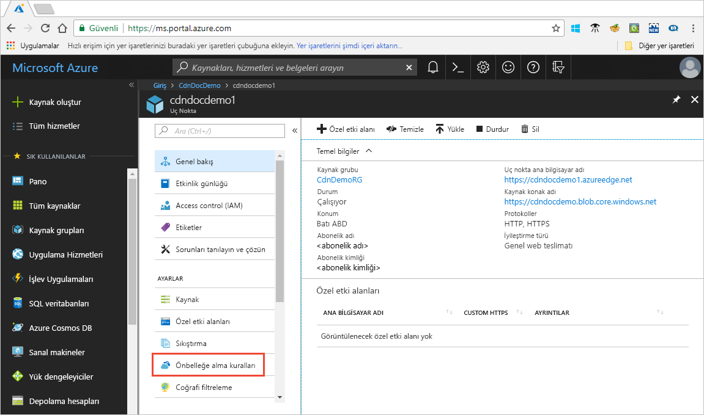

# Öğretici: Azure CDN önbelleğe alma kuralları ayarlayın

> [!NOTE] 
> Azure CDN önbelleğe alma kuralları yalnızca **Verizon'dan Azure CDN Standart** ve **Akamai'den Azure CDN Standart** için kullanılabilir. **Verizon'dan Azure CDN Premium**’da, benzer işlevler için **Yönet** portalında [Azure CDN kuralları altyapısı](cdn-rules-engine.md)’nı kullanın.
 

Bu öğreticide, Azure Content Delivery Network (CDN) önbelleğe alma kurallarını kullanarak varsayılan önbellek süre sonu davranışının hem genel olarak hem de URL yolu ve dosya uzantısı gibi özel koşullarla ayarlanması veya değiştirilmesi açıklanmıştır. Azure CDN iki tür önbelleğe alma kuralı sağlar:
- Genel önbelleğe alma kuralları: Uç nokta için tüm istekleri etkileyen profilinizde her uç nokta için bir genel önbelleğe alma kuralı ayarlayabilirsiniz. Genel önbelleğe alma kuralı ayarlandığında tüm HTTP önbellek yönergesi üst bilgilerini geçersiz kılar.

- Özel önbelleğe alma kuralları: Profilinizde bir veya daha fazla özel önbelleğe alma kuralları her uç noktası için ayarlayabilirsiniz. Özel önbelleğe alma kuralları ayarlandığında belirli yollar ve dosya uzantılarıyla eşleşir, sırasıyla işlenir ve genel önbelleğe alma kuralını geçersiz kılar. 

Bu öğreticide şunların nasıl yapıldığını öğreneceksiniz:
> [!div class="checklist"]
> - Önbelleğe alma kuralları sayfasını açın.
> - Genel önbelleğe alma kuralı oluşturun.
> - Özel önbelleğe alma kuralı oluşturun.

[!INCLUDE [quickstarts-free-trial-note](../../includes/quickstarts-free-trial-note.md)]

## Önkoşullar

Bu öğreticideki adımları tamamlayabilmeniz için öncelikle bir CDN profili ve en az bir CDN uç noktası oluşturmanız gerekir. Daha fazla bilgi için [hızlı başlangıç: Bir Azure CDN profili ve uç noktası oluşturma](cdn-create-new-endpoint.md).

## Azure CDN önbelleğe alma kuralları sayfasını açın

1. [Azure portalında](https://portal.azure.com) bir CDN profili ve ardından bir uç nokta seçin.

2. Ayarların altındaki sol bölmede **Önbelleğe alma kuralları**’nı seçin.

   

   **Önbelleğe alma kuralları** sayfası görüntülenir.

   

## Genel önbelleğe alma kurallarını ayarlama

Aşağıda gösterilen şekilde bir genel önbelleğe alma kuralı oluşturun:

1. **Genel önbelleğe alma kuralları**’nın altında **Sorgu dizesi önbelleğe alma davranışı** seçeneğini **Sorgu dizelerini yoksay** olarak ayarlayın.

2. **Önbelleğe alma davranışı** seçeneğini **Eksikse ayarla** olarak ayarlayın.
       
3. **Önbellek sona erme süresi** için, **Günler** alanına 10 yazın.

    Genel önbelleğe alma kuralı, uç noktaya yönelik tüm istekleri etkiler. Bu kural, mevcut kaynak önbellek yönergesi üst bilgilerini onaylar (`Cache-Control` veya `Expires`). Aksi takdirde, belirtilmemişlerse, önbelleği 10 güne ayarlar. 

    

## Özel önbelleğe alma kurallarını ayarlama

Aşağıda gösterilen şekilde bir özel önbelleğe alma kuralı oluşturun:

1. **Özel önbelleğe alma kuralları** altında, **Eşleşme koşulu** seçeneğini **Yol** ve **Eşleşme değeri** seçeneğini ise `/images/*.jpg` olarak ayarlayın.
    
2. **Önbelleğe alma davranışı** seçeneğini **Geçersiz kıl** olarak ayarlayın ve **Günler** alanına 30 yazın.
       
    Bu özel önbelleğe alma kuralı, uç noktanızdaki `/images` klasöründe bulunan tüm `.jpg` resim dosyalarında 30 günlük önbellek süresi ayarlar. Kaynak sunucu tarafından gönderilen tüm `Cache-Control` veya `Expires` HTTP üst bilgilerini geçersiz kılar.

    

    
## Kaynakları temizleme

Önceki adımlarda önbelleğe alma kuralları oluşturdunuz. Artık bu önbelleğe alma kurallarını kullanmak istemiyorsanız, aşağıdaki adımları gerçekleştirerek kaldırabilirsiniz:
 
1. Bir CDN profili ve ardından kaldırmak istediğiniz önbelleğe alma kurallarını içeren uç noktayı seçin.

2. Ayarların altındaki sol bölmede **Önbelleğe alma kuralları**’nı seçin.

3. **Genel önbelleğe alma kuralları** altında **Önbelleğe alma davranışı** seçeneğini **Ayarlı değil** olarak ayarlayın.
 
4. **Özel önbelleğe alma kuralları** altında, silmek istediğiniz kuralın yanındaki onay kutusunu seçin.

5. **Sil**’i seçin.

6. Sayfanın üst kısmından **Kaydet**’i seçin.

## Sonraki adımlar

Bu öğreticide, şunların nasıl yapıldığını öğrendiniz:

> [!div class="checklist"]
> - Önbelleğe alma kuralları sayfasını açın.
> - Genel önbelleğe alma kuralı oluşturun.
> - Özel önbelleğe alma kuralı oluşturun.

Ek önbelleğe alma kuralı ayarlarını yapılandırma konusunda bilgi edinmek için bir sonraki makaleye ilerleyin.

> [!div class="nextstepaction"]
> [Azure CDN önbelleğe alma davranışını önbelleğe alma kurallarıyla denetleme](cdn-caching-rules.md)

