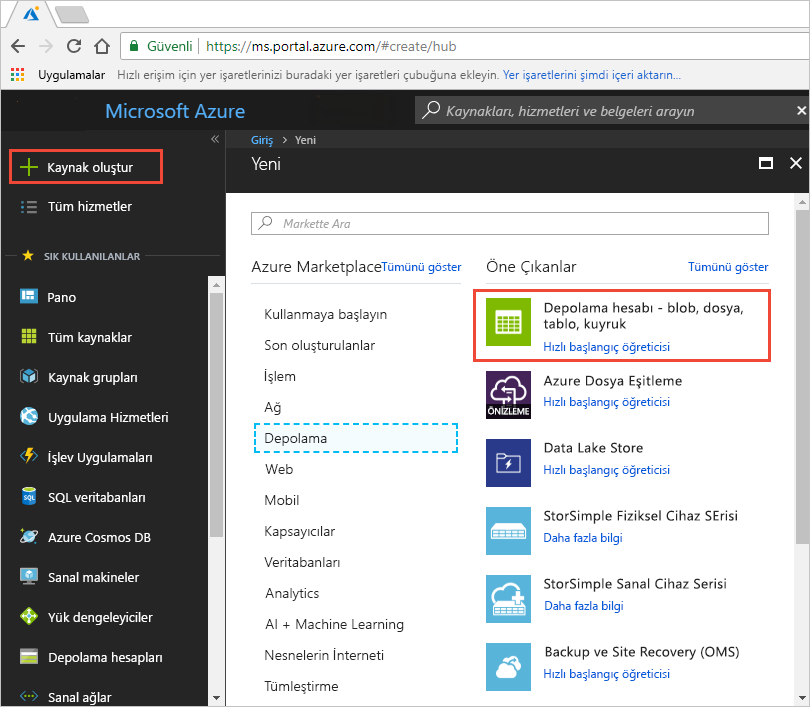
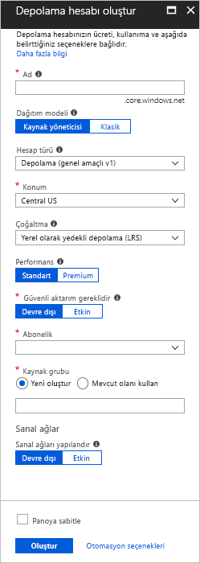
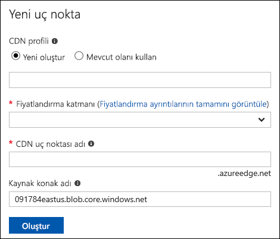
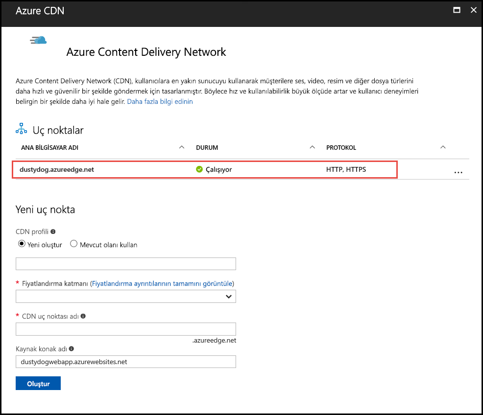
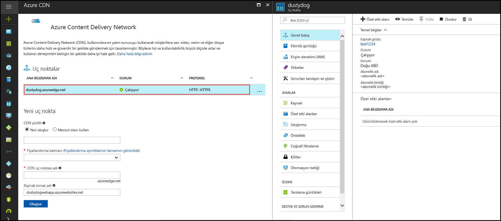

# Hızlı Başlangıç: Bir Azure depolama hesabını Azure CDN ile tümleştirme
Bu hızlı başlangıçta [Azure İçerik Teslim Ağı'nı (CDN)](cdn-overview.md) Azure depolamadan önbelleğe içerik almak için etkinleştireceksiniz. Azure CDN, geliştiricilere yüksek bant genişlikli içerik sunmak için genel bir çözüm sunmaktadır. İşlem örneklerinin bloblarını ve statik içeriğini Birleşik Devletler, Avrupa, Asya, Avustralya ve Güney Amerika'daki fiziksel düğümlerde önbelleğe alabilir.

[!INCLUDE [quickstarts-free-trial-note](../../includes/quickstarts-free-trial-note.md)]

## Azure portalında oturum açma
Azure hesabınızla [Azure portalında](https://portal.azure.com) oturum açın.

## Depolama hesabı oluşturma
Bir Azure aboneliğine yönelik yeni bir depolama hesabı oluşturmak için aşağıdaki yordamı kullanın. Bir depolama hesabı Azure Depolama hizmetlerine erişmenizi sağlar. Depolama hesabı Azure depolama hizmeti bileşenlerinin her biri erişmek için ad alanı en üst düzey temsil eder: Azure Blob, kuyruk ve tablo depolama. Daha fazla bilgi için bkz: [Microsoft Azure Storage'a giriş](../storage/common/storage-introduction.md).

Bir depolama hesabı oluşturmak için hizmetin yöneticisi veya ilişkili aboneliğin bir ortak yöneticisi olmanız gerekir.

Bir depolama hesabı oluşturmak için Azure portal ve PowerShell dahil olmak üzere çeşitli yöntemler kullanabilirsiniz. Bu hızlı başlangıç, Azure portalın nasıl kullanılacağını göstermektedir.   

**Bir Azure aboneliğine bir depolama hesabı oluşturmak için**

1. Azure portalında sol üst köşedeki **Kaynak oluştur** seçeneğini belirleyin. 

    **Yeni** bölmesi görüntülenir.

2. **Depolama**’yı ve sonra **Depolama hesabı - blob, dosya, tablo, kuyruk** öğesini seçin.
    
    

    **Depolama hesabı oluşturma** bölmesi görünür.   

    

3. **Ad** kutusuna bir alt etki alanı adı girin. Bu giriş, 3-24 küçük harf ve rakam içerebilir.
   
    Bu değer, aboneliğin blob, kuyruk veya tablo kaynağı adreslerine ulaşmak için kullanılan URI içindeki konak adı olur. Blob depolamadaki bir kapsayıcı kaynağının adresine ulaşmak için aşağıdaki biçimde bir URI kullanın:
   
    http://*&lt;StorageAcountLabel&gt;*.blob.core.windows.net/*&lt;kapsayicim&gt;*

    Burada  *&lt;StorageAccountLabel&gt;*, **Ad** kutusuna girdiğiniz değeri gösterir.
   
    > [!IMPORTANT]    
    > URL etiketi, depolama hesabının URI'sinin alt etki alanını oluşturur ve Azure'da barındırılan tüm hizmetler arasında benzersiz olması gerekir.
   
    Bu değer ayrıca portalda depolama hesabının adı olarak veya programlamada bu hesaba erişirken de kullanılır.
    
4. Ayarların geri kalanı için aşağıdaki tabloda belirtilen değerleri kullanın:

    | Ayar  | Değer |
    | -------- | ----- |
    | **Dağıtım modeli** | Varsayılan değeri kullanın. |
    | **Hesap türü** | Varsayılan değeri kullanın. |
    | **Konum**    | Açılan listeden **Orta ABD**’yi seçin. |
    | **Çoğaltma** | Varsayılan değeri kullanın. |
    | **Performans** | Varsayılan değeri kullanın. |
    | **Güvenli aktarım gerekir** | Varsayılan değeri kullanın. |
    | **Abonelik** | Açılan listeden bir Azure aboneliği seçin. |
    | **Kaynak grubu** | **Yeni oluştur**’u seçin ve kaynak grubu adınız olarak *my-resource-group-123* girin. Bu adın küresel olarak benzersiz olması gerekir. Ad daha önceden kullanılmışsa, farklı bir ad girebilir ya da **Var olanı kullan**'ı seçip aşağı açılan listeden **my-resource-group-123**'ü seçebilirsiniz.  Kaynak grupları hakkında daha fazla bilgi için bkz. [Azure Resource Manager’a genel bakış](../azure-resource-manager/resource-group-overview.md#resource-groups).| 
    | **Sanal ağları yapılandırma** | Varsayılan değeri kullanın. |  
    
5. Oluşturulduktan sonra depolama hesabını panonuza kaydetmek için **Panoya sabitle**'yi seçin.
    
6. **Oluştur**’u seçin. Depolama hesabını oluşturmayı tamamlamak birkaç dakika alabilir.

## Depolama hesabı için Azure CDN'yi etkinleştirme

Azure CDN'yi doğrudan depolama hesabınızdan depolama hesabınız için etkinleştirebilirsiniz. CDN uç noktanız için [büyük dosya indirmeyi en iyi duruma getirme](cdn-optimization-overview.md#large-file-download) gibi gelişmiş yapılandırma ayarları belirtmek istiyorsanız, bir CDN profili ve uç noktası oluşturmak üzere bunun yerine [Azure CDN uzantısını](cdn-create-new-endpoint.md) kullanabilirsiniz.

1. Panodan bir depolama hesabını ve ardından sol bölmeden **Azure CDN**'yi seçin. **Azure CDN** düğmesi hemen görünmüyorsa, bulmak için CDN'yi sol bölmenin **Arama** kutusuna girebilirsiniz.
    
    **Azure CDN** sayfası görünür.

    
    
2. Aşağıdaki tabloda belirtilen gerekli bilgileri girerek yeni bir uç noktası oluşturun:

    | Ayar  | Değer |
    | -------- | ----- |
    | **CDN profili** | Seçin **Yeni Oluştur** ve profil adınızı girin, örneğin, *my-cdn-profile-123*. Bu adın küresel olarak benzersiz olması gerekir.  |
    | **Fiyatlandırma katmanı** | Açılan listeden **Standart Verizon**’u seçin. |
    | **CDN uç noktası adı** | Uç nokta konak adınız, yani girin *my-endpoint-123*. Bu adın küresel olarak benzersiz olması gerekir. Bu ad, _&lt;uç nokta adı&gt;_.azureedge.net etki alanındaki önbelleğe alınmış kaynaklarınıza erişmek için kullanılır. |
    | **Kaynak konak adı** | Yeni CDN uç noktası, kaynak sunucu için varsayılan olarak depolama hesabınızın konak adını kullanır. |

3. **Oluştur**’u seçin. Uç nokta oluşturulduktan sonra uç nokta listesinde görünür.

    

## Ek CDN özelliklerini etkinleştirme
CDN uç noktası yapılandırma sayfasını açmak için depolama hesabı **Azure CDN** sayfasında listeden CDN uç noktasını seçin. Bu sayfadan [sıkıştırma](cdn-improve-performance.md), [sorgu dizesi önbelleğe alma](cdn-query-string.md) ve [coğrafi filtreleme](cdn-restrict-access-by-country.md) gibi ek CDN özelliklerini sunduğunuz içerik için etkinleştirebilirsiniz. 
    

## SAS'yi etkinleştirme
Özel depolama kapsayıcılarına sınırlı erişim vermek istiyorsanız, Azure depolama hesabınızın Paylaşılan Erişim İmzası (SAS) özelliğini kullanabilirsiniz. Bir SAS, hesap anahtarınızı açığa çıkarmadan Azure Depolama kaynaklarınıza kısıtlı erişim hakları veren bir URI'dir. Daha fazla bilgi için bkz. [Azure CDN'yi SAS ile kullanma](cdn-sas-storage-support.md).

## CDN içeriğine erişme
CDN'de önbelleğe alınmış içeriğe erişmek için portalda verilen CDN URL'sini kullanın. Önbelleğe alınan bir blobun adresi aşağıdaki biçimdedir:

http://<*Ucnoktaadi*\>.azureedge.net/<*genelKapsayicim*\>/<*BlobAdi*\>

> [!NOTE]
> Bir depolama hesabına Azure CDN erişimini etkinleştirdikten sonra herkesin erişebildiği nesneler CDN POP önbelleğine almaya uygundur. CDN'de önbelleğe alınmış durumdaki bir nesneyi değiştirirseniz, Azure CDN, yaşam süresinin dolmasından sonra önbelleğe alınan içeriği yenileyene kadar yeni içerik kullanılamaz.

## Azure CDN'den içerik kaldırma
Bir nesneyi Azure CDN'de artık önbelleğe almak istemiyorsanız, aşağıdaki adımlardan birini uygulayabilirsiniz:

* Kapsayıcıyı genel yerine özel yapma. Daha fazla bilgi için bkz. [Kapsayıcılara ve bloblara anonim okuma erişimini yönetme](../storage/blobs/storage-manage-access-to-resources.md).
* Azure portalı kullanarak CDN uç noktasını devre dışı bırakın veya silin.
* Barındırılan hizmetinizi nesne için isteklere artık yanıt vermeyecek şekilde değiştirin.

Azure CDN'de daha önce önbelleğe alınmış bir nesne, yaşam süresi sona erene veya uç nokta [temizlenene](cdn-purge-endpoint.md) kadar önbellekte kalır. Yaşam süresi sona erdiğinde, Azure CDN, CDN uç noktasının hala geçerli ve nesnenin hala anonim olarak erişilebilir durumda olup olmadığını belirler. Bunlar söz konusu değilse nesne artık önbelleğe alınmaz.

## Kaynakları temizleme
Önceki adımlarda, bir kaynak grubunda CDN profili ve bir uç nokta oluşturdunuz. [Sonraki adımlara](#next-steps) gidip uç noktanıza nasıl özel etki alanı ekleneceğini öğrenmek istiyorsanız bu kaynakları kaydedin. Ancak ileride bu kaynakları kullanmayı düşünmüyorsanız, kaynak grubunu silerek bunları silebilir, böylece ek ücretleri önleyebilirsiniz:

1. Azure portalındaki sol menüden **Kaynak grupları**’nı seçin ve sonra **my-resource-group-123** seçeneğini belirleyin.

2. **Kaynak grubu** sayfasında **Kaynak grubunu sil**’i seçin, metin kutusuna *my-resource-group-123* değerini girin ve **Sil**’i seçin.

    Bu işlem, bu hızlı başlangıçta oluşturduğunuz kaynak grubunu, profili ve uç noktayı siler.

3. Depolama hesabınızı silmek için, hesabı panodan seçin, sonra üstteki menüden **Sil**'i seçin.

## Sonraki adımlar
CDN uç noktanıza özel etki alanı ekleme ve uç noktada HTTPS'yi etkinleştirme hakkında bilgi edinmek için aşağıdaki öğreticiye bakın:

> [!div class="nextstepaction"]
> [Öğretici: HTTPS üzerinden bir Azure CDN özel etki alanını kullanarak depolama blob'lara erişim](cdn-storage-custom-domain-https.md)

