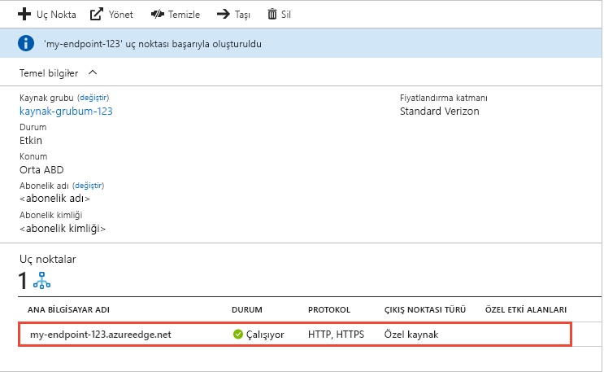

# Bir Azure CDN uç noktası oluşturma
Bu makalede oluşturmak için ayarları açıklar bir [Azure Content Delivery Network (CDN)](cdn-overview.md) var olan bir CDN profilinde uç noktası. Bir profil ve uç nokta oluşturduktan sonra müşterilerinize içerik sunmaya başlayabilirsiniz. Bir profil ve uç nokta oluşturma Hızlı Başlangıç için bkz: [hızlı başlangıç: Bir Azure CDN profili ve uç noktası oluşturma](cdn-create-new-endpoint.md).

## Önkoşullar
Bir CDN uç noktası oluşturmadan önce bir veya daha fazla CDN uç noktası içerebilir en az bir CDN profili oluşturmuş olmanız gerekir. CDN uç noktalarınızı internet etki alanı, web uygulaması veya başka ölçütlere göre düzenlemek için birden çok profil kullanabilirsiniz. CDN fiyatlandırması CDN profili düzeyinde uygulandığından, Azure CDN fiyatlandırma katmanları karışımını kullanmak istiyorsanız birden çok CDN profili oluşturmanız gerekir. Bir CDN profili oluşturmak için bkz: [yeni bir CDN profili oluşturmak](cdn-create-new-endpoint.md#create-a-new-cdn-profile).

## Azure portalında oturum açma
Azure hesabınızla [Azure portalında](https://portal.azure.com) oturum açın.

## Yeni bir CDN uç noktası oluşturma

1. [Azure portalında](https://portal.azure.com), CDN profilinize gidin. Önceki adımda bunu panoya sabitlemiş olabilirsiniz. Aksi takdirde, **Tüm hizmetler**’i, sonra da **CDN profilleri**’ni seçerek bulabilirsiniz. **CDN profilleri** bölmesinde, uç noktanızı eklemeyi planladığınız profili seçin. 
   
    CDN profili bölmesi görünür.

2. **Uç nokta**’yı seçin.
   
    
   
    **Uç nokta ekleyin** sayfası görüntülenir.
   
    

3. **Ad** için, yeni CDN uç noktasına yönelik benzersiz bir ad girin. Bu ad, etki alanındaki önbelleğe alınmış kaynaklarınıza erişmek için kullanılan  _\<uçnoktaadı >_ . azureedge.net.

4. İçin **kaynak türü**, aşağıdaki kaynak türlerinin birini seçin: 
   - **Depolama** Azure depolama için
   - **Bulut hizmeti** Azure Cloud Services
   - **Web uygulaması** Azure Web Apps için
   - **Özel kaynak** (Azure'da veya başka bir yerde barındırılan) tüm diğer genel olarak erişilebilir kaynağı web sunucusu

5. İçin **kaynak konak adı**seçin veya kaynak sunucu etki alanınızı girin. Aşağı açılan 4. adımda belirtilen türdeki tüm kullanılabilir kaynak sunucuları listeler. Seçtiyseniz **özel kaynak** , çıkış noktası türünüz olarak özel kaynak sunucunuza etki alanını girin.
    
6. İçin **kaynak yolu**, önbelleğe almak istediğiniz kaynakların yolunu girin. 5\. adımda belirttiğiniz etki alanındaki herhangi bir kaynağın önbelleğe alınmasına izin için bu ayarı boş bırakın.
    
7. **Kaynak ana bilgisayar üst bilgisi** için, Azure CDN'nin her bir istekle göndermesini istediğiniz ana bilgisayar üst bilgisini girin veya varsayılan değeri bırakın.
   
   > [!NOTE]
   > Azure Storage ve Web Apps gibi bazı kaynak türleri, ana bilgisayar üst bilgisinin kaynağın etki alanı ile eşleşmesini gerektirir. Etki alanından farklı ana bilgisayar üst bilgisi gerektiren bir kaynağa sahip değilseniz varsayılan değeri bırakmanız gerekir.
   > 
    
8. İçin **Protokolü** ve **kaynak bağlantı noktası**, kaynak sunucu kaynaklarınıza erişmek için kullanılacak bağlantı noktalarını ve protokolleri belirtin. En az bir protokol (HTTP veya HTTPS) seçilmelidir. CDN tarafından sağlanan etki alanını kullan ( _\<uçnoktaadı >_ . azureedge.net) HTTPS içeriğine erişmek için. 
   
   > [!NOTE]
   > **Kaynak bağlantı noktası** yalnızca uç nokta kullanır kaynak sunucudan bilgi almak için bağlantı noktası değeri belirler. Uç noktanın kendisi, **Kaynak bağlantı noktası** değerinden bağımsız olarak, yalnızca varsayılan HTTP ve HTTPS bağlantı noktalarındaki (80 ve 443) uç istemciler tarafından kullanılabilir.  
   > 
   > **Akamai'den Azure CDN** profillerindeki uç noktalar, kaynak bağlantı noktaları için tam TCP bağlantı noktası aralığına izin vermez. İzin verilmeyen kaynak bağlantı noktalarının listesi için bkz. [Akamai'den Azure CDN İzin Verilen Kaynak Bağlantı Noktaları](/previous-versions/azure/mt757337(v=azure.100)).  
   > 
   > Azure CDN özel etki alanları için HTTPS desteği üzerinde desteklenmiyor **akamai'den Azure CDN** ürünleri. Daha fazla bilgi için bkz. [Azure CDN özel etki alanı üzerinde HTTPS'yi yapılandırma](cdn-custom-ssl.md).
    
9. İçin **için en iyi duruma getirilmiş**, senaryo en iyi şekilde eşleşen bir iyileştirme türü ve sunmak için uç nokta istediğiniz içerik türü seçin. Daha fazla bilgi için [içerik teslim türü için Azure CDN en iyi duruma getirme](cdn-optimization-overview.md).

    Aşağıdaki en iyi duruma getirme türü ayarları profili türüne göre desteklenir:
    - **Azure CDN standart Microsoft gelen** profilleri:
       - [**Genel web teslimatı**](cdn-optimization-overview.md#general-web-delivery)

    - **Azure CDN standart Verizon** ve **verizon'dan Azure CDN Premium** profilleri:
       - [**Genel web teslimatı**](cdn-optimization-overview.md#general-web-delivery)
       - [**Dinamik site hızlandırma**](cdn-optimization-overview.md#dynamic-site-acceleration)

    - **Azure CDN standart Akamai** profilleri:
       - [**Genel web teslimatı**](cdn-optimization-overview.md#general-web-delivery)
       - [**Genel medya akışı**](cdn-optimization-overview.md#general-media-streaming)
       - [**İsteğe bağlı medya video**](cdn-optimization-overview.md#video-on-demand-media-streaming)
       - [**Büyük dosya indirme**](cdn-optimization-overview.md#large-file-download)
       - [**Dinamik site hızlandırma**](cdn-optimization-overview.md#dynamic-site-acceleration)

10. Yeni uç nokta oluşturmak için **Ekle**’yi seçin.
   
    Uç nokta oluşturulduktan sonra, profile yönelik uç noktalar listesinde görünür.
    
    
    
    Kaydın yayılması zaman alacağından, uç nokta hemen kullanılabilir olmaz: 
    - **Microsoft’tan Azure CDN Standart** profilleri için yayma işlemi genellikle 10 dakikada tamamlanır. 
    - **Akamai’den Azure CDN Standart** profilleri için yayma işlemi genellikle bir dakika içinde tamamlanır. 
    - **Verizon’dan Azure CDN Standart** ve **Verizon’dan Azure CDN Premium** profilleri için yayma işlemi genellikle 90 dakika içinde tamamlanır. 
   
    Uç nokta yapılandırması bulunma noktası (POP) sunuculara yayılmadan önce CDN etki alanı adını kullanmayı denerseniz, bir HTTP 404 yanıt durumu alabilirsiniz. Birkaç saat uç noktanızı ve yine de bir 404 yanıtı durum alıyorsunuz bkz edilmişse [bir 404 durum kodu döndüren sorun giderme Azure CDN uç noktası](cdn-troubleshoot-endpoint.md).

## Kaynakları temizleme
Artık gerekli olmadığında, uç noktayı silmek için onu seçin ve ardından **Sil**. 

## Sonraki adımlar
Özel etki alanları hakkında bilgi edinmek için CDN uç noktanıza özel etki alanı ekleme öğreticisiyle devam edin.

> [!div class="nextstepaction"]
> [Özel etki alanı ekleme](cdn-map-content-to-custom-domain.md)

