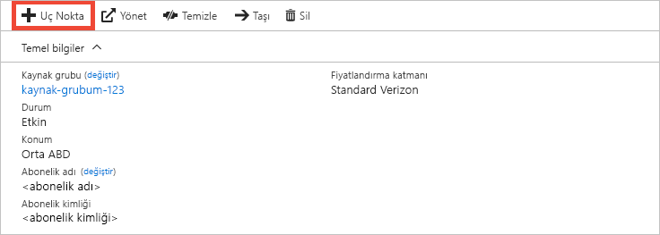
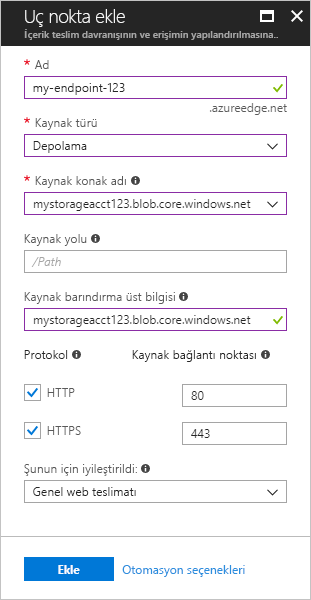

# Hızlı Başlangıç: Bir Azure CDN profili ve uç noktası oluşturma
Bu hızlı başlangıçta, yeni bir CDN profili ve CDN uç noktası oluşturarak Azure Content Delivery Network’ü (CDN) etkinleştireceksiniz. Bir profil ve uç nokta oluşturduktan sonra müşterilerinize içerik sunmaya başlayabilirsiniz.

[!INCLUDE [quickstarts-free-trial-note](../../includes/quickstarts-free-trial-note.md)]

## Önkoşullar
Bu hızlı başlangıç amaçları doğrultusunda, kaynak konak adı için kullandığınız *mystorageacct123* adlı bir depolama hesabı oluşturmuş olmanız gerekir. Daha fazla bilgi için bkz. [Azure CDN ile bir Azure depolama hesabını tümleştirme](cdn-create-a-storage-account-with-cdn.md).

## Azure portalında oturum açma
Azure hesabınızla [Azure portalında](https://portal.azure.com) oturum açın.

[!INCLUDE [cdn-create-profile](../../includes/cdn-create-profile.md)]

## Yeni bir CDN uç noktası oluşturma

CDN profili oluşturduktan sonra bir uç nokta oluşturmak için bunu kullanabilirsiniz.

1. Azure portalında, panonuzda oluşturduğunuz CDN profilini seçin. Bulamazsanız, **Tüm hizmetler**’i ve sonra **CDN profilleri**’ni seçin. **CDN profilleri** sayfasında, kullanmak istediğiniz profili seçin. 
   
    CDN profili sayfası görüntülenir.

2. **Uç nokta**’yı seçin.
   
    
   
    **Uç nokta ekleyin** bölmesi görünür.

3. Uç noktası ayarları için aşağıdaki tabloda belirtilen değerleri kullanın:

    | Ayar | Value |
    | ------- | ----- |
    | **Name** | Uç nokta konak adınız için *my-endpoint-123* değerini girin. Bu ad küresel olarak benzersiz olmalıdır. Daha önceden kullanılmışsa farklı bir ad girebilirsiniz. Bu ad, _&lt;uç nokta adı&gt;_ .azureedge.net etki alanındaki önbelleğe alınmış kaynaklarınıza erişmek için kullanılır.|
    | **Kaynak türü** | **Depolama**’yı seçin. | 
    | **Kaynak konak adı** | Konak adınız için *mystorageacct123.blob.core.windows.net* değerini girin. Bu ad küresel olarak benzersiz olmalıdır. Daha önceden kullanılmışsa farklı bir ad girebilirsiniz. |
    | **Kaynak yolu** | Boş bırakın. |
    | **Kaynak barındırma üst bilgisi** | Varsayılan olarak oluşturulan değeri değiştirmeyin. |  
    | **Protokolü** | Varsayılan **HTTP** ve **HTTPS** seçeneklerini seçili şekilde bırakın. |
    | **Kaynak bağlantı noktası** | Varsayılan bağlantı noktası değerlerini değiştirmeyin. | 
    | **Şunun için iyileştirildi:** | Varsayılan **Genel web teslimatı** seçimini değiştirmeyin. |

    

3. Yeni uç nokta oluşturmak için **Ekle**’yi seçin.
   
   Uç nokta oluşturulduktan sonra, profile yönelik uç noktalar listesinde görünür.
    
   
    
   Kaydın yayılması zaman alacağından, uç nokta hemen kullanılabilir olmaz: 
   - **Microsoft’tan Azure CDN Standart** profilleri için yayma işlemi genellikle 10 dakikada tamamlanır. 
   - **Akamai’den Azure CDN Standart** profilleri için yayma işlemi genellikle bir dakika içinde tamamlanır. 
   - **Verizon’dan Azure CDN Standart** ve **Verizon’dan Azure CDN Premium** profilleri için yayma işlemi genellikle 90 dakika içinde tamamlanır. 

## Kaynakları temizleme
Önceki adımlarda, bir kaynak grubunda CDN profili ve bir uç nokta oluşturdunuz. [Sonraki adımlara](#next-steps) gidip uç noktanıza nasıl özel etki alanı ekleneceğini öğrenmek istiyorsanız bu kaynakları kaydedin. Ancak ileride bu kaynakları kullanmayı düşünmüyorsanız, kaynak grubunu silerek bunları silebilir, böylece ek ücretleri önleyebilirsiniz:

1. Azure portalındaki sol menüden **Kaynak grupları**’nı seçin ve sonra **my-resource-group-123** seçeneğini belirleyin.

2. **Kaynak grubu** sayfasında **Kaynak grubunu sil**’i seçin, metin kutusuna *my-resource-group-123* değerini girin ve **Sil**’i seçin.

    Bu işlem, bu hızlı başlangıçta oluşturduğunuz kaynak grubunu, profili ve uç noktayı siler.

## Sonraki adımlar
CDN uç noktanıza özel etki alanı ekleme hakkında bilgi edinmek için aşağıdaki öğreticiye bakın:

> [!div class="nextstepaction"]
> [Öğretici: Azure CDN uç noktanıza özel etki alanı ekleme](cdn-map-content-to-custom-domain.md)

