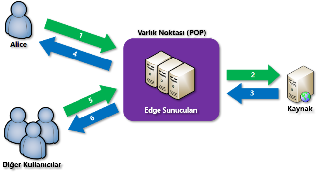

# Azure’da içerik teslim ağı nedir?
İçerik teslim ağı (CDN), kullanıcılara etkili bir şekilde web içeriği teslim edebilen dağıtılmış bir sunucu ağıdır. CDN’ler gecikme süresini en aza indirmek için, önbelleğe alınmış içerikleri son kullanıcılara yakın olan bulunma noktası (POP) konumlarındaki uç sunucularda depolar. 

Azure Content Delivery Network (CDN), dünya genelindeki stratejik olarak yerleştirilen fiziksel düğümlerde içeriği önbelleğe alarak, yüksek bant genişliği içeriğinin hızlı bir şekilde kullanıcılara teslimi konusunda geliştiricilere genel bir çözüm sunar. Azure CDN, CDN POP’ları kullanarak çeşitli ağ iyileştirmelerinden yararlanarak, önbelleğe alınamayan dinamik içeriği hızlandırabilir. Örneğin, Sınır Ağ Geçidi Protokolü’nü (BGP) atlamak için rota iyileştirmesi.

Web sitesi varlıklarını teslim etmek için Azure CDN kullanmanın avantajları şunlardır:

* Özellikle içeriğin yüklenmesi için birden çok gidiş dönüş gerektiren uygulamaların kullanımı sırasında, son kullanıcılar için daha iyi performans ve geliştirilmiş kullanıcı deneyimi.
* Bir ürün sunumu etkinliğinin başlangıcında olduğu gibi, anlık yüksek düzeyde yükü daha iyi işleyebilmek için büyük ölçeklendirme.
* Kaynak sunucuya daha az trafik gönderilmesi için kullanıcı isteklerinin dağıtımı ve uç sunuculardan içerik sunulması.

Geçerli CDN düğümü konumlarının listesi için bkz. [Azure CDN POP konumları](cdn-pop-locations.md).

## Nasıl çalışır?

1. Bir kullanıcı (Alice), _&lt;uç nokta adı&gt;_.azureedge.net gibi özel bir etki alanı adına sahip olan bir URL’yi kullanarak bir dosya (varlık olarak da adlandırılır) isteğinde bulunur. Bu ad, bir uç nokta konak adı veya özel bir etki alanı olabilir. DNS, genellikle coğrafi olarak kullanıcıya en yakın bulunma noktası olan en iyi performansa sahip bulunma noktası konumuna isteği yönlendirir.
    
2. Bulunma noktasındaki uç sunucuların önbelleğinde dosya mevcut değilse bulunma noktası, kaynak sunucudan dosyayı ister. Kaynak sunucu; bir Azure Web App, Azure Bulut Hizmeti, Azure Depolama hesabı veya genel olarak erişilebilen herhangi bir web sunucusu olabilir.
   
3. Kaynak sunucu, dosyayı bulunma noktasındaki bir uç sunucuya döndürür.
    
4. Bulunma noktasındaki uç sunucu, dosyayı önbelleğe alır ve dosyayı özgün istek sahibine (Alice) döndürür. Dosya, HTTP üst bilgileri tarafından belirtilen yaşam süresi (TTL) doluncaya kadar bulunma noktasındaki uç sunucuda önbelleğe alınmış şekilde kalır. Kaynak sunucu bir TTL belirtmediyse varsayılan TTL yedi gündür.
    
5. Daha sonra ek kullanıcılar, Alice’in kullandığı aynı URL’yi kullanarak aynı dosyayı isteyebilir ve ayrıca aynı bulunma noktasına da yönlendirilebilir.
    
6. Dosya için TTL’nin süresi dolmadıysa bulunma noktası uç sunucusu dosyayı doğrudan önbellekten döndürür. Bu işlem, daha hızlı ve daha duyarlı bir kullanıcı deneyimiyle sonuçlanır.

## Gereksinimler
Azure CDN kullanmak için en az bir Azure aboneliğiniz olmalıdır. Ayrıca CDN uç noktalarından oluşan bir koleksiyon olan en az bir CDN profili oluşturmanız gerekir. Her CDN uç noktası, içerik teslim davranışının ve erişiminin belirli bir yapılandırmasını temsil eder. CDN uç noktalarınızı internet etki alanı, web uygulaması veya başka ölçütlere göre düzenlemek için birden çok profil kullanabilirsiniz. CDN profil düzeyinde [Azure CDN fiyatlandırması](https://azure.microsoft.com/pricing/details/cdn/) uygulandığından, fiyatlandırma katmanları karışımını kullanmak istiyorsanız birden fazla CDN profili oluşturmanız gerekir. Azure CDN faturalama yapısı hakkında daha fazla bilgi için bkz. [Azure CDN faturalamayı anlama](cdn-billing.md).

### Sınırlamalar
Her Azure aboneliği aşağıdaki kaynaklar için varsayılan sınırlara sahiptir:
 - Oluşturulabilecek CDN profili sayısı.
 - Bir CDN profilinde oluşturulabilecek uç nokta sayısı. 
 - Bir uç noktaya eşlenebilecek özel etki alanı sayısı.

CDN aboneliği sınırları hakkında daha fazla bilgi için bkz. [CDN sınırları](https://docs.microsoft.com/azure/azure-subscription-service-limits).
    
## Azure CDN özellikleri
Azure CDN aşağıdaki temel özellikleri sunar:

- [Dinamik site hızlandırma](cdn-dynamic-site-acceleration.md)
- [CDN önbelleğe alma kuralları](cdn-caching-rules.md)
- [HTTPS özel etki alanı desteği](cdn-custom-ssl.md)
- [Azure tanılama günlükleri](cdn-azure-diagnostic-logs.md)
- [Dosya sıkıştırma](cdn-improve-performance.md)
- [Coğrafi filtreleme](cdn-restrict-access-by-country.md)

Her bir Azure CDN ürününün desteklediği özelliklerin tam listesi için bkz. [Azure CDN ürün özelliklerinin karşılaştırması](cdn-features.md).

## Sonraki adımlar
- CDN ile çalışmaya başlamak için bkz. [Azure CDN profili ve uç noktası oluşturma](cdn-create-new-endpoint.md).
- [Microsoft Azure Portal](https://portal.azure.com) üzerinden veya [PowerShell](cdn-manage-powershell.md) ile CDN uç noktalarınızı yönetme.
- Azure CDN’yi [.NET](cdn-app-dev-net.md) veya [Node.js](cdn-app-dev-node.md) ile nasıl otomatik hale getireceğinizi öğrenin.
- Azure CDN’yi çalışır halde görmek için [Azure CDN videolarını](https://azure.microsoft.com/resources/videos/index/?services=cdn&sort=newest) izleyin.
- En son Azure CDN özellikleri hakkında daha fazla bilgi için bkz. [Azure CDN blogu](https://azure.microsoft.com/blog/tag/azure-cdn/).
