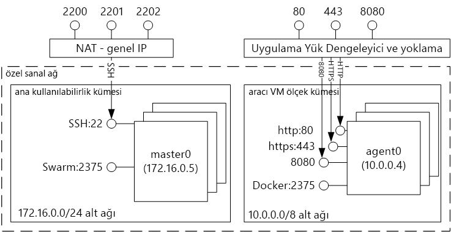

# (KULLANIM DIŞI) Docker kapsayıcı barındırma çözümlerine Azure Container Service ile giriş 

[!INCLUDE [ACS deprecation](../../../includes/container-service-deprecation.md)]

Azure Container Service, kapsayıcı uygulamalarda çalışmak üzere önceden yapılandırılmış olan sanal makine kümeleriyle ilgili oluşturma, yapılandırma ve yönetim süreçlerinin basitleştirir. Bu hizmet, popüler açık kaynak planlama ve düzenleme araçlarının iyileştirilmiş yapılandırmalarını kullanır. Bu sayede Microsoft Azure’daki kapsayıcı tabanlı uygulamaları dağıtmak ve yönetmek için mevcut becerilerinizi kullanabilir veya kapsamlı ve gelişmeye devam eden topluluk uzmanlığından faydalanabilirsiniz.

Azure Container Service, uygulama kapsayıcılarınızın tamamen taşınabilir olmasını sağlamak için Docker kapsayıcı biçiminden faydalanır. Bu hizmet ayrıca uygulamaları binlerce veya on binlerce kapsayıcıya ölçekleyebilmeniz için Marathon ve DC/OS, Docker Swarm veya Kubernetes biçimlerini de destekler.

Azure Container Service’i kullanarak Azure’un kuruluş düzeyindeki özelliklerinden faydalanırken düzenleme katmanında taşınabilirlik dahil olmak üzere uygulama taşınabilirliğini koruyabilirsiniz.

## Azure Container Service’i kullanma
Azure Container Service’i ile amacımız, günümüzde müşterilerimiz arasında popüler olan açık kaynak araçları ve teknolojileri kullanan bir kapsayıcı barındırma ortamı sunmaktır. Şu an kullandığınız düzenleyici (DC/OS, Docker Swarm veya Kubernetes) için standart API uç noktalarını kullanıma sunuyoruz. Bu uç noktaları kullanarak, ilgili uç noktalarla iletişim kurma özelliğine sahip olan tüm yazılımlardan faydalanabilirsiniz. Örneğin, Docker Swarm uç noktasıyla Docker komut satırı arabirimini (CLI) kullanabilirsiniz. DC/OS için DCOS CLI bileşenini seçebilirsiniz. Kubernetes için `kubectl` seçeneğini belirleyebilirsiniz.

## Azure Container Service’i kullanarak Docker kümesi oluşturma
Azure Container Service’i kullanmaya başlamak için bir Azure Resource Manager şablonunu ([Docker Swarm](https://github.com/Azure/azure-quickstart-templates/tree/master/101-acs-swarm), [DC/OS](https://github.com/Azure/azure-quickstart-templates/tree/master/101-acs-dcos) veya [Kubernetes](https://github.com/Azure/azure-quickstart-templates/tree/master/101-acs-kubernetes)) ya da [Azure CLI](container-service-create-acs-cluster-cli.md) bileşenini kullanarak portal aracılığıyla (Market’te **Azure Container Service** ifadesini aratın) bir Azure Container Service kümesi dağıtırsınız. Sunulan hızlı başlangıç şablonu, ek veya gelişmiş Azure yapılandırmalarını dahil edecek şekilde değiştirilebilir. Daha fazla bilgi edinmek için bkz. [Azure Container Service kümesi dağıtma](container-service-deployment.md).

## Uygulama dağıtma
Azure Container Service’te düzenleme için Docker Swarm, DC/OS veya Kubernetes seçenekleri sunulmaktadır. Uygulamanızı nasıl dağıtacağınız, düzenleme seçiminize göre değişiklik gösterir.

### DC/OS kullanma
DC/OS, Apache Mesos dağıtılmış sistemler çekirdeği tabanlı bir dağıtılmış işletim sistemidir. Apache Software Foundation bünyesinde yer alan Apache Mesos’ta [BT dünyasının önde gelen isimleri](https://mesos.apache.org/documentation/latest/powered-by-mesos/) kullanıcı ve katılımcı olarak görev yapmaktadır.

DC/OS ve Apache Mesos, etkileyici bir özellik kümesine sahiptir:

* Kanıtlanmış ölçeklenebilirlik
* Birincil ve ikincil veritabanı Apache ZooKeeper kullanan hataya dayanıklı çoğaltılan
* Docker biçimli kapsayıcılar için destek
* Linux kapsayıcılarla görevler arasında yerel yalıtım
* Çok kaynaklı planlama (bellek, CPU, disk ve bağlantı noktaları)
* Yeni paralel uygulamalar geliştirmek için Java, Python ve C++ API’leri
* Küme durumunu görüntülemek için web arabirimi

Azure Container Service üzerinde çalışan DC/OS, varsayılan olarak planlanmış iş yükleri için Marathon düzenleme platformunu içerir. Bununla birlikte, ACS’nin DC/OS dağıtımı hizmetinize eklenebilecek Mesosphere Universe hizmetlerini içerir. Universe’teki hizmetler Spark, Hadoop, Cassandra ve çok daha fazlasını içerir.

#### Marathon’u kullanma
Marathon, cgroups hizmetleri için küme çapında bir başlatma ve denetim sistemidir. Azure Container Service için bu, Docker biçimli kapsayıcılardır. Marathon’un sunduğu web arabirimini kullanarak uygulamalarınızı dağıtabilirsiniz. Buna `http://DNS_PREFIX.REGION.cloudapp.azure.com` gibi bir URL'den erişebilirsiniz
Burada DNS\_PREFIX ve REGION değerlerinin ikisi de dağıtım sırasında tanımlanır. Elbette, kendi DNS adınızı da kullanabilirsiniz. Marathon web arabirimini kullanarak kapsayıcı çalıştırma hakkında daha fazla bilgi edinmek için bkz. [Marathon web kullanıcı arabirimi aracılığıyla DC/OS kapsayıcısını yönetme](container-service-mesos-marathon-ui.md).

Marathon ile iletişim kurmak için REST API’lerini de kullanabilirsiniz. Her araç ile kullanılabilen çeşitli istemci kitaplıkları vardır. Bu kitaplıklar birçok dili kapsamaktadır. Dilerseniz istediğiniz dilde HTTP protokolünü de kullanabilirsiniz. Ayrıca birçok popüler DevOps aracı, Marathon desteği sunmaktadır. Bu sayede Azure Container Service kümesiyle çalışırken operasyon ekibiniz üst düzey esnekliğe sahip olur. Marathon REST API’yi kullanarak kapsayıcı çalıştırma hakkında daha fazla bilgi edinmek için bkz. [Marathon REST API aracılığıyla DC/OS kapsayıcısını yönetme](container-service-mesos-marathon-rest.md).

### Docker Swarm’u kullanma
Docker Swarm, Docker için yerel kümeleme imkanı sunar. Docker Swarm, standart Docker API’yi sunduğu için Docker programıyla iletişim kurabilen tüm araçlar Swarm’u kullanarak Azure Container Service üzerindeki birden fazla ana bilgisayar için saydam ölçeklendirme sağlayabilir.

[!INCLUDE [container-service-swarm-mode-note](../../../includes/container-service-swarm-mode-note.md)]

Bir Swarm kümesindeki kapsayıcıları yönetmek için desteklenen araçlar, sınırlı olmamak üzere aşağıdakileri içerir:

* Dokku
* Docker CLI ve Docker Compose
* Krane
* Jenkins

### Kubernetes kullanma
Kubernetes, popüler ve açık kaynaklı bir üretim düzeyinde kapsayıcı düzenleme aracıdır. Kubernetes, kapsayıcılı uygulamaların dağıtımını, ölçeklendirmesini ve yönetimini otomatikleştirir. Açık kaynaklı bir çözüm olduğu ve açık kaynak topluluğu tarafından yönetildiği için, Azure Container Service üzerinde sorunsuzca çalışır ve Azure Container Service üzerinde ölçekli kapsayıcıları dağıtmak için kullanılabilir.

Aşağıdaki zengin özelliklere sahiptir:
* Yatay ölçekleme
* Hizmet bulma ve yük dengeleme
* Gizli bilgiler ve yapılandırma yönetimi
* API tabanlı otomatik piyasaya çıkarma ve geri alma işlemleri
* Kendi kendini iyileştirme

## Videolar
Azure Container Service’i kullanmaya başlama (101):  

> [!VIDEO https://channel9.msdn.com/Shows/Azure-Friday/Azure-Container-Service-101/player]
>
>

Azure Container Service ile Uygulama Oluşturma (Derleme 2016)

> [!VIDEO https://channel9.msdn.com/Events/Build/2016/B822/player]
>
>

## Sonraki adımlar

[Portal](container-service-deployment.md)’ı veya [Azure CLI](container-service-create-acs-cluster-cli.md) aracını kullanarak bir Container Service kümesi dağıtın.
