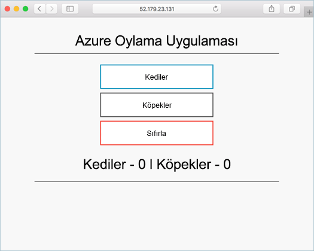

# <a name="deprecated-deploy-docker-ce-cluster"></a>(KULLANIM DIŞI) Docker CE kümesi dağıtma

[!INCLUDE [ACS deprecation](../../../includes/container-service-deprecation.md)]

Bu hızlı başlangıçta, Azure CLI kullanılarak Docker CE kümesi dağıtılır. Ardından web ön ucu ve bir Redis örneğinden oluşan çok kapsayıcılı bir uygulama dağıtılıp küme üzerinde çalıştırılır. Tamamlandığında, uygulamaya İnternet üzerinden erişilebilir.

Azure Container Service’teki Docker CE önizlemededir ve **üretim iş yükleri için kullanılmamalıdır**.

Azure aboneliğiniz yoksa başlamadan önce [ücretsiz bir hesap](https://azure.microsoft.com/free/?WT.mc_id=A261C142F) oluşturun.

CLI'yi yerel olarak yükleyip kullanmayı seçerseniz bu hızlı başlangıç için Azure CLI 2.0.4 veya sonraki bir sürümünü kullanmanız gerekir. Sürümü bulmak için `az --version` komutunu çalıştırın. Yükleme veya yükseltme yapmanız gerekirse bkz. [Azure CLI’yı yükleme]( /cli/azure/install-azure-cli).

## <a name="create-a-resource-group"></a>Kaynak grubu oluşturma

[az group create](/cli/azure/group#az-group-create) komutuyla bir kaynak grubu oluşturun. Azure kaynak grubu, Azure kaynaklarının dağıtıldığı ve yönetildiği mantıksal bir gruptur.

Aşağıdaki örnekte adlı bir kaynak grubu oluşturur *myResourceGroup* içinde *westus2* konumu.

```azurecli-interactive
az group create --name myResourceGroup --location westus2
```

Çıktı:

```json
{
  "id": "/subscriptions/00000000-0000-0000-0000-000000000000/resourceGroups/myResourceGroup",
  "location": "westus2",
  "managedBy": null,
  "name": "myResourceGroup",
  "properties": {
    "provisioningState": "Succeeded"
  },
  "tags": null
}
```

## <a name="create-docker-swarm-cluster"></a>Docker Swarm kümesi oluşturma

Azure Container Service'te [az acs create](/cli/azure/acs#az-acs-create) komutuyla bir Docker CE kümesi oluşturun. Docker CE bölge availaiblity hakkında daha fazla bilgi için bkz. [Docker CE için ACS bölgeleri](https://github.com/Azure/ACS/blob/master/announcements/2017-08-04_additional_regions.md)

Aşağıdaki örnekte, bir Linux ana düğümü ve üç Linux aracı düğümüyle *mySwarmCluster* adlı bir küme oluşturulur.

```azurecli-interactive
az acs create --name mySwarmCluster --orchestrator-type dockerce --resource-group myResourceGroup --generate-ssh-keys
```

Sınırlı deneme sürümünde olduğu gibi bazı durumlarda, bir Azure aboneliğinin Azure kaynaklarına sınırlı erişimi olur. Dağıtım sınırlı kullanılabilir çekirdek sayısı nedeniyle başarısız olursa, `--agent-count 1` öğesini [az acs create](/cli/azure/acs#az-acs-create) komutuna ekleyerek varsayılan aracı sayısını azaltın. 

Birkaç dakika sonra komut tamamlanır ve küme hakkında JSON tarafından biçimlendirilmiş bilgiler gösterilir.

## <a name="connect-to-the-cluster"></a>Kümeye bağlanma

Bu hızlı başlangıç boyunca hem Docker Swarm ana şablonunun hem de Docker aracı havuzunun FQDN’sine ihtiyacınız olur. Hem ana şablon hem de aracı FQDN'lerini döndürmek için aşağıdaki komutu çalıştırın.


```bash
az acs list --resource-group myResourceGroup --query '[*].{Master:masterProfile.fqdn,Agent:agentPoolProfiles[0].fqdn}' -o table
```

Çıktı:

```bash
Master                                                               Agent
-------------------------------------------------------------------  --------------------------------------------------------------------
myswarmcluster-myresourcegroup-d5b9d4mgmt.ukwest.cloudapp.azure.com  myswarmcluster-myresourcegroup-d5b9d4agent.ukwest.cloudapp.azure.com
```

Swarm ana şablonuna yönelik bir SSH tüneli oluşturun. `MasterFQDN` değerini Swarm ana şablonunun FQDN adresiyle değiştirin.

```bash
ssh -p 2200 -fNL localhost:2374:/var/run/docker.sock azureuser@MasterFQDN
```

`DOCKER_HOST` ortam değişkenini ayarlayın. Bu, konağın adını belirtmenize gerek kalmadan Docker Swarm’a karşı docker komutları çalıştırmanıza imkan tanır.

```bash
export DOCKER_HOST=localhost:2374
```

Şimdi Docker Swarm’da Docker hizmetlerini çalıştırmaya hazırsınız.


## <a name="run-the-application"></a>Uygulamayı çalıştırma

`azure-vote.yaml` adlı bir dosya oluşturun ve aşağıdaki içeriği dosyaya kopyalayın.


```yaml
version: '3'
services:
  azure-vote-back:
    image: redis
    ports:
        - "6379:6379"

  azure-vote-front:
    image: microsoft/azure-vote-front:v1
    environment:
      REDIS: azure-vote-back
    ports:
        - "80:80"
```

Azure Vote hizmetini oluşturmak için [docker stack deploy](https://docs.docker.com/engine/reference/commandline/stack_deploy/) komutunu çalıştırın.

```bash
docker stack deploy azure-vote --compose-file azure-vote.yaml
```

Çıktı:

```bash
Creating network azure-vote_default
Creating service azure-vote_azure-vote-back
Creating service azure-vote_azure-vote-front
```

Uygulamanın dağıtım durumunu döndürmek için [docker stack ps](https://docs.docker.com/engine/reference/commandline/stack_ps/) komutunu kullanın.

```bash
docker stack ps azure-vote
```

Her bir hizmetin `CURRENT STATE` durumu `Running` olduğunda uygulama hazır olur.

```bash
ID                  NAME                            IMAGE                                 NODE                               DESIRED STATE       CURRENT STATE                ERROR               PORTS
tnklkv3ogu3i        azure-vote_azure-vote-front.1   microsoft/azure-vote-front:v1   swarmm-agentpool0-66066781000004   Running             Running 5 seconds ago                            
lg99i4hy68r9        azure-vote_azure-vote-back.1    redis:latest                          swarmm-agentpool0-66066781000002   Running             Running about a minute ago
```

## <a name="test-the-application"></a>Uygulamayı test etme

Azure Vote uygulamasını test etmek için Swarm aracı havuzunun FQDN’sine göz atın.



## <a name="delete-cluster"></a>Kümeyi silme
Kümeye artık ihtiyacınız yoksa [az group delete](/cli/azure/group#az-group-delete) komutunu kullanarak kaynak grubunu, kapsayıcı hizmetini ve ilgili tüm kaynakları kaldırabilirsiniz.

```azurecli-interactive
az group delete --name myResourceGroup --yes --no-wait
```

## <a name="get-the-code"></a>Kodu alma

Bu hızlı başlangıçta, önceden oluşturulmuş kapsayıcı görüntüleri kullanılarak Docker hizmeti oluşturulur. İlgili uygulama kodu, Dockerfile ve Compose dosyası GitHub'da bulunur.

[https://github.com/Azure-Samples/azure-voting-app-redis](https://github.com/Azure-Samples/azure-voting-app-redis.git)

## <a name="next-steps"></a>Sonraki adımlar

Bu hızlı başlangıçta, bir Docker Swarm kümesi dağıtıp ve bu kümeye çok kapsayıcılı bir uygulama dağıttınız.

Docker swarm ile Azure DevOps tümleştirme hakkında bilgi edinmek için Docker Swarm ve Azure DevOps ile CI/CD'ye devam edin.

> [!div class="nextstepaction"]
> [Docker Swarm ve Azure DevOps ile CI/CD](./container-service-docker-swarm-setup-ci-cd.md)
