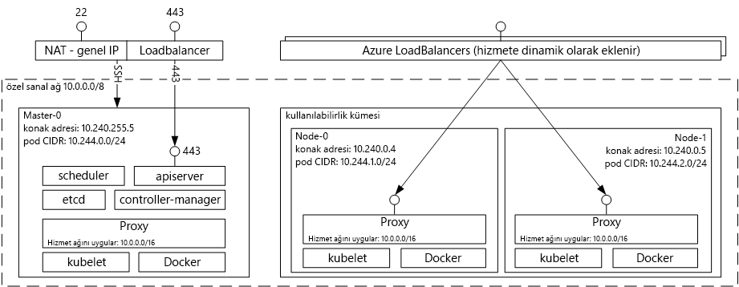

# Kubernetes için Azure Container Service’e Giriş

[!INCLUDE [aks-preview-redirect.md](../../../includes/aks-preview-redirect.md)]

Kubernetes için Azure Container Service, kapsayıcı uygulamalarda çalışmak üzere önceden yapılandırılmış sanal makine kümesi oluşturma, yapılandırma ve yönetim süreçlerini basitleştirir. Bu sayede Microsoft Azure’daki kapsayıcı tabanlı uygulamaları dağıtmak ve yönetmek için mevcut becerilerinizi kullanabilir veya kapsamlı ve gelişmeye devam eden topluluk uzmanlığından faydalanabilirsiniz.

Azure Container Service’i kullanarak Azure’un kuruluş düzeyindeki özelliklerinden faydalanırken Kubernetes ve Docker görüntü biçimi aracılığıyla uygulama taşınabilirliğini koruyabilirsiniz.

## Kubernetes için Azure Container Service’i Kullanma
Azure Container Service’i ile amacımız, günümüzde müşterilerimiz arasında popüler olan açık kaynak araçları ve teknolojileri kullanan bir kapsayıcı barındırma ortamı sunmaktır. Bu işlem için standart Kubernetes API uç noktalarını kullanıma sunacağız. Bu standart uç noktaları kullanarak, bir Kubernetes kümesiyle iletişim kurma özelliğine sahip olan tüm yazılımlardan faydalanabilirsiniz. Örneğin [kubectl](https://kubernetes.io/docs/user-guide/kubectl-overview/), [helm](https://helm.sh/) veya [draft](https://github.com/Azure/draft) arasından seçim yapabilirsiniz.

## Azure Container Service kullanan bir Kubernetes kümesi oluşturma
Azure Container Service’i kullanmaya başlamak için portal aracılığıyla (Market’te [Azure Container Service](container-service-kubernetes-walkthrough.md) ifadesini aratın) veya **Azure CLI 2.0** ile bir Azure Container Service kümesi dağıtırsınız. Azure Resource Manager şablonları hakkında daha fazla denetime gereksinim duyan İleri düzey bir kullanıcıysanız açık kaynak [acs-engine](https://github.com/Azure/acs-engine) projesini kullanarak kendi özel Kubernetes kümenizi oluşturup `az` CLI’si ile dağıtabilirsiniz.

### Kubernetes kullanma
Kubernetes, kapsayıcılı uygulamaların dağıtımını, ölçeklendirmesini ve yönetimini otomatikleştirir. Aşağıdaki zengin özelliklere sahiptir:
* Otomatik bin paketleme
* Kendi kendini iyileştirme
* Yatay ölçekleme
* Hizmet bulma ve yük dengeleme
* Otomatik piyasaya çıkarma ve geri alma işlemleri
* Gizli dizi ve yapılandırma yönetimi
* Depolama düzenleme
* Toplu iş yürütme

Azure Container Service aracılığıyla dağıtılan Kubernetes mimari diyagramı:

## Videolar

Azure Container Services'daki Kubernetes Desteği (Azure Friday, Ocak 2017):

> [!VIDEO https://channel9.msdn.com/Shows/Azure-Friday/Kubernetes-Support-in-Azure-Container-Services/player]
>
>

Kubernetes’te Uygulama Geliştirme ve Dağıtma Araçları (Azure OpenDev, Haziran 2017):

> [!VIDEO https://channel9.msdn.com/Events/AzureOpenDev/June2017/Tools-for-Developing-and-Deploying-Applications-on-Kubernetes/player]
>
>

## Sonraki adımlar

Azure Container Service’i bugün incelemeye başlamak için [Kubernetes Hızlı Başlangıç](container-service-kubernetes-walkthrough.md)’a bakın.