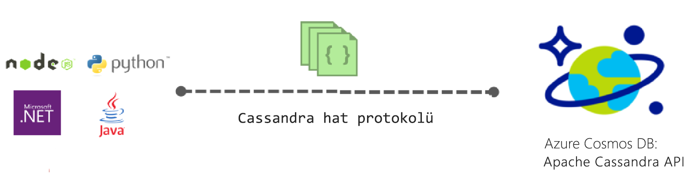

# Azure Cosmos DB Apache Cassandra API için giriş

Azure Cosmos DB Cassandra API (Önizleme) için Apache Cassandra premium özellikleri gibi yazılan uygulamaları için sağlar:

* [Ölçeklenebilir depolama boyutu ve üretilen iş](partition-data.md).
* [Anahtar teslim genel dağıtım](distribute-data-globally.md)
* 99 yüzdebirlikte tek basamaklı milisaniyelik gecikme süresi.
* [Beş iyi tanımlanmış tutarlılık düzeyleri](consistency-levels.md)
* [Otomatik dizin oluşturma verileri](http://www.vldb.org/pvldb/vol8/p1668-shukla.pdf) gerektirmeden şema ve dizin yönetimi ile ilgilidir. 
* Yüksek kullanılabilirlik, tarafından yedeklenen tüm garanti [endüstri lideri SLA'ları](https://azure.microsoft.com/support/legal/sla/cosmos-db/)

## Azure Cosmos DB Apache Cassandra API nedir?

Azure Cosmos DB yazılmış uygulamalar için veri deposu olarak kullanılabilir [Apache Cassandra](https://cassandra.apache.org/), Apache Cassandra API'yi kullanarak. Varolan kullanarak buna [Apache lisanslı CQLv4 ile uyumlu sürücüleri](https://cassandra.apache.org/doc/latest/getting_started/drivers.html?highlight=driver), uygulamanızın Cassandra Azure Cosmos DB Cassandra API'si ile artık iletişim kurmak için yazılmış. Çoğu durumda, sadece bir bağlantı dizesi değiştirilerek Azure Cosmos veritabanı Apache Cassandra API kullanarak Apache Cassandra kullanarak geçiş yapabilirsiniz. Bu işlevini kullanarak, kolayca oluşturabilir ve çalışma Cassandra API veritabanı uygulamaları Azure bulut ile Azure Cosmos veritabanı genel dağıtım ve [kapsamlı endüstri lideri SLA](https://azure.microsoft.com/support/legal/sla/cosmos-db), bilinen kullanmaya devam ederken becerileri ve araçları Cassandra API'si.

Cassandra istemci sürücüleri zaten alışık olduğunuz ve Azure Cosmos (gibi CQLSH) Cassandra sorgu tabanlı dil araçları kullanarak veritabanında depolanan verileri ile etkileşim kurmak Cassandra API sağlar.

## Apache Cassandra API için Azure Cosmos DB kullanmanın faydası nedir?

**Operations management**: Gerçek hizmet tam olarak yönetilen olarak Azure Cosmos DB Cassandra API Yöneticiler yönetme ve işletim sistemi, JVM ve yaml dosyaları ve bunların Interplay arasında çok ayarları izleme hakkında endişelenmeniz gerekmez sağlar. Azure Cosmos DB verimlilik, gecikme, depolama ve kullanılabilirlik ve yapılandırılabilir uyarıları izleme sağlar. 

**Performans Yönetimi**: Azure Cosmos DB için 99 yazar ve yedeklenen SLA düşük gecikme süresi okuma sağlar. Kullanıcıların iyi okuma sağlamak ve SLA'ları yazmak için işlem yükünü çok hakkında endişelenmeniz gerekmez. Bu, genellikle silinmiş öğe, çiçek tomurcukları filtreler ayarlayarak ve çoğaltma gecikmelere yönetme sıkıştırma, zamanlama içerir. Bunlar yönetme endişe sorunları ve olanak sağlayan azure Cosmos DB alır hemen üzerinde uygulama sonuçlara odaklanın.

**Otomatik dizin oluşturma**: Azure Cosmos DB Cassandra API'si veritabanı tablosunun tüm sütunları otomatik olarak dizinler. Azure Cosmos DB sorgulamalarını hızlandırmak için ikincil dizinlerin oluşturulmasını gerektirmez. Bu, düşük gecikme süresi okuma ve yazma otomatik tutarlı dizin yaparken deneyimi sunar. 

**Var olan kodu ve araçlarını kullanma yeteneğini**: Azure Cosmos DB kablo protokolü düzeyi uyumluluğunu varolan SDK'lar ve araçlar sağlar. Bu uyumluluk varolan kullanabileceğiniz sağlar Önemsiz değişikliklerle Cassandra API, Azure Cosmos DB ile codebase.

**Üretilen iş ve depolama esneklik**: Azure Cosmos platform, basit portalı, PowerShell aracılığıyla bölgeler arasında garantili verimlilik esneklik sağlar veya CLI işlemleri. Uygulamanız büyüdükçe, Özellikler esnek Azure Cosmos DB tabloları tahmin edilebilir performansla sorunsuz bir şekilde ölçeklendirebilirsiniz. Azure Cosmos DB neredeyse sınırsız depolama boyutlarına ölçeklendirebilirsiniz Cassandra API tabloları destekler. 

**Genel dağıtım ve kullanılabilirlik**: Azure Cosmos DB kullanıcıların kullanılabilirlik sağlarken düşük gecikme süreli bir deneyim sağlamak için Azure bölgeleri verilerinin dağıtma olanağı sağlar. Bir bölge içinde % 99,99 kullanılabilirlik Azure Cosmos DB sağlar ve hiçbir işlem yüküyle bölgelere kullanılabilirlik %99.999 okuyun. Azure Cosmos DB kullanılabilir 30 + [Azure bölgeleri](https://azure.microsoft.com/regions/services/). Daha fazla bilgi edinin [verilerini genel dağıtmak](distribute-data-globally.md). 

**Tutarlılık seçimine**: Azure Cosmos DB beş iyi tanımlanmış tutarlılık düzeyleri tutarlılık ve performans arasında en iyi dengeyi elde etmek için seçimi sağlar. Güçlü, sınırlanmış eskime durumu, oturum, tutarlı önek bu tutarlılık düzeyleri olan ve son. Bu ayrıntılı ve iyi tanımlanmış tutarlılık düzeyleri ses dengelemeler tutarlılık, kullanılabilirlik ve gecikme süresi arasında yapmak geliştiriciye izin verir. Daha fazla bilgi için bkz. [Kullanılabilirlik ve performansı en üst düzeye çıkarmak için tutarlılık düzeylerini kullanma](consistency-levels.md). 

**Kurumsal düzeyde**: güvenli ve varsayılan – DB sağlayan Azure cosmos uyumlu [uyumluluk sertifikalarından](https://www.microsoft.com/trustcenter) kullanıcıların, uyumluluk sorunları hakkında endişelenmeden platform kullanabilir emin olmak için. Azure Cosmos DB şifreleme REST ve hareket, IP Güvenlik Duvarı'nı ve denetim düzlemi etkinlikler için denetim günlüklerini de sağlar.  

## Nasıl kullanmaya başlarım
Bir Azure Cosmos DB Cassandra API hesabı oluşturmak ve bir Cassandra uygulaması oluşturmak için Cassandra API quickstarts izleyin:

* [Hızlı Başlangıç: bir Cassandra Node.js ve Azure Cosmos DB ile web uygulaması oluşturma](create-cassandra-nodejs.md)
* [Hızlı Başlangıç: bir Cassandra Java ve Azure Cosmos DB ile web uygulaması oluşturma](create-cassandra-java.md)
* [Hızlı Başlangıç: bir Cassandra .NET ve Azure Cosmos DB ile web uygulaması oluşturma](create-cassandra-dotnet.md)
* [Hızlı Başlangıç: bir Cassandra Python ve Azure Cosmos DB ile web uygulaması oluşturma](create-cassandra-python.md)

## Hemen kaydolun 

Bir Azure aboneliğiniz zaten varsa, Cassandra API (Önizleme) için de kaydolabilirsiniz [Azure portal](https://aka.ms/cosmosdb-cassandra-signup). Azure'da yeniyseniz için imzalama bir [ücretsiz deneme sürümü](https://azure.microsoft.com/free) 12 ay ücretsiz Azure Cosmos DB erişimin nereden.

## Sonraki adımlar

Azure Cosmos DB Cassandra API'si hakkında bilgi Azure Cosmos DB belgeler genel tümleştirilmiştir, ancak başlamanıza yardımcı olmak için birkaç işaretçi şunlardır:

* İzleyin [Quickstarts](create-cassandra-nodejs.md) Git örnek kullanarak bir hesap ve yeni bir uygulama oluşturmak için
* İzleyin [öğretici](tutorial-develop-cassandra-java.md) program aracılığıyla yeni bir uygulama oluşturmak için.
* İzleyin [alma Cassandra veri öğretici](cassandra-import-data.md) mevcut verilerinizi Azure Cosmos Veritabanına içeri aktarmak için.
* Okuma [SSS](faq.md#cassandra).
