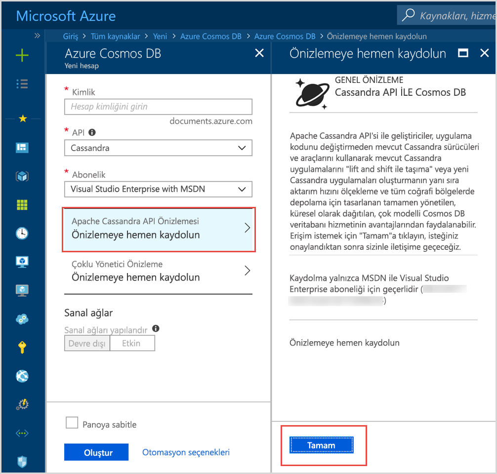

# Azure Cosmos DB'ye giriş: Apache Cassandra API'si

Azure Cosmos DB, Apache Cassandra ile yazılmış ve aşağıdaki gibi premium özellikler gereken uygulamalar için Cassandra API'sini (önizleme) sağlar:

* [Ölçeklenebilir depolama boyutu ve aktarım hızı](partition-data.md).
* [Anahtar teslimi genel dağıtım](distribute-data-globally.md)
* 99 yüzdebirlikte tek basamaklı milisaniyelik gecikme süresi.
* [Beş iyi tanımlanmış tutarlılık düzeyi](consistency-levels.md)
* Şema ve dizin yönetimi ile ilgilenmenize gerek kalmadan [veriler için otomatik dizin oluşturma](http://www.vldb.org/pvldb/vol8/p1668-shukla.pdf). 
* [Endüstri lideri SLA'lar](https://azure.microsoft.com/support/legal/sla/cosmos-db/) tarafından desteklenen garantili yüksek kullanılabilirlik

## Azure Cosmos DB Apache Cassandra API'si nedir?

Azure Cosmos DB, [Apache Cassandra](https://cassandra.apache.org/) için Apache Cassandra API'si kullanılarak yazılmış uygulamalar için veri deposu olarak kullanılabilir. Bu, Cassandra için yazılmış uygulamanız, mevcut [Apache lisanslı CQLv4 uyumlu sürücüleri](https://cassandra.apache.org/doc/latest/getting_started/drivers.html?highlight=driver) kullanarak artık Azure Cosmos DB Cassandra API'si ile iletişim kurabilir. Çoğu durumda sadece bir bağlantı dizesini değiştirerek Apache Cassandra'yı kullanmaktan Azure Cosmos DB'nin Apache Cassandra API'sini kullanmaya geçebilirsiniz. Bu işlevselliği kullanarak, Cassandra API'nin tanıdık beceri ve araçlarını kullanmaya devam ederken, Azure Cosmos DB'nin genel dağıtımı ve [kapsamlı endüstri lideri SLA'ları](https://azure.microsoft.com/support/legal/sla/cosmos-db) ile Azure bulutunda kolayca Cassandra API'si veritabanı uygulamaları geliştirebilir ve çalıştırabilirsiniz.

Cassandra API'si, (CQLSH gibi) Cassandra Sorgu Dili tabanlı araçları ve zaten aşina olduğunuz Cassandra istemci sürücülerini kullanarak Azure Cosmos DB'de depolanan verilerle etkileşim kurmanızı sağlar. Bu konuda, Baş Mühendislik Yöneticisi Kirill Gavrylyuk ile yapılmış bu Microsoft Mechanics videosunda daha fazla bilgi edinebilirsiniz.

> [!VIDEO https://www.youtube.com/embed/1Sf4McGN1AQ]
>

## Azure Cosmos DB için Apache Cassandra API'si kullanmanın avantajı nedir?

**İşletim yönetimi gerekmez**: Gerçek anlamda tam olarak yönetilen bir hizmet olan Azure Cosmos DB, Cassandra API yöneticilerinin işletim sistemleri, JVM ve YAML dosyaları genelindeki sayısız ayarı ve bunların etkileşimlerini yönetme ve izleme konusunda kaygılanmasına gerek bırakmaz. Azure Cosmos DB aktarım hızı, gecikme süresi, depolama ve kullanılabilirlik için izleme ve yapılandırılabilir uyarılar sunar. 

**Performans yönetimi**: Azure Cosmos DB, yüzde 99. dilim için SLA ile desteklenen düşük gecikme süreli okuma ve yazmalar sunar. Kullanıcıların iyi okuma ve yazma SLA'ları sağlamak için büyük bir ek işletim yükünün altında kalması gerekmez. Bunlar arasında zamanlama sıkıştırması, kaldırılmış uygulama kayıtlarının yönetilmesi, Bloom filtrelerinin ayarlanması ve çoğaltma gecikmeleri sayılabilir. Azure Cosmos DB, bu sorunları yönetme kaygısını ortadan kaldırır ve uygulama teslimlerine odaklanmanızı sağlar.

**Otomatik dizin oluşturma**: Azure Cosmos DB, Cassandra API veritabanındaki tablonun tüm sütunlarının otomatik olarak dizinlerini oluşturur. Azure Cosmos DB sorgularını hızlandırmak için ikincil dizinler oluşturulması gerekmez. Otomatik olarak tutarı dizinler oluştururken düşük gecikme süreli okuma ve yazma deneyimi sunar. 

**Mevcut kodu ve araçları kullanma olanağı**: Azure Cosmos DB, mevcut SDK'lar ve araçlar ile kablo protokolü düzeyinde uyumluluk sunar. Bu uyumluluk, Azure Cosmos DB'nin Cassandra API'sine dayanan mevcut kod tabanınızı önemsiz değişikliklerle kullanabilmenizi sağlar.

**Aktarım hızı ve depolama esnekliği**: Azure Cosmos platformu basit portal, PowerShell veya CLI işlemleriyle bölgeler genelinde garantili aktarım hızı esnekliği sunar. Uygulamanız büyüdükçe, Azure Cosmos DB Tablolarınızı tahmin edilebilir performansla sorunsuz ve esnek bir şekilde ölçeklendirebilirsiniz. Azure Cosmos DB, neredeyse sınırsız depolama boyutlarına kadar ölçeklenebilen Cassandra API tablolarını destekler. 

**Genel dağıtım ve kullanılabilirlik**: Azure Cosmos DB, kullanıcılara düşük gecikme süresi deneyimi sağlamanın yanı sıra kullanılabilirliği de garantilemek için verileri Azure bölgeleri genelinde dağıtma olanağı sunar. Azure Cosmos DB, bölgeler içinde %99,99'luk kullanılabilirliği ve bölgeler arasında %99,999'luk okuma kullanılabilirliğini ek işletim yükü getirmeden sağlar. Azure Cosmos DB 30+ [Azure Bölgesinde](https://azure.microsoft.com/regions/services/) kullanılabilir. [Verileri küresel olarak dağıtma](distribute-data-globally.md) bölümünde daha fazlasını öğrenin. 

**Seçimde tutarlılık**: Azure Cosmos DB, tutarlılık ve performans arasında en iyi oranı elde etmek için beş iyi tanımlanmış tutarlılık düzeyi seçeneği sunar. Bu tutarlılık düzeyleri güçlü, sınırlanmış eskime durumu, oturum, tutarlı önek ve son şeklindedir. Bu ayrıntılı ve iyi tanımlanmış tutarlılık düzeyleri geliştiricinin tutarlılık, kullanılabilirlik ve gecikme süresi arasında sağlam bir denge kurmasına olanak tanır. Daha fazla bilgi için bkz. [Kullanılabilirlik ve performansı en üst düzeye çıkarmak için tutarlılık düzeylerini kullanma](consistency-levels.md). 

**Kurumsal düzey**: Azure Cosmos DB, kullanıcıların platformu güvenli bir şekilde kullanabilmesini sağlamak için [uyumluluk sertifikaları](https://www.microsoft.com/trustcenter) sunar. Azure Cosmos DB ayrıca durağan ve hareketli durumlarda şifreleme, IP güvenlik duvarı ve denetim düzlemi etkinlikleri için denetim günlükleri sunar.  

## Hemen kaydolun 

Zaten bir Azure aboneliğiniz varsa, [Azure portalında](https://aka.ms/cosmosdb-cassandra-signup) Cassandra API (önizleme) programına katılmak üzere kaydolabilirsiniz.  Azure'da yeniyseniz, Azure Cosmos DB'ye 12 aylık ücretsiz erişim elde edeceğiniz [ücretsiz denemeye](https://azure.microsoft.com/free) kaydolun. Cassandra API (önizleme) programına erişim istemek için aşağıdaki adımları tamamlayın.

1. [Azure portalı](https://portal.azure.com)'nda, **Kaynak oluştur** > **Veritabanları** > **Azure Cosmos DB**'ye tıklayın. 

2. Yeni Hesap sayfasında, API kutusunda **Cassandra**'yı seçin. 

3. **Abonelik** kutusunda, bu hesap için kullanmak istediğiniz Azure aboneliğini seçin.

4. **Önizlemeye bugün kaydolun**'a tıklayın.

    

3. Önizlemeye bugün kaydolun bölmesinde **Tamam**'a tıklayın. 

    İsteği gönderdikten sonra durum Yeni hesap bölmesinde **Onay bekliyor**'a dönüşür. 

İsteği gönderdikten sonra, isteğinizin onaylandığını bildiren e-postayı bekleyin. İsteklerin yüksek sayıda olması nedeniyle bildirimin gelmesi bir hafta alabilir. İsteği tamamlamak için bir istek bileti oluşturmanız gerekmez. İstekler alındıkları sırada incelenecektir. 

## Nasıl kullanmaya başlarım
Önizleme programına katıldıktan sonra, Cassandra API'sini kullanarak bir uygulama oluşturmak için Cassandra API'si hızlı başlangıçlarını izleyin:

* [Hızlı Başlangıç: Node.js ve Azure Cosmos DB ile Cassandra uygulaması oluşturma](create-cassandra-nodejs.md)
* [Hızlı Başlangıç: Java ve Azure Cosmos DB ile Cassandra uygulaması oluşturma](create-cassandra-java.md)
* [Hızlı Başlangıç: .NET ve Azure Cosmos DB ile Cassandra uygulaması oluşturma](create-cassandra-dotnet.md)
* [Hızlı Başlangıç: Python ve Azure Cosmos DB ile Cassandra uygulaması oluşturma](create-cassandra-python.md)

## Sonraki adımlar

Azure Cosmos DB Cassandra API'si hakkında bilgiler, genel Azure Cosmos DB belgeleriyle tümleştirilmiştir ancak başlamanıza yardımcı olacak birkaç ipucu verebiliriz:

* Bir Git örneğini kullanarak bir hesap ve yeni bir uygulama oluşturmak için ve [Hızlı başlangıçlar](create-cassandra-nodejs.md)'ı izleyin
* Programlamayla yeni bir uygulama oluşturmak için [Öğretici](tutorial-develop-cassandra-java.md)'yi izleyin.
* Mevcut verilerinizi Azure Cosmos DB'ye içeri aktarmak için [Cassandra verisi içeri aktarma öğreticisi](cassandra-import-data.md)'ni izleyin.
* [SSS](faq.md#cassandra)'yi okuyun.
