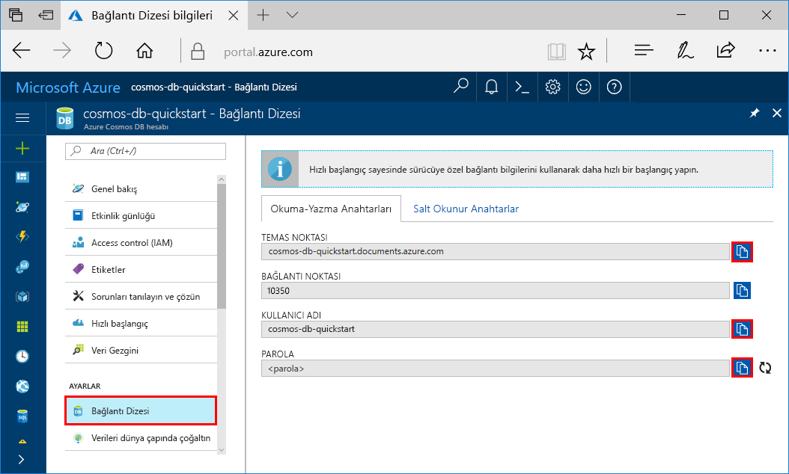

# <a name="quickstart-build-a-cassandra-app-with-net-sdk-and-azure-cosmos-db"></a>Hızlı Başlangıç: .NET SDK'sını ve Azure Cosmos DB ile Cassandra uygulaması derleme

> [!div class="op_single_selector"]
> * [.NET](create-cassandra-dotnet.md)
> * [Java](create-cassandra-java.md)
> * [Node.js](create-cassandra-nodejs.md)
> * [Python](create-cassandra-python.md)
>  

Bu hızlı başlangıçta GitHub’dan bir örneği kopyalayarak bir profil uygulaması derlemek için .NET ve Azure Cosmos DB [Cassandra API’sini](cassandra-introduction.md) nasıl kullanacağınız gösterilmektedir. Bu hızlı başlangıçta web tabanlı Azure portalını kullanarak bir Azure Cosmos DB hesabı oluşturma işlemi de gösterilmektedir.

Azure Cosmos DB, Microsoft'un genel olarak dağıtılmış çok modelli veritabanı hizmetidir. Bu hizmetle belge, tablo, anahtar/değer ve grafik veritabanlarını kolayca oluşturup sorgulayabilir ve tüm bunları yaparken Azure Cosmos DB'nin genel dağıtım ve yatay ölçeklendirme özelliklerinden faydalanabilirsiniz. 

## <a name="prerequisites"></a>Önkoşullar

[!INCLUDE [quickstarts-free-trial-note](../../includes/quickstarts-free-trial-note.md)] Alternatif olarak, [Azure Cosmos DB](https://azure.microsoft.com/try/cosmosdb/)’yi ücretsiz olarak, Azure aboneliği olmadan ve herhangi bir taahhütte bulunmadan deneyebilirsiniz.

Ayrıca, şunlar gerekir: 
* Visual Studio yüklü 2019 yoksa, indirip kullanabilirsiniz **ücretsiz** [Visual Studio 2019 Community Edition](https://www.visualstudio.com/downloads/). Visual Studio kurulumu sırasında **Azure dağıtımını** etkinleştirdiğinizden emin olun.
* Örneği kopyalamak için [Git](https://www.git-scm.com/) yükleyin.

<a id="create-account"></a>
## <a name="create-a-database-account"></a>Veritabanı hesabı oluşturma

[!INCLUDE [cosmos-db-create-dbaccount-cassandra](../../includes/cosmos-db-create-dbaccount-cassandra.md)]


## <a name="clone-the-sample-application"></a>Örnek uygulamayı kopyalama

Şimdi kod ile çalışmaya geçelim. GitHub’dan bir Cassandra API’si uygulaması kopyalayalım, bağlantı dizesini ayarlayalım ve uygulamayı çalıştıralım. Verilerle program aracılığıyla çalışmanın ne kadar kolay olduğunu göreceksiniz. 

1. Bir komut istemi açın. `git-samples` adlı yeni bir klasör oluşturun. Ardından, komut istemini kapatın.

    ```bash
    md "C:\git-samples"
    ```

2. Git Bash gibi bir Git terminal penceresi açın ve örnek uygulamayı yüklemek üzere yeni bir klasör olarak değiştirmek için `cd` komutunu kullanın.

    ```bash
    cd "C:\git-samples"
    ```

3. Örnek depoyu kopyalamak için aşağıdaki komutu çalıştırın. Bu komut bilgisayarınızda örnek uygulamanın bir kopyasını oluşturur.

    ```bash
    git clone https://github.com/Azure-Samples/azure-cosmos-db-cassandra-dotnet-getting-started.git
    ```

4. Ardından Visual Studio'da CassandraQuickStartSample çözüm dosyasını açın. 

## <a name="review-the-code"></a>Kodu gözden geçirin

Bu adım isteğe bağlıdır. Kodun veritabanı kaynaklarını nasıl oluşturduğunu öğrenmek istiyorsanız aşağıdaki kod parçacıklarını gözden geçirebilirsiniz. Kod parçacıklarının tamamı `C:\git-samples\azure-cosmos-db-cassandra-dotnet-getting-started\CassandraQuickStartSample` klasöründe yüklü olan `Program.cs` dosyasından alınmıştır. Aksi durumda, [Bağlantı dizenizi güncelleştirme](#update-your-connection-string) bölümüne atlayabilirsiniz.

* Bir Cassandra kümesi uç noktasına bağlanarak oturumu başlatın. Azure Cosmos DB üzerinde Cassandra API’si yalnızca TLSv1.2’yi destekler. 

  ```csharp
   var options = new Cassandra.SSLOptions(SslProtocols.Tls12, true, ValidateServerCertificate);
   options.SetHostNameResolver((ipAddress) => CassandraContactPoint);
   Cluster cluster = Cluster.Builder().WithCredentials(UserName, Password).WithPort(CassandraPort).AddContactPoint(CassandraContactPoint).WithSSL(options).Build();
   ISession session = cluster.Connect();
   ```

* Yeni bir anahtar alanı oluşturun.

    ```csharp
    session.Execute("CREATE KEYSPACE uprofile WITH REPLICATION = { 'class' : 'NetworkTopologyStrategy', 'datacenter1' : 1 };"); 
    ```

* Yeni bir tablo oluşturun.

   ```csharp
  session.Execute("CREATE TABLE IF NOT EXISTS uprofile.user (user_id int PRIMARY KEY, user_name text, user_bcity text)");
   ```

* Uprofile anahtar alanına bağlanan yeni bir oturum ile IMapper nesnesini kullanarak kullanıcı varlıkları ekleyin.

    ```csharp
    mapper.Insert<User>(new User(1, "LyubovK", "Dubai"));
    ```
    
* Tüm kullanıcıların bilgilerini almak için sorgulayın.

    ```csharp
   foreach (User user in mapper.Fetch<User>("Select * from user"))
   {
      Console.WriteLine(user);
   }
    ```
    
* Tek bir kullanıcının bilgilerini almak için sorgulayın.

    ```csharp
    mapper.FirstOrDefault<User>("Select * from user where user_id = ?", 3);
    ```

## <a name="update-your-connection-string"></a>Bağlantı dizenizi güncelleştirme

Bu adımda Azure portalına dönerek bağlantı dizesi bilgilerinizi kopyalayıp uygulamaya ekleyin. Bağlantı dizesi bilgileri, uygulamanızın barındırılan veritabanıyla iletişim kurmasına olanak tanır.

1. [Azure portalında](https://portal.azure.com/) **Bağlantı Dizesi**’ni seçin.

    En üstteki USERNAME değerini kopyalamak için ekranın sağ tarafındaki  kullanın.

    

2. Visual Studio'da, Program.cs dosyasını açın. 

3. Portaldan USERNAME değerini 13. satırdaki `<FILLME>` üzerine yapıştırın.

    Program.cs dosyasının 13. satırı şuna benzer şekilde görünmelidir: 

    `private const string UserName = "cosmos-db-quickstart";`

3. Portala geri dönün ve PASSWORD değerini kopyalayın. Portaldan PASSWORD değerini 14. satırdaki `<FILLME>` üzerine yapıştırın.

    Program.cs dosyasının 14. satırı şuna benzer şekilde görünmelidir: 

    `private const string Password = "2Ggkr662ifxz2Mg...==";`

4. Portala geri dönün ve CONTACT POINT değerini kopyalayın. Portaldan CONTACT POINT değerini 15. satırdaki `<FILLME>` üzerine yapıştırın.

    Program.cs dosyasının 15. satırı şuna benzer şekilde görünmelidir: 

    `private const string CassandraContactPoint = "cosmos-db-quickstarts.cassandra.cosmosdb.azure.com"; //  DnsName`

5. Program.cs dosyasını kaydedin.
    
## <a name="run-the-net-app"></a>.NET uygulama çalıştırma

1. Visual Studio’da **Araçlar** > **NuGet Paket Yöneticisi** > **Paket Yöneticisi Konsolu**’nu seçin.

2. Komut isteminde .NET Sürücüsü NuGet paketini yüklemek için aşağıdaki komutu kullanın. 

    ```cmd
    Install-Package CassandraCSharpDriver
    ```
3. Uygulamayı çalıştırmak için CTRL+F5 tuşlarına basın. Uygulamanız konsol pencerenizde görüntülenir. 

    

    Programın yürütülmesini durdurup konsol penceresini kapatmak için CTRL + C tuşlarına basın. 
    
4. Azure portalında bu yeni verileri sorgulamak, değiştirmek ve birlikte çalışmak için **Veri Gezgini**'ni açın.

    

## <a name="review-slas-in-the-azure-portal"></a>Azure portalında SLA'ları gözden geçirme

[!INCLUDE [cosmosdb-tutorial-review-slas](../../includes/cosmos-db-tutorial-review-slas.md)]

## <a name="clean-up-resources"></a>Kaynakları temizleme

[!INCLUDE [cosmosdb-delete-resource-group](../../includes/cosmos-db-delete-resource-group.md)]

## <a name="next-steps"></a>Sonraki adımlar

Bu hızlı başlangıçta Azure Cosmos DB hesabı oluşturmayı, Veri Gezgini'ni kullanarak kapsayıcı oluşturmayı ve bir web uygulamasını çalıştırmayı öğrendiniz. Şimdi Cosmos DB hesabınıza ek veri aktarabilirsiniz. 

> [!div class="nextstepaction"]
> [Cassandra verilerini Azure Cosmos DB’ye aktarma](cassandra-import-data.md)
