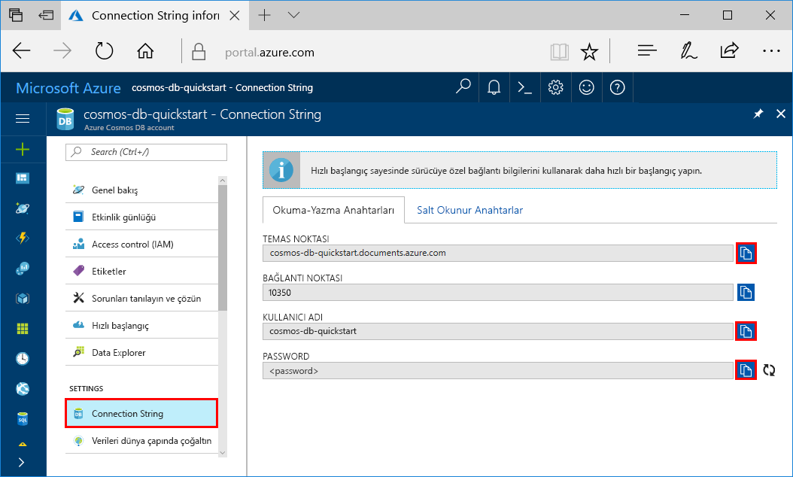
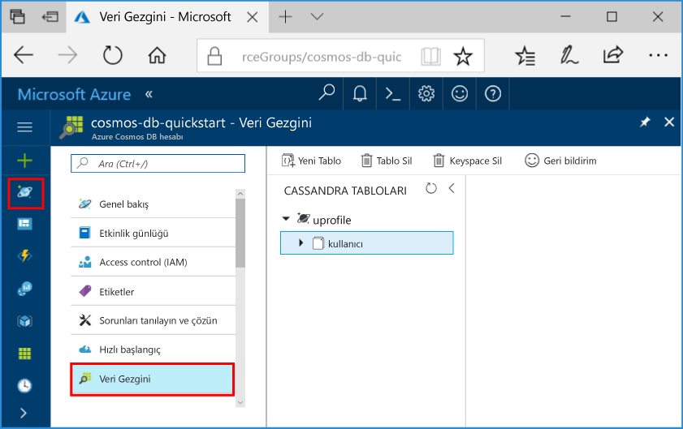

# <a name="quickstart-build-a-cassandra-app-with-java-sdk-and-azure-cosmos-db"></a>Hızlı Başlangıç: Java ile Cassandra uygulaması derleme SDK ve Azure Cosmos DB

> [!div class="op_single_selector"]
> * [.NET](create-cassandra-dotnet.md)
> * [Java](create-cassandra-java.md)
> * [Node.js](create-cassandra-nodejs.md)
> * [Python](create-cassandra-python.md)
>  

Bu hızlı başlangıçta GitHub’dan bir örneği kopyalayarak bir profil uygulaması derlemek için Java ve Azure Cosmos DB [Cassandra API’sini](cassandra-introduction.md) nasıl kullanacağınız gösterilmektedir. Bu hızlı başlangıçta web tabanlı Azure portalını kullanarak bir Azure Cosmos DB hesabı oluşturma işlemi de gösterilmektedir.

Azure Cosmos DB, Microsoft'un genel olarak dağıtılmış çok modelli veritabanı hizmetidir. Bu hizmetle belge, tablo, anahtar/değer ve grafik veritabanlarını kolayca oluşturup sorgulayabilir ve tüm bunları yaparken Azure Cosmos DB'nin genel dağıtım ve yatay ölçeklendirme özelliklerinden faydalanabilirsiniz. 

## <a name="prerequisites"></a>Önkoşullar

[!INCLUDE [quickstarts-free-trial-note](../../includes/quickstarts-free-trial-note.md)] Alternatif olarak, [Azure Cosmos DB](https://azure.microsoft.com/try/cosmosdb/)’yi ücretsiz olarak, Azure aboneliği olmadan ve herhangi bir taahhütte bulunmadan deneyebilirsiniz.

Ayrıca, şunlar gerekir:

* [Java Development Kit (JDK) 1.7+](https://aka.ms/azure-jdks)
    * Ubuntu’da JDK’yi yüklemek için `apt-get install default-jdk` komutunu çalıştırın.
    * JAVA_HOME ortam değişkenini JDK’nin yüklü olduğu klasöre işaret edecek şekilde ayarladığınızdan emin olun.
* Bir [Maven](https://maven.apache.org/) ikili arşivi [indirin](https://maven.apache.org/download.cgi) ve [yükleyin](https://maven.apache.org/install.html)
    * Ubuntu’da Maven’i yüklemek için `apt-get install maven` komutunu çalıştırabilirsiniz.
* [Git](https://www.git-scm.com/)
    * Ubuntu’da Git’i yüklemek için `sudo apt-get install git` komutunu çalıştırabilirsiniz.

## <a name="create-a-database-account"></a>Veritabanı hesabı oluşturma

Bir belge veritabanı oluşturmadan önce Azure Cosmos DB ile bir Cassandra hesabı oluşturmanız gerekir.

[!INCLUDE [cosmos-db-create-dbaccount-cassandra](../../includes/cosmos-db-create-dbaccount-cassandra.md)]

## <a name="clone-the-sample-application"></a>Örnek uygulamayı kopyalama

Şimdi kod ile çalışmaya geçelim. GitHub’dan bir Cassandra uygulaması kopyalayalım, bağlantı dizesini ayarlayalım ve uygulamayı çalıştıralım. Verilerle program aracılığıyla çalışmanın ne kadar kolay olduğunu göreceksiniz. 

1. Bir komut istemi açın. `git-samples` adlı yeni bir klasör oluşturun. Ardından, komut istemini kapatın.

    ```bash
    md "C:\git-samples"
    ```

2. Git Bash gibi bir Git terminal penceresi açın ve örnek uygulamayı yüklemek üzere yeni bir klasör olarak değiştirmek için `cd` komutunu kullanın.

    ```bash
    cd "C:\git-samples"
    ```

3. Örnek depoyu kopyalamak için aşağıdaki komutu çalıştırın. Bu komut bilgisayarınızda örnek uygulamanın bir kopyasını oluşturur.

    ```bash
    git clone https://github.com/Azure-Samples/azure-cosmos-db-cassandra-java-getting-started.git
    ```

## <a name="review-the-code"></a>Kodu gözden geçirin

Bu adım isteğe bağlıdır. Kodun veritabanı kaynaklarını nasıl oluşturduğunu öğrenmek istiyorsanız aşağıdaki kod parçacıklarını gözden geçirebilirsiniz. Aksi durumda, [Bağlantı dizenizi güncelleştirme](#update-your-connection-string) bölümüne atlayabilirsiniz. Bu kod parçacıklarının tamamı `src/main/java/com/azure/cosmosdb/cassandra/util/CassandraUtils.java` dosyasından alınmıştır.  

* Cassandra konağı, bağlantı noktası, kullanıcı adı, parola ve SSL seçenekleri ayarlanmıştır. Bağlantı dizesi bilgileri Azure portalındaki bağlantı dizesi sayfasından gelir.

   ```java
   cluster = Cluster.builder().addContactPoint(cassandraHost).withPort(cassandraPort).withCredentials(cassandraUsername, cassandraPassword).withSSL(sslOptions).build();
   ```

* `cluster`, Azure Cosmos DB Cassandra API’sine bağlanır ve erişilecek bir oturum döndürür.

    ```java
    return cluster.connect();
    ```

Aşağıdaki kod parçacıkları `src/main/java/com/azure/cosmosdb/cassandra/repository/UserRepository.java` dosyasından alınmıştır.

* Yeni bir anahtar alanı oluşturun.

    ```java
    public void createKeyspace() {
        final String query = "CREATE KEYSPACE IF NOT EXISTS uprofile WITH replication = {'class': 'SimpleStrategy', 'replication_factor': '3' } ";
        session.execute(query);
        LOGGER.info("Created keyspace 'uprofile'");
    }
    ```

* Yeni bir tablo oluşturun.

   ```java
   public void createTable() {
        final String query = "CREATE TABLE IF NOT EXISTS uprofile.user (user_id int PRIMARY KEY, user_name text, user_bcity text)";
        session.execute(query);
        LOGGER.info("Created table 'user'");
   }
   ```

* Hazırlanmış bir deyim nesnesini kullanarak kullanıcı varlıkları ekleyin.

    ```java
    public PreparedStatement prepareInsertStatement() {
        final String insertStatement = "INSERT INTO  uprofile.user (user_id, user_name , user_bcity) VALUES (?,?,?)";
        return session.prepare(insertStatement);
    }

    public void insertUser(PreparedStatement statement, int id, String name, String city) {
        BoundStatement boundStatement = new BoundStatement(statement);
        session.execute(boundStatement.bind(id, name, city));
    }
    ```

* Tüm kullanıcı bilgilerini almak için sorgulayın.

    ```java
   public void selectAllUsers() {
        final String query = "SELECT * FROM uprofile.user";
        List<Row> rows = session.execute(query).all();

        for (Row row : rows) {
            LOGGER.info("Obtained row: {} | {} | {} ", row.getInt("user_id"), row.getString("user_name"), row.getString("user_bcity"));
        }
    }
    ```

* Tek bir kullanıcının bilgilerini almak için sorgulayın.

    ```java
    public void selectUser(int id) {
        final String query = "SELECT * FROM uprofile.user where user_id = 3";
        Row row = session.execute(query).one();

        LOGGER.info("Obtained row: {} | {} | {} ", row.getInt("user_id"), row.getString("user_name"), row.getString("user_bcity"));
    }
    ```

## <a name="update-your-connection-string"></a>Bağlantı dizenizi güncelleştirme

Bu adımda Azure portalına dönerek bağlantı dizesi bilgilerinizi kopyalayıp uygulamaya ekleyin. Bağlantı dizesi ayrıntıları, uygulamanızın barındırılan veritabanıyla iletişim kurmasına olanak tanır.

1. [Azure portalında](https://portal.azure.com/) **Bağlantı Dizesi**’ni seçin. 

    

2. CONTACT POINT değerini kopyalamak için ekranın sağ tarafındaki  kullanın.

3. `C:\git-samples\azure-cosmosdb-cassandra-java-getting-started\java-examples\src\main\resources` klasöründen `config.properties` dosyasını açın. 

3. Portaldan CONTACT POINT değerini 2. satırdaki `<Cassandra endpoint host>` üzerine yapıştırın.

    Config.properties 2. satırı şuna benzer görünmelidir: 

    `cassandra_host=cosmos-db-quickstart.cassandra.cosmosdb.azure.com`

3. Portala geri dönün ve USERNAME değerini kopyalayın. Portaldan USERNAME değerini 4. satırdaki `<cassandra endpoint username>` üzerine yapıştırın.

    Config.properties 4. satırı şuna benzer görünmelidir: 

    `cassandra_username=cosmos-db-quickstart`

4. Portala geri dönün ve PASSWORD değerini kopyalayın. Portaldan PASSWORD değerini 5. satırdaki `<cassandra endpoint password>` üzerine yapıştırın.

    Config.properties 5. satırı şuna benzer görünmelidir: 

    `cassandra_password=2Ggkr662ifxz2Mg...==`

5. Belirli bir SSL sertifikasını kullanmak istiyorsanız 6. satırda `<SSL key store file location>` değerini SSL sertifikasının konumuyla değiştirin. Bir değer sağlanmamışsa, <JAVA_HOME>/jre/lib/security/cacerts konumuna yüklenen JDK sertifikası kullanılır. 

6. 6. satırı belirli bir SSL sertifikası kullanmak üzere değiştirdiyseniz, 7. satırı bu sertifikanın parolasını kullanacak şekilde güncelleştirin. 

7. `config.properties` dosyasını kaydedin.

## <a name="run-the-java-app"></a>Java uygulamasını çalıştırma

1. Git terminal penceresinde, `azure-cosmosdb-cassandra-java-getting-started\java-examples` klasörüne `cd`.

    ```git
    cd "C:\git-samples\azure-cosmosdb-cassandra-java-getting-started\java-examples"
    ```

2. Git terminal penceresinde, `cosmosdb-cassandra-examples.jar` dosyasını oluşturmak için aşağıdaki komutları kullanın.

    ```git
    mvn clean install
    ```

3. Git terminal penceresinde, Java uygulamasını başlatmak için aşağıdaki komutu çalıştırın.

    ```git
    java -cp target/cosmosdb-cassandra-examples.jar com.azure.cosmosdb.cassandra.examples.UserProfile
    ```

    Terminal penceresinde anahtar alanı ve tablonun oluşturulduğuna yönelik bildirimler gösterilir. Daha sonra tablodaki tüm kullanıcıları seçip döndürür ve çıktıyı gösterir, ardından kimliğe göre bir satır seçip değeri gösterir.  

    Programın yürütülmesini durdurup konsol penceresini kapatmak için CTRL + C tuşlarına basın.

4. Azure portalında bu yeni verileri sorgulamak, değiştirmek ve birlikte çalışmak için **Veri Gezgini**'ni açın. 

    

## <a name="review-slas-in-the-azure-portal"></a>Azure portalında SLA'ları gözden geçirme

[!INCLUDE [cosmosdb-tutorial-review-slas](../../includes/cosmos-db-tutorial-review-slas.md)]

## <a name="clean-up-resources"></a>Kaynakları temizleme

[!INCLUDE [cosmosdb-delete-resource-group](../../includes/cosmos-db-delete-resource-group.md)]

## <a name="next-steps"></a>Sonraki adımlar

Bu hızlı başlangıçta Azure Cosmos DB hesabını ve Cassandra veritabanını oluşturmayı, Veri Gezgini'ni kullanarak kapsayıcı oluşturmayı ve bu işlemleri programlı bir şekilde yapacak bir uygulamayı çalıştırmayı öğrendiniz. Şimdi Azure Cosmos DB kapsayıcınıza ek veri aktarabilirsiniz. 

> [!div class="nextstepaction"]
> [Cassandra verilerini Azure Cosmos DB’ye aktarma](cassandra-import-data.md)
