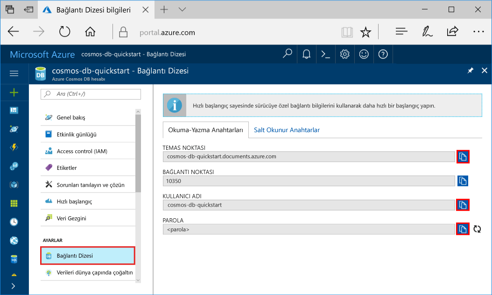
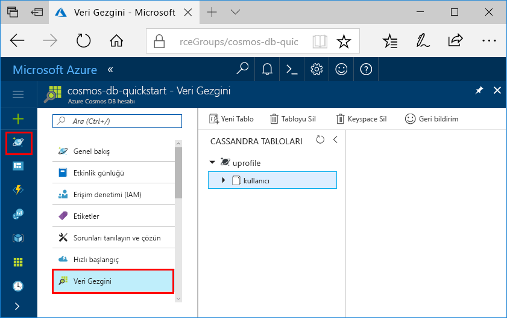

# <a name="quickstart-build-a-cassandra-app-with-nodejs-sdk-and-azure-cosmos-db"></a>Hızlı Başlangıç: Node.js SDK'sını ve Azure Cosmos DB ile Cassandra uygulaması derleme

> [!div class="op_single_selector"]
> * [.NET](create-cassandra-dotnet.md)
> * [Java](create-cassandra-java.md)
> * [Node.js](create-cassandra-nodejs.md)
> * [Python](create-cassandra-python.md)
>  

Bu hızlı başlangıçta GitHub’dan bir örneği kopyalayarak bir profil uygulaması oluşturmak için Node.js ve Azure Cosmos DB [Cassandra API’sini](cassandra-introduction.md) nasıl kullanacağınız gösterilmektedir. Bu hızlı başlangıçta web tabanlı Azure portalını kullanarak bir Azure Cosmos DB hesabı oluşturma işlemi de gösterilmektedir.

Azure Cosmos DB, Microsoft'un genel olarak dağıtılmış çok modelli veritabanı hizmetidir. Bu hizmetle belge, tablo, anahtar/değer ve grafik veritabanlarını kolayca oluşturup sorgulayabilir ve tüm bunları yaparken Azure Cosmos DB'nin genel dağıtım ve yatay ölçeklendirme özelliklerinden faydalanabilirsiniz. 

## <a name="prerequisites"></a>Önkoşullar

[!INCLUDE [quickstarts-free-trial-note](../../includes/quickstarts-free-trial-note.md)] Alternatif olarak, [Azure Cosmos DB](https://azure.microsoft.com/try/cosmosdb/)’yi ücretsiz olarak, Azure aboneliği olmadan ve herhangi bir taahhütte bulunmadan deneyebilirsiniz.

Ayrıca, şunlar gerekir:
* [Node.js](https://nodejs.org/en/) sürüm v0.10.29 veya üzeri
* [Git](https://git-scm.com/)

## <a name="create-a-database-account"></a>Veritabanı hesabı oluşturma

Bir belge veritabanı oluşturmadan önce Azure Cosmos DB ile bir Cassandra hesabı oluşturmanız gerekir.

[!INCLUDE [cosmos-db-create-dbaccount-cassandra](../../includes/cosmos-db-create-dbaccount-cassandra.md)]

## <a name="clone-the-sample-application"></a>Örnek uygulamayı kopyalama

Şimdi github'dan bir Cassandra API'si uygulaması kopyalayalım, bağlantı dizesini ayarlayalım ve uygulamayı şimdi. Verilerle programlı bir şekilde çalışmanın ne kadar kolay olduğunu görüyorsunuz. 

1. Bir komut istemi açın. `git-samples` adlı yeni bir klasör oluşturun. Ardından, komut istemini kapatın.

    ```bash
    md "C:\git-samples"
    ```

2. Git bash gibi bir git terminal penceresi açın. `cd` komutunu kullanarak, örnek uygulamayı yüklemek için yeni klasöre geçiş yapın.

    ```bash
    cd "C:\git-samples"
    ```

3. Örnek depoyu kopyalamak için aşağıdaki komutu çalıştırın. Bu komut bilgisayarınızda örnek uygulamanın bir kopyasını oluşturur.

    ```bash
    git clone https://github.com/Azure-Samples/azure-cosmos-db-cassandra-nodejs-getting-started.git
    ```

## <a name="review-the-code"></a>Kodu gözden geçirin

Bu adım isteğe bağlıdır. Kodun veritabanı kaynaklarını nasıl oluşturduğunu öğrenmek istiyorsanız aşağıdaki kod parçacıklarını gözden geçirebilirsiniz. Kod parçacıklarının tamamı `C:\git-samples\azure-cosmos-db-cassandra-nodejs-getting-started` klasöründeki `uprofile.js` dosyasından alınmıştır. Aksi durumda, [Bağlantı dizenizi güncelleştirme](#update-your-connection-string) bölümüne atlayabilirsiniz. 

* Kullanıcı adı ve parola değerleri, Azure portalındaki bağlantı dizesi sayfası kullanılarak ayarlanmıştır. `path\to\cert` bir X509 sertifikasının yolunu sağlar. 

   ```javascript
   var ssl_option = {
        cert : fs.readFileSync("path\to\cert"),
        rejectUnauthorized : true,
        secureProtocol: 'TLSv1_2_method'
        };
   const authProviderLocalCassandra = new cassandra.auth.PlainTextAuthProvider(config.username, config.password);
   ```

* `client`, contactPoint bilgileriyle başlatılır. ContactPoint, Azure portalından alınır.

    ```javascript
    const client = new cassandra.Client({contactPoints: [config.contactPoint], authProvider: authProviderLocalCassandra, sslOptions:ssl_option});
    ```

* `client`, Azure Cosmos DB Cassandra API’sine bağlanır.

    ```javascript
    client.connect(next);
    ```

* Yeni bir anahtar alanı oluşturulur.

    ```javascript
    function createKeyspace(next) {
        var query = "CREATE KEYSPACE IF NOT EXISTS uprofile WITH replication = {\'class\': \'NetworkTopologyStrategy\', \'datacenter1\' : \'1\' }";
        client.execute(query, next);
        console.log("created keyspace");    
  }
    ```

* Yeni bir tablo oluşturulur.

   ```javascript
   function createTable(next) {
    var query = "CREATE TABLE IF NOT EXISTS uprofile.user (user_id int PRIMARY KEY, user_name text, user_bcity text)";
        client.execute(query, next);
        console.log("created table");
   },
   ```

* Anahtar/değer varlıkları eklenir.

    ```javascript
    ...
       {
          query: 'INSERT INTO  uprofile.user  (user_id, user_name , user_bcity) VALUES (?,?,?)',
          params: [5, 'IvanaV', 'Belgaum', '2017-10-3136']
        }
    ];
    client.batch(queries, { prepare: true}, next);
    ```

* Tüm anahtar değerlerini almak için sorgu.

    ```javascript
   var query = 'SELECT * FROM uprofile.user';
    client.execute(query, { prepare: true}, function (err, result) {
      if (err) return next(err);
      result.rows.forEach(function(row) {
        console.log('Obtained row: %d | %s | %s ',row.user_id, row.user_name, row.user_bcity);
      }, this);
      next();
    });
    ```  
    
* Bir anahtar-değeri almak için sorgu.

    ```javascript
    function selectById(next) {
        console.log("\Getting by id");
        var query = 'SELECT * FROM uprofile.user where user_id=1';
        client.execute(query, { prepare: true}, function (err, result) {
        if (err) return next(err);
            result.rows.forEach(function(row) {
            console.log('Obtained row: %d | %s | %s ',row.user_id, row.user_name, row.user_bcity);
        }, this);
        next();
        });
    }
    ```  

## <a name="update-your-connection-string"></a>Bağlantı dizenizi güncelleştirme

Bu adımda Azure portalına dönerek bağlantı dizesi bilgilerinizi kopyalayıp uygulamaya ekleyin. Bağlantı dizesi, uygulamanızın barındırılan veritabanıyla iletişim kurmasına olanak tanır.

1. [Azure portalında](https://portal.azure.com/) **Bağlantı Dizesi**’ni seçin. 

    En üstteki USERNAME değerini kopyalamak için ekranın sağ tarafındaki  düğmesini kullanın.

    

2. `config.js` dosyasını açın. 

3. Portaldan CONTACT POINT değerini 4. satırda `<FillMEIN>` üzerine yapıştırın.

    Satır 4 şuna benzer şekilde görünmelidir: 

    `config.contactPoint = "cosmos-db-quickstarts.cassandra.cosmosdb.azure.com:10350"`

4. Portaldan USERNAME değerini kopyalayın ve 2. satırda `<FillMEIN>` üzerine yapıştırın.

    Satır 2 şuna benzer şekilde görünmelidir: 

    `config.username = 'cosmos-db-quickstart';`
    
5. Portaldan PASSWORD değerini kopyalayın ve 3. satırda `<FillMEIN>` üzerine yapıştırın.

    Satır 3 şuna benzer şekilde görünmelidir:

    `config.password = '2Ggkr662ifxz2Mg==';`

6. `config.js` dosyasını kaydedin.
    
## <a name="use-the-x509-certificate"></a>X509 sertifikası kullanma

1. Baltimore CyberTrust Kök sertifikasını [https://cacert.omniroot.com/bc2025.crt](https://cacert.omniroot.com/bc2025.crt) konumundan yerel olarak indirin. `.cer` dosya uzantısını kullanarak dosyayı yeniden adlandırın.

   Sertifika `02:00:00:b9` seri numarasına ve `d4🇩🇪20:d0:5e:66:fc:53:fe:1a:50:88:2c:78:db:28:52:ca:e4:74` SHA1 parmak izine sahiptir.

2. `uprofile.js` dosyasını açın ve `path\to\cert` değerini yeni sertifikanızı işaret edecek şekilde değiştirin.

3. `uprofile.js` dosyasını kaydedin.

## <a name="run-the-nodejs-app"></a>Node.js uygulamasını çalıştırma

1. Git terminal penceresinde `npm install` komutunu çalıştırarak gerekli npm modüllerini yükleyin.

2. Node.js uygulamanızı başlatmak için `node uprofile.js` komutunu çalıştırın.

3. Sonuçların beklendiği gibi olduğunu komut satırından kontrol edin.

    

    Programın yürütülmesini durdurup konsol penceresini kapatmak için CTRL + C tuşlarına basın. 

4. Azure portalında bu yeni verileri sorgulamak, değiştirmek ve birlikte çalışmak için **Veri Gezgini**'ni açın. 

     

## <a name="review-slas-in-the-azure-portal"></a>Azure portalında SLA'ları gözden geçirme

[!INCLUDE [cosmosdb-tutorial-review-slas](../../includes/cosmos-db-tutorial-review-slas.md)]

## <a name="clean-up-resources"></a>Kaynakları temizleme

[!INCLUDE [cosmosdb-delete-resource-group](../../includes/cosmos-db-delete-resource-group.md)]

## <a name="next-steps"></a>Sonraki adımlar

Bu hızlı başlangıçta Azure Cosmos DB hesabı oluşturmayı, Veri Gezgini'ni kullanarak kapsayıcı oluşturmayı ve bir uygulamayı çalıştırmayı öğrendiniz. Şimdi Cosmos DB hesabınıza ek veri aktarabilirsiniz. 

> [!div class="nextstepaction"]
> [Cassandra verilerini Azure Cosmos DB’ye aktarma](cassandra-import-data.md)


