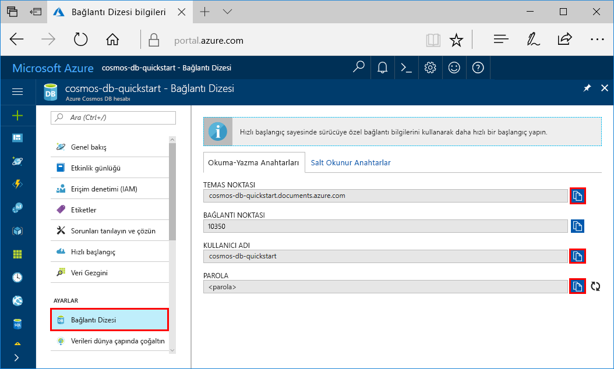
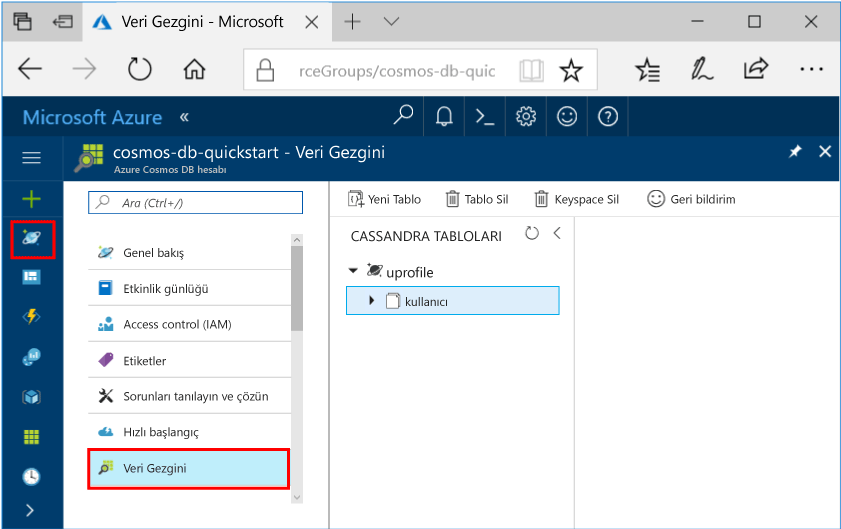

# <a name="quickstart-build-a-cassandra-app-with-python-and-azure-cosmos-db"></a>Hızlı Başlangıç: Python ve Azure Cosmos DB ile Cassandra uygulaması derleme

Bu hızlı başlangıçta GitHub’dan bir örneği kopyalayarak bir profil uygulaması derlemek için Python ve Azure Cosmos DB [Cassandra API’sini](cassandra-introduction.md) nasıl kullanacağınız gösterilmektedir. Bu hızlı başlangıç ayrıca web tabanlı Azure portalını kullanarak bir Azure Cosmos DB hesabı oluşturma adımlarını da gösterir.

Azure Cosmos DB, Microsoft'un genel olarak dağıtılmış çok modelli veritabanı hizmetidir. Bu hizmetle belge, tablo, anahtar/değer ve grafik veritabanlarını kolayca oluşturup sorgulayabilir ve tüm bunları yaparken Azure Cosmos DB'nin genel dağıtım ve yatay ölçeklendirme özelliklerinden faydalanabilirsiniz.   

## <a name="prerequisites"></a>Ön koşullar

[!INCLUDE [quickstarts-free-trial-note](../../includes/quickstarts-free-trial-note.md)] Alternatif olarak, [Azure Cosmos DB](https://azure.microsoft.com/try/cosmosdb/)’yi ücretsiz olarak, Azure aboneliği olmadan ve herhangi bir taahhütte bulunmadan deneyebilirsiniz.

Azure Cosmos DB Cassandra API’si önizleme programına erişim. Erişim için henüz başvurmadıysanız [şimdi kaydolun](cassandra-introduction.md#sign-up-now).

Buna ek olarak:
* [Python](https://www.python.org/downloads/) v2.7.14 sürümü
* [Git](http://git-scm.com/)
* [Apache Cassandra için Python Sürücüsü](https://github.com/datastax/python-driver)

## <a name="create-a-database-account"></a>Veritabanı hesabı oluşturma

Bir belge veritabanı oluşturmadan önce Azure Cosmos DB ile bir Cassandra hesabı oluşturmanız gerekir.

[!INCLUDE [cosmos-db-create-dbaccount-cassandra](../../includes/cosmos-db-create-dbaccount-cassandra.md)]

## <a name="clone-the-sample-application"></a>Örnek uygulamayı kopyalama

Şimdi GitHub’dan bir Cassandra API’si uygulaması kopyalayalım, bağlantı dizesini ayarlayalım ve uygulamayı çalıştıralım. Verilerle programlı bir şekilde çalışmanın ne kadar kolay olduğunu görüyorsunuz. 

1. Bir komut istemini açın, git-samples adlı yeni bir klasör oluşturun ve komut istemini kapatın.

    ```bash
    md "C:\git-samples"
    ```

2. Git Bash gibi bir Git terminal penceresi açın ve örnek uygulamayı yüklemek üzere yeni bir klasör olarak değiştirmek için `cd` komutunu kullanın.

    ```bash
    cd "C:\git-samples"
    ```

3. Örnek depoyu kopyalamak için aşağıdaki komutu çalıştırın. Bu komut bilgisayarınızda örnek uygulamanın bir kopyasını oluşturur.

    ```bash
    git clone https://github.com/Azure-Samples/azure-cosmos-db-cassandra-python-getting-started.git
    ```

## <a name="review-the-code"></a>Kodu gözden geçirin

Bu adım isteğe bağlıdır. Veritabanı kaynaklarının kodda nasıl oluşturulduğunu öğrenmekle ilgileniyorsanız aşağıdaki kod parçacıklarını gözden geçirebilirsiniz. Kod parçacıklarının tamamı pyquickstart.py dosyasından alınmıştır. Aksi durumda, [Bağlantı dizenizi güncelleştirme](#update-your-connection-string) bölümüne atlayabilirsiniz. 

* Kullanıcı adı ve parola, Azure portalında bağlantı dizesi sayfası kullanılarak ayarlanır. Path\to\cert yolunu, X509 sertifikanızın yoluyla değiştirebilirsiniz.

   ```python
    ssl_opts = {
            'ca_certs': 'path\to\cert',
            'ssl_version': ssl.PROTOCOL_TLSv1_2
            }
    auth_provider = PlainTextAuthProvider( username=cfg.config['username'], password=cfg.config['password'])
    cluster = Cluster([cfg.config['contactPoint']], port = cfg.config['port'], auth_provider=auth_provider, ssl_options=ssl_opts)
    session = cluster.connect()
   
   ```

* `cluster`, contactPoint bilgileriyle başlatılır. ContactPoint, Azure portalından alınır.

    ```python
   cluster = Cluster([cfg.config['contactPoint']], port = cfg.config['port'], auth_provider=auth_provider)
    ```

* `cluster`, Azure Cosmos DB Cassandra API’sine bağlanır.

    ```python
    session = cluster.connect()
    ```

* Yeni bir anahtar alanı oluşturulur.

    ```python
   session.execute('CREATE KEYSPACE IF NOT EXISTS uprofile WITH replication = {\'class\': \'NetworkTopologyStrategy\', \'datacenter1\' : \'1\' }')
    ```

* Yeni bir tablo oluşturulur.

   ```
   session.execute('CREATE TABLE IF NOT EXISTS uprofile.user (user_id int PRIMARY KEY, user_name text, user_bcity text)');
   ```

* Anahtar/değer varlıkları eklenir.

    ```Python
    insert_data = session.prepare("INSERT INTO  uprofile.user  (user_id, user_name , user_bcity) VALUES (?,?,?)")
    batch = BatchStatement()
    batch.add(insert_data, (1, 'LyubovK', 'Dubai'))
    batch.add(insert_data, (2, 'JiriK', 'Toronto'))
    batch.add(insert_data, (3, 'IvanH', 'Mumbai'))
    batch.add(insert_data, (4, 'YuliaT', 'Seattle'))
    ....
    session.execute(batch)
    ```

* Tüm anahtar değerlerini almak için sorgu.

    ```Python
    rows = session.execute('SELECT * FROM uprofile.user')
    ```  
    
* Bir anahtar-değeri almak için sorgu.

    ```Python
    
    rows = session.execute('SELECT * FROM uprofile.user where user_id=1')
    ```  

## <a name="update-your-connection-string"></a>Bağlantı dizenizi güncelleştirme

Bu adımda Azure portalına dönerek bağlantı dizesi bilgilerinizi kopyalayıp uygulamaya ekleyin. Bu, uygulamanızın barındırılan veritabanıyla iletişim kurmasına olanak tanır.

1. [Azure portalında](http://portal.azure.com/) **Bağlantı Dizesi**’ne tıklayın. 

    En üstteki USERNAME değerini kopyalamak için ekranın sağ tarafındaki  kullanın.

    

2. `config.py` dosyasını açın. 

3. Portaldan CONTACT POINT değerini 10. satırda `<FILLME>` üzerine yapıştırın.

    10. satır şuna benzer şekilde görünmelidir: 

    `'contactPoint': 'cosmos-db-quickstarts.cassandra.cosmosdb.azure.com:10350'`

4. Portaldan USERNAME değerini kopyalayın ve 6. satırda `<FILLME>` üzerine yapıştırın.

    6. satır şuna benzer şekilde görünmelidir: 

    `'username': 'cosmos-db-quickstart',`
    
5. Portaldan PASSWORD değerini kopyalayın ve 8. satırda `<FILLME>` üzerine yapıştırın.

    8. satır şuna benzer şekilde görünmelidir:

    `'password' = '2Ggkr662ifxz2Mg==`';`

6. Config.py dosyasını kaydedin.
    
## <a name="use-the-x509-certificate"></a>X509 sertifikası kullanma

1. Baltimore CyberTrust Root’u eklemeniz gerekirse 02:00:00:b9 seri numarasını ve d4🇩🇪20:d0:5e:66:fc:53:fe:1a:50:88:2c:78:db:28:52:ca:e4:74 SHA1 parmak izini kullanın. Bu, https://cacert.omniroot.com/bc2025.crt adresinden indirilip .cer uzantısıyla yerel bir dosyaya kaydedilebilir

2. Pyquickstart.py dosyasını açıp 'path\to\cert' yolunu yeni sertifikanıza işaret edecek şekilde değiştirin.

3. Pyquickstart.py dosyasını kaydedin.

## <a name="run-the-app"></a>Uygulamayı çalıştırma

1. azure-cosmos-db-cassandra-python-getting-started klasörüne geçmek için Git terminalinde cd komutunu kullanın. 

2. Gerekli modülleri yüklemek için aşağıdaki komutları çalıştırın:

    ```python
    python -m pip install cassandra-driver
    python -m pip install prettytable
    python -m pip install requests
    python -m pip install pyopenssl
    ```

2. Düğüm uygulamanızı başlatmak için aşağıdaki komutu çalıştırın:

    ```
    python pyquickstart.py
    ```

3. Sonuçların beklendiği gibi olduğunu komut satırından kontrol edin.

    Programın yürütülmesini durdurup konsol penceresini kapatmak için CTRL + C tuşlarına basın. 

    
    
    Şimdi Azure portalında Veri Gezgini'ni açıp bu yeni verileri görebilir, sorgulayabilir, değiştirebilir ve onlarla çalışabilirsiniz. 

    

## <a name="review-slas-in-the-azure-portal"></a>Azure portalında SLA'ları gözden geçirme

[!INCLUDE [cosmosdb-tutorial-review-slas](../../includes/cosmos-db-tutorial-review-slas.md)]

## <a name="clean-up-resources"></a>Kaynakları temizleme

[!INCLUDE [cosmosdb-delete-resource-group](../../includes/cosmos-db-delete-resource-group.md)]

## <a name="next-steps"></a>Sonraki adımlar

Bu hızlı başlangıçta Azure Cosmos DB hesabı oluşturmayı, Veri Gezgini'ni kullanarak kapsayıcı oluşturmayı ve bir uygulamayı çalıştırmayı öğrendiniz. Şimdi Cosmos DB hesabınıza ek veri aktarabilirsiniz. 

> [!div class="nextstepaction"]
> [Cassandra verilerini Azure Cosmos DB’ye aktarma](cassandra-import-data.md)

