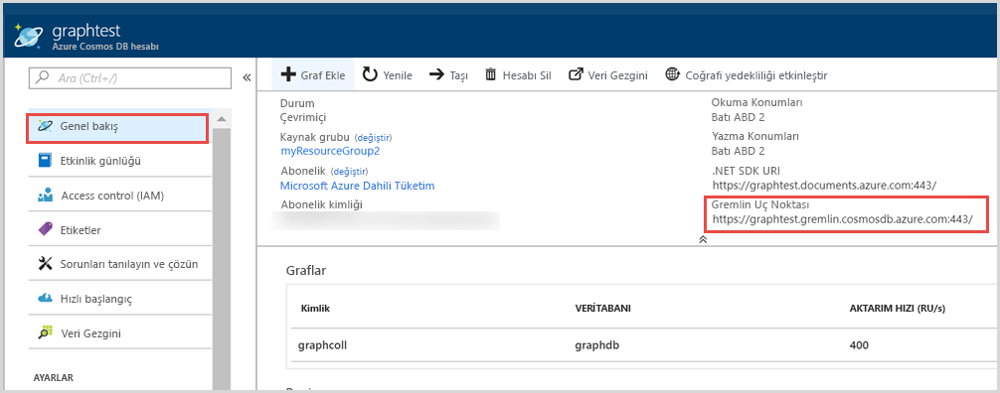
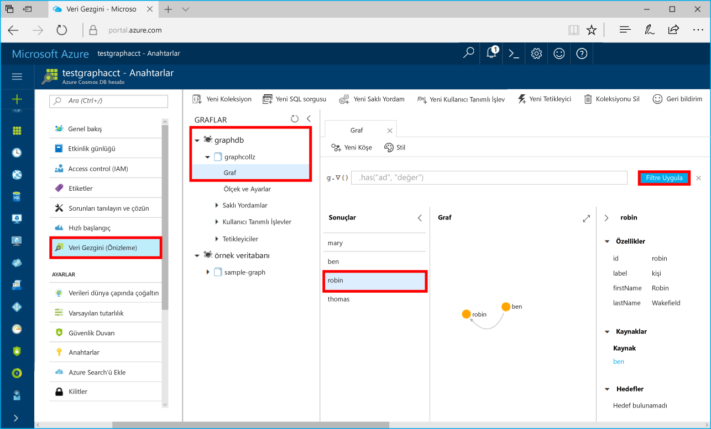

# <a name="quickstart-build-a-net-framework-or-core-application-using-the-azure-cosmos-db-gremlin-api-account"></a>Hızlı Başlangıç: Azure Cosmos DB Gremlin API hesabı kullanarak bir .NET Framework veya Core uygulaması derleme

> [!div class="op_single_selector"]
> * [Gremlin konsolu](create-graph-gremlin-console.md)
> * [.NET](create-graph-dotnet.md)
> * [Java](create-graph-java.md)
> * [Node.js](create-graph-nodejs.md)
> * [Python](create-graph-python.md)
> * [PHP](create-graph-php.md)
>  

Azure Cosmos DB, Microsoft'un genel olarak dağıtılmış çok modelli veritabanı hizmetidir. Bu hizmetle belge, anahtar/değer ve grafik veritabanlarını kolayca oluşturup sorgulayabilir ve tüm bunları yaparken Azure Cosmos DB'nin genel dağıtım ve yatay ölçeklendirme özelliklerinden faydalanabilirsiniz. 

Bu hızlı başlangıçta Azure portalı kullanarak bir Azure Cosmos DB [Gremlin API](graph-introduction.md) hesabını, veritabanını ve grafiğini (kapsayıcı) nasıl oluşturacağınız anlatılmıştır. Daha sonra açık kaynaklı [Gremlin.Net](https://tinkerpop.apache.org/docs/3.2.7/reference/#gremlin-DotNet) sürücüsünü kullanarak bir konsol uygulaması oluşturabilir ve çalıştırabilirsiniz.  

## <a name="prerequisites"></a>Önkoşullar

Visual Studio yüklü 2019 yoksa, indirip kullanabilirsiniz **ücretsiz** [Visual Studio 2019 Community Edition](https://www.visualstudio.com/downloads/). Visual Studio kurulumu sırasında **Azure dağıtımını** etkinleştirdiğinizden emin olun.

[!INCLUDE [quickstarts-free-trial-note](../../includes/quickstarts-free-trial-note.md)]

## <a name="create-a-database-account"></a>Veritabanı hesabı oluşturma

[!INCLUDE [cosmos-db-create-dbaccount-graph](../../includes/cosmos-db-create-dbaccount-graph.md)]

## <a name="add-a-graph"></a>Graf ekleme

[!INCLUDE [cosmos-db-create-graph](../../includes/cosmos-db-create-graph.md)]

## <a name="clone-the-sample-application"></a>Örnek uygulamayı kopyalama

Şimdi GitHub'dan bir Gremlin API'si uygulaması kopyalayalım, bağlantı dizesini ayarlayalım ve uygulamayı çalıştıralım. Verilerle program aracılığıyla çalışmanın ne kadar kolay olduğunu göreceksiniz. 

1. Bir komut istemini açın, git-samples adlı yeni bir klasör oluşturun ve komut istemini kapatın.

    ```bash
    md "C:\git-samples"
    ```

2. Git Bash gibi bir Git terminal penceresi açın ve örnek uygulamayı yüklemek üzere yeni bir klasör olarak değiştirmek için `cd` komutunu kullanın.

    ```bash
    cd "C:\git-samples"
    ```

3. Örnek depoyu kopyalamak için aşağıdaki komutu çalıştırın. Bu komut bilgisayarınızda örnek uygulamanın bir kopyasını oluşturur.

    ```bash
    git clone https://github.com/Azure-Samples/azure-cosmos-db-graph-gremlindotnet-getting-started.git
    ```

4. Ardından Visual Studio’yu ve çözüm dosyasını açın.

5. Projedeki NuGet paketlerini geri yükleyin. Bu Gremlin.Net sürücüsünü ve Newtonsoft.Json paketini içermelidir.


6. Ayrıca NuGet paket yöneticisi veya [NuGet komut satırı yardımcı programını](https://docs.microsoft.com/nuget/install-nuget-client-tools) kullanarak Gremlin.Net sürücüsünü kendiniz de yükleyebilirsiniz: 

    ```bash
    nuget install Gremlin.Net
    ```

## <a name="review-the-code"></a>Kodu gözden geçirin

Bu adım isteğe bağlıdır. Veritabanı kaynaklarının kodda nasıl oluşturulduğunu öğrenmekle ilgileniyorsanız aşağıdaki kod parçacıklarını gözden geçirebilirsiniz. Aksi durumda, [Bağlantı dizenizi güncelleştirme](#update-your-connection-string) bölümüne atlayabilirsiniz. 

Aşağıdaki kod parçacıklarının tamamı, Program.cs dosyasından alınır.

* Yukarıda oluşturulan hesaba göre bağlantı parametrelerinizi ayarlayın (Satır 19): 

    ```csharp
    private static string hostname = "your-endpoint.gremlin.cosmosdb.azure.com";
    private static int port = 443;
    private static string authKey = "your-authentication-key";
    private static string database = "your-database";
    private static string collection = "your-graph-container";
    ```

* Yürütülecek Gremlin komutları bir Sözlük içinde listelenir (Satır 26):

    ```csharp
    private static Dictionary<string, string> gremlinQueries = new Dictionary<string, string>
    {
        { "Cleanup",        "g.V().drop()" },
        { "AddVertex 1",    "g.addV('person').property('id', 'thomas').property('firstName', 'Thomas').property('age', 44)" },
        { "AddVertex 2",    "g.addV('person').property('id', 'mary').property('firstName', 'Mary').property('lastName', 'Andersen').property('age', 39)" },
        { "AddVertex 3",    "g.addV('person').property('id', 'ben').property('firstName', 'Ben').property('lastName', 'Miller')" },
        { "AddVertex 4",    "g.addV('person').property('id', 'robin').property('firstName', 'Robin').property('lastName', 'Wakefield')" },
        { "AddEdge 1",      "g.V('thomas').addE('knows').to(g.V('mary'))" },
        { "AddEdge 2",      "g.V('thomas').addE('knows').to(g.V('ben'))" },
        { "AddEdge 3",      "g.V('ben').addE('knows').to(g.V('robin'))" },
        { "UpdateVertex",   "g.V('thomas').property('age', 44)" },
        { "CountVertices",  "g.V().count()" },
        { "Filter Range",   "g.V().hasLabel('person').has('age', gt(40))" },
        { "Project",        "g.V().hasLabel('person').values('firstName')" },
        { "Sort",           "g.V().hasLabel('person').order().by('firstName', decr)" },
        { "Traverse",       "g.V('thomas').out('knows').hasLabel('person')" },
        { "Traverse 2x",    "g.V('thomas').out('knows').hasLabel('person').out('knows').hasLabel('person')" },
        { "Loop",           "g.V('thomas').repeat(out()).until(has('id', 'robin')).path()" },
        { "DropEdge",       "g.V('thomas').outE('knows').where(inV().has('id', 'mary')).drop()" },
        { "CountEdges",     "g.E().count()" },
        { "DropVertex",     "g.V('thomas').drop()" },
    };
    ```


* Yukarıda sağlanan parametreleri kullanarak bir `GremlinServer` bağlantı nesnesi oluşturun (Satır 52):

    ```csharp
    var gremlinServer = new GremlinServer(hostname, port, enableSsl: true, 
                                                    username: "/dbs/" + database + "/colls/" + collection, 
                                                    password: authKey);
    ```

* Yeni bir `GremlinClient` nesnesi oluşturun (Satır 56):

    ```csharp
    var gremlinClient = new GremlinClient(gremlinServer);
    ```

* Zaman uyumsuz bir görev içinde `GremlinClient` nesnesini kullanarak her bir Gremlin sorgusunu yürütün (Satır 63). Bu yukarıda tanımlanan sözlükten Gremlin sorgularını okur (Satır 26):

    ```csharp
    var results = await gremlinClient.SubmitAsync<dynamic>(query.Value);
    ```

* Newtonsoft.Json öğesinden `JsonSerializer` sınıfını kullanarak sonucu alın ve sözlük olarak biçimlendirilen değerleri okuyun:

    ```csharp
    foreach (var result in results)
    {
        // The vertex results are formed as dictionaries with a nested dictionary for their properties
        string output = JsonConvert.SerializeObject(result);
        Console.WriteLine(String.Format("\tResult:\n\t{0}", output));
    }
    ```

## <a name="update-your-connection-string"></a>Bağlantı dizenizi güncelleştirme

Bu adımda Azure portalına dönerek bağlantı dizesi bilgilerinizi kopyalayıp uygulamaya ekleyin.

1. [Azure portalda](https://portal.azure.com/) graf veritabanı hesabınıza gidin. **Genel Bakış** sekmesinde iki uç nokta görebilirsiniz: 
 
   **.NET SDK URI'si** -Microsoft.Azure.Graphs kitaplığını kullanarak graf hesabına bağlandığında bu değeri kullanılır. 

   **Gremlin Uç Noktası** - Bu değer, Gremlin.Net kitaplığını kullanarak graf hesabına bağlandığınızda kullanılır.

    

   Bu örneği çalıştırmak için, **Gremlin Uç Noktası** değerini kopyalayın, sondaki bağlantı noktası numarasını silin. Böylelikle URI şuna dönüşür: `https://<your cosmos db account name>.gremlin.cosmosdb.azure.com`

2. Program.cs içinde değeri satır 19’daki `hostname` değişkeninde `your-endpoint` üzerine yapıştırın. 

    `"private static string hostname = "<your cosmos db account name>.gremlin.cosmosdb.azure.com";`

    Uç nokta değeri şimdi şöyle görünmelidir:

    `"private static string hostname = "testgraphacct.gremlin.cosmosdb.azure.com";`

3. Ardından, **Anahtarlar** sekmesine gidin, portaldan **BİRİNCİL ANAHTAR** değerinizi kopyalayın ve satır 21’de `"your-authentication-key"` yer tutucusunu değiştirerek `authkey` değişkeni içinde yapıştırın. 

    `private static string authKey = "your-authentication-key";`

4. Yukarıda oluşturulan veritabanının bilgilerini kullanarak, veritabanı adını satır 22’de `database` değişkeni içinde yapıştırın. 

    `private static string database = "your-database";`

5. Benzer şekilde, yukarıda oluşturulan kapsayıcının bilgilerini kullanarak, koleksiyonu (aynı zamanda grafik adı) satır 23’teki `collection` değişkeninin içinde yapıştırın. 

    `private static string collection = "your-collection-or-graph";`

6. Program.cs dosyasını kaydedin. 

Bu adımlarla uygulamanıza Azure Cosmos DB ile iletişim kurması için gereken tüm bilgileri eklemiş oldunuz. 

## <a name="run-the-console-app"></a>Konsol uygulamasını çalıştırma

Uygulamayı çalıştırmak için CTRL+F5 tuşlarına basın. Uygulama hem Gremlin sorgu komutlarını hem de konsol sonuçlarını yazdırır.

   Konsol penceresinde grafiğe eklenmekte olan kenarlar ve köşeler gösterilir. Betik tamamlandığında, ENTER tuşuna basarak konsol penceresini kapatın.

## <a name="browse-using-the-data-explorer"></a>Veri Gezgini'ni kullanarak göz atma

Şimdi Azure portalındaki Veri Gezgini'ne dönerek yeni grafik verilerinize göz atıp sorgu gönderebilirsiniz.

1. Yeni veritabanı, Veri Gezgini'nin Graflar bölmesinde görüntülenir. Veritabanını ve kapsayıcı düğümlerini genişletip **Graf**’a tıklayın.

2. Graftaki tüm köşeleri görüntülemek üzere varsayılan sorguyu kullanmak için **Filtre Uygula** düğmesine tıklayın. Örnek uygulama tarafından oluşturulan veriler Grafikler bölmesinde görüntülenir.

    Grafiği yakınlaştırıp uzaklaştırabilir, grafik görüntüleme alanını genişletebilir, başka köşeler ekleyebilir ve görüntüleme alanında köşeleri taşıyabilirsiniz.

    

## <a name="review-slas-in-the-azure-portal"></a>Azure portalında SLA'ları gözden geçirme

[!INCLUDE [cosmosdb-tutorial-review-slas](../../includes/cosmos-db-tutorial-review-slas.md)]

## <a name="clean-up-resources"></a>Kaynakları temizleme

[!INCLUDE [cosmosdb-delete-resource-group](../../includes/cosmos-db-delete-resource-group.md)]

## <a name="next-steps"></a>Sonraki adımlar

Bu hızlı başlangıçta Azure Cosmos DB hesabı oluşturmayı, Veri Gezgini'ni kullanarak grafik oluşturmayı ve bir uygulamayı çalıştırmayı öğrendiniz. Artık daha karmaşık sorgular oluşturabilir ve Gremlin kullanarak güçlü grafik geçişi mantığını kullanabilirsiniz. 

> [!div class="nextstepaction"]
> [Gremlin kullanarak sorgulama](tutorial-query-graph.md)

