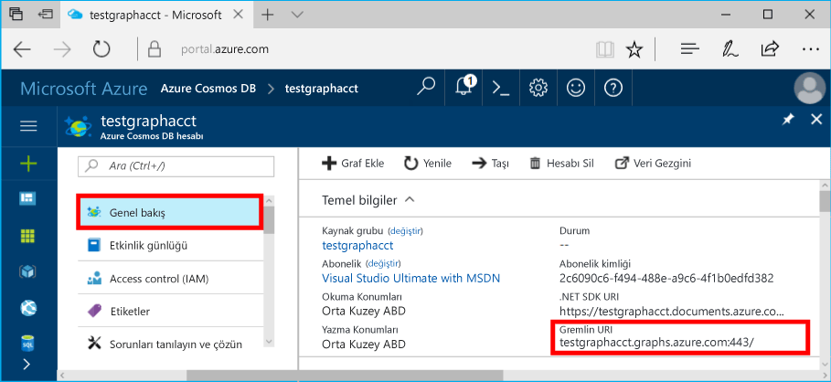

# <a name="azure-cosmos-db-build-a-java-application-using-the-graph-api"></a>Azure Cosmos DB: Grafik API'sini kullanarak bir Java uygulaması derleme

Azure Cosmos DB, Microsoft'un genel olarak dağıtılmış çok modelli veritabanı hizmetidir. Bu hizmetle belge, anahtar/değer ve grafik veritabanlarını kolayca oluşturup sorgulayabilir ve tüm bunları yaparken Azure Cosmos DB'nin genel dağıtım ve yatay ölçeklendirme özelliklerinden faydalanabilirsiniz. 

Bu hızlı başlangıç belgesinde Azure portalı kullanarak Grafik API'si (önizleme) için bir Azure Cosmos DB hesabını, veritabanını ve grafiğini nasıl oluşturacağınız anlatılmıştır. Bu adımların ardından OSS [Gremlin Java](https://mvnrepository.com/artifact/org.apache.tinkerpop/gremlin-driver) sürücüsünü kullanarak bir konsol uygulaması derleyebilir ve çalıştırabilirsiniz.  

## <a name="prerequisites"></a>Ön koşullar

* Bu örneği çalıştırmadan önce aşağıdaki önkoşullara sahip olmanız gerekir:
   * JDK 1.7 veya sonraki bir sürümü (JDK yoksa `apt-get install default-jdk` komutunu çalıştırın) ve `JAVA_HOME` gibi ortam değişkenlerini ayarlama
   * Maven (Maven yoksa `apt-get install maven` komutunu çalıştırın)

[!INCLUDE [quickstarts-free-trial-note](../../includes/quickstarts-free-trial-note.md)]

## <a name="create-a-database-account"></a>Veritabanı hesabı oluşturma

[!INCLUDE [cosmos-db-create-dbaccount-graph](../../includes/cosmos-db-create-dbaccount-graph.md)]

## <a name="add-a-graph"></a>Grafik ekleme

[!INCLUDE [cosmos-db-create-graph](../../includes/cosmos-db-create-graph.md)]

## <a name="clone-the-sample-application"></a>Örnek uygulamayı kopyalama

Şimdi GitHub'dan bir Grafik API'si (önizleme) uygulaması kopyalayalım, bağlantı dizesini ayarlayalım ve uygulamayı çalıştıralım. Verilerle programlı bir şekilde çalışmanın ne kadar kolay olduğunu görüyorsunuz. 

1. Git bash gibi bir git terminal penceresi açın ve `cd` ile çalışma dizinine gidin.  

2. Örnek depoyu kopyalamak için aşağıdaki komutu çalıştırın. 

    ```bash
    git clone https://github.com/Azure-Samples/azure-cosmos-db-graph-java-getting-started.git
    ```

## <a name="review-the-code"></a>Kodu gözden geçirin

Uygulamada gerçekleşen işlemleri hızlıca gözden geçirelim. `Program.java` dosyasını açtığınızda bu kod satırlarıyla karşılaşacaksınız. 

* Gremlin `Client`, `src/remote.yaml` içinde bulunan yapılandırmadan başlatılır.

    ```java
    Cluster cluster = Cluster.build(new File("src/remote.yaml")).create();
    
    Client client = cluster.connect();
    ```

* Bir dizi Gremlin adımı `client.submit` yöntemi kullanılarak çalıştırılır.

    ```java
    ResultSet results = client.submit("g.V()");

    CompletableFuture<List<Result>> completableFutureResults = results.all();
    List<Result> resultList = completableFutureResults.get();

    for (Result result : resultList) {
        System.out.println(result.toString());
    }
    ```
## <a name="update-your-connection-string"></a>Bağlantı dizenizi güncelleştirme

1. src/remote.yaml dosyasını açın. 

3. src/remote.yaml dosyasına *ana bilgisayar*, *bağlantı noktası*, *kullanıcı adı*, *parola*, *bağlantı havuzu*, ve *seri hale getirici* yapılandırmalarınızı girin:

    Ayar|Önerilen değer|Açıklama
    ---|---|---
    Ana bilgisayarlar|[***.graphs.azure.com]|Aşağıdaki ekran görüntüsüne bakın. Bu, Azure portalının Genel Bakış sayfasında bulunan, köşeli ayraç içindeki, sonundan :443/ bölümü çıkartılmış Gremlin URI değeridir.<br><br>Bu değer, Anahtarlar sekmesinde bulunan URI değeri kullanılıp https:// bölümü çıkarılarak ve belgeleri grafiklere dönüştürüp sondaki :443/ bölümü çıkarılarak alınabilir.
    Bağlantı noktası|443|443 olarak ayarlayın.
    Kullanıcı adı|*Kullanıcı adınız*|`/dbs/<db>/colls/<coll>` formunun kaynağı; burada `<db>` veritabanı adınız ve `<coll>` koleksiyon adınızdır.
    Parola|*Birincil ana anahtarınız*|Aşağıdaki ikinci ekran görüntüsüne bakın. Bu sizin birincil anahtarınızdır, bu anahtarı Azure portalının Anahtarlar sayfasındaki Birincil Anahtar kutusunda bulabilirsiniz. Değeri kopyalamak için kutunun solundaki kopyala düğmesini kullanın.
    Bağlantı havuzu|{enableSsl: true}|SSL için bağlantı havuzu ayarınız.
    Serileştirici|{ className: org.apache.tinkerpop.gremlin.<br>driver.ser.GraphSONMessageSerializerV1d0,<br> config: { serializeResultToString: true }}|Bu değere ayarlayın ve değeri yapıştırırken tüm `\n` satır sonlarını silin.

    Hosts değeri için **Genel Bakış** sayfasından **Gremlin URI** değerini kopyalayın: 

    Password değeri için, **Anahtarlar** sayfasından **Birincil Anahtar**’ı kopyalayın: 

## <a name="run-the-console-app"></a>Konsol uygulamasını çalıştırma

1. Gerekli Java paketlerini yüklemek için bir terminalde `mvn package` komutunu çalıştırın.

2. Java uygulamanızı başlatmak için bir terminalde `mvn exec:java -D exec.mainClass=GetStarted.Program` komutunu çalıştırın.

Şimdi Veri Gezgini'ne dönüp bu yeni verileri görebilir, sorgulayabilir, değiştirebilir ve onlarla çalışabilirsiniz. 

## <a name="browse-using-the-data-explorer"></a>Veri Gezgini'ni kullanarak göz atma

Şimdi Azure portalındaki Veri Gezgini'ne dönerek yeni grafik verilerinize göz atıp sorgu gönderebilirsiniz.

* Yeni veritabanı, Veri Gezgini'nin Koleksiyonlar bölmesinde görüntülenir. **graphdb**, **graphcoll** öğelerini genişletip **Grafik** öğesine tıklayın.

    Örnek uygulama tarafından oluşturulan veriler Grafikler bölmesinde görüntülenir.

## <a name="review-slas-in-the-azure-portal"></a>Azure portalında SLA'ları gözden geçirme

[!INCLUDE [cosmosdb-tutorial-review-slas](../../includes/cosmos-db-tutorial-review-slas.md)]

## <a name="clean-up-resources"></a>Kaynakları temizleme

Bu uygulamayı kullanmaya devam etmeyecekseniz aşağıdaki adımları kullanarak Azure portalında bu hızlı başlangıç tarafından oluşturulan tüm kaynakları silin: 

1. Azure portalında sol taraftaki menüden, **Kaynak grupları**'na ve ardından oluşturduğunuz kaynağın adına tıklayın. 
2. Kaynak grubu sayfanızda, **Sil**'e tıklayın, metin kutusuna silinecek kaynağın adını yazın ve ardından **Sil**'e tıklayın.

## <a name="next-steps"></a>Sonraki adımlar

Bu hızlı başlangıçta Azure Cosmos DB hesabı oluşturmayı, Veri Gezgini'ni kullanarak grafik oluşturmayı ve bir uygulamayı çalıştırmayı öğrendiniz. Artık daha karmaşık sorgular oluşturabilir ve Gremlin kullanarak güçlü grafik geçişi mantığını kullanabilirsiniz. 

> [!div class="nextstepaction"]
> [Gremlin kullanarak sorgulama](tutorial-query-graph.md)


