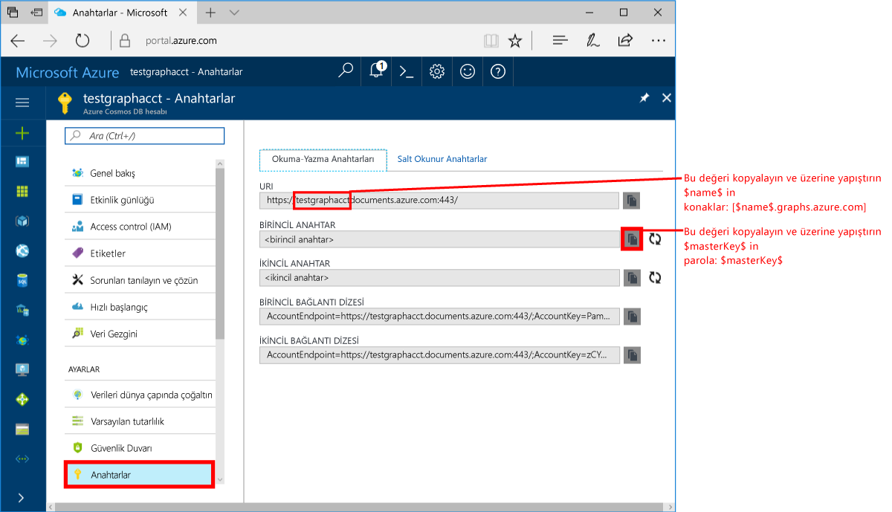
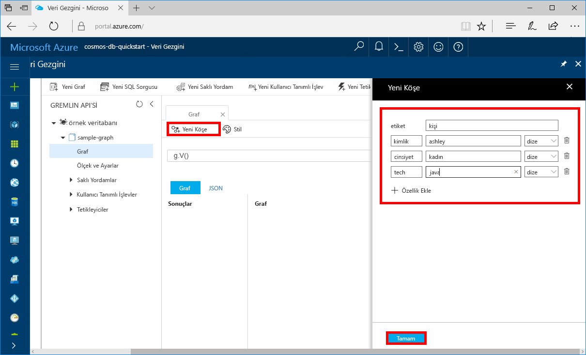
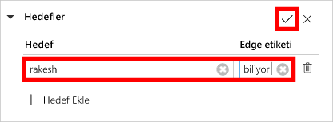
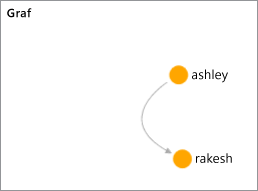

# <a name="quickstart-create-a-graph-database-in-azure-cosmos-db-using-the-java-sdk"></a>Hızlı Başlangıç: Azure Cosmos DB Java SDK'sını kullanarak bir grafik veritabanı oluşturma 

> [!div class="op_single_selector"]
> * [Gremlin konsolu](create-graph-gremlin-console.md)
> * [.NET](create-graph-dotnet.md)
> * [Java](create-graph-java.md)
> * [Node.js](create-graph-nodejs.md)
> * [Python](create-graph-python.md)
> * [PHP](create-graph-php.md)
>  

Azure Cosmos DB, Microsoft'un genel olarak dağıtılmış çok modelli veritabanı hizmetidir. Azure Cosmos DB’yi kullanarak hızlıca yönetilen belgeler, tablolar ve grafik veritabanları oluşturabilir ve bunları sorgulayabilirsiniz. 

Bu hızlı başlangıç Azure Cosmos DB için Azure portal araçlarını kullanarak basit bir grafik veritabanı oluşturur. Bu hızlı başlangıçta ayrıca bir Java konsol uygulamasını OSS [Apache TinkerPop](https://tinkerpop.apache.org/) sürücüsü kullanan bir [Gremlin API](graph-introduction.md)’si kullanarak nasıl hızlı bir şekilde oluşturabileceğiniz gösterilmektedir. Bu hızlı başlangıçtaki yönergeler Java çalıştırabilen tüm işletim sistemlerinde izlenebilir. Bu hızlı başlangıcı tamamladığınızda tercihinize bağlı olarak Kullanıcı Arabiriminde veya programlama arabiriminde grafik oluşturma ve değiştirme hakkında bilgi sahibi olacaksınız. 

## <a name="prerequisites"></a>Önkoşullar
[!INCLUDE [quickstarts-free-trial-note](../../includes/quickstarts-free-trial-note.md)]

Buna ek olarak:

* [Java Development Kit (JDK) 8 sürümü](https://aka.ms/azure-jdks)
    * JAVA_HOME ortam değişkenini JDK’nin yüklü olduğu klasöre işaret edecek şekilde ayarladığınızdan emin olun.
* Bir [Maven](https://maven.apache.org/) ikili arşivi [indirin](https://maven.apache.org/download.cgi) ve [yükleyin](https://maven.apache.org/install.html)
    * Ubuntu’da Maven’i yüklemek için `apt-get install maven` komutunu çalıştırabilirsiniz.
* [Git](https://www.git-scm.com/)
    * Ubuntu’da Git’i yüklemek için `sudo apt-get install git` komutunu çalıştırabilirsiniz.

## <a name="create-a-database-account"></a>Veritabanı hesabı oluşturma

Bir grafik veritabanı oluşturmadan önce Azure Cosmos DB ile bir Gremlin (Graf) veritabanı hesabı oluşturmanız gerekir.

[!INCLUDE [cosmos-db-create-dbaccount-graph](../../includes/cosmos-db-create-dbaccount-graph.md)]

## <a name="add-a-graph"></a>Graf ekleme

[!INCLUDE [cosmos-db-create-graph](../../includes/cosmos-db-create-graph.md)]

## <a name="clone-the-sample-application"></a>Örnek uygulamayı kopyalama

Şimdi kod ile çalışmaya geçelim. GitHub'dan bir Gremlin API'si uygulaması kopyalayalım, bağlantı dizesini ayarlayalım ve uygulamayı çalıştıralım. Verilerle program aracılığıyla çalışmanın ne kadar kolay olduğunu göreceksiniz.  

1. Bir komut istemini açın, git-samples adlı yeni bir klasör oluşturun ve komut istemini kapatın.

    ```bash
    md "C:\git-samples"
    ```

2. Git Bash gibi bir Git terminal penceresi açın ve örnek uygulamayı yüklemek üzere bir klasör olarak değiştirmek için `cd` komutunu kullanın.  

    ```bash
    cd "C:\git-samples"
    ```

3. Örnek depoyu kopyalamak için aşağıdaki komutu çalıştırın. Bu komut bilgisayarınızda örnek uygulamanın bir kopyasını oluşturur. 

    ```bash
    git clone https://github.com/Azure-Samples/azure-cosmos-db-graph-java-getting-started.git
    ```

## <a name="review-the-code"></a>Kodu gözden geçirin

Bu adım isteğe bağlıdır. Veritabanı kaynaklarının kodda nasıl oluşturulduğunu öğrenmekle ilgileniyorsanız aşağıdaki kod parçacıklarını gözden geçirebilirsiniz. Aksi durumda, [Bağlantı dizenizi güncelleştirme](#update-your-connection-information) bölümüne atlayabilirsiniz.

Aşağıdaki kod parçacıklarının tümü C:\git-samples\azure-cosmos-db-graph-java-getting-started\src\GetStarted\Program.java dosyasından alınmıştır.

* Gremlin `Client`, C:\git-samples\azure-cosmos-db-graph-java-getting-started\src\remote.yaml dosyasındaki yapılandırmadan başlatılır.

    ```java
    cluster = Cluster.build(new File("src/remote.yaml")).create();
    ...
    client = cluster.connect();
    ```

* Bir dizi Gremlin adımı `client.submit` yöntemi kullanılarak çalıştırılır.

    ```java
    ResultSet results = client.submit(gremlin);

    CompletableFuture<List<Result>> completableFutureResults = results.all();
    List<Result> resultList = completableFutureResults.get();

    for (Result result : resultList) {
        System.out.println(result.toString());
    }
    ```

## <a name="update-your-connection-information"></a>Bağlantı bilgilerinizi güncelleştirme

Şimdi, Azure portalına dönerek bağlantı bilgilerinizi kopyalayıp uygulamaya ekleyin. Bu ayarlar, uygulamanızın barındırılan veritabanıyla iletişim kurmasına olanak tanır.

1. [Azure portalında](https://portal.azure.com/), **Anahtarlar**’a tıklayın. 

    URI değerinin ilk parçasını kopyalayın.

    
2. src/remote.yaml dosyasını açın ve benzersiz kimlik değerini `hosts: [$name$.graphs.azure.com]` içindeki `$name$` öğesine yapıştırın.

    remote.yaml dosyasının 1. satırı şuna benzer şekilde görünmelidir: 

    `hosts: [test-graph.graphs.azure.com]`

3. `endpoint` değerindeki `graphs` ifadesini `gremlin.cosmosdb` ile değiştirin. (Grafik veritabanı hesabınızı 20 Aralık 20, 2017’den önce oluşturduysanız, uç nokta değerinde bir değişiklik yapmayın ve sonraki adıma geçin.)

    Uç nokta değeri şimdi şöyle görünmelidir:

    `"endpoint": "https://testgraphacct.gremlin.cosmosdb.azure.com:443/"`

4. Azure portalında, kopyala düğmesini kullanarak PRIMARY KEY’i kopyalayın ve `password: $masterKey$` içindeki `$masterKey$` öğesine yapıştırın.

    remote.yaml dosyasının 4. satırı şuna benzer şekilde görünmelidir: 

    `password: 2Ggkr662ifxz2Mg==`

5. remote.yaml dosyasının 3. satırının şu değerini değiştirin:

    `username: /dbs/$database$/colls/$collection$`

    - 

    `username: /dbs/sample-database/colls/sample-graph`

    Örnek veritabanı veya grafınız için benzersiz bir ad kullandıysanız değerleri uygun şekilde güncelleştirin.

6. remote.yaml dosyasını kaydedin.

## <a name="run-the-console-app"></a>Konsol uygulamasını çalıştırma

1. Git terminal penceresinde `cd` komutuyla azure-cosmos-db-graph-java-getting-started klasörüne ulaşın.

    ```git
    cd "C:\git-samples\azure-cosmos-db-graph-java-getting-started"
    ```

2. Git terminal penceresinde aşağıdaki komutu kullanarak gerekli Java paketlerini yükleyin.

   ```
   mvn package
   ```

3. Git terminal penceresinde, Java uygulamasını başlatmak için aşağıdaki komutları kullanın.
    
    ```
    mvn exec:java -D exec.mainClass=GetStarted.Program
    ```

    Terminal penceresinde grafiğe eklenmekte olan köşeler gösterilir. 
    
    Zaman aşımı hatası alırsanız, bağlantı bilgilerini, [Bağlantı bilgilerinizi güncelleştirme](#update-your-connection-information), konusunda belirtildiği şekilde güncelleştirdiğinizden emin olun ve son komutu çalıştırmayı yeniden deneyin. 
    
    Program durduktan sonra Enter tuşuna basın ve ardından İnternet tarayıcınızdaki Azure portalına geçin. 

<a id="add-sample-data"></a>
## <a name="review-and-add-sample-data"></a>Örnek verileri inceleme ve ekleme

Şimdi Veri Gezgini’ne dönüp grafiğe eklenen köşeleri görebilir ve ek veri noktaları ekleyebilirsiniz.

1. **Veri Gezgini**’ne tıklayın, **sample-graph** öğesini genişletin, **Graph**’a ve son olarak **Filtre Uygula**’ya tıklayın. 

   

2. **Sonuç listesinde**, grafiğe yeni kullanıcıların eklendiğini görürsünüz. **Ben**’i seçin ve kullanıcının robin’e bağlı olduğuna dikkat edin. Köşeleri sürükleyip bırakarak hareket ettirebilir, farenizin tekerleğini kaydırarak öğeleri yakınlaştırabilir ve uzaklaştırabilir, ayrıca çift okla grafiğin boyutunu genişletebilirsiniz. 

   

3. Şimdi birkaç yeni kullanıcı ekleyelim. Grafa veri eklemek için **yeni köşe** düğmesine tıklayın.

   

4. Etiket kutusuna *kişi* yazın.

5. Aşağıdaki özelliklerin her birini eklemek için **Özellik ekle** seçeneğine tıklayın. Graftaki her kişi için benzersiz özellikler oluşturabileceğinizi görürsünüz. Yalnızca kimliği anahtarı gereklidir.

    anahtar|değer|Notlar
    ----|----|----
    id|ashley|Köşe için benzersiz tanımlayıcı. Kimlik belirtmezseniz, bir kimlik otomatik olarak oluşturulur.
    cinsiyet|kadın| 
    teknoloji | java | 

    > [!NOTE]
    > Bu hızlı başlangıçta bölümlenmemiş bir koleksiyon oluşturacaksınız. Ancak koleksiyon oluşturma sırasında bir bölüm anahtarı belirterek bölümlendirilmiş bir koleksiyon oluşturursanız, daha sonra bölüm anahtarını her yeni köşede anahtar olarak eklemeniz gerekir. 

6. **Tamam** düğmesine tıklayın. Ekranın en altındaki **Tamam** seçeneğini görmek için ekranınızı genişletmeniz gerekebilir.

7. Tekrar **Yeni Köşe**’ye tıklayın ve ek yeni kullanıcıyı ekleyin. 

8. *Kişi* etiketi girin.

9. Aşağıdaki özelliklerin her birini eklemek için **Özellik ekle** seçeneğine tıklayın:

    anahtar|değer|Notlar
    ----|----|----
    id|rakesh|Köşe için benzersiz tanımlayıcı. Kimlik belirtmezseniz, bir kimlik otomatik olarak oluşturulur.
    cinsiyet|erkek| 
    okul|MIT| 

10. **Tamam** düğmesine tıklayın. 

11. Grafikteki tüm değerleri görüntülemek için, varsayılan `g.V()` filtresine sahip **Filtre Uygula** düğmesine tıklayın. Tüm kullanıcılar **Sonuç listesinde** gösterilir. 

    Daha fazla veri ekledikçe sonuçlarınızı sınırlamak için filtreleri kullanabilirsiniz. Veri Gezgini, varsayılan olarak bir grafikteki tüm köşeleri almak için `g.V()` kullanır. JSON biçimindeki bir grafikteki tüm köşelerin sayımını döndürmek için, bu değeri `g.V().count()` gibi farklı bir [grafik sorgusu](tutorial-query-graph.md) olarak değiştirebilirsiniz. Filtre değiştirdiyseniz, tüm sonuçları yeniden görüntülemek içinn filtreyi `g.V()` durumuna döndürün ve **Filtre Uygula**’ya tıklayın.

12. Artık rakesh ve ashley arasında bağlantı kurabilirsiniz. **Sonuçlar** listesinde **ashley**’nin seçili olduğundan emin olun ve ardından sağ alt taraftaki **Hedefler**’in yanında bulunan  seçeneğine tıklayın. Düğmeyi görmek için pencerenizi genişletmeniz gerekebilir.

    

13. **Hedef** kutusunda *rakesh* yazın, **Kenar etiketi** kutusunda *tanıyor* yazın ve ardından onay kutusuna tıklayın.

    

14. Sonuç listesinden **rakesh**’i seçin, ashley ve rakesh’in bağlantılı olduğunu görürsünüz. 

    

    Bu işlemle birlikte, bu öğreticideki kaynak oluşturma bölümünü tamamladınız. Grafiğinize köşe eklemeye, var olan köşeleri veya sorguları değiştirmeye devam edebilirsiniz. Şimdi, Azure Cosmos DB’nin sağladığı ölçümleri gözden geçirip kaynakları temizleyelim. 

## <a name="review-slas-in-the-azure-portal"></a>Azure portalında SLA'ları gözden geçirme

[!INCLUDE [cosmosdb-tutorial-review-slas](../../includes/cosmos-db-tutorial-review-slas.md)]

## <a name="clean-up-resources"></a>Kaynakları temizleme

[!INCLUDE [cosmosdb-delete-resource-group](../../includes/cosmos-db-delete-resource-group.md)]

## <a name="next-steps"></a>Sonraki adımlar

Bu hızlı başlangıçta Azure Cosmos DB hesabı oluşturmayı, Veri Gezgini'ni kullanarak grafik oluşturmayı ve bir uygulamayı çalıştırmayı öğrendiniz. Artık daha karmaşık sorgular oluşturabilir ve Gremlin kullanarak güçlü grafik geçişi mantığını kullanabilirsiniz. 

> [!div class="nextstepaction"]
> [Gremlin kullanarak sorgulama](tutorial-query-graph.md)

