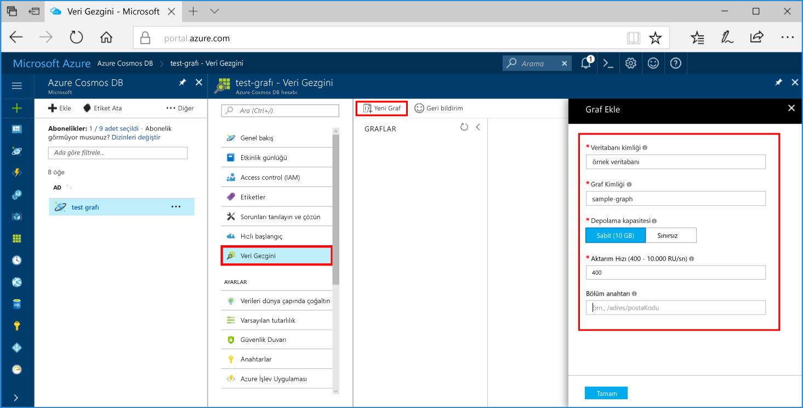

# <a name="azure-cosmos-db-create-a-graph-database-using-java-and-the-azure-portal"></a>Azure Cosmos DB: Java ve Azure portalını kullanarak bir grafik veritabanı oluşturma

Azure Cosmos DB, Microsoft'un genel olarak dağıtılmış çok modelli veritabanı hizmetidir. Azure Cosmos DB kullanarak hızlı bir şekilde oluşturmak ve yönetilen belgesi, tablo ve grafik veritabanları sorgu. 

Bu hızlı başlangıç Azure Cosmos DB için Azure portal araçları kullanarak bir basit grafik veritabanı oluşturur. Bu hızlı başlangıçta ayrıca bir Java konsol uygulamasını [Gremlin Java](https://mvnrepository.com/artifact/org.apache.tinkerpop/gremlin-driver) sürücüsü kullanan bir grafik veritabanını kullanarak nasıl hızlı bir şekilde oluşturabileceğiniz gösterilmektedir. Bu hızlı başlangıçtaki yönergeler Java çalıştırabilen tüm işletim sistemlerinde izlenebilir. Bu hızlı başlangıç oluşturma ve kullanıcı Arabirimi veya programlı olarak tercihinizi hangisi grafiklerde değiştirme ile familiarizes. 

## <a name="prerequisites"></a>Ön koşullar
[!INCLUDE [quickstarts-free-trial-note](../../includes/quickstarts-free-trial-note.md)]

Buna ek olarak:

* [Java Development Kit (JDK) 1.7+](http://www.oracle.com/technetwork/java/javase/downloads/jdk8-downloads-2133151.html)
    * Ubuntu’da JDK’yi yüklemek için `apt-get install default-jdk` komutunu çalıştırın.
    * JAVA_HOME ortam değişkenini JDK’nin yüklü olduğu klasöre işaret edecek şekilde ayarladığınızdan emin olun.
* Bir [Maven](http://maven.apache.org/) ikili arşivi [indirin](http://maven.apache.org/download.cgi) ve [yükleyin](http://maven.apache.org/install.html)
    * Ubuntu’da Maven’i yüklemek için `apt-get install maven` komutunu çalıştırabilirsiniz.
* [Git](https://www.git-scm.com/)
    * Ubuntu’da Git’i yüklemek için `sudo apt-get install git` komutunu çalıştırabilirsiniz.

## <a name="create-a-database-account"></a>Veritabanı hesabı oluşturma

Bir grafik veritabanı oluşturmadan önce Azure Cosmos DB ile bir Gremlin (Graf) veritabanı hesabı oluşturmanız gerekir.

[!INCLUDE [cosmos-db-create-dbaccount-graph](../../includes/cosmos-db-create-dbaccount-graph.md)]

## <a name="add-a-graph"></a>Grafik ekleme

Şimdi bir grafik veritabanı oluşturmak için Azure portalında Veri Gezgini aracını kullanabilirsiniz. 

1. Tıklatın **Veri Gezgini** > **yeni bir grafik**.

    **Grafik Ekle** alanı sağ ucundaki görüntülenir, hemen görmek için kaydırmanız gerekebilir.

    

2. İçinde **Ekle grafik** sayfasında, yeni bir grafik ayarlarını girin.

    Ayar|Önerilen değer|Açıklama
    ---|---|---
    Veritabanı Kimliği|sample-database|Girin *örnek veritabanı* yeni bir veritabanı adı olarak. Veritabanı adı 1 ile 255 karakter arasında olmalı, `/ \ # ?` içermemeli ve boşlukla bitmemelidir.
    Grafik Kimliği|sample-graph|Girin *örnek grafik* yeni koleksiyonunuz için bir ad olarak. Grafik adları veritabanı kimlikleri aynı karakter gereksinimlerine sahip.
    Depolama Kapasitesi|Sabit (10 GB)|Bir değerle değiştirmek **sabit (10 GB)**. Bu değer, veritabanının depolama kapasitesidir.
    Aktarım hızı|400 RU|İşleme 400 istek birimleri (RU/s) saniyede değiştirin. Daha sonra gecikme süresini azaltmak isterseniz aktarım hızının ölçeğini artırabilirsiniz.
    Bölüm anahtarı|Boş bırakın|Bu hızlı başlangıç için bölüm anahtarını boş bırakın.

3. Formu doldurduktan sonra **Tamam**'a tıklayın.

## <a name="clone-the-sample-application"></a>Örnek uygulamayı kopyalama

Şimdi kod ile çalışmaya geçelim. Şimdi bir grafik API uygulaması github'dan bağlantı dizesini ayarlamak ve çalıştırın kopyalayın. Verilerle programlı bir şekilde çalışmanın ne kadar kolay olduğunu göreceksiniz.  

1. Git bash gibi bir git terminal penceresi açın ve kullanmak `cd` örnek uygulamayı yüklemek için bir klasör olarak değiştirmek için komutu.  

    ```bash
    cd "C:\git-samples"
    ```

2. Örnek depoyu kopyalamak için aşağıdaki komutu çalıştırın. Bu komut bilgisayarınızda örnek uygulaması bir kopyasını oluşturur. 

    ```bash
    git clone https://github.com/Azure-Samples/azure-cosmos-db-graph-java-getting-started.git
    ```

## <a name="review-the-code"></a>Kodu gözden geçirin

Bu adım isteğe bağlıdır. Veritabanı kaynakları kodda nasıl oluşturulduğunu öğrenmek isterseniz, aşağıdaki kod parçacıkları gözden geçirebilirsiniz. Kod parçacıkları tüm gelen alınır `Program.java` C:\git-samples\azure-cosmos-db-graph-java-getting-started\src\GetStarted klasördeki dosya. Aksi takdirde, atlayabilirsiniz [bağlantı dizenizi güncelleştirme](#update-your-connection-string). 

* Gremlin `Client`, `src/remote.yaml` içinde bulunan yapılandırmadan başlatılır.

    ```java
    cluster = Cluster.build(new File("src/remote.yaml")).create();
    ...
    client = cluster.connect();
    ```

* Bir dizi Gremlin adımı `client.submit` yöntemi kullanılarak çalıştırılır.

    ```java
    ResultSet results = client.submit(gremlin);

    CompletableFuture<List<Result>> completableFutureResults = results.all();
    List<Result> resultList = completableFutureResults.get();

    for (Result result : resultList) {
        System.out.println(result.toString());
    }
    ```

## <a name="update-your-connection-information"></a>Bağlantı bilgilerinizi güncelleştirin

Şimdi, bağlantı bilgilerini almak ve bir uygulamaya kopyalamak için Azure portalına geri dönün. Bu ayarlar, barındırılan veritabanıyla iletişim kurmak uygulamanızı sağlar.

1. İçinde [Azure portal](http://portal.azure.com/), tıklatın **anahtarları**. 

    URI değeri ilk bölümünü kopyalayın.

    
2. Src/remote.yaml dosyasını açın ve üzerinden değeri yapıştırabilirsiniz `$name$` içinde `hosts: [$name$.graphs.azure.com]`.

    1. satırına remote.yaml benzer görünmelidir 

    `hosts: [test-graph.graphs.azure.com]`

3. Azure portalında, birincil anahtarı kopyalayın ve üzerinden yapıştırmak için Kopyala düğmesini kullanın. `$masterKey$` içinde `password: $masterKey$`.

    Remote.yaml 4 satırlık benzer görünmelidir 

    `password: 2Ggkr662ifxz2Mg==`

4. Satırından 3 remote.yaml, değiştirme

    `username: /dbs/$database$/colls/$collection$`

    - 

    `username: /dbs/sample-database/colls/sample-graph`

5. Remote.yaml dosyasını kaydedin.

## <a name="run-the-console-app"></a>Konsol uygulamasını çalıştırma

1. Git terminal penceresinde `cd` komutuyla azure-cosmos-db-graph-java-getting-started klasörüne ulaşın.

    ```git
    cd "C:\git-samples\azure-cosmos-db-graph-java-getting-started"
    ```

2. Git terminal penceresinde `mvn package` yazarak gerekli Java paketlerini yükleyin.

3. Git terminal penceresinden çalıştırmak `mvn exec:java -D exec.mainClass=GetStarted.Program` Java uygulamanızı başlatmak için.

    Terminal penceresinde grafiğe eklenmekte olan köşeler gösterilir. Programı durdurur sonra Internet tarayıcınız Azure Portalı'na geri çevirin. 

<a id="add-sample-data"></a>
## <a name="review-and-add-sample-data"></a>Örnek verileri inceleme ve ekleme

Şimdi Veri Gezgini’ne dönüp grafiğe eklenen köşeleri görebilir ve ek veri noktaları ekleyebilirsiniz.

1. Tıklatın **Veri Gezgini**, genişletin **örnek grafik**, tıklatın **grafik**ve ardından **Filtre Uygula**. 

   

2. **Sonuç listesinde**, grafiğe yeni kullanıcıların eklendiğini görürsünüz. **Ben**’i seçin, robin ile bağlantılı olduğunu görürsünüz. Sürükleyip bırakarak, köşeleri fare tekerleği kaydırarak yakınlaştırma ve grafiğin çift oklu boyutunu genişletin taşıyabilirsiniz. 

   

3. Birkaç yeni kullanıcılar ekleyelim. Grafiğe veri eklemek için **yeni köşe** düğmesine tıklayın.

   

4. Bir etiketi girin *kişi*.

5. Tıklatın **özellik ekleme** her biri aşağıdaki özellikleri eklemek için. Grafikteki her kişi için benzersiz özellikler oluşturabileceğinizi görürsünüz. Yalnızca kimliği anahtarı gereklidir.

    anahtar|değer|Notlar
    ----|----|----
    id|ashley|Köşe için benzersiz tanımlayıcı. Kimlik belirtmezseniz, bir kimlik otomatik olarak oluşturulur.
    cinsiyet|kadın| 
    teknoloji | java | 

    > [!NOTE]
    > Bu hızlı başlangıçta bölümlenmemiş bir koleksiyon oluşturacağız. Ancak koleksiyon oluşturma sırasında bir bölüm anahtarı belirterek bölümlendirilmiş bir koleksiyon oluşturursanız, daha sonra bölüm anahtarını her yeni köşede anahtar olarak eklemeniz gerekir. 

6. **Tamam** düğmesine tıklayın. Ekranın en altındaki **Tamam** seçeneğini görmek için ekranınızı genişletmeniz gerekebilir.

7. Tekrar **Yeni Köşe**’ye tıklayın ve ek yeni kullanıcıyı ekleyin. 

8. Bir etiketi girin *kişi*.

9. Tıklatın **özellik ekleme** her biri aşağıdaki özellikleri eklemek için:

    anahtar|değer|Notlar
    ----|----|----
    id|rakesh|Köşe için benzersiz tanımlayıcı. Kimlik belirtmezseniz, bir kimlik otomatik olarak oluşturulur.
    cinsiyet|erkek| 
    okul|MIT| 

10. **Tamam** düğmesine tıklayın. 

11. Tıklatın **Filtre Uygula** varsayılan `g.V()` grafikte tüm değerleri görüntülemek için filtre. Tüm kullanıcılar **Sonuç listesinde** gösterilir. 

    Daha fazla veri ekledikçe sonuçlarınızı sınırlamak için filtreleri kullanabilirsiniz. Varsayılan olarak, Veri Gezgini kullanır `g.V()` Grafikteki tüm köşeleri alınamadı. Farklı bir değiştirebilirsiniz [grafik sorgu](tutorial-query-graph.md), gibi `g.V().count()`, JSON biçiminde Grafikteki tüm köşeleri sayısını dönün. Filtre filtre başa değişiklik değiştirdiyseniz `g.V()` tıklatıp **Filtre Uygula** yeniden tüm sonuçları görüntülemek için.

12. Artık rakesh ve ashley arasında bağlantı kurabiliriz. **Sonuç listesinde** **ashley**’in seçili olduğundan emin olun ve ardından sağ alttaki **Hedefler**’in yanında bulunan Düzenle düğmesine tıklayın. **Özellikler** alanını görmek için pencerenizi genişletmeniz gerekebilir.

   

13. İçinde **hedef** kutusuna yazın *rakesh*ve **kenar etiket** kutusuna yazın *bilir*ve ardından onay'ı tıklatın.

   

14. Sonuç listesinden **rakesh**’i seçin, ashley ve rakesh’in bağlantılı olduğunu görürsünüz. 

   

   Bu öğretici kaynak oluşturma parçası tamamlanan. Köşeleri, grafiğe eklemek, var olan köşeleri veya sorguları değiştirmek devam edebilirsiniz. Şimdi gözden geçirme Azure Cosmos DB ölçümleri sağlar ve kaynakları temizlemek artık. 

## <a name="review-slas-in-the-azure-portal"></a>Azure portalında SLA'ları gözden geçirme

[!INCLUDE [cosmosdb-tutorial-review-slas](../../includes/cosmos-db-tutorial-review-slas.md)]

## <a name="clean-up-resources"></a>Kaynakları temizleme

[!INCLUDE [cosmosdb-delete-resource-group](../../includes/cosmos-db-delete-resource-group.md)]

## <a name="next-steps"></a>Sonraki adımlar

Bu hızlı başlangıçta Azure Cosmos DB hesabı oluşturmayı, Veri Gezgini'ni kullanarak grafik oluşturmayı ve bir uygulamayı çalıştırmayı öğrendiniz. Artık daha karmaşık sorgular oluşturabilir ve Gremlin kullanarak güçlü grafik geçişi mantığını kullanabilirsiniz. 

> [!div class="nextstepaction"]
> [Gremlin kullanarak sorgulama](tutorial-query-graph.md)

