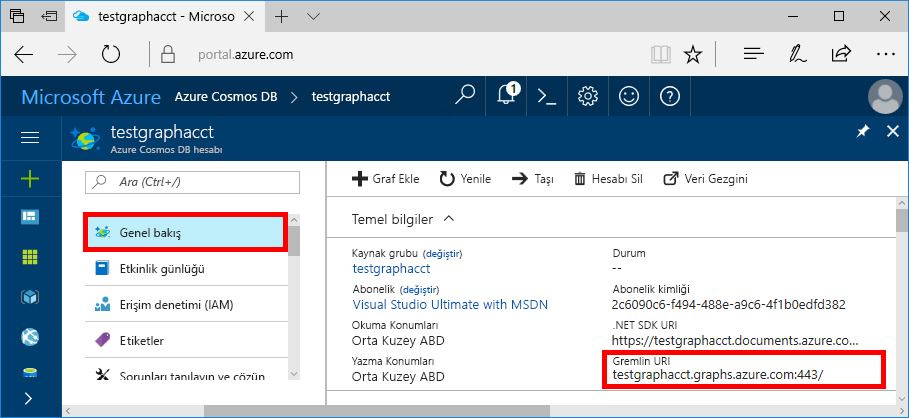
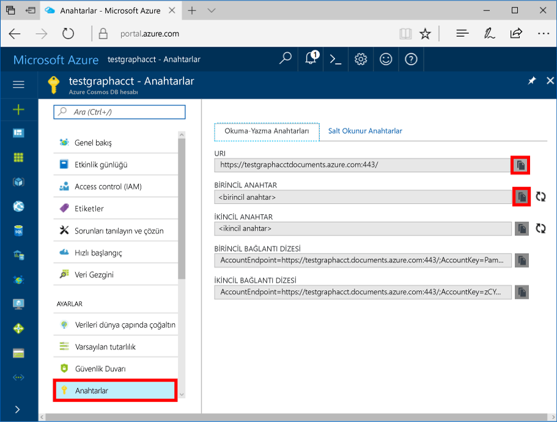

# <a name="quickstart-build-a-nodejs-application-by-using-azure-cosmos-db-gremlin-api-account"></a>Hızlı Başlangıç: Azure Cosmos DB Gremlin API hesabı kullanarak bir Node.js uygulaması oluşturma

> [!div class="op_single_selector"]
> * [Gremlin konsolu](create-graph-gremlin-console.md)
> * [.NET](create-graph-dotnet.md)
> * [Java](create-graph-java.md)
> * [Node.js](create-graph-nodejs.md)
> * [Python](create-graph-python.md)
> * [PHP](create-graph-php.md)
>  

Azure Cosmos DB, Microsoft'un genel olarak dağıtılmış çok modelli veritabanı hizmetidir. Bu hizmetle belge, anahtar/değer ve grafik veritabanlarını kolayca oluşturup sorgulayabilir ve tüm bunları yaparken Azure Cosmos DB'nin genel dağıtım ve yatay ölçeklendirme özelliklerinden faydalanabilirsiniz. 

Bu hızlı başlangıçta Azure portalı kullanarak bir Azure Cosmos DB [Gremlin API](graph-introduction.md) hesabını, veritabanını ve grafiğini nasıl oluşturacağınız anlatılmıştır. Bu adımların ardından açık kaynaklı [Gremlin Node.js](https://www.npmjs.com/package/gremlin) sürücüsünü kullanarak bir konsol uygulaması oluşturabilir ve çalıştırabilirsiniz.

## <a name="prerequisites"></a>Önkoşullar

Bu örneği çalıştırmadan önce aşağıdaki önkoşullara sahip olmanız gerekir:
* [Node.js](https://nodejs.org/en/) v0.10.29 sürümü veya sonraki bir sürüm
* [Git](https://git-scm.com/)

[!INCLUDE [quickstarts-free-trial-note](../../includes/quickstarts-free-trial-note.md)]

## <a name="create-a-database-account"></a>Veritabanı hesabı oluşturma

[!INCLUDE [cosmos-db-create-dbaccount-graph](../../includes/cosmos-db-create-dbaccount-graph.md)]

## <a name="add-a-graph"></a>Graf ekleme

[!INCLUDE [cosmos-db-create-graph](../../includes/cosmos-db-create-graph.md)]

## <a name="clone-the-sample-application"></a>Örnek uygulamayı kopyalama

Şimdi GitHub'dan bir Gremlin API'si uygulaması kopyalayalım, bağlantı dizesini ayarlayalım ve uygulamayı çalıştıralım. Verilerle program aracılığıyla çalışmanın ne kadar kolay olduğunu göreceksiniz. 

1. Bir komut istemini açın, git-samples adlı yeni bir klasör oluşturun ve komut istemini kapatın.

    ```bash
    md "C:\git-samples"
    ```

2. Git Bash gibi bir Git terminal penceresi açın ve örnek uygulamayı yüklemek üzere yeni bir klasör olarak değiştirmek için `cd` komutunu kullanın.

    ```bash
    cd "C:\git-samples"
    ```

3. Örnek depoyu kopyalamak için aşağıdaki komutu çalıştırın. Bu komut bilgisayarınızda örnek uygulamanın bir kopyasını oluşturur.

    ```bash
    git clone https://github.com/Azure-Samples/azure-cosmos-db-graph-nodejs-getting-started.git
    ```

3. Çözüm dosyasını Visual Studio'da açın. 

## <a name="review-the-code"></a>Kodu gözden geçirin

Bu adım isteğe bağlıdır. Veritabanı kaynaklarının kodda nasıl oluşturulduğunu öğrenmekle ilgileniyorsanız aşağıdaki kod parçacıklarını gözden geçirebilirsiniz. Aksi durumda, [Bağlantı dizenizi güncelleştirme](#update-your-connection-string) bölümüne atlayabilirsiniz. 

Aşağıdaki kod parçacıklarının tamamı, app.js dosyasından alınmıştır.

* Gremlin istemcisi oluşturulur.

    ```javascript
    const client = Gremlin.createClient(
        443, 
        config.endpoint, 
        { 
            "session": false, 
            "ssl": true, 
            "user": `/dbs/${config.database}/colls/${config.collection}`,
            "password": config.primaryKey
        });
    ```

  Tüm yapılandırmalar, [aşağıdaki bölümde](#update-your-connection-string) düzenlediğimiz `config.js` öğesinde yer alır.

* Farklı Gremlin işlemlerini yürütmek için bir dizi işlev tanımlanır. Bu, bunlardan biridir:

    ```javascript
    function addVertex1(callback)
    {
        console.log('Running Add Vertex1'); 
        client.execute("g.addV('person').property('id', 'thomas').property('firstName', 'Thomas').property('age', 44).property('userid', 1)", { }, (err, results) => {
          if (err) callback(console.error(err));
          console.log("Result: %s\n", JSON.stringify(results));
          callback(null)
        });
    }
    ```

* Her işlev bir Gremlin sorgu dizisi parametresi olan bir `client.execute` yöntemi yürütür. `g.V().count()` öğesinin nasıl yürütüldüğü hakkında bir örnek aşağıdadır:

    ```javascript
    console.log('Running Count'); 
    client.execute("g.V().count()", { }, (err, results) => {
        if (err) return console.error(err);
        console.log(JSON.stringify(results));
        console.log();
    });
    ```

* Dosyanın sonunda, tüm yöntemler `async.waterfall()` yöntemi kullanılarak çağrılır. Bu işlem yöntemleri art arda yürütür:

    ```javascript
    try{
        async.waterfall([
            dropGraph,
            addVertex1,
            addVertex2,
            addEdge,
            countVertices
            ], finish);
    } catch(err) {
        console.log(err)
    }
    ```


## <a name="update-your-connection-string"></a>Bağlantı dizenizi güncelleştirme

1. Config.js dosyasını açın. 

2. Config.js dosyasında, `config.endpoint` anahtarını Azure portalının **Genel Bakış** sayfasında bulunan **Gremlin URI** değeriyle doldurun. 

    `config.endpoint = "https://<your_Gremlin_account_name>.gremlin.cosmosdb.azure.com:443/";`

    

3. Config.js dosyasında, config.primaryKey değerini Azure portalının **Anahtarlar** sayfasında bulunan **Birincil Anahtar** değeriyle doldurun. 

    `config.primaryKey = "PRIMARYKEY";`

   

4. Veritabanı adını ve config.database ve config.collection değerinin grafik (kapsayıcı) adını girin. 

Aşağıda, tamamlanan config.js dosyanızın nasıl görüneceğine ilişkin bir örnek bulabilirsiniz:

```javascript
var config = {}

// Note that this must not have HTTPS or the port number
config.endpoint = "https://testgraphacct.gremlin.cosmosdb.azure.com:443/"; 
config.primaryKey = "Pams6e7LEUS7LJ2Qk0fjZf3eGo65JdMWHmyn65i52w8ozPX2oxY3iP0yu05t9v1WymAHNcMwPIqNAEv3XDFsEg==";
config.database = "graphdb"
config.collection = "Persons"

module.exports = config;
```

## <a name="run-the-console-app"></a>Konsol uygulamasını çalıştırma

1. Terminal penceresi açın ve projeye dahil olan package.json dosyası için yükleme diziniyle değiştirin (`cd` komutuyla).

2. `gremlin` dahil gerekli npm modüllerini yüklemek için `npm install` öğesini çalıştırın.

3. Node.js uygulamanızı başlatmak için bir terminalde `node app.js` komutunu çalıştırın.

## <a name="browse-with-data-explorer"></a>Veri Gezgini ile Göz Ama

Artık Azure portalındaki Veri Gezgini'ne dönerek yeni grafik verilerinizi görüntüleyebilir, sorgulayabilir, değiştirebilir ve bu verilerle çalışabilirsiniz.

Yeni veritabanı, Veri Gezgini'nin **Graflar** bölmesinde görüntülenir. Veritabanını ve ardından kapsayıcıyı genişletip **Graf**’ı seçin.

Örnek uygulama tarafından oluşturulan veriler, **Filtre Uygula**’yı seçtiğinizde **Graf** sekmesinin sonraki bölmesinde gösterilir.

Filtreyi test etmek için `g.V()` işlemini `.has('firstName', 'Thomas')` ile tamamlamayı deneyin. Değerin büyük küçük harfe duyarlı olduğunu unutmayın.

## <a name="review-slas-in-the-azure-portal"></a>Azure portalında SLA'ları gözden geçirme

[!INCLUDE [cosmosdb-tutorial-review-slas](../../includes/cosmos-db-tutorial-review-slas.md)]

## <a name="clean-up-your-resources"></a>Kaynaklarınızı temizleme

[!INCLUDE [cosmosdb-delete-resource-group](../../includes/cosmos-db-delete-resource-group.md)]

## <a name="next-steps"></a>Sonraki adımlar

Bu makalede, Azure Cosmos DB hesabı oluşturmayı, Veri Gezgini'ni kullanarak grafik oluşturmayı ve bir uygulamayı çalıştırmayı öğrendiniz. Artık daha karmaşık sorgular oluşturabilir ve Gremlin kullanarak güçlü grafik geçişi mantığını kullanabilirsiniz. 

> [!div class="nextstepaction"]
> [Gremlin kullanarak sorgulama](tutorial-query-graph.md)
