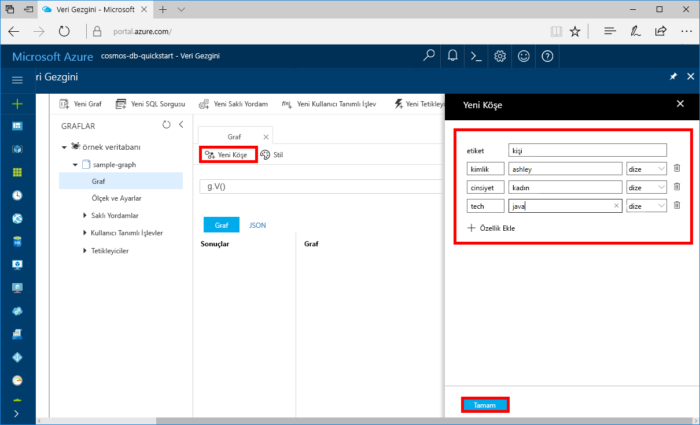
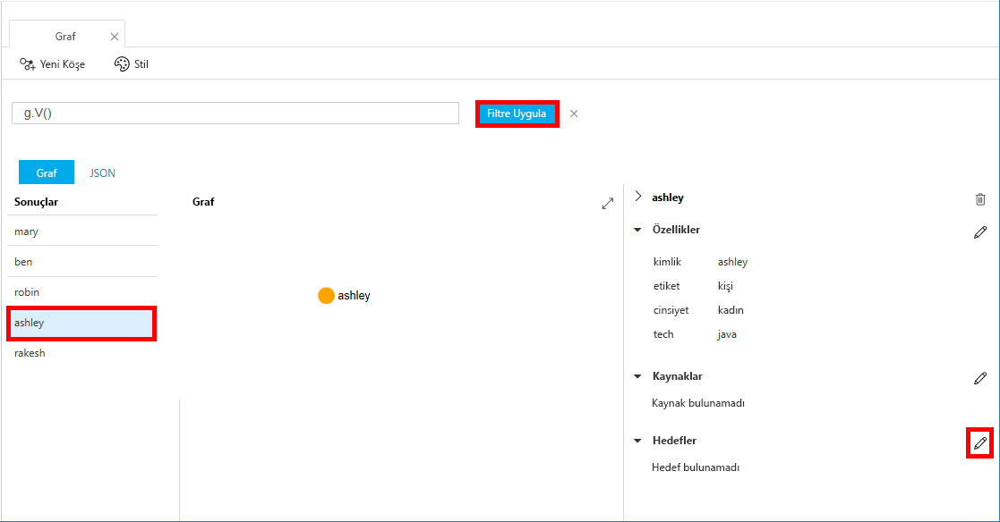
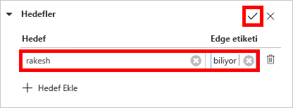

# <a name="quickstart-create-a-graph-database-in-azure-cosmos-db-using-php-and-the-azure-portal"></a>Hızlı Başlangıç: PHP ve Azure portalını kullanarak Azure Cosmos DB içinde bir grafik veritabanı oluşturma

> [!div class="op_single_selector"]
> * [Gremlin konsolu](create-graph-gremlin-console.md)
> * [.NET](create-graph-dotnet.md)
> * [Java](create-graph-java.md)
> * [Node.js](create-graph-nodejs.md)
> * [Python](create-graph-python.md)
> * [PHP](create-graph-php.md)
>  

Bu hızlı başlangıçta GitHub’dan bir örneği kopyalayarak bir konsol uygulaması oluşturmak için PHP ve Azure Cosmos DB [Gremlin API’sini](graph-introduction.md) nasıl kullanacağınız gösterilmektedir. Bu hızlı başlangıç ayrıca web tabanlı Azure portalını kullanarak bir Azure Cosmos DB hesabı oluşturma adımlarını da gösterir.   

Azure Cosmos DB, Microsoft'un genel olarak dağıtılmış çok modelli veritabanı hizmetidir. Bu hizmetle belge, tablo, anahtar/değer ve grafik veritabanlarını kolayca oluşturup sorgulayabilir ve tüm bunları yaparken Azure Cosmos DB'nin genel dağıtım ve yatay ölçeklendirme özelliklerinden faydalanabilirsiniz.  

## <a name="prerequisites"></a>Önkoşullar

[!INCLUDE [quickstarts-free-trial-note](../../includes/quickstarts-free-trial-note.md)] Alternatif olarak, [Azure Cosmos DB](https://azure.microsoft.com/try/cosmosdb/)’yi ücretsiz olarak, Azure aboneliği olmadan ve herhangi bir taahhütte bulunmadan deneyebilirsiniz.

Buna ek olarak:
* [PHP](https://php.net/) 5.6 veya daha yeni
* [Oluşturucu](https://getcomposer.org/download/)

## <a name="create-a-database-account"></a>Veritabanı hesabı oluşturma

Bir grafik veritabanı oluşturmadan önce Azure Cosmos DB ile bir Gremlin (Graf) veritabanı hesabı oluşturmanız gerekir.

[!INCLUDE [cosmos-db-create-dbaccount-graph](../../includes/cosmos-db-create-dbaccount-graph.md)]

## <a name="add-a-graph"></a>Graf ekleme

[!INCLUDE [cosmos-db-create-graph](../../includes/cosmos-db-create-graph.md)]

## <a name="clone-the-sample-application"></a>Örnek uygulamayı kopyalama

Şimdi kod ile çalışmaya geçelim. GitHub'dan bir Gremlin API'si uygulaması kopyalayalım, bağlantı dizesini ayarlayalım ve uygulamayı çalıştıralım. Verilerle program aracılığıyla çalışmanın ne kadar kolay olduğunu göreceksiniz.  

1. Bir komut istemini açın, git-samples adlı yeni bir klasör oluşturun ve komut istemini kapatın.

    ```bash
    md "C:\git-samples"
    ```

2. Git Bash gibi bir Git terminal penceresi açın ve örnek uygulamayı yüklemek üzere bir klasör olarak değiştirmek için `cd` komutunu kullanın.  

    ```bash
    cd "C:\git-samples"
    ```

3. Örnek depoyu kopyalamak için aşağıdaki komutu çalıştırın. Bu komut bilgisayarınızda örnek uygulamanın bir kopyasını oluşturur. 

    ```bash
    git clone https://github.com/Azure-Samples/azure-cosmos-db-graph-php-getting-started.git
    ```

## <a name="review-the-code"></a>Kodu gözden geçirin

Bu adım isteğe bağlıdır. Veritabanı kaynaklarının kodda nasıl oluşturulduğunu öğrenmekle ilgileniyorsanız aşağıdaki kod parçacıklarını gözden geçirebilirsiniz. Kod parçacıklarının tümü C:\git-samples\azure-cosmos-db-graph-php-getting-started\ klasöründeki connect.php dosyasından alınmıştır. Aksi durumda, [Bağlantı dizenizi güncelleştirme](#update-your-connection-information) bölümüne atlayabilirsiniz. 

* Gremlin `connection`, `connect.php` dosyasının başında `$db` nesnesi kullanılarak başlatılır.

    ```php
    $db = new Connection([
        'host' => '<your_server_address>.graphs.azure.com',
        'username' => '/dbs/<db>/colls/<coll>',
        'password' => 'your_primary_key'
        ,'port' => '443'

        // Required parameter
        ,'ssl' => TRUE
    ]);
    ```

* Bir dizi Gremlin adımı `$db->send($query);` yöntemi kullanılarak çalıştırılır.

    ```php
    $query = "g.V().drop()";
    ...
    $result = $db->send($query);
    $errors = array_filter($result);
    }
    ```

## <a name="update-your-connection-information"></a>Bağlantı bilgilerinizi güncelleştirme

Şimdi, Azure portalına dönerek bağlantı bilgilerinizi kopyalayıp uygulamaya ekleyin. Bu ayarlar, uygulamanızın barındırılan veritabanıyla iletişim kurmasına olanak tanır.

1. [Azure portalında](https://portal.azure.com/), **Anahtarlar**’a tıklayın. 

    URI değerinin ilk parçasını kopyalayın.

    
2. `connect.php` dosyasını açın ve 8. satırdaki URI değerini `your_server_address` üzerine yapıştırın.

    Bağlantı nesnesini başlatma işlemi şu kod gibi görünmelidir:

    ```php
    $db = new Connection([
        'host' => 'testgraphacct.graphs.azure.com',
        'username' => '/dbs/<db>/colls/<coll>',
        'password' => 'your_primary_key'
        ,'port' => '443'

        // Required parameter
        ,'ssl' => TRUE
    ]);
    ```

3. Grafik veritabanı hesabınız 20 Aralık 2017 veya sonrasında oluşturulduysa, ana bilgisayar adındaki `graphs.azure.com` ifadesini `gremlin.cosmosdb.azure.com` olarak değiştirin.

4. Bağlantı nesnesindeki `username` parametresini veritabanı ve grafik adınızla değiştirin. Önerilen `sample-database` ve `sample-graph` değerlerini kullandıysanız şu kod gibi görünmelidir:

    `'username' => '/dbs/sample-database/colls/sample-graph'`

    Tüm Bağlantı nesnesi şu anda aşağıdaki kod parçacığı gibi görünmelidir:

    ```php
    $db = new Connection([
        'host' => 'testgraphacct.graphs.azure.com',
        'username' => '/dbs/sample-database/colls/sample-graph',
        'password' => 'your_primary_key',
        'port' => '443'

        // Required parameter
        ,'ssl' => TRUE
    ]);
    ```

5. Azure portalında, kopyala düğmesini kullanarak PRIMARY KEY’i kopyalayın ve password parametresindeki `your_primary_key` öğesine yapıştırın.

    Bağlantı nesnesini başlatma işlemi şimdi şu kod gibi görünmelidir:

    ```php
    $db = new Connection([
        'host' => 'testgraphacct.graphs.azure.com',
        'username' => '/dbs/sample-database/colls/sample-graph',
        'password' => '2Ggkr662ifxz2Mg==',
        'port' => '443'

        // Required parameter
        ,'ssl' => TRUE
    ]);
    ```

6. `connect.php` dosyasını kaydedin.

## <a name="run-the-console-app"></a>Konsol uygulamasını çalıştırma

1. Git terminal penceresinde `cd` komutuyla azure-cosmos-db-graph-php-getting-started klasörüne ulaşın.

    ```git
    cd "C:\git-samples\azure-cosmos-db-graph-php-getting-started"
    ```

2. Git terminal penceresinde aşağıdaki komutu kullanarak gerekli PHP bağımlılıklarını yükleyin.

   ```
   composer install
   ```

3. Git terminal penceresinde, PHP uygulamasını başlatmak için aşağıdaki komutları kullanın.
    
    ```
    php connect.php
    ```

    Terminal penceresinde grafiğe eklenmekte olan köşeler gösterilir. 
    
    Zaman aşımı hatası alırsanız, bağlantı bilgilerini, [Bağlantı bilgilerinizi güncelleştirme](#update-your-connection-information), konusunda belirtildiği şekilde güncelleştirdiğinizden emin olun ve son komutu çalıştırmayı yeniden deneyin. 
    
    Program durduktan sonra Enter tuşuna basın ve ardından İnternet tarayıcınızdaki Azure portalına geçin. 

<a id="add-sample-data"></a>
## <a name="review-and-add-sample-data"></a>Örnek verileri inceleme ve ekleme

Şimdi Veri Gezgini’ne dönüp grafiğe eklenen köşeleri görebilir ve ek veri noktaları ekleyebilirsiniz.

1. **Veri Gezgini**’ne tıklayın, **sample-graph** öğesini genişletin, **Graph**’a ve son olarak **Filtre Uygula**’ya tıklayın. 

   

2. **Sonuç listesinde**, grafiğe yeni kullanıcıların eklendiğini görürsünüz. **Ben**’i seçin, robin ile bağlantılı olduğunu görürsünüz. Köşeleri sürükleyip bırakarak hareket ettirebilir, farenizin tekerleğini kaydırarak öğeleri yakınlaştırabilir ve uzaklaştırabilir, ayrıca çift okla grafiğin boyutunu genişletebilirsiniz. 

   

3. Şimdi birkaç yeni kullanıcı ekleyelim. Grafa veri eklemek için **yeni köşe** düğmesine tıklayın.

   

4. *Kişi* etiketi girin.

5. Aşağıdaki özelliklerin her birini eklemek için **Özellik ekle** seçeneğine tıklayın. Graftaki her kişi için benzersiz özellikler oluşturabileceğinizi görürsünüz. Yalnızca kimliği anahtarı gereklidir.

    anahtar|değer|Notlar
    ----|----|----
    id|ashley|Köşe için benzersiz tanımlayıcı. Kimlik belirtmezseniz, bir kimlik otomatik olarak oluşturulur.
    cinsiyet|kadın| 
    teknoloji | java | 

    > [!NOTE]
    > Bu hızlı başlangıçta bölümlenmemiş bir koleksiyon oluşturacaksınız. Ancak koleksiyon oluşturma sırasında bir bölüm anahtarı belirterek bölümlendirilmiş bir koleksiyon oluşturursanız, daha sonra bölüm anahtarını her yeni köşede anahtar olarak eklemeniz gerekir. 

6. **Tamam** düğmesine tıklayın. Ekranın en altındaki **Tamam** seçeneğini görmek için ekranınızı genişletmeniz gerekebilir.

7. Tekrar **Yeni Köşe**’ye tıklayın ve ek yeni kullanıcıyı ekleyin. 

8. *Kişi* etiketi girin.

9. Aşağıdaki özelliklerin her birini eklemek için **Özellik ekle** seçeneğine tıklayın:

    anahtar|değer|Notlar
    ----|----|----
    id|rakesh|Köşe için benzersiz tanımlayıcı. Kimlik belirtmezseniz, bir kimlik otomatik olarak oluşturulur.
    cinsiyet|erkek| 
    okul|MIT| 

10. **Tamam** düğmesine tıklayın. 

11. Grafikteki tüm değerleri görüntülemek için, varsayılan `g.V()` filtresine sahip **Filtre Uygula** düğmesine tıklayın. Tüm kullanıcılar **Sonuç listesinde** gösterilir. 

    Daha fazla veri ekledikçe sonuçlarınızı sınırlamak için filtreleri kullanabilirsiniz. Veri Gezgini, varsayılan olarak bir grafikteki tüm köşeleri almak için `g.V()` kullanır. JSON biçimindeki bir grafikteki tüm köşelerin sayımını döndürmek için, bu değeri `g.V().count()` gibi farklı bir [grafik sorgusu](tutorial-query-graph.md) olarak değiştirebilirsiniz. Filtre değiştirdiyseniz, tüm sonuçları yeniden görüntülemek içinn filtreyi `g.V()` durumuna döndürün ve **Filtre Uygula**’ya tıklayın.

12. Artık rakesh ve ashley arasında bağlantı kurabilirsiniz. **Sonuç listesinde** **ashley**’nin seçili olduğundan emin olun ve ardından sağ alttaki **Hedefler**’in yanında bulunan Düzenle düğmesine tıklayın. **Özellikler** alanını görmek için pencerenizi genişletmeniz gerekebilir.

    

13. **Hedef** kutusunda *rakesh* yazın, **Kenar etiketi** kutusunda *tanıyor* yazın ve ardından onay işaretine tıklayın.

    

14. Sonuç listesinden **rakesh**’i seçin, ashley ve rakesh’in bağlantılı olduğunu görürsünüz. 

    

    Bu işlemle birlikte, bu hızlı başlangıçtaki kaynak oluşturma bölümünü tamamladınız. Grafiğinize köşe eklemeye, var olan köşeleri veya sorguları değiştirmeye devam edebilirsiniz. Şimdi, Azure Cosmos DB’nin sağladığı ölçümleri gözden geçirip kaynakları temizleyelim. 

## <a name="review-slas-in-the-azure-portal"></a>Azure portalında SLA'ları gözden geçirme

[!INCLUDE [cosmosdb-tutorial-review-slas](../../includes/cosmos-db-tutorial-review-slas.md)]

## <a name="clean-up-resources"></a>Kaynakları temizleme

[!INCLUDE [cosmosdb-delete-resource-group](../../includes/cosmos-db-delete-resource-group.md)]

## <a name="next-steps"></a>Sonraki adımlar

Bu hızlı başlangıçta Azure Cosmos DB hesabı oluşturmayı, Veri Gezgini'ni kullanarak grafik oluşturmayı ve bir uygulamayı çalıştırmayı öğrendiniz. Artık daha karmaşık sorgular oluşturabilir ve Gremlin kullanarak güçlü grafik geçişi mantığını kullanabilirsiniz. 

> [!div class="nextstepaction"]
> [Gremlin kullanarak sorgulama](tutorial-query-graph.md)

