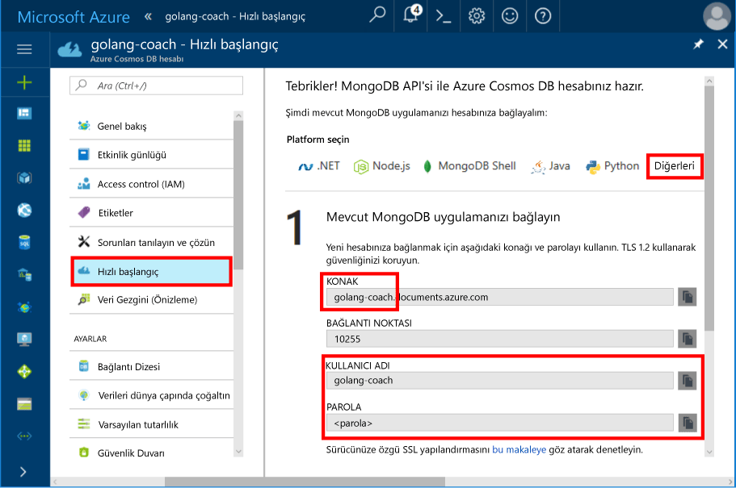
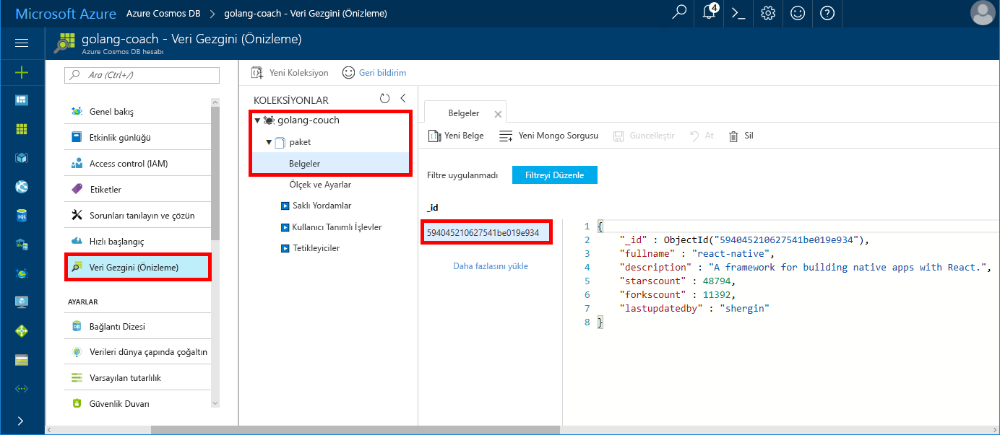

# <a name="quickstart-build-a-console-app-using-azure-cosmos-dbs-api-for-mongodb-and-golang-sdk"></a>Hızlı Başlangıç: MongoDB ve Golang SDK'sı için Azure Cosmos DB'nin API'sini kullanarak bir konsol uygulaması oluşturma

> [!div class="op_single_selector"]
> * [.NET](create-mongodb-dotnet.md)
> * [Java](create-mongodb-java.md)
> * [Node.js](create-mongodb-nodejs.md)
> * [Python](create-mongodb-flask.md)
> * [Xamarin](create-mongodb-xamarin.md)
> * [Golang](create-mongodb-golang.md)
>  

Azure Cosmos DB, Microsoft'un genel olarak dağıtılmış çok modelli veritabanı hizmetidir. Hızla oluşturun ve belge, anahtar/değer ve her biri genel dağıtım ve yatay ölçeklendirme özelliklerinden faydalanabilirsiniz Cosmos DB'nin grafik veritabanlarını sorgulama.

Bu hızlı başlangıçta dilinde yazılmış mevcut bir MongoDB uygulamasını nasıl gösterir [Golang](https://golang.org/) ve Azure Cosmos DB'nin MongoDB kullanarak Cosmos veritabanı sunucunuza bağlanın.

Diğer bir deyişle, Golang uygulamanız yalnızca MongoDB istemcisini kullanarak bağlanma bilir. Verileri bir Cosmos veritabanında saklandığını uygulamaya saydamdır.

## <a name="prerequisites"></a>Önkoşullar

- Azure aboneliği. Azure aboneliğiniz yoksa başlamadan önce [ücretsiz bir hesap](https://azure.microsoft.com/free) oluşturun. 

  [!INCLUDE [cosmos-db-emulator-mongodb](../../includes/cosmos-db-emulator-mongodb.md)]

- [Go](https://golang.org/dl/) ve [Go](https://golang.org/) dilinde temel bilgi düzeyi.
- Bir IDE: [GoLand](https://www.jetbrains.com/go/) jetbrains [Visual Studio Code'u](https://code.visualstudio.com/) Microsoft tarafından veya [Atom](https://atom.io/). Bu öğreticide, GoLand kullanıyorum.

<a id="create-account"></a>
## <a name="create-a-database-account"></a>Veritabanı hesabı oluşturma

[!INCLUDE [cosmos-db-create-dbaccount](../../includes/cosmos-db-create-dbaccount-mongodb.md)]

## <a name="clone-the-sample-application"></a>Örnek uygulamayı kopyalama

Örnek uygulamayı kopyalayın ve gerekli paketleri yükleyin.

1. GOROOT\src klasörünün (varsayılan olarak C:\Go\ konumundadır) içinde CosmosDBSample adlı bir klasör oluşturun.
2. Git bash gibi bir git terminal penceresinde aşağıdaki komutu çalıştırarak örnek depoyu CosmosDBSample klasörüne kopyalayın. 

    ```bash
    git clone https://github.com/Azure-Samples/azure-cosmos-db-mongodb-golang-getting-started.git
    ```
3.  Mgo paketini edinmek için aşağıdaki komutu çalıştırın. 

    ```
    go get gopkg.in/mgo.v2
    ```

[Mgo](https://labix.org/mgo) sürücüsü olan bir [MongoDB](https://www.mongodb.com/) sürücüsü [Go diline](https://golang.org/) özellikleri standart Go izleyen çok basit bir API altında zengin ve seçimi uygular deyimleri.

<a id="connection-string"></a>

## <a name="update-your-connection-string"></a>Bağlantı dizenizi güncelleştirme

Bu adımda Azure portalına dönerek bağlantı dizesi bilgilerinizi kopyalayıp uygulamaya ekleyin.

1. Go uygulaması için gerekli olan bağlantı dizesi verilerini görüntülemek için sol gezinti menüsünde **Hızlı başlangıç**’a ve ardından **Diğer**’e tıklayın.

2. Goglang’de GOROOT\CosmosDBSample dizinindeki main.go dosyasını açın ve aşağıdaki ekran görüntüsünde gösterildiği gibi Azure portalından edinilen bağlantı dizesi bilgilerini kullanarak aşağıdaki kod satırlarını güncelleştirin. 

    Veritabanı adı, Azure portalı bağlantı dizesi bölmesindeki **Konak** değerinin ön ekidir. Aşağıdaki resimde gösterilen hesap için Veritabanı adı golang-coach şeklindedir.

    ```go
    Database: "The prefix of the Host value in the Azure portal",
    Username: "The Username in the Azure portal",
    Password: "The Password in the Azure portal",
    ```

    

3. Main.go adlı dosyayı kaydedin.

## <a name="review-the-code"></a>Kodu gözden geçirin

Bu adım isteğe bağlıdır. Veritabanı kaynaklarının kodda nasıl oluşturulduğunu öğrenmekle ilgileniyorsanız aşağıdaki kod parçacıklarını gözden geçirebilirsiniz. Aksi takdirde, [Uygulamayı çalıştırma](#run-the-app) konusuna atlayabilirsiniz. 

Aşağıdaki kod parçacıklarının tamamı, main.go dosyasından alınmıştır.

### <a name="connecting-the-go-app-to-cosmos-db"></a>Cosmos DB'yi kullanarak Go uygulamasına bağlanma

Azure Cosmos DB'nin MongoDB API'si, SSL etkin bağlantıyı destekler. Bağlanmak için tanımlamanız gerekir **Mgo.dialınfo** işlevi [mgo. Dialınfo](https://godoc.org/gopkg.in/mgo.v2#DialInfo)ve kullanım [tls. *Arama* ](https://golang.org/pkg/crypto/tls#Dial) ve bağlantıyı gerçekleştirmek için işlevi.

Aşağıdaki Golang kod parçacığı, Go uygulaması MongoDB için Azure Cosmos DB API'si ile bağlanır. *Dialınfo* sınıf, bir oturumu için seçenekleri içerir.

```go
// DialInfo holds options for establishing a session.
dialInfo := &mgo.DialInfo{
    Addrs:    []string{"golang-couch.documents.azure.com:10255"}, // Get HOST + PORT
    Timeout:  60 * time.Second,
    Database: "database", // It can be anything
    Username: "username", // Username
    Password: "Azure database connect password from Azure Portal", // PASSWORD
    DialServer: func(addr *mgo.ServerAddr) (net.Conn, error) {
        return tls.Dial("tcp", addr.String(), &tls.Config{})
    },
}

// Create a session which maintains a pool of socket connections
// to Cosmos database (using Azure Cosmos DB's API for MongoDB).
session, err := mgo.DialWithInfo(dialInfo)

if err != nil {
    fmt.Printf("Can't connect, go error %v\n", err)
    os.Exit(1)
}

defer session.Close()

// SetSafe changes the session safety mode.
// If the safe parameter is nil, the session is put in unsafe mode, 
// and writes become fire-and-forget,
// without error checking. The unsafe mode is faster since operations won't hold on waiting for a confirmation.
// 
session.SetSafe(&mgo.Safe{})
```

SSL bağlantısı yoksa **mgo.Dial()** yöntemi kullanılır. SSL bağlantısı için **mgo.DialWithInfo()** yöntemi gerekir.

Oturum nesnesinin oluşturulması için **DialWIthInfo{}** nesnesinin bir örneği kullanılır. Oturum bağlantısı kurulduktan sonra aşağıdaki kod parçacığını kullanarak koleksiyona erişebilirsiniz:

```go
collection := session.DB("database").C("package")
```

<a id="create-document"></a>

### <a name="create-a-document"></a>Belge oluşturma

```go
// Model
type Package struct {
    Id bson.ObjectId  `bson:"_id,omitempty"`
    FullName      string
    Description   string
    StarsCount    int
    ForksCount    int
    LastUpdatedBy string
}

// insert Document in collection
err = collection.Insert(&Package{
    FullName:"react",
    Description:"A framework for building native apps with React.",
    ForksCount: 11392,
    StarsCount:48794,
    LastUpdatedBy:"shergin",

})

if err != nil {
    log.Fatal("Problem inserting data: ", err)
    return
}
```

### <a name="query-or-read-a-document"></a>Bir belgeyi sorgulama veya okuma

Cosmos DB, her bir koleksiyonda depolanan verilere karşı zengin sorguları destekler. Aşağıdaki örnek kod, koleksiyonunuzdaki belgeler için çalıştırabileceğiniz bir sorguyu gösterir.

```go
// Get a Document from the collection
result := Package{}
err = collection.Find(bson.M{"fullname": "react"}).One(&result)
if err != nil {
    log.Fatal("Error finding record: ", err)
    return
}

fmt.Println("Description:", result.Description)
```


### <a name="update-a-document"></a>Bir belgeyi güncelleştirme

```go
// Update a document
updateQuery := bson.M{"_id": result.Id}
change := bson.M{"$set": bson.M{"fullname": "react-native"}}
err = collection.Update(updateQuery, change)
if err != nil {
    log.Fatal("Error updating record: ", err)
    return
}
```

### <a name="delete-a-document"></a>Bir belgeyi silme

Cosmos DB belgeleri silinmesini destekler.

```go
// Delete a document
query := bson.M{"_id": result.Id}
err = collection.Remove(query)
if err != nil {
   log.Fatal("Error deleting record: ", err)
   return
}
```
    
## <a name="run-the-app"></a>Uygulamayı çalıştırma

1. Golang içinde GOPATH emin olun (altında kullanılabilir **dosya**, **ayarları**, **Git**, **GOPATH**) altındadır olduğu konumu yüklü, varsayılan olarak userprofıle\go olan. 
2. Uygulamayı çalıştırdıktan sonra belgeyi görebilmeniz için 103.-107. satırlar arasında yer alan ve belgeyi silen satırları açıklama satırı yapın.
3. Golang içinde tıklayın **çalıştırma**ve ardından **'Main.Go'yu Derle ve Çalıştır' çalıştırma**.

    Uygulama işlemi tamamlar ve [Belge oluşturma](#create-document)’da oluşturulan belgenin açıklamasını görüntüler.
    
    ```
    Description: A framework for building native apps with React.
    
    Process finished with exit code 0
    ```

    
    
## <a name="review-your-document-in-data-explorer"></a>Veri Gezgini’nde belgenizi gözden geçirin

Belgenizi Veri Gezgini’nde görmek için Azure portalına dönün.

1. Sol gezinti menüsünde **Veri Gezgini (Önizleme)** seçeneğine tıklayın, **golang-coach**, **paket** seçeneğini genişletin ve **Belgeler**’e tıklayın. **Belgeler** sekmesinde \_id seçeneğine tıklayarak belgeyi sağ bölmede görüntüleyin. 

    
    
2. Daha sonra belgeyle satır içi çalışabilir ve **Güncelleştir**’e tıklayarak belgeyi kaydedebilirsiniz. Belgeyi silme veya yeni belgeler ya da sorgular oluşturma seçeneğiniz de vardır.

## <a name="review-slas-in-the-azure-portal"></a>Azure portalında SLA'ları gözden geçirme

[!INCLUDE [cosmosdb-tutorial-review-slas](../../includes/cosmos-db-tutorial-review-slas.md)]

## <a name="clean-up-resources"></a>Kaynakları temizleme

[!INCLUDE [cosmosdb-delete-resource-group](../../includes/cosmos-db-delete-resource-group.md)]

## <a name="next-steps"></a>Sonraki adımlar

Bu hızlı başlangıçta, bir Cosmos hesabı oluşturmayı ve bir Golang uygulamasını çalıştırmayı öğrendiniz. Şimdi, Cosmos veritabanınıza ek veri aktarabilirsiniz. 

> [!div class="nextstepaction"]
> [Azure Cosmos DB’ye MongoDB verileri aktarma](mongodb-migrate.md)
